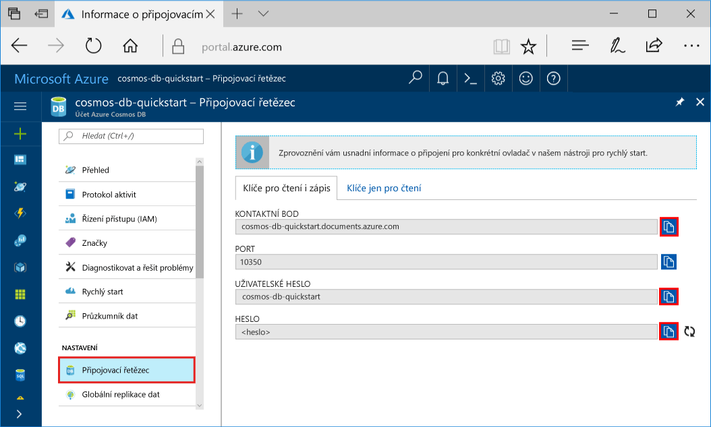
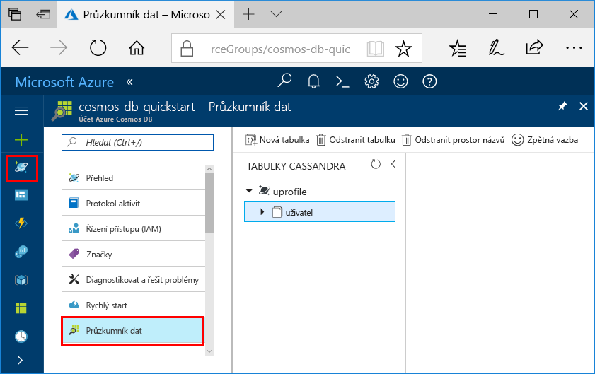

# <a name="quickstart-build-a-cassandra-app-with-nodejs-and-azure-cosmos-db"></a>Rychlý úvod: Sestavení aplikace Cassandra s Node.js a Azure Cosmos DB

Tento rychlý start ukazuje způsob použití Node.js a Azure Cosmos DB [Cassandra API](cassandra-introduction.md) k vytvoření profilu aplikace klonováním příklad z Githubu. Tento rychlý start také vás provede procesem vytvoření účtu Azure Cosmos DB pomocí portálu Azure založených na webu.

Azure Cosmos DB je globálně distribuované databáze více modelu služby společnosti Microsoft. Můžete rychle vytvořit a dotazovat dokumentu, tabulka, klíč hodnota a graf databází, které těžit z globální distribuci a možnosti vodorovné škálování základem Azure Cosmos DB. 

## <a name="prerequisites"></a>Požadavky

[!INCLUDE [quickstarts-free-trial-note](../../includes/quickstarts-free-trial-note.md)]Alternativně můžete [zkuste Azure Cosmos DB zdarma](https://azure.microsoft.com/try/cosmosdb/) bez předplatného Azure, bez poplatků a závazky.

Přístup k rozhraní API služby Azure Cosmos DB Cassandra programu preview. Pokud jste ještě nenainstalovali pro přístup k ještě [nyní](cassandra-introduction.md#sign-up-now).

Navíc platí:
* [Node.js](https://nodejs.org/en/) verze 0.10.29 nebo vyšší
* [Git](http://git-scm.com/)

## <a name="create-a-database-account"></a>Vytvoření účtu databáze

Než bude možné vytvořit databázi dokumentů, musíte vytvořit účet Cassandra s Azure Cosmos DB.

[!INCLUDE [cosmos-db-create-dbaccount-cassandra](../../includes/cosmos-db-create-dbaccount-cassandra.md)]

## <a name="clone-the-sample-application"></a>Klonování ukázkové aplikace

Nyní Pojďme klonování Cassandra API aplikace z githubu, nastavení připojovacího řetězce a potom ho spusťte. Uvidíte, jak snadno se pracuje s daty prostřednictvím kódu programu. 

1. Otevřete okno terminálu git, jako je například git bash a použít `cd` příkaz Přejít do složky pro instalaci ukázkové aplikace. 

    ```bash
    cd "C:\git-samples"
    ```

2. Ukázkové úložiště naklonujete spuštěním následujícího příkazu. Tento příkaz vytvoří kopii ukázková aplikace ve vašem počítači.

    ```bash
    git clone https://github.com/Azure-Samples/azure-cosmos-db-cassandra-nodejs-getting-started.git
    ```

## <a name="review-the-code"></a>Kontrola kódu

Tento krok je volitelný. Pokud vás zajímá učení vytváření databázových prostředků v kódu, můžete zkontrolovat následující fragmenty kódu. Fragmenty kódu jsou převzaty z `uprofile.js` soubor ve složce C:\git-samples\azure-cosmos-db-cassandra-nodejs-getting-started. Jinak, můžete přeskočit na [aktualizovat připojovací řetězec](#update-your-connection-string). 

* Uživatelské jméno a heslo se nastavuje pomocí stránce připojovací řetězec na portálu Azure. Path\to\cert obsahuje cestu k X509 certifikátu. 

   ```nodejs
   var ssl_option = {
        cert : fs.readFileSync("path\to\cert"),
        rejectUnauthorized : true,
        secureProtocol: 'TLSv1_2_method'
        };
   const authProviderLocalCassandra = new cassandra.auth.PlainTextAuthProvider(config.username, config.password);
   ```

* `client` Inicializován s contactPoint informace. ContactPoint se načtou z portálu Azure.

    ```nodejs
    const client = new cassandra.Client({contactPoints: [config.contactPoint], authProvider: authProviderLocalCassandra, sslOptions:ssl_option});
    ```

* `client` Připojí k rozhraní API služby Azure DB Cosmos Cassandra.

    ```nodejs
    client.connect(next);
    ```

* Vytvoří se nový keyspace.

    ```nodejs
    function createKeyspace(next) {
        var query = "CREATE KEYSPACE IF NOT EXISTS uprofile WITH replication = {\'class\': \'NetworkTopologyStrategy\', \'datacenter1\' : \'1\' }";
        client.execute(query, next);
        console.log("created keyspace");    
  }
    ```

* Je-li vytvořit novou tabulku.

   ```nodejs
   function createTable(next) {
    var query = "CREATE TABLE IF NOT EXISTS uprofile.user (user_id int PRIMARY KEY, user_name text, user_bcity text)";
        client.execute(query, next);
        console.log("created table");
   },
   ```

* Klíč/hodnota entity jsou vloženy.

    ```nodejs
    ...
       {
          query: 'INSERT INTO  uprofile.user  (user_id, user_name , user_bcity) VALUES (?,?,?)',
          params: [5, 'IvanaV', 'Belgaum', '2017-10-3136']
        }
    ];
    client.batch(queries, { prepare: true}, next);
    ```

* Dotaz pro získání získat všechny klíčové hodnoty.

    ```nodejs
   var query = 'SELECT * FROM uprofile.user';
    client.execute(query, { prepare: true}, function (err, result) {
      if (err) return next(err);
      result.rows.forEach(function(row) {
        console.log('Obtained row: %d | %s | %s ',row.user_id, row.user_name, row.user_bcity);
      }, this);
      next();
    });
    ```  
    
* Dotaz pro získání klíč hodnota.

    ```nodejs
    function selectById(next) {
        console.log("\Getting by id");
        var query = 'SELECT * FROM uprofile.user where user_id=1';
        client.execute(query, { prepare: true}, function (err, result) {
        if (err) return next(err);
            result.rows.forEach(function(row) {
            console.log('Obtained row: %d | %s | %s ',row.user_id, row.user_name, row.user_bcity);
        }, this);
        next();
        });
    }
    ```  

## <a name="update-your-connection-string"></a>Aktualizace připojovacího řetězce

Teď se vraťte zpátky na portál Azure Portal, kde najdete informace o připojovacím řetězci, a zkopírujte je do aplikace. To umožňuje aplikaci ke komunikaci s vaší hostované databází.

1. V [portál Azure](http://portal.azure.com/), klikněte na tlačítko **připojovací řetězec**. 

    Použití  tlačítko na pravé straně obrazovky zkopírujte nejvyšší hodnotu, obraťte se na bodu.

    

2. Otevřete soubor `config.js`. 

3. Vložit hodnotu bodu obraťte se na portálu přes `<FillMEIN>` na řádku 4.

    4. řádek by teď měl vypadat podobně jako 

    `config.contactPoint = "cosmos-db-quickstarts.documents.azure.com:10350"`

4. Zkopírujte hodnotu uživatelského jména z portálu a vložte ji přes `<FillMEIN>` na řádek 2.

    2. řádek by teď měl vypadat podobně jako 

    `config.username = 'cosmos-db-quickstart';`
    
5. Zkopírujte hodnotu HESLA z portálu a vložte ho přes `<FillMEIN>` na řádku 3.

    3. řádek by teď měl vypadat podobně jako

    `config.password = '2Ggkr662ifxz2Mg==';`

6. Uložení souboru config.js.
    
## <a name="use-the-x509-certificate"></a>Použít X509 certifikát 

1. Pokud potřebujete přidat Baltimore CyberTrust Root, má 02:00:00:b9 sériové číslo a SHA1 otisk prstu d4🇩🇪20:d0:5e:66:fc:53:fe:1a:50:88:2 c: 78:db:28:52:ca:e4:74. Ho můžete stáhnout z https://cacert.omniroot.com/bc2025.crt, uložit do místního souboru s příponou CER. 

2. Otevřete uprofile.js a změňte 'path\to\cert' tak, aby odkazoval na nový certifikát. 

3. Uložte uprofile.js. 

## <a name="run-the-app"></a>Spuštění aplikace

1. V okně terminálu git spustit `npm install` instalace vyžaduje npm modulů.

2. Spustit `node uprofile.js` spustit aplikaci uzlu.

3. Zkontrolujte výsledky podle očekávání z příkazového řádku.

    

    Stisknutím kombinace kláves CTRL + C zastavení exection programu a zavřete okno konzoly. 

    Nyní lze otevřít Průzkumníku dat na portálu Azure najdete v části dotazu, úpravu a pracovat s Tato nová data. 

     

## <a name="review-slas-in-the-azure-portal"></a>Ověření smluv SLA na webu Azure Portal

[!INCLUDE [cosmosdb-tutorial-review-slas](../../includes/cosmos-db-tutorial-review-slas.md)]

## <a name="clean-up-resources"></a>Vyčištění prostředků

[!INCLUDE [cosmosdb-delete-resource-group](../../includes/cosmos-db-delete-resource-group.md)]

## <a name="next-steps"></a>Další kroky

V tomto rychlém startu jsme se seznámili s postupem vytvoření účtu databáze Azure Cosmos, vytvoření kolekce pomocí Průzkumníka dat a spuštění aplikace. Teď můžete do účtu databáze Cosmos importovat další data. 

> [!div class="nextstepaction"]
> [Importovat Cassandra data do Azure Cosmos DB](cassandra-import-data.md)


