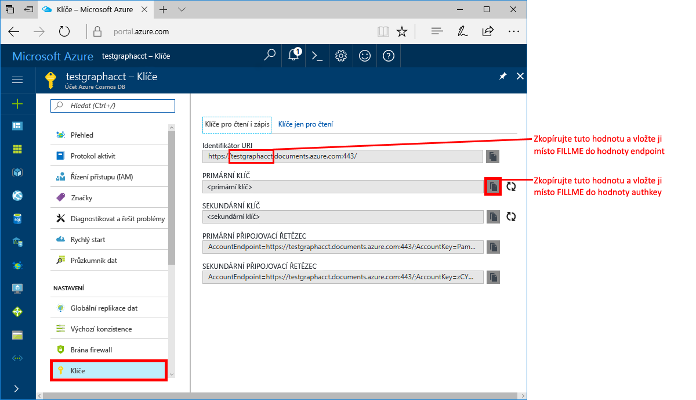
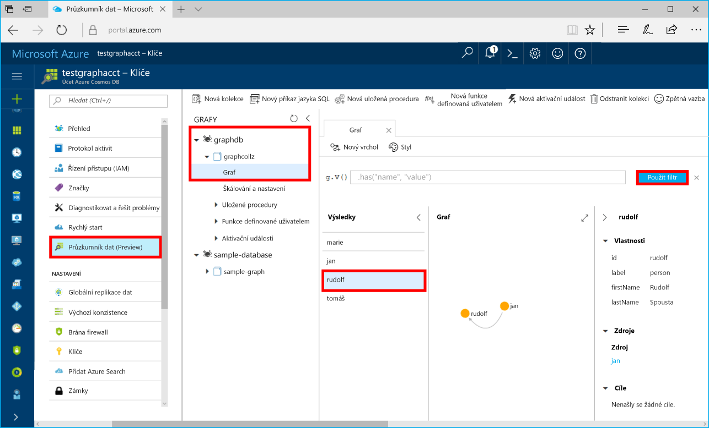

# <a name="azure-cosmos-db-build-a-net-framework-or-core-application-using-the-graph-api"></a>Azure Cosmos DB: Vytvoření aplikace v .NET Framework nebo .NET Core s využitím rozhraní Graph API

Azure Cosmos DB je globálně distribuovaná databázová služba Microsoftu pro více modelů. Můžete snadno vytvořit a dotazovat databáze dotazů, klíčů/hodnot a grafů, které tak můžou využívat výhody použitelnosti v celosvětovém měřítku a možností horizontálního škálování v jádru databáze Azure Cosmos. 

Tento rychlý start popisuje způsob vytvoření účtu databáze Azure Cosmos, databáze a grafu (kontejneru) pomocí webu Azure Portal. Potom sestavíte a spustíte aplikaci konzoly založenou na [rozhraní Graph API](graph-sdk-dotnet.md).  

## <a name="prerequisites"></a>Požadavky

Pokud ještě nemáte nainstalovanou sadu Visual Studio 2017, můžete stáhnout a použít **bezplatnou verzi** [Visual Studio 2017 Community Edition](https://www.visualstudio.com/downloads/). Nezapomeňte při instalaci sady Visual Studio povolit možnost **Azure Development**.

Pokud už máte sadu Visual Studio 2017 nainstalovanou, ujistěte se, že máte nainstalovanou sadu [Visual Studio 2017 s aktualizací Update 3](https://www.visualstudio.com/en-us/news/releasenotes/vs2017-relnotes).

[!INCLUDE [quickstarts-free-trial-note](../../includes/quickstarts-free-trial-note.md)]

## <a name="create-a-database-account"></a>Vytvoření účtu databáze

[!INCLUDE [cosmos-db-create-dbaccount-graph](../../includes/cosmos-db-create-dbaccount-graph.md)]

## <a name="add-a-graph"></a>Přidání grafu

[!INCLUDE [cosmos-db-create-graph](../../includes/cosmos-db-create-graph.md)]

## <a name="clone-the-sample-application"></a>Klonování ukázkové aplikace

Teď naklonujeme aplikaci rozhraní Graph API z GitHubu, nastavíme připojovací řetězec a spustíme ji. Přesvědčíte se, jak snadno se pracuje s daty prostřednictvím kódu programu. 

Tento ukázkový projekt používá formát projektu .NET Core a byl nakonfigurovaný k cílení na následující rozhraní:
 - netcoreapp2.0
 - net461

1. Otevřete okno terminálu Git, jako je třeba Git Bash, a pomocí `cd` přejděte do pracovního adresáře.  

2. Ukázkové úložiště naklonujete spuštěním následujícího příkazu. 

    ```bash
    git clone https://github.com/Azure-Samples/azure-cosmos-db-graph-dotnet-getting-started.git
    ```

3. Potom otevřete sadu Visual Studio a otevřete soubor řešení. 

## <a name="review-the-code"></a>Kontrola kódu

Ještě jednou se stručně podívejme na to, co se v aplikaci děje. Otevřete soubor Program.cs a zjistíte, že tyto řádky kódu vytvářejí prostředky databáze Azure Cosmos. 

* Inicializuje se DocumentClient. 

    ```csharp
    using (DocumentClient client = new DocumentClient(
        new Uri(endpoint),
        authKey,
        new ConnectionPolicy { ConnectionMode = ConnectionMode.Direct, ConnectionProtocol = Protocol.Tcp }))
    ```

* Vytvoří se nová databáze.

    ```csharp
    Database database = await client.CreateDatabaseIfNotExistsAsync(new Database { Id = "graphdb" });
    ```

* Vytvoří se nový graf.

    ```csharp
    DocumentCollection graph = await client.CreateDocumentCollectionIfNotExistsAsync(
        UriFactory.CreateDatabaseUri("graphdb"),
        new DocumentCollection { Id = "graph" },
        new RequestOptions { OfferThroughput = 1000 });
    ```
* Pomocí metody `CreateGremlinQuery` se provede série kroků konzoly Gremlin.

    ```csharp
    // The CreateGremlinQuery method extensions allow you to execute Gremlin queries and iterate
    // results asychronously
    IDocumentQuery<dynamic> query = client.CreateGremlinQuery<dynamic>(graph, "g.V().count()");
    while (query.HasMoreResults)
    {
        foreach (dynamic result in await query.ExecuteNextAsync())
        {
            Console.WriteLine($"\t {JsonConvert.SerializeObject(result)}");
        }
    }

    ```

## <a name="update-your-connection-string"></a>Aktualizace připojovacího řetězce

Teď se vraťte zpátky na portál Azure Portal, kde najdete informace o připojovacím řetězci, a zkopírujte je do aplikace.

1. Na [portálu Azure](http://portal.azure.com/) klikněte na **Klíče**. 

    Zkopírujte první část hodnoty identifikátoru URI.

    

2. V sadě Visual Studio 2017 otevřete soubor appsettings.json a vložte tuto hodnotu místo `FILLME` v části `endpoint`. 

    `"endpoint": "https://FILLME.documents.azure.com:443/",`

    Hodnota koncového bodu by teď měla vypadat takto:

    `"endpoint": "https://testgraphacct.documents.azure.com:443/",`

3. Z portálu zkopírujte hodnotu **PRIMÁRNÍHO KLÍČE**, nastavte ji jako hodnotu klíče AuthKey v souboru App.config a potom uložte změny. 

    `"authkey": "FILLME"`

4. Uložte soubor appsettings.json. 

Teď jste aktualizovali aplikaci a zadali do ní všechny informace potřebné ke komunikaci s Azure Cosmos DB. 

## <a name="run-the-console-app"></a>Spuštění aplikace konzoly

Než aplikaci spustíte, doporučujeme aktualizovat balíček *Microsoft.Azure.Graphs* na nejnovější verzi.

1. V sadě Visual Studio klikněte v **Průzkumníku řešení** pravým tlačítkem myši na projekt **GraphGetStarted** a potom klikněte na možnost **Spravovat balíčky NuGet**. 

2. Na kartě **Aktualizace** ve správci balíčků NuGet zadejte *Microsoft.Azure.Graphs* a zaškrtněte políčko **Zahrnout předběžné verze**. 

3. Z výsledků aktualizujte knihovnu **Microsoft.Azure.Graphs** na nejnovější verzi balíčku. Tím se nainstaluje balíček knihovny rozšíření grafů databáze Azure Cosmos a všechny závislosti.

    Pokud se vám zobrazí zpráva týkající se kontroly změn řešení, klikněte na **OK**. Pokud se vám zobrazí zpráva týkající se přijetí licence, klikněte na **Souhlasím**.

4. Spusťte aplikaci stisknutím CTRL+F5.

   V okně konzoly se zobrazí vrcholy a hrany, které se přidávají do grafu. Po dokončení skriptu dvojím stisknutím klávesy ENTER zavřete okno konzoly.

## <a name="browse-using-the-data-explorer"></a>Procházení pomocí Průzkumníku dat

Teď se můžete vrátit do Průzkumníku dat na webu Azure Portal, procházet nová data grafu a zadávat na ně dotazy.

1. V Průzkumníku dat se nová databáze zobrazí v podokně Graphs (Grafy). Rozbalte položky **graphdb** a **graphcollz** a potom klikněte na **Graph**.

2. Kliknutím na tlačítko **Použít filtr** použijte výchozí dotaz k zobrazení vrcholů v grafu. V podokně Graphs (Grafy) se zobrazí data vygenerovaná ukázkovou aplikací.

    Graf můžete přiblížit nebo oddálit, můžete rozšířit prostor pro zobrazení grafu, přidat další vrcholy a přesouvat vrcholy na zobrazovacím povrchu.

    

## <a name="review-slas-in-the-azure-portal"></a>Ověření podmínek SLA na portálu Azure Portal

[!INCLUDE [cosmosdb-tutorial-review-slas](../../includes/cosmos-db-tutorial-review-slas.md)]

## <a name="clean-up-resources"></a>Vyčištění prostředků

Pokud nebudete tuto aplikace nadále používat, odstraňte na základě následujícího postupu z portálu Azure Portal všechny prostředky vytvořené podle tohoto rychlého startu: 

1. V nabídce vlevo na portálu Azure Portal klikněte na **Skupiny prostředků** a pak klikněte na název vytvořeného prostředku. 
2. Na stránce skupiny prostředků klikněte na **Odstranit**, do textového pole zadejte prostředek, který chcete odstranit, a pak klikněte na **Odstranit**.

## <a name="next-steps"></a>Další kroky

V tomto rychlém startu jste se seznámili s postupem vytvoření účtu databáze Azure Cosmos, vytvoření grafu pomocí Průzkumníku dat a spuštění aplikace. Teď můžete pomocí konzoly Gremlin vytvářet složitější dotazy a implementovat účinnou logiku procházení grafů. 

> [!div class="nextstepaction"]
> [Dotazování pomocí konzoly Gremlin](tutorial-query-graph.md)

