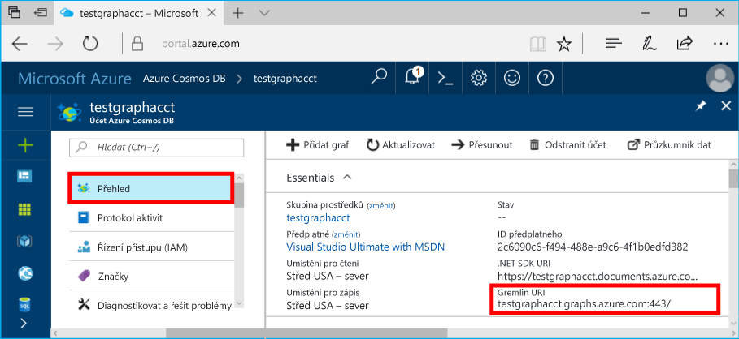
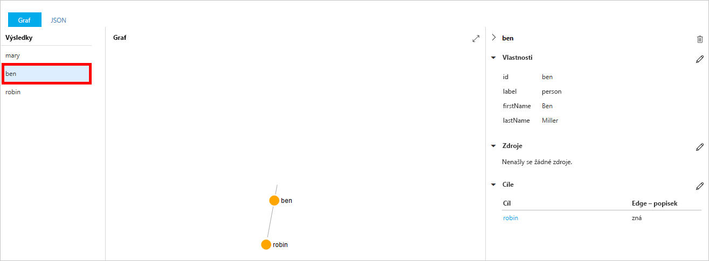
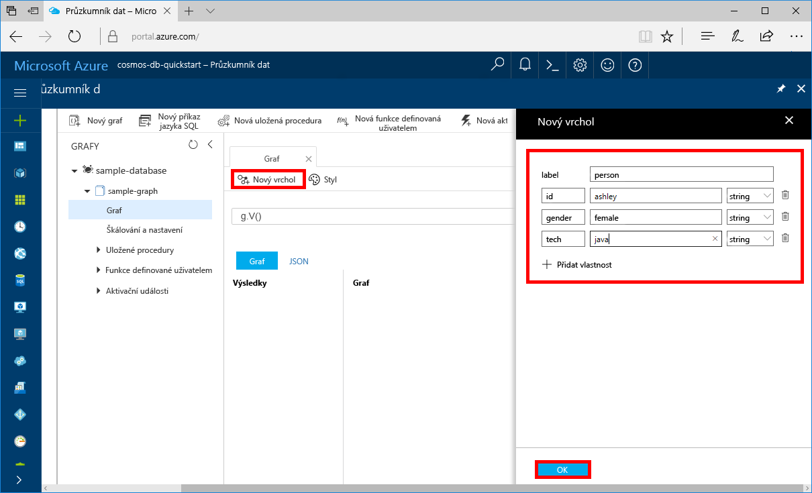
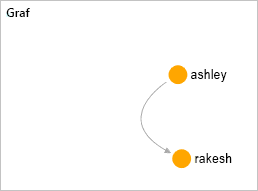

# <a name="azure-cosmos-db-create-a-graph-database-using-java-and-the-azure-portal"></a>Azure Cosmos DB: Vytvoření databáze grafu pomocí Javy a webu Azure Portal

Databáze Azure Cosmos je databázová služba Microsoftu s více modely použitelná v celosvětovém měřítku. Můžete snadno vytvořit a dotazovat databáze dotazů, klíčů/hodnot a grafů, které tak můžou využívat výhody použitelnosti v celosvětovém měřítku a možností horizontálního škálování v jádru databáze Azure Cosmos. 

V tomto rychlém startu se vytvoří databáze grafu pomocí nástrojů pro Azure Cosmos DB na webu Azure Portal. V tomto rychlém startu se také dozvíte, jak rychle vytvořit konzolovou aplikaci Java, která používá databázi grafu, pomocí ovladače OSS [Gremlin Java](https://mvnrepository.com/artifact/org.apache.tinkerpop/gremlin-driver). Pokyny v tomto rychlém startu platí pro všechny operační systémy, které podporují Javu. Po dokončení tohoto rychlého startu budete vědět, jak vytvořit a upravit prostředky grafu v uživatelském rozhraní nebo programově podle toho, čemu dáváte přednost. 

## <a name="prerequisites"></a>Požadavky

* [Java Development Kit (JDK) 1.7+](http://www.oracle.com/technetwork/java/javase/downloads/jdk8-downloads-2133151.html)
    * Na Ubuntu nainstalujte sadu JDK spuštěním příkazu `apt-get install default-jdk`.
    * Nezapomeňte nastavit proměnnou prostředí JAVA_HOME tak, aby odkazovala na složku, ve které je sada JDK nainstalovaná.
* [Stáhněte](http://maven.apache.org/download.cgi) a [nainstalujte](http://maven.apache.org/install.html) binární archiv [Maven](http://maven.apache.org/).
    * Na Ubuntu můžete Maven nainstalovat spuštěním příkazu `apt-get install maven`.
* [Git](https://www.git-scm.com/)
    * Na Ubuntu můžete Git nainstalovat spuštěním příkazu `sudo apt-get install git`.

[!INCLUDE [quickstarts-free-trial-note](../../includes/quickstarts-free-trial-note.md)]

## <a name="create-a-database-account"></a>Vytvoření účtu databáze

Než budete moct vytvořit databázi grafu, je potřeba pomocí služby Azure Cosmos DB vytvořit účet databáze Gremlin (Graph).

[!INCLUDE [cosmos-db-create-dbaccount-graph](../../includes/cosmos-db-create-dbaccount-graph.md)]

## <a name="add-a-graph"></a>Přidání grafu

Teď můžete pomocí nástroje Průzkumník dat na webu Azure Portal vytvořit databázi grafu. 

1. Na webu Azure Portal v levé navigační nabídce klikněte na **Průzkumník dat (Preview)**. 
2. V okně **Průzkumník dat (Preview)** klikněte na **Nový graf** a potom stránku vyplňte pomocí následujících informací.

    

    Nastavení|Navrhovaná hodnota|Popis
    ---|---|---
    ID databáze|sample-database|ID vaší nové databáze. Názvy databází musí mít délku 1 až 255 znaků a nesmí obsahovat znaky `/ \ # ?` ani koncové mezery.
    ID grafu|sample-graph|ID vašeho nového grafu. Názvy grafu mají stejné požadavky na znaky jako ID databází.
    Kapacita úložiště| 10 GB|Nechte zadanou výchozí hodnotu. Tohle je kapacita úložiště databáze.
    Propustnost|400 RU/s|Nechte zadanou výchozí hodnotu. Propustnost můžete později navýšit, pokud budete chtít snížit latenci.
    RU/min|Vypnuto|Nechte zadanou výchozí hodnotu.
    Klíč oddílu|Ponechte prázdné|Pro účely tohoto rychlého startu ponechte klíč oddílu prázdný.

3. Po vyplnění formuláře klikněte na **OK**.

## <a name="clone-the-sample-application"></a>Klonování ukázkové aplikace

Teď naklonujeme aplikaci grafu z GitHubu, nastavíme připojovací řetězec a spustíme ji. Uvidíte, jak snadno se pracuje s daty prostřednictvím kódu programu. 

1. Otevřete okno terminálu Git, jako je třeba Git Bash, a pomocí `cd` přejděte do pracovního adresáře.  

2. Ukázkové úložiště naklonujete spuštěním následujícího příkazu. 

    ```bash
    git clone https://github.com/Azure-Samples/azure-cosmos-db-graph-java-getting-started.git
    ```

## <a name="review-the-code"></a>Kontrola kódu

Ještě jednou se stručně podívejme na to, co se v aplikaci děje. Otevřete soubor `Program.java` ze složky \src\GetStarted a vyhledejte tyto řádky kódu. 

* Inicializuje se konzola Gremlin `Client` z konfigurace v nástroji `src/remote.yaml`.

    ```java
    cluster = Cluster.build(new File("src/remote.yaml")).create();
    ...
    client = cluster.connect();
    ```

* Pomocí metody `client.submit` se provede série kroků konzoly Gremlin.

    ```java
    ResultSet results = client.submit(gremlin);

    CompletableFuture<List<Result>> completableFutureResults = results.all();
    List<Result> resultList = completableFutureResults.get();

    for (Result result : resultList) {
        System.out.println(result.toString());
    }
    ```

## <a name="update-your-connection-string"></a>Aktualizace připojovacího řetězce

1. Otevřete soubor src/remote.yaml. 

3. V souboru src/remote.yaml vyplňte hodnoty *hosts* (hostitelé), *username* (uživatelské jméno) a *password* (heslo). Zbývající nastavení není potřeba měnit.

    Nastavení|Navrhovaná hodnota|Popis
    ---|---|---
    Hostitelé|[***.graphs.azure.com]|Podívejte se na snímek obrazovky pod touto tabulkou. Tato hodnota je hodnota Gremlin URI na stránce Přehled na webu Azure Portal v hranatých závorkách a s odebraným řetězcem „:443/“ na konci.<br><br>Tuto hodnotu můžete získat také z karty Klíče s použitím hodnoty URI, ve které odeberete „https://“, změníte „documents“ na „graphs“ a odeberete „:443/“ na konci.
    Uživatelské jméno|/dbs/sample-database/colls/sample-graph|Prostředek ve formátu `/dbs/<db>/colls/<coll>`, kde `<db>` je název vaší stávající databáze a `<coll>` je název vaší stávající kolekce.
    Heslo|*Primární hlavní klíč*|Podívejte se na druhý snímek obrazovky pod touto tabulkou. Tato hodnota je váš primární klíč, který můžete získat ze stránky Klíče na webu Azure Portal v poli Primární klíč. Zkopírujte hodnotu pomocí tlačítka pro kopírování na pravé straně pole.

    Pro hodnotu Hostitelé zkopírujte hodnotu **Gremlin URI** ze stránky **Přehled**. Pokud je hodnota prázdná, na řádku Hostitelé v předchozí tabulce najdete pokyny pro vytvoření identifikátoru Gremlin URI z okna Klíče.


    Pro hodnotu Heslo zkopírujte **Primární klíč** z okna **Klíče**: 

## <a name="run-the-console-app"></a>Spuštění aplikace konzoly

1. V okně terminálu Git přejděte příkazem `cd` do složky azure-cosmos-db-graph-java-getting-started folder.

2. V okně terminálu Git zadejte `mvn package`, aby se nainstalovaly požadované balíčky Java.

3. V okně terminálu Git spuštěním příkazu `mvn exec:java -D exec.mainClass=GetStarted.Program` spusťte svoji aplikaci Java.

V okně terminálu se zobrazí vrcholy, které se přidávají do grafu. Po dokončení programu přejděte v internetovém prohlížeči zpět na web Azure Portal. 

<a id="add-sample-data"></a>
## <a name="review-and-add-sample-data"></a>Kontrola a přidání ukázkových dat

Teď můžete přejít zpět do Průzkumníku dat a zobrazit vrcholy přidané do grafu a přidat další datové body.

1. V Průzkumníku dat rozbalte **sample-database**/**sample-graph**, klikněte na **Graf** a potom klikněte na **Použít filtr**. 

   

2. V seznamu **Výsledky** si všimněte nových uživatelů přidaných do grafu. Vyberte uživatele **ben** a všimněte si, že je propojený s uživatelem robin. V Graph Exploreru můžete přesouvat vrcholy, přibližovat a oddalovat a zvětšit plochu Graph Exploreru. 

   

3. Přidejme do grafu několik nových uživatelů pomocí Průzkumníku dat. Klikněte na tlačítko **Nový vrchol** a přidejte do grafu data.

   

4. Jako popisek zadejte *person* (osoba), potom zadejte následující klíče a hodnoty a vytvořte v grafu první vrchol. Všimněte si, že pro každou osobu v grafu můžete vytvořit jedinečné vlastnosti. Vyžaduje se pouze klíč id.

    key|hodnota|Poznámky
    ----|----|----
    id|ashley|Jedinečný identifikátor pro vrchol. Pokud identifikátor nezadáte, vygeneruje se pro vás.
    gender (pohlaví)|female (žena)| 
    tech (technologie) | java | 

    > [!NOTE]
    > V tomto rychlém startu vytváříme kolekci bez oddílů. Pokud však vytvoříte dělenou kolekci zadáním klíče oddílu při vytváření kolekce, pak každý nový vrchol bude muset zahrnovat klíč oddílu jako klíč. 

5. Klikněte na **OK**. Možná bude nutné zvětšit obrazovku, aby se tlačítko **OK** zobrazilo v dolní části obrazovky.

6. Znovu klikněte na **Nový vrchol** a přidejte dalšího nového uživatele. Jako popisek zadejte *person* (osoba) a potom zadejte následující klíče a hodnoty:

    key|hodnota|Poznámky
    ----|----|----
    id|rakesh|Jedinečný identifikátor pro vrchol. Pokud identifikátor nezadáte, vygeneruje se pro vás.
    gender (pohlaví)|male (muž)| 
    school (škola)|MIT| 

7. Klikněte na **OK**. 

8. Klikněte na **Použít filtr** s výchozím filtrem `g.V()`. Teď se v seznamu **Výsledky** zobrazí všichni uživatelé. S přidáváním dalších dat můžete pomocí filtrů omezit výsledky. Průzkumník dat ve výchozím nastavení používá `g.V()` k načtení všech vrcholů v grafu, ale můžete to změnit na jiný [dotaz na graf](tutorial-query-graph.md), jako například `g.V().count()`, který vrátí počet všech vrcholů v grafu ve formátu JSON.

9. Teď můžeme propojit uživatele rakesh a ashley. Ujistěte se, že v seznamu **Výsledky** je vybraný uživatel **ashley**, a potom klikněte na tlačítko Upravit vedle položky **Cíle** vpravo dole. Možná budete muset rozšířit okno, aby se zobrazila oblast **Vlastnosti**.

   

10. Do pole **Cíl** zadejte *rakesh*, do pole **Popisek hrany** zadejte *knows* (zná) a potom klikněte na zaškrtávací políčko.

   

11. Teď vyberte ze seznamu výsledků uživatele **rakesh** a zobrazí se propojení mezi uživateli ashley a rakesh. 

   

    Průzkumník dat můžete použít také pro vytváření uložených procedur, funkcí UDF a triggerů pro provádění obchodní logiky a také propustnosti škálování na straně serveru. Průzkumník dat zpřístupní všechna integrovaná programová data v rozhraních API, ale zajistí jednoduchý přístup k vašim datům na portálu Azure Portal.


## <a name="review-slas-in-the-azure-portal"></a>Ověření smluv SLA na webu Azure Portal

[!INCLUDE [cosmosdb-tutorial-review-slas](../../includes/cosmos-db-tutorial-review-slas.md)]

## <a name="clean-up-resources"></a>Vyčištění prostředků

Pokud nebudete tuto aplikace nadále používat, odstraňte na základě následujícího postupu z portálu Azure Portal všechny prostředky vytvořené podle tohoto rychlého startu: 

1. V nabídce vlevo na portálu Azure Portal klikněte na **Skupiny prostředků** a pak klikněte na název vytvořeného prostředku. 
2. Na stránce skupiny prostředků klikněte na **Odstranit**, do textového pole zadejte prostředek, který chcete odstranit, a pak klikněte na **Odstranit**.

## <a name="next-steps"></a>Další kroky

V tomto rychlém startu jste se seznámili s postupem vytvoření účtu databáze Azure Cosmos, vytvoření grafu pomocí Průzkumníku dat a spuštění aplikace. Teď můžete pomocí konzoly Gremlin vytvářet složitější dotazy a implementovat účinnou logiku procházení grafů. 

> [!div class="nextstepaction"]
> [Dotazování pomocí konzoly Gremlin](tutorial-query-graph.md)


