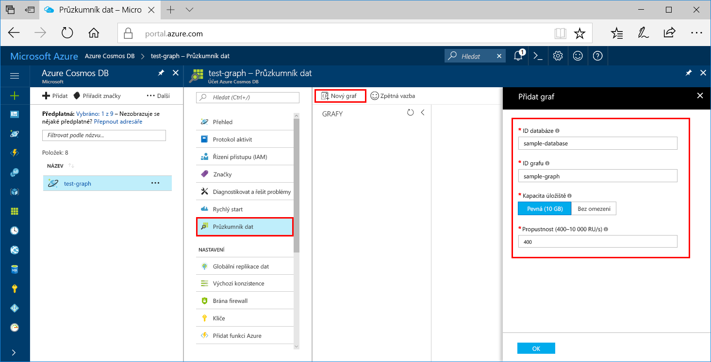
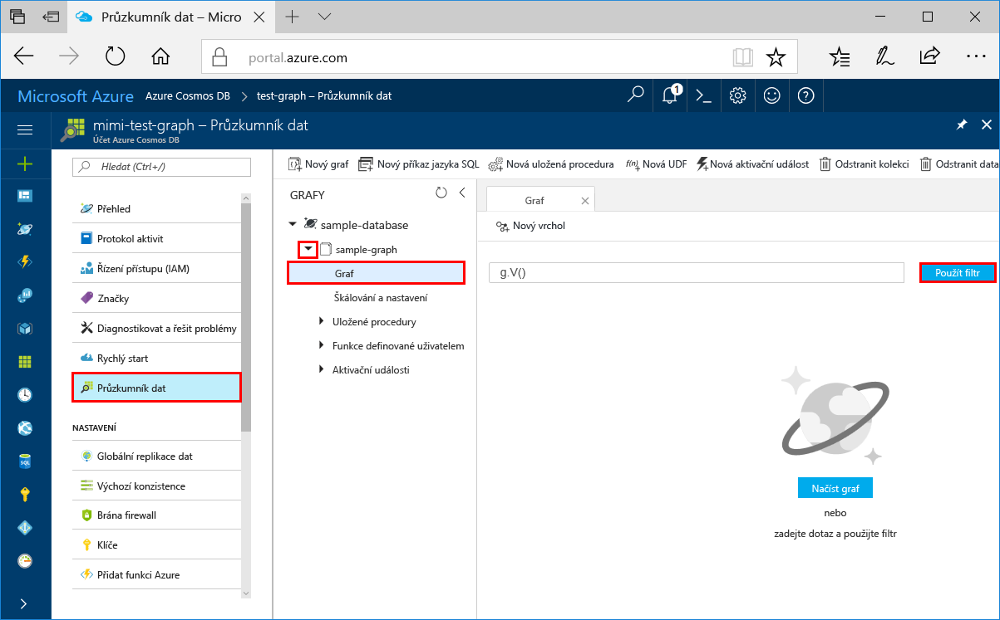
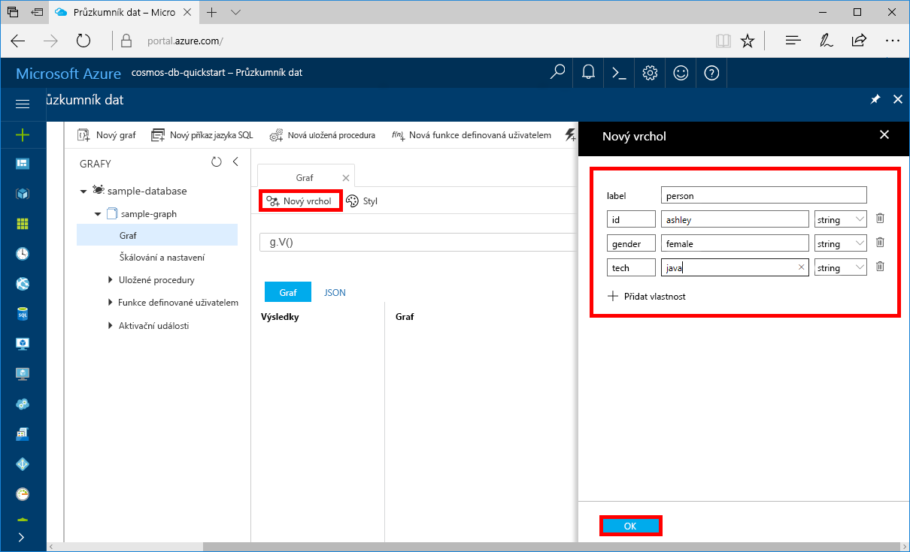
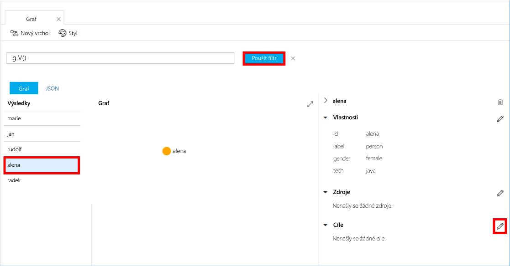
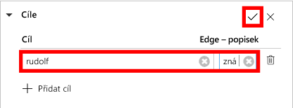

# <a name="azure-cosmos-db-create-a-graph-database-using-python-and-the-azure-portal"></a>Azure Cosmos DB: Vytvoření databáze grafů pomocí Pythonu a webu Azure Portal

Tento rychlý start ukazuje, jak pomocí Pythonu a rozhraní [Graph API](graph-introduction.md) služby Azure Cosmos DB sestavit aplikaci konzoly naklonováním příkladu z GitHubu. Tento rychlý start vás také provede vytvořením účtu Azure Cosmos DB pomocí webu Azure Portal.   

Azure Cosmos DB je globálně distribuovaná databázová služba Microsoftu pro více modelů. Můžete rychle vytvořit a dotazovat databáze dokumentů, párů klíč-hodnota a grafů, které tak můžou využívat výhody možnosti globální distribuce a horizontálního škálování v jádru služby Azure Cosmos DB.  

> [!NOTE]
> Tento rychlý start vyžaduje účet databáze grafů vytvořený po 20. prosinci 2017. Existující účty budou podporovat Python, jakmile se migrují do všeobecné dostupnosti.

## <a name="prerequisites"></a>Požadavky

[!INCLUDE [quickstarts-free-trial-note](../../includes/quickstarts-free-trial-note.md)] Alternativně můžete [vyzkoušet službu Azure Cosmos DB zdarma](https://azure.microsoft.com/try/cosmosdb/) bez předplatného Azure, poplatků a závazků.

Navíc platí:
* [Python](https://www.python.org/downloads/) verze v3.5 nebo novější
* [Správce balíčků pip](https://pip.pypa.io/en/stable/installing/)
* [Git](http://git-scm.com/)
* [Ovladač Pythonu pro Gremlin](https://github.com/apache/tinkerpop/tree/master/gremlin-python)

## <a name="create-a-database-account"></a>Vytvoření účtu databáze

Než budete moct vytvořit databázi grafu, je potřeba pomocí služby Azure Cosmos DB vytvořit účet databáze Gremlin (Graph).

[!INCLUDE [cosmos-db-create-dbaccount-graph](../../includes/cosmos-db-create-dbaccount-graph.md)]

## <a name="add-a-graph"></a>Přidání grafu

Teď můžete pomocí nástroje Průzkumník dat na webu Azure Portal vytvořit databázi grafu. 

1. Klikněte na **Průzkumník dat** > **Nový graf**.

    Úplně vpravo se zobrazí oblast **Přidat graf**. Pokud ji nevidíte, možná se budete muset posunout doprava.

    

2. Na stránce **Přidat graf** zadejte nastavení pro nový graf.

    Nastavení|Navrhovaná hodnota|Popis
    ---|---|---
    ID databáze|sample-database|Jako název nové databáze zadejte *sample-database*. Názvy databází musí mít délku 1 až 255 znaků a nesmí obsahovat znaky `/ \ # ?` ani koncové mezery.
    ID grafu|sample-graph|Jako název nové kolekce zadejte *sample-graph*. Názvy grafů mají stejné požadavky na znaky jako ID databází.
    Kapacita úložiště|Pevná (10 GB)|Nechte zadanou výchozí hodnotu **Pevná (10 GB)**. Tato hodnota je kapacita úložiště databáze.
    Propustnost|400 RU/s|Změňte propustnost na 400 jednotek žádostí za sekundu (RU/s). Pokud budete chtít snížit latenci, můžete propustnost později navýšit.

3. Po vyplnění formuláře klikněte na **OK**.

## <a name="clone-the-sample-application"></a>Klonování ukázkové aplikace

Teď přejděme k práci s kódem. Naklonujeme aplikaci Graph API z GitHubu, nastavíme připojovací řetězec a spustíme ji. Přesvědčíte se, jak snadno se pracuje s daty prostřednictvím kódu programu.  

1. Otevřete příkazový řádek, vytvořte novou složku git-samples a potom příkazový řádek zavřete.

    ```bash
    md "C:\git-samples"
    ```

2. Otevřete okno terminálu Git, třeba Git Bash, a pomocí příkazu `cd` přejděte do složky, do které chcete nainstalovat ukázkovou aplikaci.  

    ```bash
    cd "C:\git-samples"
    ```

3. Ukázkové úložiště naklonujete spuštěním následujícího příkazu. Tento příkaz vytvoří na vašem počítači kopii ukázkové aplikace. 

    ```bash
    git clone https://github.com/Azure-Samples/azure-cosmos-db-graph-python-getting-started.git
    ```

## <a name="review-the-code"></a>Kontrola kódu

Tento krok je volitelný. Pokud chcete zjistit, jak se v kódu vytvářejí prostředky databáze, můžete si prohlédnout následující fragmenty kódu. Všechny fragmenty kódu pocházejí ze souboru `connect.py` ve složce C:\git-samples\azure-cosmos-db-graph-python-getting-started\. Jinak můžete přeskočit přímo k části [Aktualizace informací o připojení](#update-your-connection-information). 

* `client` konzoly Gremlin se inicializuje na řádku 104 v `connect.py`:

    ```python
    ...
    client = client.Client('wss://<YOUR_ENDPOINT>.graphs.azure.com:443/','g', 
        username="/dbs/<YOUR_DATABASE>/colls/<YOUR_COLLECTION_OR_GRAPH>", 
        password="<YOUR_PASSWORD>")
    ...
    ```

* Na začátku souboru `connect.py` je deklarovaná posloupnost kroků konzoly Gremlin. K jejich provedení se použije metoda `client.submitAsync()`:

    ```python
    client.submitAsync(_gremlin_cleanup_graph)
    ```

## <a name="update-your-connection-information"></a>Aktualizace informací o připojení

Teď se vraťte na portál Azure, kde najdete informace o připojení, a zkopírujte je do aplikace. Tato nastavení umožní aplikaci komunikovat s hostovanou databází.

1. Na [portálu Azure](http://portal.azure.com/) klikněte na **Klíče**. 

    Zkopírujte první část hodnoty identifikátoru URI.

    

2. Otevřete soubor connect.py a na řádku 104 místo `<YOUR_ENDPOINT>` vložte tuto hodnotu URI:

    ```python
    client = client.Client('wss://<YOUR_ENDPOINT>.graphs.azure.com:443/','g', 
        username="/dbs/<YOUR_DATABASE>/colls/<YOUR_COLLECTION_OR_GRAPH>", 
        password="<YOUR_PASSWORD>")
    ```

    Část URI objektu klienta by měla vypadat nějak takto:

    ```python
    client = client.Client('wss://test.graphs.azure.com:443/','g', 
        username="/dbs/<YOUR_DATABASE>/colls/<YOUR_COLLECTION_OR_GRAPH>", 
        password="<YOUR_PASSWORD>")
    ```

3. V názvu klienta změňte `graphs.azure.com` na `gremlin.cosmosdb.azure.com`. (Pokud se účet databáze grafů vytvořil před 20. prosincem 2017, neprovádějte žádné změny a přejděte k dalšímu kroku.)

4. Změňte druhý parametr objektu `client` a nahraďte řetězce `<YOUR_DATABASE>` a `<YOUR_COLLECTION_OR_GRAPH>`. Pokud jste použili navrhované hodnoty, parametr by měl vypadat přibližně takto:

    `username="/dbs/sample-database/colls/sample-graph"`

    Celý objekt `client` by měl vypadat nějak takhle:

    ```python
    client = client.Client('wss://test.gremlin.cosmosdb.azure.com:443/','g', 
        username="/dbs/sample-database/colls/sample-graph", 
        password="<YOUR_PASSWORD>")
    ```

5. Na webu Azure Portal pomocí tlačítka pro kopírování zkopírujte PRIMÁRNÍ KLÍČ a vložte ho místo `<YOUR_PASSWORD>` v parametru `password=<YOUR_PASSWORD>`.

    Celá definice objektu `client` by měla vypadat nějak takhle:
    ```python
    client = client.Client('wss://test.gremlin.cosmosdb.azure.com:443/','g', 
        username="/dbs/sample-database/colls/sample-graph", 
        password="asdb13Fadsf14FASc22Ggkr662ifxz2Mg==")
    ```

6. Uložte soubor `connect.py`.

## <a name="run-the-console-app"></a>Spuštění aplikace konzoly

1. V okně terminálu Git přejděte příkazem `cd` do složky azure-cosmos-db-graph-python-getting-started.

    ```git
    cd "C:\git-samples\azure-cosmos-db-graph-python-getting-started"
    ```

2. V okně terminálu Git pomocí následujícího příkazu nainstalujte požadované balíčky Pythonu.

   ```
   pip install -r requirements.txt
   ```

3. V okně terminálu Git pomocí následujícího příkazu spusťte aplikaci v Pythonu.
    
    ```
    python connect.py
    ```

    V okně terminálu se zobrazí vrcholy a hrany, které se přidávají do grafu. 
    
    Pokud dochází k chybám časového limitu, zkontrolujte, jestli jste v části [Aktualizace informací o připojení](#update-your-connection-information) správně aktualizovali informace o připojení, a zkuste poslední příkaz spustit znovu. 
    
    Po zastavení programu stiskněte Enter a pak v internetovém prohlížeči přejděte zpátky na portál Azure.

<a id="add-sample-data"></a>
## <a name="review-and-add-sample-data"></a>Kontrola a přidání ukázkových dat

Teď můžete přejít zpět do Průzkumníku dat a zobrazit vrcholy přidané do grafu a přidat další datové body.

1. Klikněte na **Průzkumník dat**, rozbalte **sample-graph**, klikněte na **Graf** a potom klikněte na **Použít filtr**. 

   

2. V seznamu **Výsledky** si všimněte nových uživatelů přidaných do grafu. Vyberte uživatele **ben** a všimněte si, že je propojený s uživatelem robin. Vrcholy můžete přesouvat přetahováním, přibližovat a oddalovat můžete pomocí kolečka myši a zvětšit plochu grafu můžete pomocí obousměrné šipky. 

   

3. Teď přidáme několik nových uživatelů. Klikněte na tlačítko **Nový vrchol** a přidejte do grafu data.

   

4. Zadejte popisek *person* (osoba).

5. Kliknutím na **Přidat vlastnost** přidejte následující vlastnosti. Všimněte si, že pro každou osobu v grafu můžete vytvořit jedinečné vlastnosti. Vyžaduje se pouze klíč id.

    key|hodnota|Poznámky
    ----|----|----
    id|ashley|Jedinečný identifikátor pro vrchol. Pokud identifikátor nezadáte, vygeneruje se pro vás.
    gender (pohlaví)|female (žena)| 
    tech (technologie) | java | 

    > [!NOTE]
    > V tomto rychlém startu se vytváří kolekce bez oddílů. Pokud však vytvoříte dělenou kolekci zadáním klíče oddílu při vytváření kolekce, pak každý nový vrchol bude muset zahrnovat klíč oddílu jako klíč. 

6. Klikněte na **OK**. Možná bude nutné zvětšit obrazovku, aby se tlačítko **OK** zobrazilo v dolní části obrazovky.

7. Znovu klikněte na **Nový vrchol** a přidejte dalšího nového uživatele. 

8. Zadejte popisek *person* (osoba).

9. Kliknutím na **Přidat vlastnost** přidejte následující vlastnosti:

    key|hodnota|Poznámky
    ----|----|----
    id|rakesh|Jedinečný identifikátor pro vrchol. Pokud identifikátor nezadáte, vygeneruje se pro vás.
    gender (pohlaví)|male (muž)| 
    school (škola)|MIT| 

10. Klikněte na **OK**. 

11. Klikněte na tlačítko **Použít filtr** s výchozím filtrem `g.V()` a zobrazte v grafu všechny hodnoty. Teď se v seznamu **Výsledky** zobrazí všichni uživatelé. 

    S přidáváním dalších dat můžete pomocí filtrů omezit výsledky. Průzkumník dat ve výchozím nastavení pomocí filtru `g.V()` načte všechny vrcholy v grafu. Můžete ho změnit na jiný [dotaz grafu](tutorial-query-graph.md), třeba `g.V().count()`, který vrátí počet všech vrcholů v grafu ve formátu JSON. Pokud jste filtr změnili, změňte ho zpátky na `g.V()`, klikněte na **Použít filtr** a znovu zobrazte všechny výsledky.

12. Teď můžeme propojit uživatele rakesh a ashley. Ujistěte se, že v seznamu **Výsledky** je vybraný uživatel **ashley**, a potom klikněte na tlačítko Upravit vedle položky **Cíle** vpravo dole. Možná budete muset rozšířit okno, aby se zobrazila oblast **Vlastnosti**.

   

13. Do pole **Cíl** zadejte *rakesh*, do pole **Popisek hrany** zadejte *knows* (zná) a potom klikněte na symbol zaškrtnutí.

   

14. Teď vyberte ze seznamu výsledků uživatele **rakesh** a zobrazí se propojení mezi uživateli ashley a rakesh. 

   

   Tím je dokončená část tohoto kurzu věnovaná vytváření prostředků. Můžete pokračovat přidáním vrcholů do grafu, úpravou existujících vrcholů nebo změnou dotazů. Teď si projdeme metriky, které služba Azure Cosmos DB nabízí, a pak vyčistíme prostředky. 

## <a name="review-slas-in-the-azure-portal"></a>Ověření podmínek SLA na portálu Azure Portal

[!INCLUDE [cosmosdb-tutorial-review-slas](../../includes/cosmos-db-tutorial-review-slas.md)]

## <a name="clean-up-resources"></a>Vyčištění prostředků

[!INCLUDE [cosmosdb-delete-resource-group](../../includes/cosmos-db-delete-resource-group.md)]

## <a name="next-steps"></a>Další kroky

V tomto rychlém startu jste se seznámili s postupem vytvoření účtu databáze Azure Cosmos, vytvoření grafu pomocí Průzkumníku dat a spuštění aplikace. Teď můžete pomocí konzoly Gremlin vytvářet složitější dotazy a implementovat účinnou logiku procházení grafů. 

> [!div class="nextstepaction"]
> [Dotazování pomocí konzoly Gremlin](tutorial-query-graph.md)

