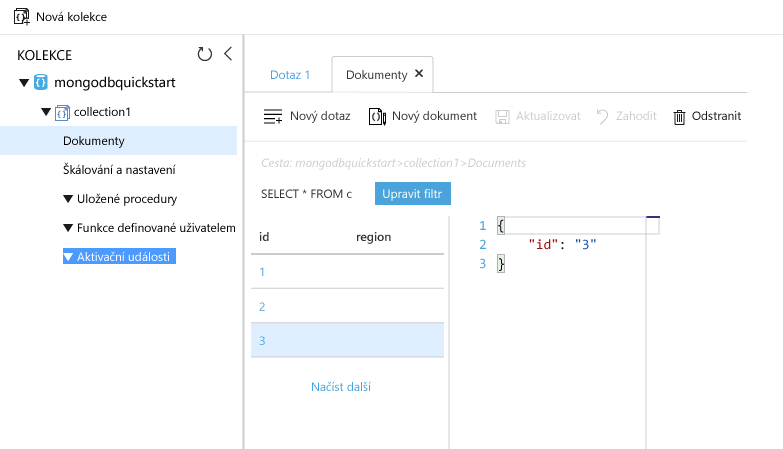

# <a name="azure-cosmos-db-migrate-an-existing-nodejs-mongodb-web-app"></a>Služba Azure Cosmos DB: Migrace stávající webové aplikace MongoDB s podporou Node.js 

Azure Cosmos DB je globálně distribuovaná databázová služba Microsoftu pro více modelů. Můžete snadno vytvořit a dotazovat databáze dotazů, klíčů/hodnot a grafů, které tak můžou využívat výhody použitelnosti v celosvětovém měřítku a možností horizontálního škálování v jádru Azure Cosmos DB. 

Tento rychlý start popisuje způsob použití stávající aplikace [MongoDB](../documentdb/documentdb-protocol-mongodb.md) napsané v Node.js a připojení ke službě Azure Cosmos DB, která podporuje připojení klienta MongoDB. Jinými slovy: aplikace Node.js ví pouze to, že se připojuje k databázi pomocí rozhraní API MongoDB. V aplikaci se transparentně zobrazuje, že data jsou uložena ve službě Azure Cosmos DB.

Po dokončení budete mít ve službě [Azure Cosmos DB](https://azure.microsoft.com/services/documentdb/) spuštěnou aplikaci MEAN (MongoDB, Express, AngularJS a Node.js). 


## <a name="prerequisites"></a>Požadavky 

Před čtením tohoto rychlého startu zkontrolujte, jestli máte na počítači nainstalované [rozhraní příkazového řádku Azure](https://docs.microsoft.com/cli/azure/install-azure-cli). Kromě tohoto budete potřebovat [Node.js](https://nodejs.org/) a [Git](http://www.git-scm.com/downloads). Spustíte příkazy `az`, `npm` a `git`.

Měli byste mít praktickou znalost Node.js. Tento rychlý start není určen jako pomůcka pro všeobecný vývoj aplikací v Node.js.

## <a name="clone-the-sample-application"></a>Klonování ukázkové aplikace

Otevřete okno terminálu Git, jako je třeba Git Bash, a pomocí `cd` přejděte do pracovního adresáře.  

Spuštěním následujících příkazů naklonujte ukázkové úložiště. Toto ukázkové úložiště obsahuje výchozí aplikaci [MEAN.js](http://meanjs.org/). 

```bash
git clone https://github.com/prashanthmadi/mean
```

## <a name="run-the-application"></a>Spuštění aplikace

Nainstalujte požadované balíčky a spusťte aplikaci.

```bash
cd mean
npm install
npm start
```

## <a name="log-in-to-azure"></a>Přihlaste se k Azure.

Teď prostřednictvím rozhraní Azure CLI 2.0 v okně terminálu vytvořte prostředky nezbytné pro hostování aplikace Node.js ve službě Azure App Service.  Přihlaste se k předplatnému Azure pomocí příkazu [az login](/cli/azure/#login) a postupujte podle pokynů na obrazovce. 

```azurecli 
az login 
``` 
   
### <a name="add-the-azure-cosmos-db-module"></a>Přidání modulu služby Azure Cosmos DB

Pokud chcete používat příkazy služby Azure Cosmos DB, přidejte modul služby Azure Cosmos DB. 

```azurecli
az component update --add cosmosdb
```

## <a name="create-a-resource-group"></a>Vytvoření skupiny prostředků

Vytvořte pomocí příkazu [az group create](/cli/azure/group#create) [skupinu prostředků](../azure-resource-manager/resource-group-overview.md). Skupina prostředků Azure je logický kontejner, ve kterém se nasazují a spravují prostředky Azure, jako například webové aplikace, databáze a účty úložiště. 

Následující příklad vytvoří skupinu prostředků pro oblast Západní Evropa. Pro skupinu prostředků vyberte jedinečný název.

```azurecli
az group create --name myResourceGroup --location "West Europe"
```

## <a name="create-an-azure-cosmos-db-account"></a>Vytvoření účtu služby Azure Cosmos DB

Pomocí příkazu [az cosmosdb create](/cli/azure/cosmosdb#create) vytvořte účet služby Azure Cosmos DB.

V následujícím příkazu nahraďte zástupný symbol `<cosmosdb_name>` vlastním jedinečným názvem účtu služby Azure Cosmos DB. Tento jedinečný název se použije jako součást koncového bodu služby Azure Cosmos DB (`https://<cosmosdb_name>.documents.azure.com/`). Název proto musí být jedinečný ve všech účtech služby Azure Cosmos DB platformy Azure. 

```azurecli
az cosmosdb create --name <cosmosdb_name> --resource-group myResourceGroup --kind MongoDB
```

Parametr `--kind MongoDB` umožňuje klientská připojení MongoDB.

Po vytvoření účtu služby Azure Cosmos DB zobrazí rozhraní příkazového řádku Azure podobné informace jako v následujícím příkladu. 

```json
{
  "databaseAccountOfferType": "Standard",
  "documentEndpoint": "https://<cosmosdb_name>.documents.azure.com:443/",
  "id": "/subscriptions/00000000-0000-0000-0000-000000000000/resourceGroups/myResourceGroup/providers/Microsoft.Document
DB/databaseAccounts/<cosmosdb_name>",
  "kind": "MongoDB",
  "location": "West Europe",
  "name": "<cosmosdb_name>",
  "readLocations": [
    {
      "documentEndpoint": "https://<cosmosdb_name>-westeurope.documents.azure.com:443/",
      "failoverPriority": 0,
      "id": "<cosmosdb_name>-westeurope",
      "locationName": "West Europe",
      "provisioningState": "Succeeded"
    }
  ],
  "resourceGroup": "myResourceGroup",
  "type": "Microsoft.DocumentDB/databaseAccounts",
  "writeLocations": [
    {
      "documentEndpoint": "https://<cosmosdb_name>-westeurope.documents.azure.com:443/",
      "failoverPriority": 0,
      "id": "<cosmosdb_name>-westeurope",
      "locationName": "West Europe",
      "provisioningState": "Succeeded"
    }
  ]
} 
```

## <a name="connect-your-nodejs-application-to-the-database"></a>Připojení aplikace Node.js k databázi

V tomto kroku připojíte ukázkovou aplikaci MEAN.js k právě vytvořené databázi služby Azure Cosmos DB, a to pomocí připojovacího řetězce MongoDB. 

## <a name="retrieve-the-key"></a>Načtení klíče

Aby bylo možné se připojit k databázi služby Azure Cosmos DB, potřebujete klíč databáze. Pro načtení primárního klíče použijte příkaz [az documentdb list-keys](/cli/azure/documentdb#list-keys).

```azurecli
az cosmosdb list-keys --name <cosmosdb_name> --resource-group myResourceGroup
```

Výstupní informace rozhraní příkazového řádku Azure jsou podobné jako v následujícím příkladu. 

```json
{
  "primaryMasterKey": "RUayjYjixJDWG5xTqIiXjC...",
  "primaryReadonlyMasterKey": "...",
  "secondaryMasterKey": "...",
  "secondaryReadonlyMasterKey": "..."
}
```

Zkopírujte hodnotu `primaryMasterKey` textového editoru. Tyto informace budete potřebovat v dalším kroku.

<a name="devconfig"></a>
## <a name="configure-the-connection-string-in-your-nodejs-application"></a>Konfigurace připojovacího řetězce v aplikaci Node.js

V úložišti MEAN.js otevřete `config/env/local-development.js`.

Obsah tohoto souboru nahraďte následujícím kódem. Nezapomeňte nahradit také dva zástupné symboly `<cosmosdb_name>` názvem účtu služby Azure Cosmos DB a zástupný symbol `<primary_master_key>` klíčem, který jste zkopírovali v předchozím kroku.

```javascript
'use strict';

module.exports = {
  db: {
    uri: 'mongodb://<cosmosdb_name>:<primary_master_key>@<cosmosdb_name>.documents.azure.com:10250/mean-dev?ssl=true&sslverifycertificate=false'
  }
};
```

> [!NOTE] 
> Možnost `ssl=true` je důležitá, protože [služba Azure Cosmos DB vyžaduje SSL](../documentdb/documentdb-connect-mongodb-account.md#connection-string-requirements). 
>
>

Uložte provedené změny.

### <a name="run-the-application-again"></a>Spusťte aplikaci znovu.

Spusťte `npm start` znovu. 

```bash
npm start
```

Zpráva konzoly by vás teď měla informovat o tom, že vývojové prostředí je připravené a spuštěné. 

V prohlížeči přejděte na `http://localhost:3000`. V horní nabídce klikněte na **Zaregistrovat se** a pokuste se vytvořit dva fiktivní uživatele. 

Ukázková aplikace MEAN.js ukládá data uživatelů v databázi. Pokud budete úspěšní a aplikace MEAN.js automaticky zaregistruje vytvořeného uživatele, bude připojení Azure Cosmos DB fungovat. 


## <a name="view-data-in-data-explorer"></a>Zobrazení dat v Průzkumníku dat

Data uložená službou Azure Cosmos DB je možné zobrazovat a je možné se na ně dotazovat a spouštět na ně obchodní logiku na portálu Azure Portal.

Pokud chcete zobrazovat uživatelská data vytvořená v předchozím kroku, zadávat na ně dotazy a pracovat s nimi, přihlaste se k portálu [Azure Portal](https://portal.azure.com) ve webovém prohlížeči.

V horním vyhledávacím poli zadejte Azure Cosmos DB. Po otevření okna účtu služby Cosmos DB vyberte účet Cosmos DB. V levém navigačním panelu klikněte na Průzkumník dat. Rozbalte kolekci v podokně Kolekce. Pak můžete zobrazovat dokumenty v kolekci, dotazovat se na data a dokonce vytvářet a spouštět uložené procedury, triggery a funkce UDF. 




## <a name="deploy-the-nodejs-application-to-azure"></a>Nasaďte aplikaci Node.js do platformy Azure

V tomto kroku se nasazuje aplikace Node.js připojená k databázi MongoDB ke službě Azure Cosmos DB.

Pravděpodobně jste si všimli, že dříve změněný soubor konfigurace je určený pro vývojové prostředí (`/config/env/local-development.js`). Pokud nasadíte aplikaci do služby App Service, bude se ve výchozím nastavení spouštět v produkčním prostředí. Teď tedy musíte provést stejné změny v příslušném souboru konfigurace.

V úložišti MEAN.js otevřete `config/env/production.js`.

V objektu `db` nahraďte hodnotu `uri` tak, jak je uvedeno v následujícím příkladu. Nezapomeňte nahradit zástupné symboly jako v předcházejícím případě.

```javascript
'mongodb://<cosmosdb_name>:<primary_master_key>@<cosmosdb_name>.documents.azure.com:10250/mean?ssl=true&sslverifycertificate=false',
```

V terminálu potvrďte do systému Git všechny změny. Můžete zkopírovat oba příkazy a spouštět je společně.

```bash
git add .
git commit -m "configured MongoDB connection string"
```
## <a name="clean-up-resources"></a>Vyčištění prostředků

Pokud nebudete tuto aplikace nadále používat, odstraňte na základě následujícího postupu z portálu Azure Portal všechny prostředky vytvořené podle tohoto rychlého startu:

1. V nabídce vlevo na portálu Azure Portal klikněte na **Skupiny prostředků** a pak klikněte na název vytvořeného prostředku. 
2. Na stránce skupiny prostředků klikněte na **Odstranit**, do textového pole zadejte prostředek, který chcete odstranit, a pak klikněte na **Odstranit**.

## <a name="next-steps"></a>Další kroky

V tomto rychlém startu jste se seznámili s postupem vytvoření účtu databáze služby Azure Cosmos DB a vytvoření kolekce MongoDB pomocí Průzkumníku dat. Teď můžete migrovat data MongoDB do služby Azure Cosmos DB.  

> [!div class="nextstepaction"]
> [Importování dat MongoDB do služby Azure Cosmos DB](../documentdb/documentdb-mongodb-migrate.md)

