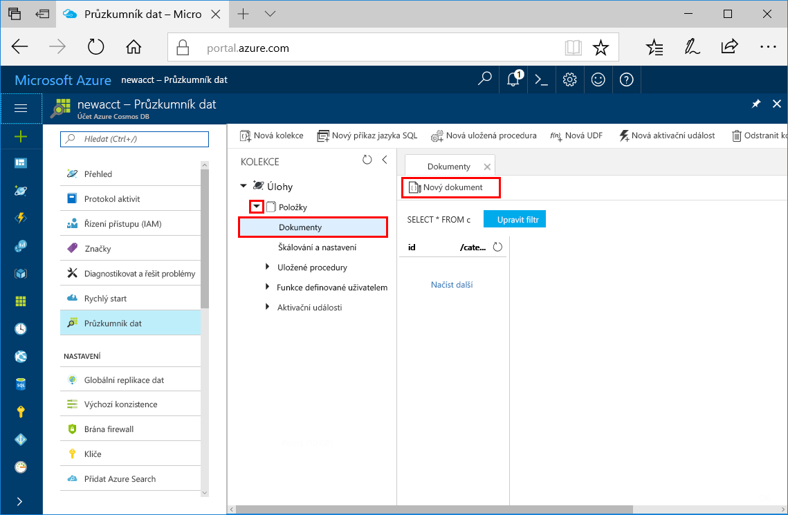
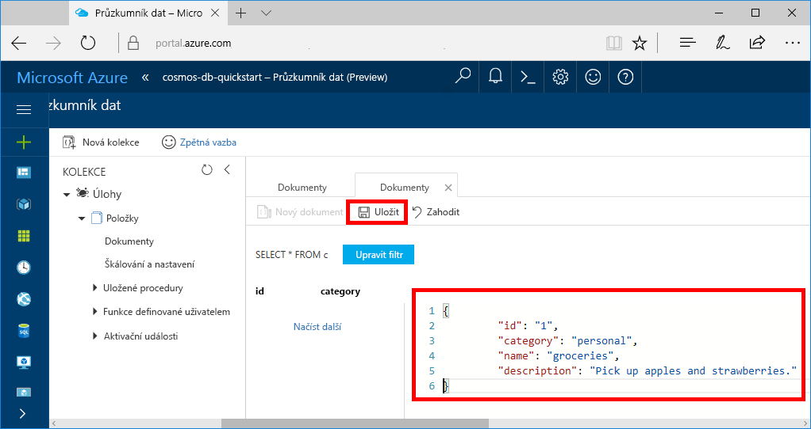
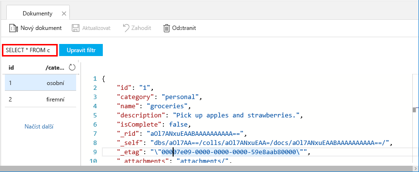
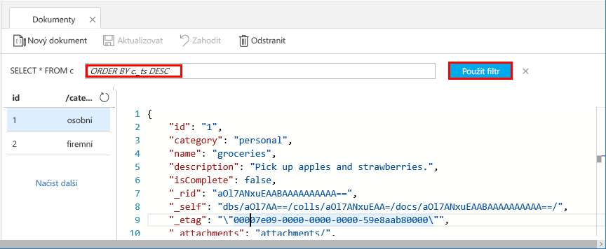
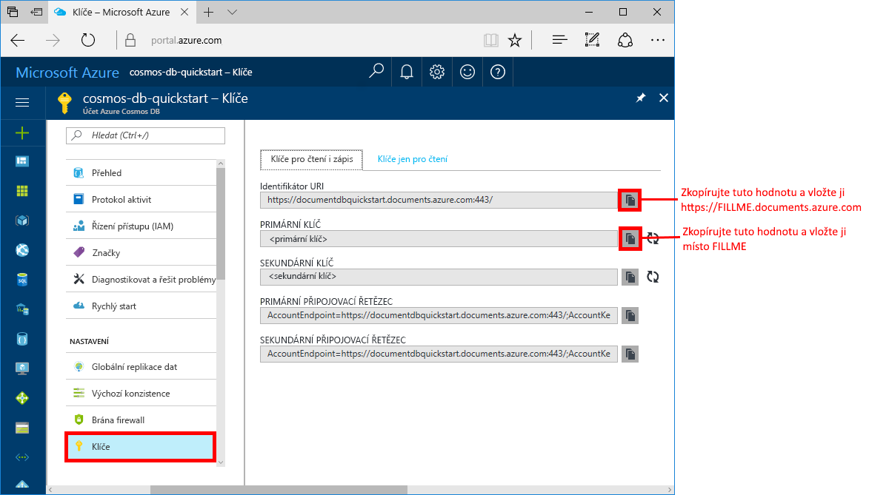

# <a name="azure-cosmos-db-create-a-document-database-using-java-and-the-azure-portal"></a>Azure Cosmos DB: Vytvoření databáze dokumentů pomocí Javy a webu Azure Portal

[!INCLUDE [cosmos-db-sql-api](../../includes/cosmos-db-sql-api.md)] 

Azure Cosmos DB je globálně distribuovaná databázová služba Microsoftu pro více modelů. Pomocí Azure Cosmos DB můžete rychle vytvořit a dotazovat spravované databáze dokumentů, tabulek a grafů.

V tomto rychlém startu se vytvoří databáze dokumentů pomocí nástrojů pro Azure Cosmos DB na webu Azure Portal. V tomto rychlém startu se také dozvíte, jak rychle vytvořit konzolovou aplikaci Java pomocí [rozhraní SQL Java API](sql-api-sdk-java.md). Pokyny v tomto rychlém startu platí pro všechny operační systémy, které podporují Javu. Po dokončení tohoto rychlého startu budete vědět, jak vytvořit a upravit prostředky databáze dokumentů v uživatelském rozhraní nebo programově podle toho, čemu dáváte přednost.

## <a name="prerequisites"></a>Požadavky

[!INCLUDE [quickstarts-free-trial-note](../../includes/quickstarts-free-trial-note.md)] 
[!INCLUDE [cosmos-db-emulator-docdb-api](../../includes/cosmos-db-emulator-docdb-api.md)]

Navíc platí: 

* [Java Development Kit (JDK) 1.7+](http://www.oracle.com/technetwork/java/javase/downloads/jdk8-downloads-2133151.html)
    * Na Ubuntu nainstalujte sadu JDK spuštěním příkazu `apt-get install default-jdk`.
    * Nezapomeňte nastavit proměnnou prostředí JAVA_HOME tak, aby odkazovala na složku, ve které je sada JDK nainstalovaná.
* [Stáhněte](http://maven.apache.org/download.cgi) a [nainstalujte](http://maven.apache.org/install.html) binární archiv [Maven](http://maven.apache.org/).
    * Na Ubuntu můžete Maven nainstalovat spuštěním příkazu `apt-get install maven`.
* [Git](https://www.git-scm.com/)
    * Na Ubuntu můžete Git nainstalovat spuštěním příkazu `sudo apt-get install git`.

## <a name="create-a-database-account"></a>Vytvoření účtu databáze

Než budete moci vytvořit databázi dokumentů, je potřeba pomocí služby Azure Cosmos DB vytvořit účet databáze SQL.

[!INCLUDE [cosmos-db-create-dbaccount](../../includes/cosmos-db-create-dbaccount.md)]

## <a name="add-a-collection"></a>Přidání kolekce

[!INCLUDE [cosmos-db-create-collection](../../includes/cosmos-db-create-collection.md)]

<a id="add-sample-data"></a>
## <a name="add-sample-data"></a>Přidání ukázkových dat

Teď můžete do nové kolekce přidávat data pomocí Průzkumníka dat.

1. Rozbalte kolekci **Položky** a klikněte na **Dokumenty** > **Nový dokument**.

   
  
2. Teď do kolekce přidejte dokument s následující strukturou a klikněte na **Uložit**.

     ```json
     {
         "id": "1",
         "category": "personal",
         "name": "groceries",
         "description": "Pick up apples and strawberries.",
         "isComplete": false
     }
     ```

    

3.  Vytvořte a uložte ještě jeden dokument, ve kterém změníte `id` na 2 a ostatní vlastnosti změníte podle svých potřeb. Nové dokumenty můžou mít jakoukoli strukturu, protože Azure Cosmos DB neuplatňuje pro data žádné schéma.

## <a name="query-your-data"></a>Dotazování dat

Teď můžete k načítání a filtrování dat používat dotazy v Průzkumníku dat.

1. Všimněte si, že ve výchozím nastavení je dotaz nastavený na `SELECT * FROM c`. Tento výchozí dotaz načte a zobrazí všechny dokumenty v kolekci. 

    

2. Změňte dotaz tak, že kliknete na tlačítko **Upravit filtr**, do pole predikátu dotazu přidáte `ORDER BY c._ts DESC` a kliknete na **Použít filtr**.

    

Tento upravený dotaz vypíše dokumenty v sestupném pořadí na základě jejich časového razítka, takže teď je jako první uvedený váš druhý dokument. Pokud jste obeznámeni se syntaxí jazyka SQL, můžete do tohoto pole zadat jakýkoli z podporovaných [příkazů jazyka SQL](sql-api-sql-query.md). 

Tím končí naše práce v Průzkumníku dat. Než se přesuneme k práci s kódem, upozorňujeme, že Průzkumník dat můžete použít také k vytváření uložených procedur, funkcí UDF a triggerů pro provádění obchodní logiky na straně serveru a také škálování propustnosti. Průzkumník dat zpřístupní všechna integrovaná programová data v rozhraních API, ale zajistí jednoduchý přístup k vašim datům na portálu Azure Portal.

## <a name="clone-the-sample-application"></a>Klonování ukázkové aplikace

Teď přejděme k práci s kódem. Naklonujeme aplikaci SQL API z GitHubu, nastavíme připojovací řetězec a spustíme ji. Přesvědčíte se, jak snadno se pracuje s daty prostřednictvím kódu programu. 

1. Otevřete příkazový řádek, vytvořte novou složku git-samples a potom příkazový řádek zavřete.

    ```bash
    md "C:\git-samples"
    ```

2. Otevřete okno terminálu Git, například Git Bash, a pomocí příkazu `cd` přejděte do nové složky, do které chcete nainstalovat ukázkovou aplikaci. 

    ```bash
    cd "C:\git-samples"
    ```

3. Ukázkové úložiště naklonujete spuštěním následujícího příkazu. Tento příkaz vytvoří na vašem počítači kopii ukázkové aplikace.

    ```bash
    git clone https://github.com/Azure-Samples/azure-cosmos-db-documentdb-java-getting-started.git
    ```

## <a name="review-the-code"></a>Kontrola kódu

Tento krok je volitelný. Pokud chcete zjistit, jak se v kódu vytvářejí prostředky databáze, můžete si prohlédnout následující fragmenty kódu. Všechny fragmenty kódu pocházejí ze souboru `Program.java` nainstalovaného ve složce C:\git-samples\azure-cosmos-db-documentdb-java-getting-started\src\GetStarted. Jinak můžete přeskočit přímo k části [Aktualizace připojovacího řetězce](#update-your-connection-string). 

* Inicializace klienta `DocumentClient`. [DocumentClient](https://docs.microsoft.com/java/api/com.microsoft.azure.documentdb._document_client) představuje logickou reprezentaci databázové služby Azure Cosmos DB na straně serveru. Tento klient slouží ke konfiguraci a provádění požadavků na službu.

    ```java
    this.client = new DocumentClient("https://FILLME.documents.azure.com",
            "FILLME", 
            new ConnectionPolicy(),
            ConsistencyLevel.Session);
    ```

* Vytvoření [databáze](https://docs.microsoft.com/java/api/com.microsoft.azure.documentdb._database).

    ```java
    Database database = new Database();
    database.setId(databaseName);
    
    this.client.createDatabase(database, null);
    ```

* Vytvoření kolekce [DocumentCollection](https://docs.microsoft.com/java/api/com.microsoft.azure.documentdb._document_collection).

    ```java
    DocumentCollection collectionInfo = new DocumentCollection();
    collectionInfo.setId(collectionName);

    ...

    this.client.createCollection(databaseLink, collectionInfo, requestOptions);
    ```

* Vytvoření dokumentu pomocí metody [createDocument](https://docs.microsoft.com/java/api/com.microsoft.azure.documentdb._document_client.createdocument).

    ```java
    // Any Java object within your code can be serialized into JSON and written to Azure Cosmos DB
    Family andersenFamily = new Family();
    andersenFamily.setId("Andersen.1");
    andersenFamily.setLastName("Andersen");
    // More properties

    String collectionLink = String.format("/dbs/%s/colls/%s", databaseName, collectionName);
    this.client.createDocument(collectionLink, family, new RequestOptions(), true);
    ```

* Příkazy jazyka SQL přes JSON se provádějí pomocí metody [queryDocuments](https://docs.microsoft.com/java/api/com.microsoft.azure.documentdb._document_client.querydocuments).

    ```java
    FeedOptions queryOptions = new FeedOptions();
    queryOptions.setPageSize(-1);
    queryOptions.setEnableCrossPartitionQuery(true);

    String collectionLink = String.format("/dbs/%s/colls/%s", databaseName, collectionName);
    FeedResponse<Document> queryResults = this.client.queryDocuments(
        collectionLink,
        "SELECT * FROM Family WHERE Family.lastName = 'Andersen'", queryOptions);

    System.out.println("Running SQL query...");
    for (Document family : queryResults.getQueryIterable()) {
        System.out.println(String.format("\tRead %s", family));
    }
    ```    

## <a name="update-your-connection-string"></a>Aktualizace připojovacího řetězce

Teď se vraťte zpátky na portál Azure Portal, kde najdete informace o připojovacím řetězci, a zkopírujte je do aplikace. Tím aplikaci umožníte komunikovat s hostovanou databází.

1. Na webu [Azure Portal](http://portal.azure.com/) klikněte na **Klíče**. 

    Pomocí tlačítka pro kopírování na pravé straně obrazovky zkopírujte horní hodnotu identifikátoru URI.

    

2. Otevřete soubor `Program.java` ve složce C:\git-samples\azure-cosmos-db-documentdb-java-getting-started\src\GetStarted. 

3. Vložte hodnotu identifikátoru URI z portálu místo `https://FILLME.documents.azure.com` na řádku 45.

4. Přejděte zpět na portál a zkopírujte hodnotu PRIMÁRNÍHO KLÍČE, jak je znázorněno na snímku obrazovky. Vložte hodnotu PRIMÁRNÍHO KLÍČE z portálu místo `FILLME` na řádku 46.

    Metoda getStartedDemo by teď měla vypadat nějak takto: 
    
    ```java
    private void getStartedDemo() throws DocumentClientException, IOException {
        this.client = new DocumentClient("https://youraccountname.documents.azure.com:443/",
                "your-primary-key...RJhQrqQ5QQ==", 
                new ConnectionPolicy(),
                ConsistencyLevel.Session);
    ```

5. Uložte soubor Program.java.

## <a name="run-the-app"></a>Spuštění aplikace

1. V okně terminálu Git přejděte příkazem `cd` do složky azure-cosmos-db-documentdb-java-getting-started.

    ```git
    cd "C:\git-samples\azure-cosmos-db-documentdb-java-getting-started"
    ```

2. V okně terminálu Git pomocí následujícího příkazu nainstalujte požadované balíčky Java.

    ```
    mvn package
    ```

3. V okně terminálu Git pomocí následujícího příkazu spusťte aplikaci v Javě.

    ```
    mvn exec:java -D exec.mainClass=GetStarted.Program
    ```

    V okně terminálu se zobrazí oznámení o vytvoření databáze FamilyDB. 
    
4. Stisknutím jakékoli klávesy vytvořte kolekci. 

5. Přejděte zpět do Průzkumníku dat a uvidíte, že teď obsahuje databázi FamilyDB.
    
6. Pokračujte a stiskem kláves v okně konzoly nechte kód vytvořit dokumenty a provést dotaz.
    
    Na konci programu se z vašeho účtu odstraní všechny prostředky z této aplikace, takže se vám nebudou účtovat žádné poplatky. 

    


## <a name="review-slas-in-the-azure-portal"></a>Ověření podmínek SLA na portálu Azure Portal

[!INCLUDE [cosmosdb-tutorial-review-slas](../../includes/cosmos-db-tutorial-review-slas.md)]

## <a name="clean-up-resources"></a>Vyčištění prostředků

[!INCLUDE [cosmosdb-delete-resource-group](../../includes/cosmos-db-delete-resource-group.md)]

## <a name="next-steps"></a>Další kroky

V tomto rychlém startu jste se seznámili s postupem vytvoření účtu Azure Cosmos DB, databáze dokumentů a kolekce pomocí Průzkumníku dat a spuštění aplikace, která to samé udělá programově. Teď můžete do kolekce Azure Cosmos DB importovat další data. 

> [!div class="nextstepaction"]
> [Importování dat do služby Azure Cosmos DB](import-data.md)


