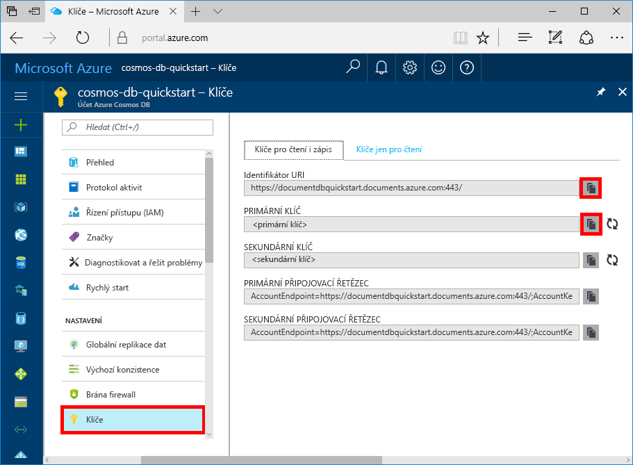

# <a name="azure-cosmos-db-build-a-sql-api-app-with-nodejs-and-the-azure-portal"></a>Azure Cosmos DB: Vytvoření aplikace SQL API s využitím Node.js a webu Azure Portal

[!INCLUDE [cosmos-db-sql-api](../../includes/cosmos-db-sql-api.md)] 

Azure Cosmos DB je globálně distribuovaná databázová služba Microsoftu pro více modelů. Můžete snadno vytvořit a dotazovat databáze dotazů, klíčů/hodnot a grafů, které tak můžou využívat výhody použitelnosti v celosvětovém měřítku a možností horizontálního škálování v jádru databáze Azure Cosmos. 

Tento rychlý start popisuje způsob vytvoření účtu služby Azure Cosmos DB, databáze dokumentů a kolekce pomocí portálu Azure Portal. Pak vytvoříte a spustíte aplikaci konzoly využívající rozhraní [SQL Node.js API](sql-api-sdk-node.md).

## <a name="prerequisites"></a>Požadavky

[!INCLUDE [quickstarts-free-trial-note](../../includes/quickstarts-free-trial-note.md)] 
[!INCLUDE [cosmos-db-emulator-docdb-api](../../includes/cosmos-db-emulator-docdb-api.md)]

* Navíc platí:
    * [Node.js](https://nodejs.org/en/) verze 0.10.29 nebo vyšší
    * [Git](http://git-scm.com/)

## <a name="create-a-database-account"></a>Vytvoření účtu databáze

[!INCLUDE [cosmos-db-create-dbaccount](../../includes/cosmos-db-create-dbaccount.md)]

## <a name="add-a-collection"></a>Přidání kolekce

[!INCLUDE [cosmos-db-create-collection](../../includes/cosmos-db-create-collection.md)]

## <a name="clone-the-sample-application"></a>Klonování ukázkové aplikace

Teď naklonujeme aplikaci SQL API z GitHubu, nastavíme připojovací řetězec a spustíme ji. Uvidíte, jak snadno se pracuje s daty prostřednictvím kódu programu. 

1. Otevřete okno terminálu Git, jako je třeba Git Bash, a pomocí `CD` přejděte do pracovního adresáře.  

2. Ukázkové úložiště naklonujete spuštěním následujícího příkazu. 

    ```bash
    git clone https://github.com/Azure-Samples/azure-cosmos-db-documentdb-nodejs-getting-started.git
    ```

## <a name="review-the-code"></a>Kontrola kódu

Ještě jednou se stručně podívejme na to, co se v aplikaci děje. Otevřete soubor `app.js` a zjistíte, že tyto řádky kódu vytvářejí prostředky databáze Azure Cosmos. 

* Inicializuje se `documentClient`.

    ```nodejs
    var client = new documentClient(config.endpoint, { "masterKey": config.primaryKey });
    ```

* Vytvoří se nová databáze.

    ```nodejs
    client.createDatabase(config.database, (err, created) => {
        if (err) reject(err)
        else resolve(created);
    });
    ```

* Vytvoří se nová kolekce.

    ```nodejs
    client.createCollection(databaseUrl, config.collection, { offerThroughput: 400 }, (err, created) => {
        if (err) reject(err)
        else resolve(created);
    });
    ```

* Vytvoří se některé dokumenty.

    ```nodejs
    client.createDocument(collectionUrl, document, (err, created) => {
        if (err) reject(err)
        else resolve(created);
    });
    ```

* Provede se dotaz SQL přes JSON.

    ```nodejs
    client.queryDocuments(
        collectionUrl,
        'SELECT VALUE r.children FROM root r WHERE r.lastName = "Andersen"'
    ).toArray((err, results) => {
        if (err) reject(err)
        else {
            for (var queryResult of results) {
                let resultString = JSON.stringify(queryResult);
                console.log(`\tQuery returned ${resultString}`);
            }
            console.log();
            resolve(results);
        }
    });
    ```    

## <a name="update-your-connection-string"></a>Aktualizace připojovacího řetězce

Teď se vraťte zpátky na portál Azure Portal, kde najdete informace o připojovacím řetězci, a zkopírujte je do aplikace.

1. Na webu [Azure Portal](http://portal.azure.com/) klikněte v účtu databáze Azure Cosmos v levém navigačním panelu na možnost **Klíče** a potom klikněte na **Klíče pro čtení i zápis**. V dalším kroku zkopírujete pomocí tlačítek kopírování na pravé straně obrazovky identifikátor URI a primární klíč do souboru `config.js`.

    

2. Otevřete soubor `config.js`. 

3. Z portálu zkopírujte hodnotu identifikátoru URI (pomocí tlačítka kopírování) a nastavte ji jako hodnotu klíče koncového bodu v souboru `config.js`. 

    `config.endpoint = "https://FILLME.documents.azure.com"`

4. Potom z portálu zkopírujte hodnotu PRIMÁRNÍHO KLÍČE a nastavte ji jako hodnotu `config.primaryKey` v souboru `config.js`. Teď jste aktualizovali aplikaci a zadali do ní všechny informace potřebné ke komunikaci s Azure Cosmos DB. 

    `config.primaryKey "FILLME"`
    
## <a name="run-the-app"></a>Spuštění aplikace
1. Spusťte v terminálu `npm install`, aby se nainstalovaly požadované moduly NPM.

2. Spuštění v terminálu `node app.js`, aby se spustila aplikace uzlu.

Teď se můžete vrátit do Průzkumníku dat a zobrazit dotaz nebo provést úpravy a pracovat s těmito novými daty. 

## <a name="review-slas-in-the-azure-portal"></a>Ověření podmínek SLA na portálu Azure Portal

[!INCLUDE [cosmosdb-tutorial-review-slas](../../includes/cosmos-db-tutorial-review-slas.md)]

## <a name="clean-up-resources"></a>Vyčištění prostředků

Pokud nebudete tuto aplikace nadále používat, odstraňte na základě následujícího postupu z portálu Azure Portal všechny prostředky vytvořené podle tohoto rychlého startu:

1. V nabídce vlevo na portálu Azure Portal klikněte na **Skupiny prostředků** a pak klikněte na název vytvořeného prostředku. 
2. Na stránce skupiny prostředků klikněte na **Odstranit**, do textového pole zadejte prostředek, který chcete odstranit, a pak klikněte na **Odstranit**.

## <a name="next-steps"></a>Další kroky

V tomto rychlém startu jsme se seznámili s postupem vytvoření účtu databáze Azure Cosmos, vytvoření kolekce pomocí Průzkumníka dat a spuštění aplikace. Teď můžete do účtu databáze Cosmos importovat další data. 

> [!div class="nextstepaction"]
> [Importování dat do služby Azure Cosmos DB](import-data.md)


