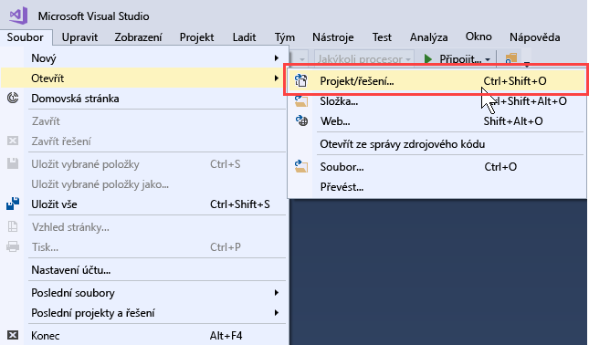
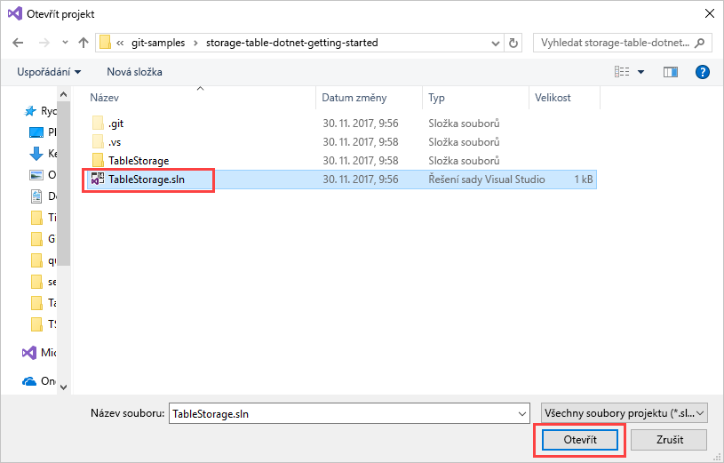
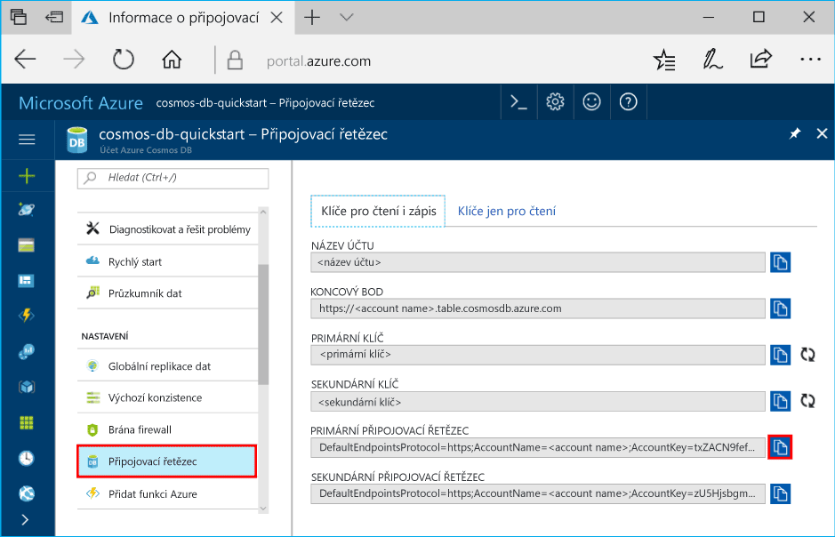
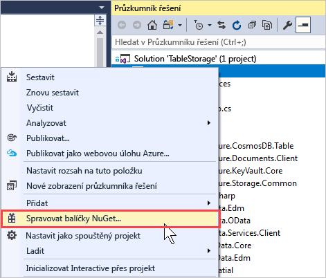
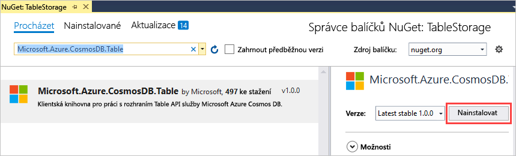
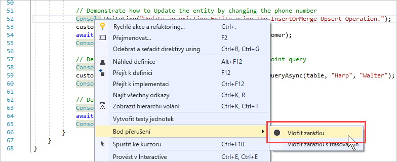
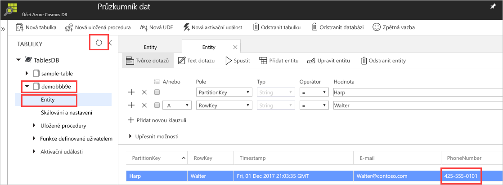

# <a name="quickstart-build-a-table-api-app-with-net-and-azure-cosmos-db"></a>Rychlý start: Sestavení aplikace Table API pomocí .NET a Azure Cosmos DB 

Tento rychlý start ukazuje, jak pomocí .NET a rozhraní [Table API](table-introduction.md) služby Azure Cosmos DB sestavit aplikaci naklonováním příkladu z GitHubu. Tento rychlý start také ukazuje, jak vytvořit účet služby Azure Cosmos DB a jak pomocí Průzkumníku dat vytvářet tabulky a entity na webu Azure Portal.

Azure Cosmos DB je globálně distribuovaná databázová služba Microsoftu pro více modelů. Můžete snadno vytvořit a dotazovat databáze dotazů, klíčů/hodnot a grafů, které tak můžou využívat výhody použitelnosti v celosvětovém měřítku a možností horizontálního škálování v jádru databáze Azure Cosmos. 

## <a name="prerequisites"></a>Požadavky

Pokud ještě nemáte nainstalovanou sadu Visual Studio 2017, můžete stáhnout a použít **bezplatnou verzi** [Visual Studio 2017 Community Edition](https://www.visualstudio.com/downloads/). Nezapomeňte při instalaci sady Visual Studio povolit možnost **Azure Development**.

[!INCLUDE [quickstarts-free-trial-note](../../includes/quickstarts-free-trial-note.md)]

## <a name="create-a-database-account"></a>Vytvoření účtu databáze

> [!IMPORTANT] 
> Abyste mohli pracovat s obecně dostupnými sadami Table API SDK, musíte si vytvořit nový účet Table API. Obecně dostupné sady SDK nepodporují účty Table API vytvořené během období Preview.
>

[!INCLUDE [cosmos-db-create-dbaccount-table](../../includes/cosmos-db-create-dbaccount-table.md)]

## <a name="add-a-table"></a>Přidání tabulky

[!INCLUDE [cosmos-db-create-table](../../includes/cosmos-db-create-table.md)]

## <a name="add-sample-data"></a>Přidání ukázkových dat

Teď můžete přidávat do nové tabulky data pomocí Průzkumníku dat.

1. V Průzkumníku dat rozbalte **ukázkovou tabulku**, klikněte na **Entity** a potom klikněte na **Přidat entitu**.

   
2. Teď přidejte data do hodnoty pole PartitionKey a do hodnoty pole RowKey a klikněte na **Přidat entitu**.

   
  
    Teď můžete přidat další entity do tabulky, upravit si entity nebo zadat dotazy na data v Průzkumníku dat. V Průzkumníku dat také můžete škálovat propustnost a přidat do tabulky uložené procedury, uživatelsky definované funkce a aktivační události.

## <a name="clone-the-sample-application"></a>Klonování ukázkové aplikace

Teď naklonujeme aplikaci Table z GitHubu, nastavíme připojovací řetězec a spustíme ji. Přesvědčíte se, jak snadno se pracuje s daty prostřednictvím kódu programu. 

1. Otevřete okno terminálu Git, třeba Git Bash, a pomocí příkazu `cd` přejděte do složky, do které chcete nainstalovat ukázkovou aplikaci. 

    ```bash
    cd "C:\git-samples"
    ```

2. Ukázkové úložiště naklonujete spuštěním následujícího příkazu. Tento příkaz vytvoří na vašem počítači kopii ukázkové aplikace. 

    ```bash
    git clone https://github.com/Azure-Samples/storage-table-dotnet-getting-started.git
    ```
## <a name="open-the-sample-application-in-visual-studio"></a>Otevření ukázkové aplikace v sadě Visual Studio

1. V sadě Visual Studio z nabídky **Soubor** zvolte **Otevřít** a pak **Projekt nebo řešení**. 

    

2. Přejděte do složky, do které jste naklonovali ukázkovou aplikaci, a otevřete soubor TableStorage.sln.

    

## <a name="update-your-connection-string"></a>Aktualizace připojovacího řetězce

Teď se vraťte zpátky na portál Azure Portal, kde najdete informace o připojovacím řetězci, a zkopírujte je do aplikace. Tím aplikaci umožníte komunikovat s hostovanou databází. 

1. Na webu [Azure Portal](http://portal.azure.com/) klikněte na **Připojovací řetězec**. 

    Pomocí tlačítka pro kopírování na pravé straně okna zkopírujte **PRIMÁRNÍ PŘIPOJOVACÍ ŘETĚZEC**.

    

2. V sadě Visual Studio otevřete soubor App.config. 

3. Vzhledem k tomu, že v tomto kurzu se nepoužívá emulátor úložiště Azure SDK, zrušte komentář u StorageConnectionString na řádku 8 a přidejte komentář u StorageConnectionString na řádku 7. Řádky 7 a 8 by teď měly vypadat takto:

    ```
    <!--key="StorageConnectionString" value="UseDevelopmentStorage=true;" />-->
    <add key="StorageConnectionString" value="DefaultEndpointsProtocol=https;AccountName=[AccountName];AccountKey=[AccountKey]" />
    ```

4. Vložte **PRIMÁRNÍ PŘIPOJOVACÍ ŘETĚZEC** z portálu do hodnoty StorageConnectionString na řádku 8. Řetězec vložte do uvozovek. 

    > [!IMPORTANT]
    > Pokud váš koncový bod používá adresu documents.azure.com, znamená to, že máte účet Preview, a pokud chcete pracovat s obecně dostupnou sadou Table API SDK, musíte si vytvořit [nový účet Table API](#create-a-database-account). 
    > 

    Řádek 8 by teď měl vypadat nějak takto:

    ```
    <add key="StorageConnectionString" value="DefaultEndpointsProtocol=https;AccountName=<account name>;AccountKey=txZACN9f...==;TableEndpoint=https://<account name>.table.cosmosdb.azure.com;" />
    ```

5. Stisknutím CTRL+S soubor App.config uložte.

Teď jste aktualizovali aplikaci a zadali do ní všechny informace potřebné ke komunikaci s Azure Cosmos DB. 

## <a name="build-and-deploy-the-app"></a>Sestavení a nasazení aplikace

1. V sadě Visual Studio klikněte v **Průzkumníku řešení** pravým tlačítkem na projekt **TableStorage** a pak klikněte na **Spravovat balíčky NuGet**. 

   
2. Do pole **Procházet** NuGet zadejte *Microsoft.Azure.CosmosDB.Table*. Vyhledá se klientská knihovna rozhraní Cosmos DB Table API.
   
   

3. Klikněte na **Nainstalovat** a nainstalujte knihovnu **Microsoft.Azure.CosmosDB.Table**. Tím se nainstaluje balíček rozhraní Azure Cosmos DB Table API a všechny závislosti.

    

4. Otevřete soubor BasicSamples.cs. Klikněte pravým tlačítkem na řádek 52, vyberte **Zarážka** a pak vyberte **Vložit zarážku**. Vložte další zarážku na řádku 55.

    

5. Stisknutím klávesy F5 spusťte aplikaci.

    V okně konzoly se zobrazí název nové databáze tabulek (v tomto případě demo91ab4) ve službě Azure Cosmos DB. 
    
    

    Pokud dojde k chybě v souvislosti se závislostmi, přečtěte si [Řešení potíží](table-sdk-dotnet.md#troubleshooting).

    Až se dostanete k první zarážce, přejděte zpět do Průzkumníku dat na webu Azure Portal. Klikněte na tlačítko **Aktualizovat**, rozbalte tabulku demo* a klikněte na **Entity**. Na kartě **Entity** na pravé straně se zobrazí nově přidaná entita pro Waltera Harpa. Všimněte si, že telefonní číslo nové entity je 425-555-0101.

    
    
6. Zavřete kartu **Entity** v Průzkumníku dat.
    
7. Stisknutím klávesy F5 spusťte aplikaci až k další zarážce. 

    Až se dostanete k zarážce, přejděte zpět na web Azure Portal, znovu klikněte na **Entity** a otevřete kartu **Entity**. Všimněte si, že se telefonní číslo aktualizovalo na 425-555-0105.

8. Stisknutím klávesy F5 spusťte aplikaci. 
 
   Aplikace přidá entity pro použití v pokročilejší ukázkové aplikaci, kterou rozhraní Table API v současné době nepodporuje. Aplikace pak odstraní tabulku vytvořenou ukázkovou aplikací.

9. V okně konzoly stiskněte Enter a ukončete aplikaci. 
  

## <a name="review-slas-in-the-azure-portal"></a>Ověření podmínek SLA na portálu Azure Portal

[!INCLUDE [cosmosdb-tutorial-review-slas](../../includes/cosmos-db-tutorial-review-slas.md)]

## <a name="clean-up-resources"></a>Vyčištění prostředků

[!INCLUDE [cosmosdb-delete-resource-group](../../includes/cosmos-db-delete-resource-group.md)]

## <a name="next-steps"></a>Další kroky

V tomto rychlém startu jste se seznámili s postupem vytvoření databázového účtu Azure Cosmos DB, vytvoření tabulky pomocí Průzkumníka dat a spuštění aplikace.  Teď můžete zadávat dotazy na svá data pomocí rozhraní API tabulky.  

> [!div class="nextstepaction"]
> [Import tabulkových dat do rozhraní Table API](table-import.md)

