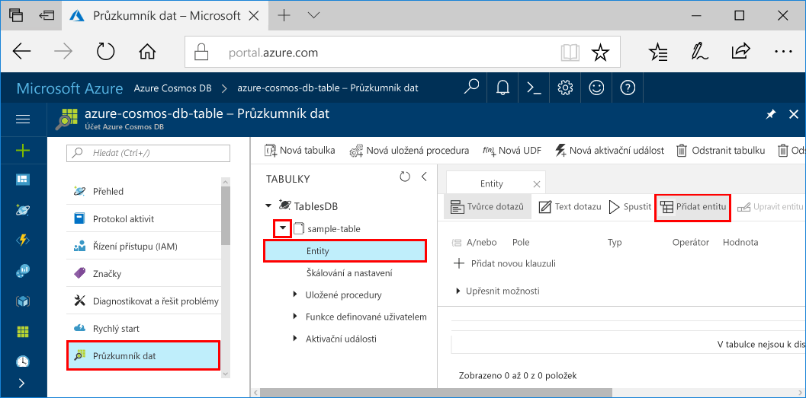
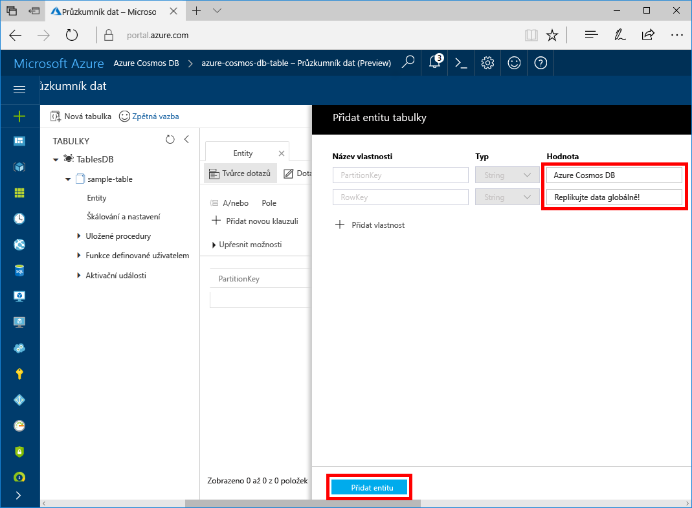

# <a name="quickstart-build-a-table-api-app-with-java-and-azure-cosmos-db"></a>Rychlý úvod: Sestavení tabulku aplikace API Java a Azure Cosmos DB

Tento rychlý start ukazuje způsob použití Java a Azure Cosmos DB [tabulky API](table-introduction.md) k sestavení aplikace klonováním příklad z Githubu. Tento rychlý start také ukazuje postup vytvoření účtu Azure Cosmos DB a použití Průzkumníku dat k vytvoření tabulky a entity na portálu Azure založených na webu.

Databáze Azure Cosmos je databázová služba Microsoftu s více modely použitelná v celosvětovém měřítku. Můžete snadno vytvořit a dotazovat databáze dotazů, klíčů/hodnot a grafů, které tak můžou využívat výhody použitelnosti v celosvětovém měřítku a možností horizontálního škálování v jádru databáze Azure Cosmos. 

## <a name="prerequisites"></a>Požadavky

[!INCLUDE [quickstarts-free-trial-note](../../includes/quickstarts-free-trial-note.md)]
[!INCLUDE [cosmos-db-emulator-docdb-api](../../includes/cosmos-db-emulator-docdb-api.md)]

Navíc platí: 

* [Java Development Kit (JDK) 1.7+](http://www.oracle.com/technetwork/java/javase/downloads/jdk8-downloads-2133151.html)
    * Na Ubuntu nainstalujte sadu JDK spuštěním příkazu `apt-get install default-jdk`.
    * Nezapomeňte nastavit proměnnou prostředí JAVA_HOME tak, aby odkazovala na složku, ve které je sada JDK nainstalovaná.
* [Stáhněte](http://maven.apache.org/download.cgi) a [nainstalujte](http://maven.apache.org/install.html) binární archiv [Maven](http://maven.apache.org/).
    * Na Ubuntu můžete Maven nainstalovat spuštěním příkazu `apt-get install maven`.
* [Git](https://www.git-scm.com/)
    * Na Ubuntu můžete Git nainstalovat spuštěním příkazu `sudo apt-get install git`.

## <a name="create-a-database-account"></a>Vytvoření účtu databáze

[!INCLUDE [cosmos-db-create-dbaccount-table](../../includes/cosmos-db-create-dbaccount-table.md)]

## <a name="add-a-table"></a>Přidání tabulky

[!INCLUDE [cosmos-db-create-table](../../includes/cosmos-db-create-table.md)]

## <a name="add-sample-data"></a>Přidání ukázkových dat

Teď můžete přidávat do nové tabulky data pomocí Průzkumníku dat.

1. V Průzkumníku dat rozbalte **ukázkovou tabulku**, klikněte na **Entity** a potom klikněte na **Přidat entitu**.

   
2. Nyní přidejte data PartitionKey hodnota pole a pole hodnota RowKey a klikněte na tlačítko **Přidat entitu**.

   
  
    Teď můžete přidat další entity do tabulky, upravit si entity nebo zadat dotazy na data v Průzkumníku dat. V Průzkumníku dat také můžete škálovat propustnost a přidat do tabulky uložené procedury, uživatelsky definované funkce a aktivační události.

## <a name="clone-the-sample-application"></a>Klonování ukázkové aplikace

Teď naklonujeme aplikaci Table z GitHubu, nastavíme připojovací řetězec a spustíme ji. Přesvědčíte se, jak snadno se pracuje s daty prostřednictvím kódu programu. 

1. Otevřete okno terminálu git, jako je například git bash a použít `cd` příkaz Přejít do složky pro instalaci ukázkové aplikace. 

    ```bash
    cd "C:\git-samples"
    ```

2. Ukázkové úložiště naklonujete spuštěním následujícího příkazu. Tento příkaz vytvoří kopii ukázková aplikace ve vašem počítači. 

    ```bash
    git clone https://github.com/Azure-Samples/storage-table-java-getting-started.git 
    ```

## <a name="update-your-connection-string"></a>Aktualizace připojovacího řetězce

Teď se vraťte zpátky na portál Azure Portal, kde najdete informace o připojovacím řetězci, a zkopírujte je do aplikace. To umožňuje aplikaci ke komunikaci s vaší hostované databází. 

1. V [portál Azure](http://portal.azure.com/), klikněte na tlačítko **připojovací řetězec**. 

   

2. Zkopírujte primární PŘIPOJOVACÍ řetězec pomocí tlačítko Kopírovat na pravé straně.

3. Config.properties otevřete ve složce C:\git-samples\storage-table-java-getting-started\src\main\resources. 

5. Okomentovat řádek jednu a zrušte komentář u řádku dva. První dva řádky by teď měl vypadat takto.

    ```
    #StorageConnectionString = UseDevelopmentStorage=true
    StorageConnectionString = DefaultEndpointsProtocol=https;AccountName=[ACCOUNTNAME];AccountKey=[ACCOUNTKEY]
    ```

6. PRIMÁRNÍ PŘIPOJOVACÍ řetězec z portálu vložte do StorageConnectionString hodnoty v řádku 2. Pokud koncový bod část připojovací řetězec používá documents.azure.com, opravte část table.cosmosdb.azure.com místo toho chcete použít.

7. Uložte soubor config.properties.

Teď jste aktualizovali aplikaci a zadali do ní všechny informace potřebné ke komunikaci s Azure Cosmos DB. 

## <a name="run-the-app"></a>Spuštění aplikace

1. V okně terminálu git `cd` ke složce úložiště tabulky java-getting-started.

    ```git
    cd "C:\git-samples\storage-table-java-getting-started"
    ```

2. Okno terminálu, spusťte následující příkazy ke spuštění v gitu spustit aplikaci Java.

    ```git
    mvn compile exec:java 
    ```

    V okně konzoly zobrazí data tabulky, který se přidává do nové tabulky databáze v Azure Cosmos DB.

    Teď se můžete vrátit do Průzkumníku dat a zobrazit dotaz nebo provést úpravy a pracovat s těmito novými daty. 

## <a name="review-slas-in-the-azure-portal"></a>Ověření podmínek SLA na portálu Azure Portal

[!INCLUDE [cosmosdb-tutorial-review-slas](../../includes/cosmos-db-tutorial-review-slas.md)]

## <a name="clean-up-resources"></a>Vyčištění prostředků

[!INCLUDE [cosmosdb-delete-resource-group](../../includes/cosmos-db-delete-resource-group.md)]

## <a name="next-steps"></a>Další kroky

V tomto rychlém startu jste se seznámili s postupem vytvoření databázového účtu Azure Cosmos DB, vytvoření tabulky pomocí Průzkumníka dat a spuštění aplikace.  Teď můžete zadávat dotazy na svá data pomocí rozhraní API tabulky.  

> [!div class="nextstepaction"]
> [Importovat data tabulky do rozhraní API tabulky](table-import.md)
