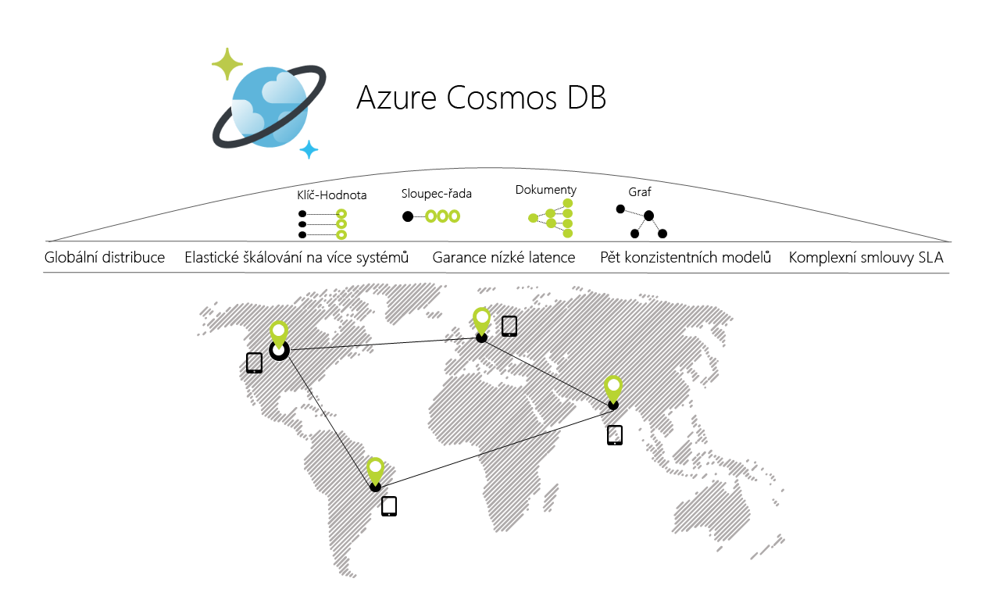

# Vítá vás Azure Cosmos DB

Azure Cosmos DB je globálně distribuovaná databáze Microsoftu pro více modelů. Stačí kliknout na tlačítko a Azure Cosmos DB vám umožní elasticky a nezávisle škálovat propustnost a úložiště v řadě geografických oblastí Azure. Nabízí záruku propustnosti, latence, dostupnosti a konzistence s kompletními [smlouvami o úrovni služeb](https://aka.ms/acdbsla) (SLA), které někdy nenabízejí žádné jiné databázové služby.

## Řešení, kterým služba Azure Cosmos DB přináší výhody

[Garantovaná](https://azure.microsoft.com/support/legal/sla/cosmos-db/) dostupnost, vysoká propustnost, nízká latence a přizpůsobitelná konzistence ve službě Azure Cosmos DB bude výhodná pro všechny [webové, mobilní a herní aplikace a aplikace IoT](use-cases.md), které potřebují zpracovávat obrovské množství čtení a zápisů v [globálním](distribute-data-globally.md) měřítku s nízkou dobou odezvy pro různá data.

## Klíčové funkce
Azure Cosmos DB jakožto globálně distribuovaná databázová služba poskytuje následující možnosti, které pomáhají vytvářet škálovatelné aplikace s rychlou odezvou:

* **Globální distribuce na klíč**
    * Můžete [distribuovat data](distribute-data-globally.md) do libovolného počtu [oblastí Azure](https://azure.microsoft.com/regions/), a to [jediným kliknutím na tlačítko](tutorial-global-distribution-documentdb.md). Díky tomu můžete umístit data tam, kde jsou vaši uživatelé, a zajistit uživatelům nejnižší možnou latenci. 
    * Pomocí rozhraní API pro vícenásobné navádění služby Azure Cosmos DB bude aplikace vždycky vědět, kde je nejbližší oblast, a požadavky bude odesílat do nejbližšího datového centra. Toto vše je možné bez změny konfigurace – nastavíte oblast zápisu a tolik oblastí čtení, kolik chcete, a o zbytek se postará služba za vás.

* **Více datových modelů a oblíbená rozhraní API pro přístup k datům a dotazování na ně**
    * Datový model založený na sekvenci záznamu atomů (ARS), na kterém je služba Azure Cosmos DB postavena, nativně podporuje více datových modelů, mimo jiné modely dokumentů, grafů, párů klíč-hodnota, tabulek a sloupcových dat.
    * Rozhraní API pro následující datové modely jsou podporována se sadami SDK dostupnými v několika jazycích:
        * [Rozhraní DocumentDB API](documentdb-introduction.md)
        * [Rozhraní MongoDB API](mongodb-introduction.md)
        * [Rozhraní Table API](table-introduction.md)
        * [Rozhraní Graph (Gremlin) API](graph-introduction.md)
        * Další datové modely se připravují. 

* **Elastické škálování propustnosti a úložiště na vyžádání, celosvětově**
    * Snadno škálujte propustnost databáze v přírůstcích po [sekundách](request-units.md), přičemž to můžete kdykoli změnit. 
    * Škálujte velikost úložiště [transparentně a automaticky](partition-data.md) s ohledem na současné a budoucí požadavky na velikost.

* **Vytváření aplikací s rychlou odezvou a vysokou důležitostí pro chod firmy**
    * Azure Cosmos DB zaručuje svým zákazníkům koncovou nízkou latentnost na 99. percentilu. 
    * Pro typickou 1kB položku zaručuje služba Cosmos DB koncovou latenci čtení pod 10 ms a indexovaných zápisů pod 15 ms na 99. percentilu v rámci stejné oblasti Azure. Střední latence jsou výrazně nižší (pod 5 ms).

* **Zajištění neustálé dostupnosti**
    * 99,99% dostupnost v jedné oblasti.
    * Nasaďte je do libovolného počtu [oblastí Azure](https://azure.microsoft.com/regions) pro zajištění vyšší dostupnosti.
    * [Simulujte selhání](regional-failover.md) jedné nebo více oblastí se zárukou nulových ztrát dat. 

* **Psaní globálně distribuovaných aplikací správným způsobem**
    * Pět [modelů konzistence](consistency-levels.md) poskytuje celé spektrum od silné konzistence podobné SQL až po konzistenci typu Případné podobné NoSQL a vše mezi tím. 
  
* **Záruka vrácení peněz**
    * Data budou k dispozici rychle, jinak dostanete zpátky peníze. 
    * [Smlouvy o úrovni služeb](https://aka.ms/acdbsla) jsou zárukou dostupnosti, latence, propustnosti a konzistence. 

* **Není potřeba správa schématu/indexu databáze**
    * Už si nemusíte dělat starosti se zajištěním synchronizace databázového schématu a indexů ve schématu aplikace. Schéma není zapotřebí. 
    * Databázový stroj služby Azure Cosmos DB je zcela nezávislý na schématu – automaticky indexuje všechna data, která ingestuje, bez vyžadování jakéhokoli schématu nebo indexů a zajišťuje bleskově rychlé dotazy. 

* **Nízké náklady na vlastnictví**
    * Toto řešení je pět až desetkrát [méně nákladné](https://aka.ms/cosmos-db-tco-paper) než nespravované řešení.
    * Třikrát levnější než DynamoDB.

## Porovnání schopností

Azure Cosmos DB nabízí ty nejlepší možnosti relačních a nerelačních databází.

| Možnosti | Relační databáze   | Nerelační databáze (NoSQL) |    Azure Cosmos DB |
| --- | --- | --- | --- |
| Globální distribuce | Ne | Ne | Ano, distribuce na klíč ve více než 30 oblastech s rozhraními API pro vícenásobné navádění|
| Horizontální škálování | Ne | Ano | Ano, můžete nezávisle škálovat úložiště a propustnost | 
| Záruky latence | Ne | Ano | Ano, 99 % čtení do 10 ms a zápisů do 15 ms | 
| Vysoká dostupnost | Ne | Ano | Ano, služba Cosmos DB je vždycky aktivní, má kompromisy PACELC a poskytuje možnosti automatického a ručního převzetí služeb při selhání|
| Datový model + API | Relační + SQL | Více modelů + OSS API | Více modelů + SQL + OSS API (další už brzy) |
| Smlouvy SLA | Ano | Ne | Ano, komplexní smlouvy SLA pro latenci, propustnost, konzistenci a dostupnost |

## Další kroky
Začínáme se službou Azure Cosmos DB s využitím jedné ze čtyř šablon Rychlý start:

* [Začínáme s rozhraním API DocumentDB služby Azure Cosmos DB](create-documentdb-dotnet.md)
* [Začínáme s rozhraním API MongoDB služby Azure Cosmos DB](create-mongodb-nodejs.md)
* [Začínáme s rozhraním API Graph služby Azure Cosmos DB](create-graph-dotnet.md)
* [Začínáme s rozhraním API Table služby Azure Cosmos DB](create-table-dotnet.md)

