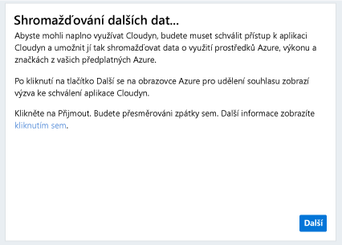
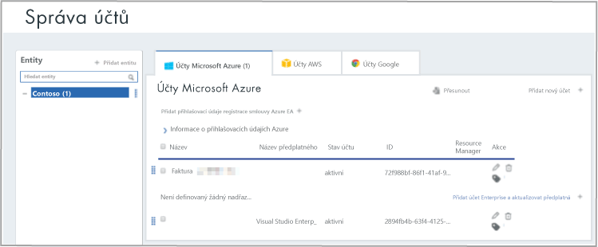

# Registraci jednotlivých předplatné Azure a zobrazení náklady dat

Při registraci s Azure náklady na správu Cloudyn použijete vašeho předplatného Azure. Registrace poskytuje přístup k portálu Cloudyn. Tento rychlý start podrobnosti o procesu registrace potřebné k vytvoření Cloudyn zkušební verzi předplatného a přihlaste se k portálu Cloudyn. Je také ukazuje, jak spustit hned zobrazení dat náklady.

## Přihlaste se k Azure.

- Přihlaste se k webu Azure Portal na adrese http://portal.azure.com.

## Vytvořte zkušební registrace

1. Na portálu Azure klikněte na tlačítko **náklady na správu + fakturace** v seznamu služeb.
2. V části **přehled**, klikněte na tlačítko **náklady na správu**  
    
3. Na **náklady na správu** klikněte na **přejít na náklady na správu** chcete otevřít stránku registrace Cloudyn v novém okně.
4. Na stránce portálu registrace zkušební verze Cloudyn, zadejte název vaší společnosti a potom vyberte **jednotlivých vlastník předplatného Azure** a pak klikněte na **Další**. Název účtu a ID klienta je automaticky přidán do formuláře.  
    
5. Vyberte vaše **nabízejí ID – název** spojené s vaším předplatným. Pokud si nejste jisti, co vaše ID míry je pro vaše předplatné, můžete zobrazit faktury Azure a vyhledejte **nabízejí ID**.
6. Souhlas s podmínkami použití a ověření vašich informací a pak klikněte na **Další**.
7. V **shromažďovat další data** klikněte na tlačítko **Další** k autorizaci Cloudyn ke shromažďování dat prostředků Azure. Data shromážděná zahrnuje využití, výkon, fakturace a značky data z vašich předplatných.  
    
8. Váš prohlížeč přejdete na stránku pro přihlášení pro Cloudyn. Přihlaste se pomocí přihlašovacích údajů předplatného Azure.
9. Klikněte na tlačítko **přejít na Cloudyn** Cloudyn portál otevřít a pak na **správy účtů** stránky, byste měli vidět informace o účtu předplatného Azure.  
    

Podívejte se na kurz video o registraci vašeho předplatného Azure, najdete v tématu [hledání Directory GUID a rychlost ID pro použití v Azure náklady na správu Cloudyn](https://youtu.be/PaRjnyaNGMI).

[!INCLUDE [cost-management-create-account-view-data](../../includes/cost-management-create-account-view-data.md)]

## Další kroky

V tento rychlý start použít informace o vašem předplatném Azure k registraci s náklady na správu. Můžete také přihlášení k portálu Cloudyn a spuštění zobrazení dat náklady. Další informace o Azure náklady na správu Cloudyn, pokračujte v kurzu pro náklady na správu.

> [!div class="nextstepaction"]
> [Zkontrolujte využití a náklady](./tutorial-review-usage.md)
