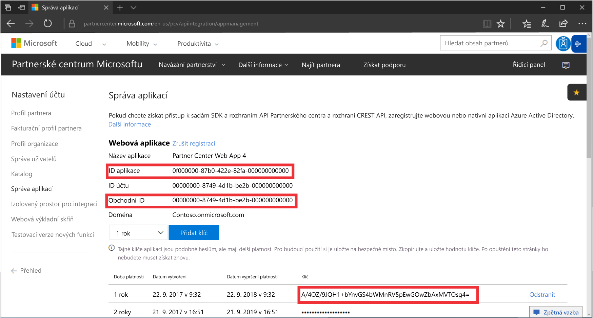
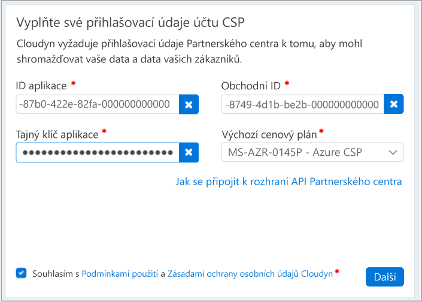

# Registrace do partnerského programu CSP a zobrazení informací o nákladech

Jako partner CSP se můžete zaregistrovat ve službě Azure Cost Management by Cloudyn. Registrací získáte přístup k portálu Cloudyn. Tento rychlý start podrobně popisuje proces registrace nezbytný k vytvoření zkušebního předplatného a přihlášení k portálu Cloudyn. Ukazuje také, jak rovnou začít zobrazovat informace o nákladech.

>[!NOTE]

>Registraci do Cloudyn můžou dokončit pouze přímí partneři CSP a nepřímí poskytovatelé CSP.
>
>Pro ověřování a přístup k datům je nezbytná konfigurace rozhraní API partnerského centra. Pro zřízení přístupu k rozhraní API je potřeba účet globálního správce partnerského centra.
Další informace najdete v tématu [Připojení k rozhraní API partnerského centra](https://msdn.microsoft.com/library/partnercenter/mt709136.aspx).
>
>Nepřímým prodejcům CSP je možné Cloudyn zpřístupnit poté, co se jejich nepřímý poskytovatel CSP zaregistruje u Cloudyn. Nepřímí prodejci CSP pak můžou poskytovat přístup do Cloudyn předplatným a zákazníkům Azure.

## Přihlaste se k Azure.

- Přihlaste se k webu Azure Portal na adrese http://portal.azure.com.

## Vytvoření registrace zkušební verze

1. Na webu Azure Portal klikněte v seznamu služeb na **Cost Management a fakturace**.
2. V části **Přehled** klikněte na **Cost Management**.  
    
3. Na stránce **Cost Management** klikněte na **Přejít do služby Cost Management** a v novém okně se otevře stránka pro registraci do Cloudyn.
4. Na stránce pro registraci zkušební verze portálu Cloudyn zadejte název vaší společnosti, vyberte **Správce partnerského programu Microsoft CSP** a pak klikněte na **Další**.  
5. Zadejte **ID aplikace**, **Obchodní ID**, **Tajný klíč aplikace** a vyberte **Výchozí cenový plán**. Pokud tyto informace nemáte po ruce, přihlaste se pomocí svého primárního účtu správce k portálu partnerského centra na adrese [https://partnercenter.microsoft.com](https://partnercenter.microsoft.com) a proveďte následující kroky:
  1. Přejděte do části **Řídicí panel** > **Nastavení účtu** > **Správa aplikací**.
  2. Pokud jste už dříve vytvořili webovou aplikaci, tento krok přeskočte. Jinak v části **Webová aplikace** klikněte na **Přidat novou webovou aplikaci**.
  3. Zkopírujte ze své webové aplikace globálně jedinečný identifikátor **ID aplikace**.
  4. Zkopírujte ze své webové aplikace globálně jedinečný identifikátor **Obchodní ID**.
  5. Jako délku platnosti klíče vyberte podle potřeby jeden nebo dva roky. Vyberte **Přidat klíč** a pak zkopírujte a uložte hodnotu tajného klíče.  
    
  6. Vraťte se na registrační stránku a vložte příslušné údaje.  
      
6. Vyjádřete souhlas s podmínkami použití a ověřte své údaje. Kliknutím na **Další** udělte Cloudyn oprávnění ke shromažďování dat o prostředcích Azure. Mezi shromažďovaná data patří informace o využití, výkonu, fakturaci a značkách z vašich předplatných.  
7. V části **Pozvat další účastníky** můžete zadáním příslušných e-mailových adres přidat další uživatele. Jakmile budete hotovi, klikněte na **Další**. Přidání všech vašich fakturačních dat do Cloudyn trvá přibližně dvě hodiny.
8. Kliknutím na **Přejít do Cloudyn** otevřete portál Cloudyn a na stránce **Správa cloudových účtů** by se měly zobrazit informace o vašem zaregistrovaném účtu CSP.

## Konfigurace přístupu nepřímých poskytovatelů CSP v Cloudyn

Rozhraní API partnerského centra je ve výchozím nastavení přístupné pouze pro přímé poskytovatele CSP. Přímý poskytovatel CSP však může nakonfigurovat přístup pro své nepřímé zákazníky nebo partnery CSP pomocí skupin entit v Cloudyn.

Pokud chcete umožnit přístup nepřímým zákazníkům nebo partnerům CSP, pomocí postupu v části [Vytvoření registrace zkušební verze](#create-a-trial-registration) nastavte registraci zkušební verze. Dále provedením následujících kroků segmentujte data nepřímých poskytovatelů CSP pomocí skupin entit Cloudyn. Potom skupinám entit přiřaďte odpovídající uživatelská oprávnění.

1. Vytvořte skupinu entit s použitím informací v části [Vytvoření entit](tutorial-user-access.md#create-entities).
2. Postupujte podle kroků v článku [Assigning subscriptions to Cost Entities](https://support.cloudyn.com/hc/en-us/articles/115005139425-Video-Assigning-subscriptions-to-Cost-Entities) (Přiřazování předplatných k entitám nákladů). Přidružte účet nepřímého zákazníka CSP a příslušná předplatná Azure k entitě, kterou jste vytvořili dříve.
3. Postupujte podle kroků v části [Vytvoření uživatele s přístupem správce](tutorial-user-access.md#create-a-user-with-admin-access) a vytvořte uživatelský účet s přístupem správce. Potom se ujistěte, že má uživatelský účet přístup ke konkrétním entitám, které jste vytvořili dříve pro nepřímý účet.

Nepřímí partneři CSP se k portálu Cloudyn přihlašují pomocí účtů, které jste pro ně vytvořili.

[!INCLUDE [cost-management-create-account-view-data](../../includes/cost-management-create-account-view-data.md)]

## Další kroky

V tomto rychlém startu jste použili své informace o CSP k registraci ve službě Cost Management. Také jste se přihlásili k portálu Cloudyn a začali jste zobrazovat informace o nákladech. Další informace o službě Azure Cost Management by Cloudyn najdete v kurzu pro službu Cost Management.

> [!div class="nextstepaction"]
> [Kontrola využití a nákladů](./tutorial-review-usage.md)
