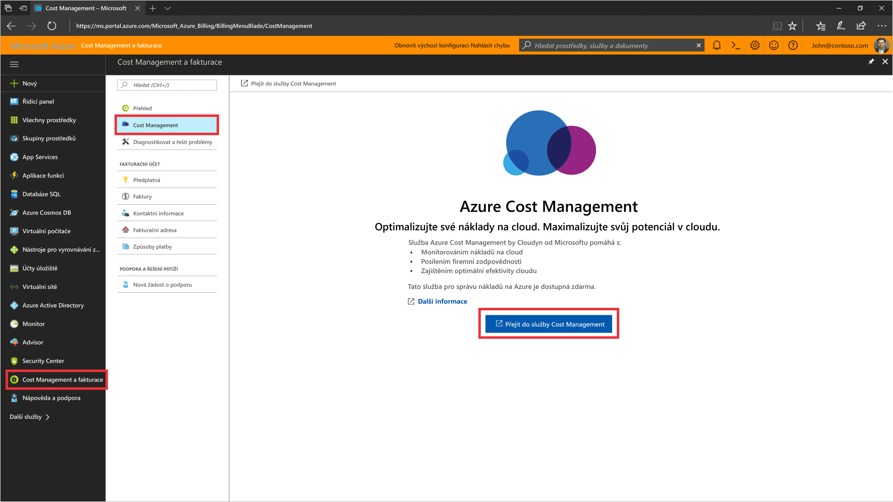
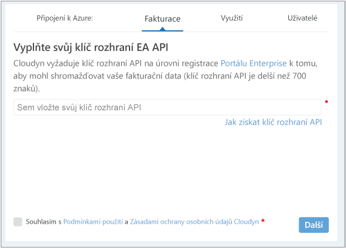
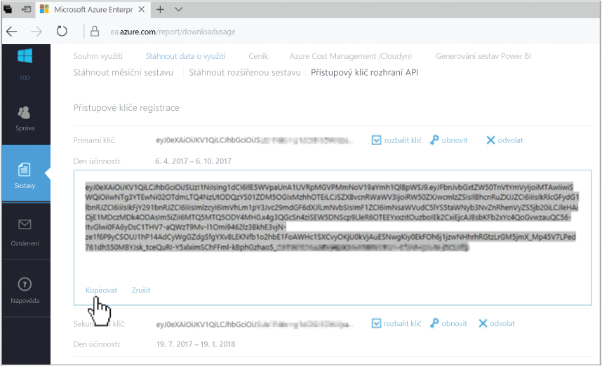
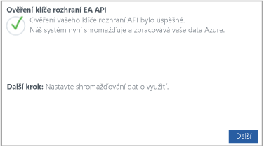

# Registrace smlouvy Azure Enterprise a zobrazení informací o nákladech

Pomocí své smlouvy Azure Enterprise se zaregistrujete ve službě Azure Cost Management by Cloudyn. Registrací získáte přístup k portálu Cloudyn. Tento rychlý start podrobně popisuje proces registrace nezbytný k vytvoření zkušebního předplatného a přihlášení k portálu Cloudyn. Ukazuje také, jak rovnou začít zobrazovat informace o nákladech.

## Přihlaste se k Azure.

- Přihlaste se k webu Azure Portal na adrese http://portal.azure.com.

## Vytvoření registrace zkušební verze

1. Na webu Azure Portal klikněte v seznamu služeb na **Cost Management a fakturace**.
2. V části **Přehled** klikněte na **Cost Management**.  
    
3. Na stránce **Cost Management** klikněte na **Přejít do služby Cost Management** a v novém okně se otevře stránka pro registraci do Cloudyn.
4. Na stránce pro registraci zkušební verze portálu Cloudyn zadejte název vaší společnosti a vyberte **Správce prováděcí smlouvy Azure Enterprise**.  
    
5. Zadejte klíč rozhraní API vaší prováděcí smlouvy Enterprise Portal. Pokud svůj klíč nemáte po ruce, klikněte na odkaz na web [Enterprise Portal](https://ea.azure.com) a proveďte následující kroky:
  1. Přihlaste se k webu Azure Enterprise, klikněte na **Sestavy**, pak na **Přístupový klíč rozhraní API** a zkopírujte váš primární klíč.  
    
  3. Vraťte se na registrační stránku a vložte váš klíč rozhraní API.
6. Vyjádřete souhlas s podmínkami použití a ověřte váš klíč. Kliknutím na **Další** udělte Cloudyn oprávnění ke shromažďování dat o prostředcích Azure. Mezi shromažďovaná data patří informace o využití, výkonu, fakturaci a značkách z vašich předplatných.  
    
7. V části **Pozvat další účastníky** můžete zadáním příslušných e-mailových adres přidat další uživatele. Jakmile budete hotovi, klikněte na **Další**. Přidání všech vašich fakturačních dat do Cloudyn trvá přibližně dvě hodiny.
8. Kliknutím na **Přejít do Cloudyn** otevřete portál Cloudyn a na stránce **Správa cloudových účtů** by se měly zobrazit informace o vašem zaregistrovaném účtu EA.

Pokud chcete zhlédnout videokurz k registraci smlouvy Enterprise, podívejte se na video [How to Find Your EA Enrollment ID and API Key for use in Azure Cost Management by Cloudyn](https://youtu.be/u_phLs_udig) (Vyhledání ID prováděcí smlouvy EA a klíče rozhraní API pro použití ve službě Azure Cost Management by Cloudyn).

[!INCLUDE [cost-management-create-account-view-data](../../includes/cost-management-create-account-view-data.md)]

## Další kroky

V tomto rychlém startu jste použili informace o své smlouvě Azure Enterprise k registraci ve službě Cost Management. Také jste se přihlásili k portálu Cloudyn a začali jste zobrazovat informace o nákladech. Další informace o službě Azure Cost Management by Cloudyn najdete v kurzu pro službu Cost Management.

> [!div class="nextstepaction"]
> [Kontrola využití a nákladů](./tutorial-review-usage.md)
