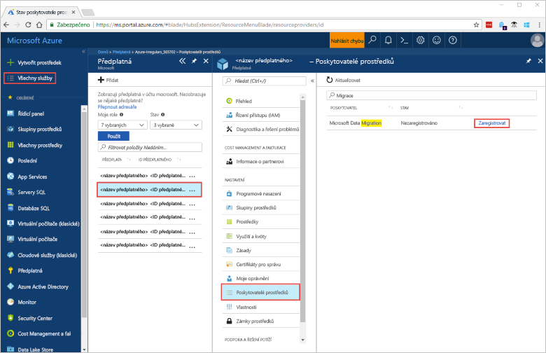
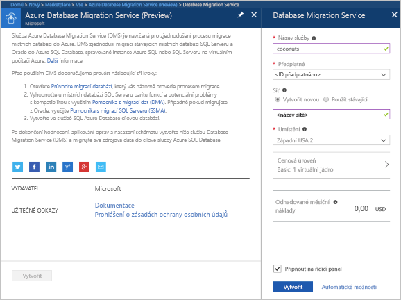
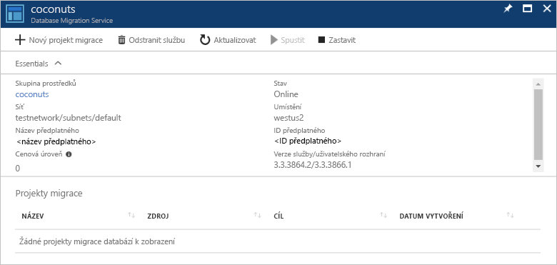

# Vytvoření instance služby migrace databáze Azure pomocí portálu Azure
V této úvodní použití portálu Azure k vytvoření instance služby migrace databáze Azure.  Po vytvoření služby budete moci použít jej k migraci dat z místního serveru SQL do Azure SQL database.

Pokud ještě nemáte předplatné Azure, vytvořte si [bezplatný účet](https://azure.microsoft.com/free/) před tím, než začnete.

## Přihlášení k portálu Azure Portal
Otevřete svůj webový prohlížeč a přejděte na [portál Microsoft Azure Portal](https://portal.azure.com/). Zadejte přihlašovací údaje pro přihlášení k portálu. Výchozím zobrazením je váš řídicí panel služby.

## Registrace poskytovatele prostředků
Budete muset registrovat poskytovatele prostředků Microsoft.DataMigration před vytvořením první službě migrace databáze.

1. Na portálu Azure vyberte **všechny služby**a potom vyberte **odběry**.

1. Vyberte předplatné, ve kterém chcete vytvořit instanci služby Azure databáze migrace a potom vyberte **zprostředkovatelé prostředků**.

1. Vyhledejte migrace a potom vyberte napravo od Microsoft.DataMigration **zaregistrovat**.

## Vytvoření služby migrace databáze Azure
1. Klikněte na tlačítko  **+**  k vytvoření nové služby.  Služba migrace databáze je stále ve verzi preview.  

1. Vyhledávání na webu marketplace pro "migrace" Vyberte "Služba migrace databáze (preview)" a pak klikněte na tlačítko **vytvořit**.

    

    - Vyberte **název služby** se snadno zapamatovatelný a k identifikaci vaší Instance služby migrace databáze Azure jedinečný.
    - Vyberte vaši Azure **předplatné** ve kterém chcete vytvořit službu migrace databáze.
    - Vytvořte novou **sítě** s jedinečným názvem.
    - Vyberte **umístění** který je nejblíže k zdrojového nebo cílového serveru.
    - Vyberte Basic: 1 vCore pro **cenová úroveň**.

1. Klikněte na možnost **Vytvořit**.

Po chvíli se služby Azure databáze migrace bude vytvořená a připravená k použití.  Služba migrace databáze uvidíte, jak je znázorněno na obrázku.

## Vyčištění prostředků
Můžete vyčistit prostředky, které jste vytvořili v rychlé spuštění odstraněním [skupina prostředků Azure](../azure-resource-manager/resource-group-overview.md).  Pokud chcete odstranit skupinu prostředků, přejděte do databáze služby migrace jste vytvořili, klikněte na **skupiny prostředků** název a potom vyberte **odstranit skupinu prostředků**.  Tato akce odstraní všechny prostředky ve skupině prostředků a také samotné skupině.

## Další kroky
> [!div class="nextstepaction"]
> [Migrace SQL serveru místně do databáze Azure SQL](tutorial-sql-server-to-azure-sql.md)