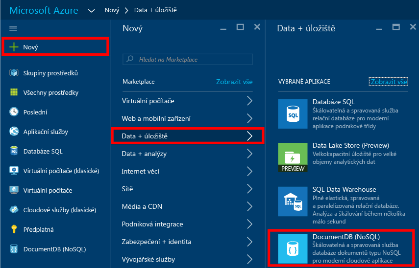
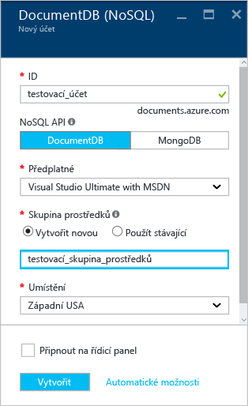
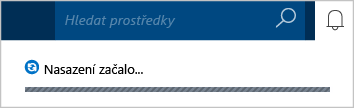
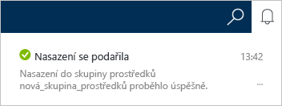
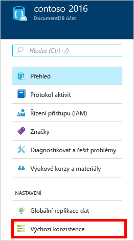
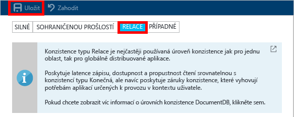

<properties
    pageTitle="Jak vytvořit účet DocumentDB | Microsoft Azure"
    description="Vytvořte databázi NoSQL pomocí Azure DocumentDB. Pomocí těchto pokynů můžete vytvořit účet DocumentDB a začít vytvářet neuvěřitelně rychlou databázi NoSQL s globálním škálováním." 
    keywords="vytvoření databáze"
    services="documentdb"
    documentationCenter=""
    authors="mimig1"
    manager="jhubbard"
    editor="monicar"/>

<tags
    ms.service="documentdb"
    ms.workload="data-services"
    ms.tgt_pltfrm="na"
    ms.devlang="na"
    ms.topic="get-started-article"
    ms.date="09/12/2016"
    ms.author="mimig"/>

# Jak vytvořit účet NoSQL DocumentDB na webu Azure Portal

> [AZURE.SELECTOR]
- [Azure Portal](documntdb-create-account.md)
- [Rozhraní příkazového řádku Azure a Azure Resource Manager](documentdb-automation-resource-manager-cli.md)

Pokud chcete vytvořit databázi pomocí Microsoft Azure DocumentDB, musíte:

- Mít účet Azure. Pokud ještě žádný nemáte, můžete získat [bezplatný účet Azure](https://azure.microsoft.com/free). 
- Vytvořit účet DocumentDB.  

Účet DocumentDB můžete vytvořit pomocí webu Azure Portal, šablon Azure Resource Manageru nebo rozhraní příkazového řádku (CLI) Azure. Tento článek popisuje, jak vytvořit účet DocumentDB pomocí webu Azure Portal. Pokud chcete účet vytvořit pomocí Azure Resource Manageru nebo rozhraní příkazového řádku Azure, přečtěte si téma věnované [automatizaci vytváření databázových účtů DocumentDB](documentdb-automation-resource-manager-cli.md).

Je pro vás služba DocumentDB nová? Podívejte se na [toto](https://azure.microsoft.com/documentation/videos/create-documentdb-on-azure/) čtyřminutové video Scotta Hanselmana, kde se dozvíte, jak na online portálu provádět nejzákladnější úkoly.

1.  Přihlaste se k webu [Azure Portal](https://portal.azure.com/).
2.  Na panelu vlevo klikněte na **Nový**, na **Data + úložiště** a nakonec na **DocumentDB (NoSQL)**.

      

3. V okně **Nový účet** zadejte požadovanou konfiguraci účtu DocumentDB.

    

    - Do pole **ID** zadejte název pro identifikaci účtu DocumentDB.  Po ověření **ID** se v poli **ID** zobrazí zelená značka zaškrtnutí. Hodnota **ID** se v rámci identifikátoru URI stane názvem hostitele. **ID** smí obsahovat jenom malá písmena, číslice a znak spojovníku a musí se skládat ze 3 až 50 znaků. Všimněte si, že ke zvolenému názvu koncového bodu se připojí text *documents.azure.com* Výsledkem bude koncový bod účtu DocumentDB.

    - V poli **Rozhraní API NoSQL** vyberte programovací model, který se má použít:
        - **DocumentDB**: Rozhraní API DocumentDB je dostupné prostřednictvím sad .NET, Java, Node.js, Python a JavaScript [SDK](documentdb-sdk-dotnet.md) a také prostřednictvím HTTP [REST](https://msdn.microsoft.com/library/azure/dn781481.aspx) a nabízí programový přístup ke všem funkcím DocumentDB. 
       
        - **MongoDB**: DocumentDB také nabízí [podporu na úrovni protokolu](documentdb-protocol-mongodb.md) pro rozhraní API **MongoDB**. Pokud použijete možnost rozhraní API MongoDB, můžete ke komunikaci s DocumentDB využít stávající sady SDK a [nástroje](documentdb-mongodb-mongochef.md) MongoDB. Stávající aplikace MongoDB můžete [přesunout](documentdb-import-data.md) do DocumentDB bez [jakékoli změny kódu](documentdb-connect-mongodb-account.md) a využívat výhod plně spravované databáze jako služby s neomezeným škálováním, globální replikací a dalšími funkcemi.

    - V poli **Předplatné** vyberte předplatné Azure, se kterým chcete tento účet DocumentDB používat. Pokud má váš účet jenom jedno předplatné, ve výchozím nastavením se vybere tento účet.

    - V poli **Skupina prostředků** vyberte nebo vytvořte skupinu prostředků pro účet DocumentDB.  Ve výchozím nastavení se vytvoří nová skupina prostředků. Další informace najdete v článku [Použití webu Azure Portal ke správě prostředků Azure](../articles/azure-portal/resource-group-portal.md).

    - K určení zeměpisného umístění, ve kterém chcete účet DocumentDB hostovat, použijte **Umístění**. 

4.  Po nakonfigurování možností nového účtu DocumentDB klikněte na **Vytvořit**. Ke kontrole stavu nasazení použijte centrum oznámení.  

      

    

5.  Účet DocumentDB je po vytvoření připravený k použití s výchozím nastavením. Výchozí konzistence účtu DocumentDB je nastavená na možnost **Relace**.  Výchozí konzistenci můžete upravit kliknutím na **Výchozí konzistence** v nabídce prostředků. Další informace o úrovních konzistence, které nabízí DocumentDB, najdete v tématu [Úrovně konzistence v DocumentDB](documentdb-consistency-levels.md).

      

      

[Postup: Vytvoření účtu DocumentDB]: #Howto
[Další kroky]: #NextSteps
[documentdb-manage]:../articles/documentdb/documentdb-manage.md

## Další kroky

Teď máte účet DocumentDB a dalším krokem je vytvoření databáze DocumentDB. 

K vytvoření nové databáze můžete použít jeden z následujících prostředků:

- Azure Portal, jak je popsáno v tématu [Vytvoření databáze DocumentDB pomocí webu Azure Portal](documentdb-create-database.md).
- Kompletní kurzy, které zahrnují ukázková data: [.NET](documentdb-get-started.md), [.NET MVC](documentdb-dotnet-application.md), [Java](documentdb-java-application.md), [Node.js](documentdb-nodejs-application.md) nebo [Python](documentdb-python-application.md).
- Ukázkový kód [.NET](documentdb-dotnet-samples.md#database-examples), [Node.js](documentdb-nodejs-samples.md#database-examples) nebo [Python](documentdb-python-samples.md#database-examples), který je dostupný na GitHubu.
- Sady [.NET](documentdb-sdk-dotnet.md), [Node.js](documentdb-sdk-node.md), [Java](documentdb-sdk-java.md), [Python](documentdb-sdk-python.md) a [REST](https://msdn.microsoft.com/library/azure/mt489072.aspx) SDK.

Po vytvoření je nutné do databáze [přidat jednu nebo více kolekcí](documentdb-create-collection.md) a do těchto kolekcí pak [přidat dokumenty](documentdb-view-json-document-explorer.md).

Jakmile máte v kolekci dokumenty, můžete [DocumentDB SQL](documentdb-sql-query.md) využít ke [spouštění dotazů](documentdb-sql-query.md#executing-queries) nad těmito dokumenty. Ke spouštění dotazů je možné využít [Průzkumníka dotazů](documentdb-query-collections-query-explorer.md) na portálu, rozhraní [REST API](https://msdn.microsoft.com/library/azure/dn781481.aspx) nebo jednu ze sad [SDK](documentdb-sdk-dotnet.md).

### Další informace

Další informace o DocumentDB najdete v těchto materiálech:

-   [Studijní program pro DocumentDB](https://azure.microsoft.com/documentation/learning-paths/documentdb/)
-   [Koncepty a hierarchický model prostředků DocumentDB](documentdb-resources.md)

<!--HONumber=sep14_HO2-->

