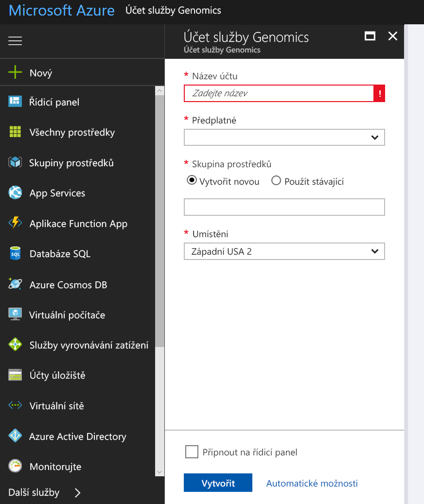
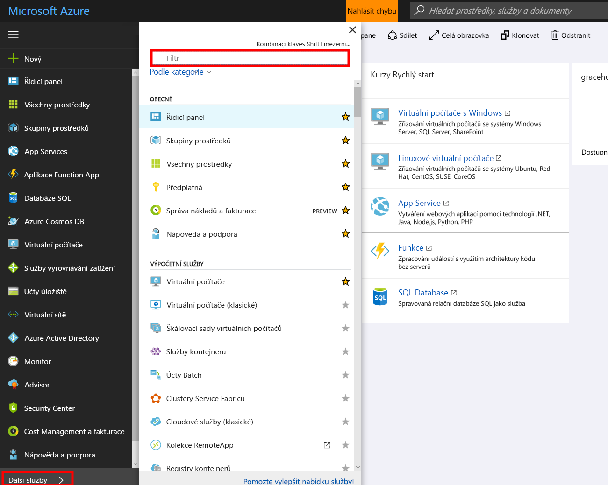
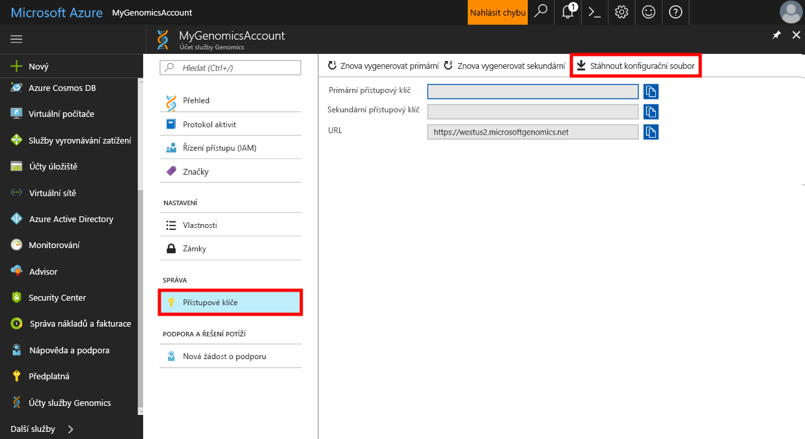

# <a name="quickstart-run-a-workflow-through-the-microsoft-genomics-service"></a>Rychlý start: Spuštění pracovního postupu ve službě Microsoft Genomics

Microsoft Genomics je škálovatelná a bezpečná služba pro sekundární analýzu, která dokáže rychle analyzovat genom počínaje od nezpracovaných čtení a vytváří zarovnaná čtení a volání variant. Začátek je rozdělen do několika kroků: 
1.  Příprava: vytvořte účet Microsoft Genomics na webu Azure Portal a nainstalujte pythonového klienta Microsoft Genomics do svého místního prostředí. 
2.  Nahrání vstupních dat: vytvořte účet úložiště Microsoft Azure na webu Azure Portal a nahrajte do něho vstupní soubory. Vstupní soubory by měly obsahovat sekvence paired-end (soubory fastq nebo bam).
3.  Spuštění: pomocí rozhraní příkazového řádku služby Microsoft Genomics spusťte pracovní postupy služby Microsoft Genomics. 

Další informace najdete v článku [Co je služba Microsoft Genomics?](overview-what-is-genomics.md)

## <a name="set-up-create-a-microsoft-genomics-account-in-the-azure-portal"></a>Příprava: vytvoření účtu Microsoft Genomics na webu Azure Portal

Účet služby Microsoft Genomics vytvoříte na webu [Azure Portal](https://portal.azure.com/#create/Microsoft.Genomics). Pokud ještě nemáte předplatné Azure, založte si ho před vytvořením účtu Microsoft Genomics. 




Nastavte v účtu Genomics následující údaje, viz předchozí obrázek. 

 |**Nastavení**          |  **Navrhovaná hodnota**  | **Popis pole** |
 |:-------------       |:-------------         |:----------            |
 |Název účtu         | MyGenomicsAccount     |Zvolte jedinečný identifikátor účtu. Informace o platných názvech najdete v části [Pravidla pojmenování](https://docs.microsoft.com/azure/architecture/best-practices/naming-conventions) |
 |Předplatné         | Název vašeho předplatného|Toto je fakturační jednotka pro vaše služby Azure – podrobnosti o vašem předplatném najdete v části [Předplatná](https://account.azure.com/Subscriptions) |      
 |Skupina prostředků       | MyResourceGroup       |  Skupiny prostředků umožňují sdružení několika prostředků Azure (účet úložiště, účet Genomics atd.) do jedné skupiny pro zjednodušení správy. Další informace najdete v tématu [Skupiny prostředků] (https://docs.microsoft.com/azure/azure-resource-manager/resource-group-overview#resource-groups). Platné názvy skupin prostředků najdete v tématu [Pravidla pojmenování](https://docs.microsoft.com/azure/architecture/best-practices/naming-conventions). |
 |Umístění                   | Západní USA 2                    |    Služba je dostupná v oblastech Západní USA 2, Západní Evropa a Jihovýchodní Asie |


V horní nabídce klikněte na Oznámení, budete tak moci sledovat proces nasazení.


## <a name="set-up-install-the-microsoft-genomics-python-client"></a>Příprava: instalace pythonového klienta Microsoft Genomics

Uživatelé musí do svého místního prostředí nainstalovat Python i pythonového klienta Microsoft Genomics. 

### <a name="install-python"></a>Instalace Pythonu

Pythonový klient Microsoft Genomics je kompatibilní s Pythonem 2.7. Doporučujeme použít verzi 2.7.12 nebo novější; optimální je 2.7.14. Můžete si ji stáhnout [tady](https://www.python.org/downloads/). 


### <a name="install-the-microsoft-genomics-client"></a>Instalace pythonového klienta Microsoft Genomics

Pythonového klienta Microsoft Genomics `msgen` nainstalujte v Pythonu pomocí nástroje pip. Následující pokyny předpokládají, že je Python zahrnutý v proměnné path. Pokud máte potíže s tím, že instalace pip není rozpoznána, bude třeba přidat Python a podsložku se skripty do systémové proměnné path.


```
pip install --upgrade --no-deps msgen
pip install msgen
```


Pokud nechcete instalovat `msgen` jako binární soubor pro celý systém a upravovat balíčky Python pro celý systém, použijte příkaz `pip` s příznakem `–-user`.
Pokud použijete instalaci využívající balíčky nebo skript setup.py, nainstalují se všechny potřebné balíčky. Jinak msgen vyžaduje tyto základní balíčky 

 * [Azure-storage](https://pypi.python.org/pypi/azure-storage). 
 * [Requests](https://pypi.python.org/pypi/requests). 


Tyto balíčky můžete nainstalovat pomocí `pip`, `easy_install` nebo standardní procedury `setup.py`. 


### <a name="test-the-microsoft-genomics-client"></a>Test pythonového klienta Microsoft Genomics
Chcete-li otestovat klienta Microsoft Genomics, stáhněte si ze svého účtu Genomics konfigurační soubor. Přejděte do svého účtu Genomics kliknutím na **Všechny služby** v levém horním rohu, filtrováním a výběrem účtu Genomics.





Vyberte účet Genomics, který jste právě vytvořili, přejděte na **Přístupové klíče** a stáhněte si konfigurační soubor.




Vyzkoušejte správnou funkci pythonového klienta Microsoft Genomics pomocí následujícího příkazu


```
msgen list -f “<full path where you saved the config file>”
```

## <a name="create-a-microsoft-azure-storage-account"></a>Vytvoření účtu služby Microsoft Azure Storage 
Služba Microsoft Genomics očekává vstupy uložené jako objekty blob bloku v účtu úložiště Azure. Také výstupní soubory zapisuje jako objekty blob bloku do uživatelem zadaného kontejneru v účtu úložiště Azure. Vstupy a výstupy můžou patřit do různých účtů úložiště.
Pokud již máte data v účtu úložiště Azure, stačí se ujistit, že je ve stejném umístění jako účet Genomics. V opačném případě se při použití služby Genomics budou účtovat poplatky za přenos dat. Pokud ještě nemáte účet Microsoft Azure Storage, budete ho muset vytvořit a nahrát do něj svá data. Další informace o účtech Azure Storage najdete [tady](https://docs.microsoft.com/azure/storage/common/storage-create-storage-account), včetně toho, co je účet úložiště a jaké služby nabízí. Chcete-li vytvořit účet Microsoft Azure Storage, přejděte na [Azure Portal](https://portal.azure.com/#create/Microsoft.StorageAccount-ARM ).  


Nastavte v účtu Storage následující údaje, viz předchozí obrázek. Použijte pro účet úložiště většinu výchozích hodnot, určete pouze, že účet úložiště má být typu blob, ne pro obecný účel. Úložiště objektů blob nabízí 2–5× rychlejší stahování a nahrávání. 


 |**Nastavení**          |  **Navrhovaná hodnota**  | **Popis pole** |
 |:-------------------------       |:-------------         |:----------            |
 |Název         | MyStorageAccount     |Zvolte jedinečný identifikátor účtu. Informace o platných názvech najdete v části [Pravidla pojmenování](https://docs.microsoft.com/azure/architecture/best-practices/naming-conventions) |
 |Deployment Model (Model nasazení)         | Resource Manager| Doporučuje se používat model nasazení pomocí správce prostředků. Další informace najdete v tématu [Vysvětlení nasazení pomocí správce prostředků](https://docs.microsoft.com/azure/azure-resource-manager/resource-manager-deployment-model). |      
 |Account kind (Druh účtu)       | Blob Storage       |  Úložiště objektů blob nabízí 2–5× rychlejší stahování a nahrávání než úložiště pro obecné účely. |
 |Výkon                  | Standard                   | Výchozí nastavení je Standard. Další podrobnosti o účtech úložiště úrovně Standard a Premium najdete v tématu [Úvod do Microsoft Azure Storage](https://docs.microsoft.com/azure/storage/common/storage-introduction).    |
 |Replikace                  | (Locally redundant storage) Místně redundantní úložiště                  | Místně redundantní úložiště replikuje data třikrát v rámci oblasti, ve které jste vytvořili účet úložiště. Další informace najdete v tématu [Replikace Azure Storage](https://docs.microsoft.com/azure/storage/common/storage-redundancy).    |
 |Secure transfer required (Vyžádání bezpečného přenosu)                  | Zakázáno                 | Ve výchozím nastavení je tato možnost zakázána. Další informace o zabezpečení přenosu dat najdete v tématu [Vyžádání zabezpečení přenosu](https://docs.microsoft.com/azure/storage/common/storage-require-secure-transfer).    |
 |Access tier (Vrstva přístupu)                  | Hot                   | Horká úroveň přístupu znamená, že k objektům v účtu úložiště budete přistupovat častěji.    |
 |Předplatné         | Vaše předplatné Azure |Podrobnosti o vašich předplatných najdete v tématu [Předplatná](https://account.azure.com/Subscriptions). |      
 |Skupina prostředků       | MyResourceGroup       |  Můžete vybrat stejnou skupinu prostředků, ve které je váš účet Genomics. Platné názvy skupin prostředků najdete v tématu [Pravidla pojmenování](https://docs.microsoft.com/azure/architecture/best-practices/naming-conventions). |
 |Umístění                  | Západní USA 2                  | Použijte stejné umístění, jaké má účet Genomics, abyste se vyhnuli poplatkům za přenosy dat a vyšší latenci. Služba Genomics je dostupná v oblastech Západní USA 2, Západní Evropa a Jihovýchodní Asie.    |
 |Virtuální sítě                | Zakázáno                   | Ve výchozím nastavení je tato možnost zakázána. Další informace najdete v článku [Virtuální sítě Azure](https://docs.microsoft.com/azure/storage/common/storage-network-security).    |


Pak vytvořte účet úložiště kliknutím na Vytvořit. Podobně jako při vytváření účtu Genomics klikněte v horní nabídce na Oznámení, budete tak moci sledovat proces nasazení. 


## <a name="upload-input-data-to-your-storage-account"></a>Nahrání vstupních dat do účtu úložiště

Služba Microsoft Genomics očekává jako vstupní soubory sekvence paired-end. Můžete nahrát svoje vlastní data, nebo použít veřejně dostupná ukázková data, která jsme pro vás připravili. Pokud chcete použít veřejně dostupné ukázková data, najdete je tady:


[https://msgensampledata.blob.core.windows.net/small/chr21_1.fq.gz](https://msgensampledata.blob.core.windows.net/small/chr21_1.fq.gz)
[https://msgensampledata.blob.core.windows.net/small/chr21_2.fq.gz](https://msgensampledata.blob.core.windows.net/small/chr21_2.fq.gz)


V rámci účtu úložiště budete potřebovat jeden kontejner objektů blob pro vstupní data a druhý kontejner objektů blob pro výstupní data.  Nahrajte vstupní data do vstupního kontejneru objektů blob. Můžete k tomu použít různé nástroje, včetně [Microsoft Azure Storage Explorer](https://azure.microsoft.com/features/storage-explorer/), [blobporter](https://github.com/Azure/blobporter) nebo [AzCopy](https://docs.microsoft.com/azure/storage/common/storage-use-azcopy?toc=%2fazure%2fstorage%2fblobs%2ftoc.json). 


## <a name="run-a-workflow-through-the-microsoft-genomics-service-using-the-python-client"></a>Spuštění pracovního postupu ve službě Microsoft Genomics pomocí pythonového klienta 

Ke spuštění pracovního postupu služby Microsoft Genomics je třeba upravit soubor config.txt a zadat vstupní a výstupní kontejner úložiště pro vaše data.
Otevřete soubor config.txt, který jste stáhli ze svého účtu Genomics. Je třeba zadat váš klíč předplatného a šest položek na konci – název účtu úložiště, klíč a kontejner pro vstupní a výstupní soubory. Tyto informace můžete zjistit na portálu v části **Access keys** (Přístupové klíče) pro váš účet úložiště, nebo přímo pomocí Průzkumníka služby Azure Storage.  


### <a name="submit-your-workflow-to-the-microsoft-genomics-service-the-microsoft-genomics-client"></a>Odešlete svůj pracovní postup službě Microsoft Genomics pomocí klienta Microsoft Genomics

Pomocí pythonového klienta Microsoft Genomics odešlete svůj pracovní postup pomocí následujícího příkazu:


```python
msgen submit -f [full path to your config file] -b1 [name of your first paired end read] -b2 [name of your second paired end read]
```


Stav pracovního postupu můžete zkontrolovat následujícím příkazem: 
```python
msgen list -f c:\temp\config.txt 
```


Po dokončení pracovního postupu můžete zobrazit výstupní soubory ve vašem účtu úložiště Azure Storage ve výstupním kontejneru, který jste nakonfigurovali. 


## <a name="next-steps"></a>Další kroky
V tomto článku jste nahráli ukázková vstupní data do úložiště Azure Storage a odeslali jste pracovní postup do služby Microsoft Genomics pomocí pythonového klienta `msgen`. Další informace o ostatních typech vstupních souborů, které můžete se službou Microsoft Genomics použít, najdete na následujících stránkách: [Párované soubory FASTQ](quickstart-input-pair-FASTQ.md) | [BAM](quickstart-input-BAM.md) | [Více souborů FASTQ nebo BAM](quickstart-input-multiple.md) 