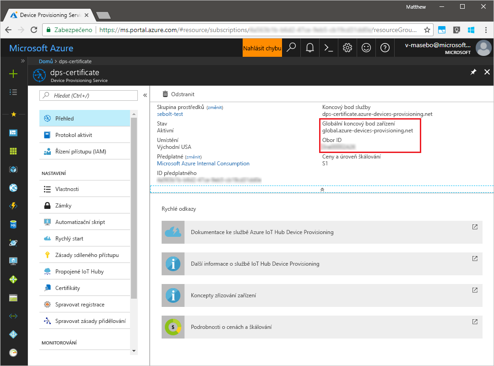
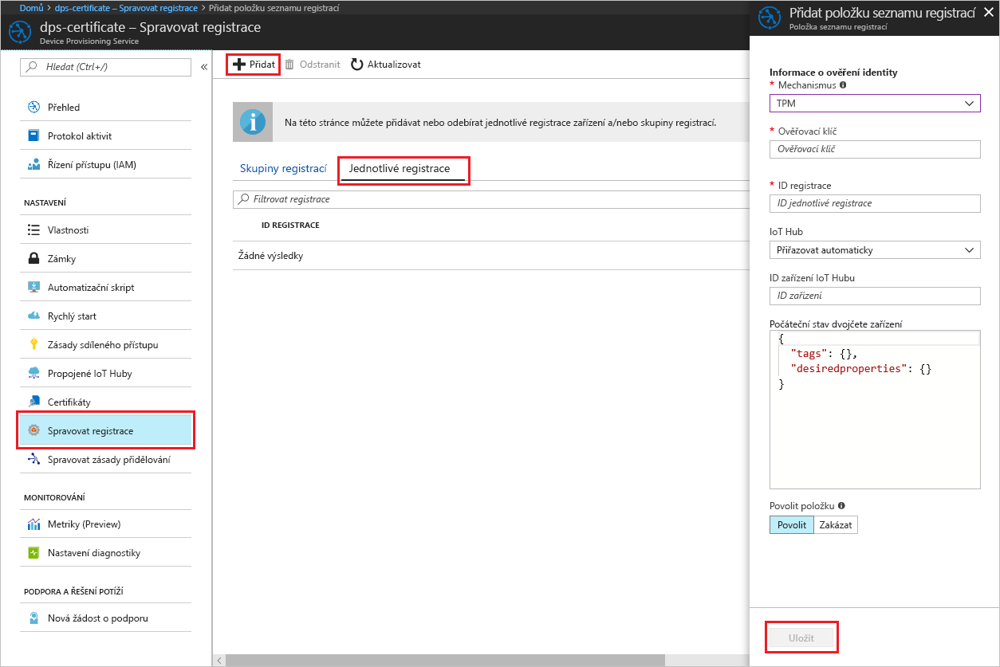
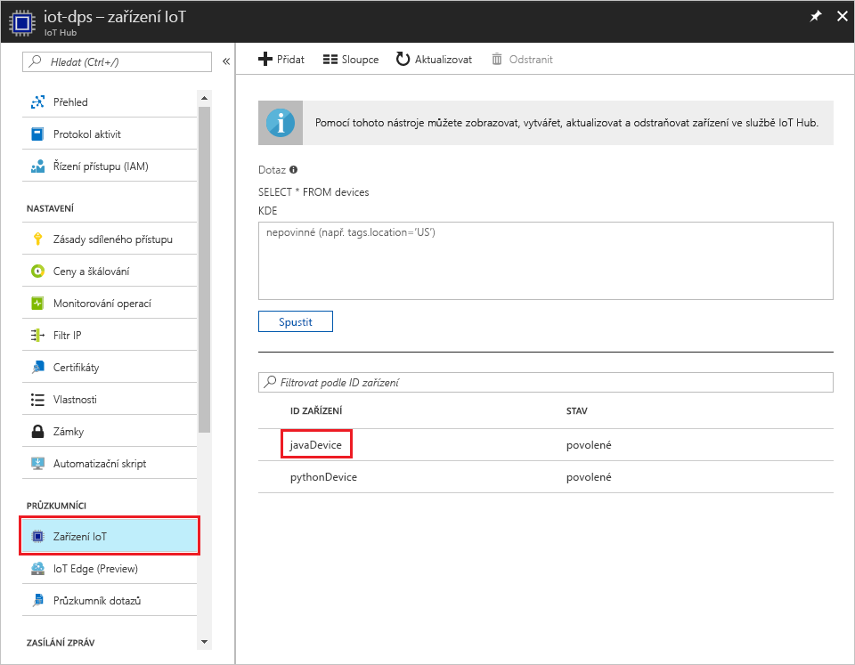

# <a name="create-and-provision-a-simulated-tpm-device-using-java-device-sdk-for-azure-iot-hub-device-provisioning-service"></a>Vytvoření a zřízení simulovaného zařízení TPM pomocí sady Java SDK pro zařízení pro službu Azure IoT Hub Device Provisioning
> [!div class="op_single_selector"]
> * [C](quick-create-simulated-device.md)
> * [Java](quick-create-simulated-device-tpm-java.md)
> * [C#](quick-create-simulated-device-tpm-csharp.md)
> * [Python](quick-create-simulated-device-tpm-python.md)

Tyto kroky ukazují, jak na vývojovém počítači s operačním systémem Windows vytvořit simulované zařízení, spustit simulátor Windows TPM jako [modul hardwarového zabezpečení (HSM)](https://azure.microsoft.com/blog/azure-iot-supports-new-security-hardware-to-strengthen-iot-security/) zařízení a jak pomocí vzorového kódu propojit toto simulované zařízení se službou Device Provisioning a centrem IoT. 

Než budete pokračovat, nezapomeňte dokončit kroky v tématu [Nastavení služby IoT Hub Device Provisioning pomocí webu Azure Portal](./quick-setup-auto-provision.md).


## <a name="prepare-the-environment"></a>Příprava prostředí 

1. Ujistěte se, že na svém počítači máte nainstalované prostředí [Java SE Development Kit 8](http://www.oracle.com/technetwork/java/javase/downloads/jdk8-downloads-2133151.html).

1. Stáhněte a nainstalujte [Maven](https://maven.apache.org/install.html).

1. Ujistěte se, že je na vašem počítači nainstalovaný `git` a že je přidaný do proměnných prostředí, ke kterým má příkazové okno přístup. Na stránce [klientských nástrojů Git organizace Software Freedom Conservancy](https://git-scm.com/download/) najdete nejnovější verzi nástrojů `git` k instalaci. Jejich součástí je i **Git Bash**, aplikace příkazového řádku, pomocí které můžete pracovat se svým místním úložištěm Git. 

1. Otevřete příkazový řádek. Naklonujte úložiště GitHub se vzorovým kódem pro simulaci zařízení.
    
    ```cmd/sh
    git clone https://github.com/Azure/azure-iot-sdk-java.git --recursive
    ```

1. Spusťte simulátor [TPM](https://docs.microsoft.com/windows/device-security/tpm/trusted-platform-module-overview). Kliknutím na **Povolit přístup** povolte změny nastavení brány _Windows Firewall_. Ten naslouchá přes soket na portech 2321 a 2322. Toto okno nezavírejte, simulátor je potřeba nechat spuštěný až do konce této úvodní příručky. 

    ```cmd/sh
    .\azure-iot-sdk-java\provisioning\provisioning-tools\tpm-simulator\Simulator.exe
    ```

    

1. V samostatném příkazovém řádku přejděte do kořenové složky a sestavte ukázkové závislosti.

    ```cmd/sh
    cd azure-iot-sdk-java
    mvn install -DskipTests=true
    ```

1. Přejděte do složky s ukázkou.

    ```cmd/sh
    cd provisioning/provisioning-samples/provisioning-tpm-sample
    ```

1. Přihlaste se k webu Azure Portal, v nabídce vlevo klikněte na tlačítko **Všechny prostředky** a otevřete svou službu Device Provisioning. Poznamenejte si _Rozsah ID_ a _Globální koncový bod služby zřizování_.

    

1. Upravte soubor `src/main/java/samples/com/microsoft/azure/sdk/iot/ProvisioningTpmSample.java` tak, aby zahrnoval váš _Rozsah ID_ a _Globální koncový bod služby zřizování_, které jste si poznamenali dříve.  

    ```java
    private static final String idScope = "[Your ID scope here]";
    private static final String globalEndpoint = "[Your Provisioning Service Global Endpoint here]";
    private static final ProvisioningDeviceClientTransportProtocol PROVISIONING_DEVICE_CLIENT_TRANSPORT_PROTOCOL = ProvisioningDeviceClientTransportProtocol.HTTPS;
    ```

1. Sestavte projekt. Přejděte do cílové složky a spusťte vytvořený soubor jar.

    ```cmd/sh
    mvn clean install
    cd target
    java -jar ./provisioning-tpm-sample-{version}-with-deps.jar
    ```

1. Program se spustí. Poznamenejte si _Ověřovací klíč_ a _ID registrace_, které použijete v další části, a nechte program spuštěný.

    
    

## <a name="create-a-device-enrollment-entry"></a>Vytvoření položky registrace zařízení

1. Přihlaste se k webu Azure Portal, v nabídce vlevo klikněte na tlačítko **Všechny prostředky** a otevřete svou službu Device Provisioning.

1. V okně s přehledem služby Device Provisioning vyberte **Správa registrací**. Vyberte kartu **Jednotlivé registrace** a klikněte na tlačítko **Přidat** v horní části. 

1. V části **Přidat položku seznamu registrací** zadejte následující informace:
    - Jako *Mechanismus* ověření identity vyberte **TPM**.
    - Zadejte pro zařízení TPM *ID registrace* a *Ověřovací klíč*, které jste si poznamenali dříve. 
    - Vyberte centrum IoT propojené s vaší zřizovací službou.
    - Zadejte jedinečné ID zařízení. Při pojmenování zařízení se ujistěte, že nepoužíváte citlivá data.
    - Aktualizujte **Počáteční stav dvojčete zařízení** s použitím požadované počáteční konfigurace zařízení.
    - Jakmile budete hotovi, klikněte na tlačítko **Uložit**. 

      

   Po úspěšné registraci se *ID registrace* vašeho zařízení zobrazí v seznamu na kartě *Jednotlivé registrace*. 


## <a name="simulate-the-device"></a>Simulace zařízení

1. V příkazovém okně se spuštěným vzorovým kódem Java na vašem počítači stiskněte Enter a pokračujte ve spouštění aplikace. Všimněte si zpráv, které simulují spouštění zařízení a jeho připojování ke službě Device Provisioning pro získání informací o vašem centru IoT.  

    

1. Po úspěšném zřízení simulovaného zařízení pro centrum IoT propojené se zřizovací službou se ID zařízení zobrazí v okně **Device Explorer** centra.

     

    Pokud jste v položce registrace pro vaše zařízení změnili *počáteční stav dvojčete zařízení* z výchozí hodnoty, může si zařízení požadovaný stav dvojčete vyžádat z centra a příslušně na něj reagovat. Další informace najdete v tématu [Principy a použití dvojčat zařízení ve službě IoT Hub](../iot-hub/iot-hub-devguide-device-twins.md).


## <a name="clean-up-resources"></a>Vyčištění prostředků

Pokud chcete pokračovat v práci s touto ukázkou klienta zařízení a jejím prozkoumáváním, nevyčišťujte prostředky vytvořené v rámci tohoto rychlého startu. Pokud pokračovat nechcete, pomocí následujícího postupu odstraňte všechny prostředky vytvořené tímto rychlým startem.

1. Zavřete na svém počítači okno výstupu ukázky klienta zařízení.
1. Zavřete na svém počítači okno simulátoru TPM.
1. V nabídce vlevo na webu Azure Portal klikněte na **Všechny prostředky** a vyberte svou službu Device Provisioning. Otevřete okno **Správa registrací** pro vaši službu a pak klikněte na kartu **Jednotlivé registrace**. Vyberte *ID REGISTRACE* zařízení, které jste zaregistrovali v rámci tohoto rychlého startu, a klikněte na tlačítko **Odstranit** v horní části. 
1. V nabídce vlevo na webu Azure Portal klikněte na **Všechny prostředky** a vyberte své centrum IoT. Otevřete okno **Zařízení IoT** pro vaše centrum, vyberte *ID ZAŘÍZENÍ*, které jste zaregistrovali v rámci tohoto rychlého startu, a pak klikněte na tlačítko **Odstranit** v horní části.

## <a name="next-steps"></a>Další kroky

V rámci tohoto rychlého startu jste na svém počítači vytvořili simulované zařízení TPM a pomocí služby IoT Hub Device Provisioning jste ho zřídili pro své centrum IoT. Pokud chcete zjistit, jak zaregistrovat zařízení TPM prostřednictvím kódu programu, pokračujte k rychlému startu pro registraci zařízení TPM prostřednictvím kódu programu. 

> [!div class="nextstepaction"]
> [Rychlý start Azure – Registrace zařízení TPM do služby Azure IoT Hub Device Provisioning](quick-enroll-device-tpm-java.md)
