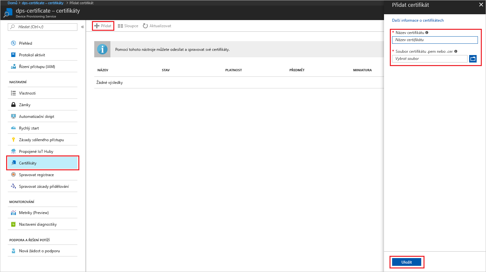
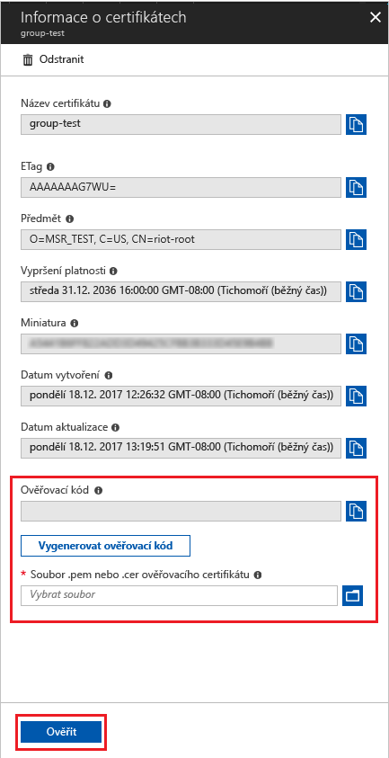

# <a name="create-and-provision-an-x509-simulated-device-using-nodejs-device-sdk-for-iot-hub-device-provisioning-service"></a>Vytvoření a zřízení simulovaného zařízení X.509 pomocí sady Node.js SDK pro zařízení pro službu IoT Hub Device Provisioning
[!INCLUDE [iot-dps-selector-quick-create-simulated-device-x509](../../includes/iot-dps-selector-quick-create-simulated-device-x509.md)]

Služba IoT Hub Device Provisioning je pomocná služba pro IoT Hub, která umožňuje plně automatizované zřizování zařízení pro centrum IoT. Se službou Device Provisioning můžete bezpečně a škálovatelně zřizovat miliony zařízení.

Zřizování zařízení se skládá ze dvou kroků. Prvním krokem je vytvoření odpovídající položky registrace ve službě Device Provisioning na základě konkrétních požadavků řešení.  Druhým krokem je navázání připojení mezi zařízením a službou Device Provisioning a registrace zařízení v centru IoT. Po dokončení obou kroků se zařízení považuje za plně zřízené. Služba Device Provisioning oba kroky automatizuje a zajišťuje tak bezproblémové zřizování zařízení. Další informace najdete v tématu [Koncepty služby Device Provisioning](https://docs.microsoft.com/en-us/azure/iot-dps/concepts-service).

Tyto kroky ukazují, jak vytvořit položku registrace ve službě Device Provisioning, simulovat zařízení X.509 na vývojovém počítači, propojit simulované zařízení se službou Device Provisioning a zaregistrovat zařízení v centru IoT pomocí sady [SDK pro zařízení Azure IoT Hub pro Node.js](https://github.com/Azure/azure-iot-sdk-node).


## <a name="prepare-the-environment"></a>Příprava prostředí 

1. Než budete pokračovat, dokončete kroky v tématu [Nastavení služby IoT Hub Device Provisioning pomocí webu Azure Portal](./quick-setup-auto-provision.md).

1. Ujistěte se, že na svém počítači máte nainstalované [Node.js v4.0 nebo novější](https://nodejs.org).

1. Ujistěte se, že je na vašem počítači nainstalovaný [Git](https://git-scm.com/download/) a že je přidaný do proměnných prostředí, ke kterým má příkazové okno přístup. 

1. Ujistěte se, že je na vašem počítači nainstalovaná knihovna [OpenSSL](https://www.openssl.org/) a že je přidaná do proměnných prostředí, ke kterým má příkazové okno přístup. Tuto knihovnu je možné sestavit a nainstalovat ze zdroje nebo stáhnout a nainstalovat od [třetí strany](https://wiki.openssl.org/index.php/Binaries), jako je [tato](https://sourceforge.net/projects/openssl/). 

    > [!NOTE]
    > Pokud již máte vytvořené _kořenové_, _zprostředkující_ nebo _listové_ certifikáty X.509, můžete tento krok a všechny další kroky týkající se generování certifikátů přeskočit.
    >


## <a name="create-an-enrollment-entry"></a>Vytvoření položky registrace

Registrace je ve službě Device Provisioning uložený záznam zařízení nebo skupin zařízení, které se někdy můžou registrovat. Záznam registrace obsahuje informace o zařízení nebo skupině zařízení, včetně podrobností o certifikátu X.509 a dalších informací o registraci. Služba Device Provisioning podporuje dva typy registrací – _jednotlivou registraci_ a _skupinu registrací_. Další informace najdete v tématu [Koncepty registrace](https://docs.microsoft.com/en-us/azure/iot-dps/concepts-service#enrollment).

Pokud vytváříte vlastní testovací certifikáty X.509, přečtěte si téma [Koncepty zabezpečení](https://docs.microsoft.com/en-us/azure/iot-dps/concepts-security#x509-certificates), kde najdete informace o tom, jaké certifikáty jsou nezbytné pro vaše řešení, a téma [Nástroje pro sadu SDK pro zařízení Azure IoT Device Provisioning pro Node.js](https://github.com/azure/azure-iot-sdk-node/tree/master/provisioning/tools), kde najdete podrobnosti o implementaci.

1. Otevřete příkazový řádek. Naklonujte úložiště GitHub se vzorovými kódy:
    
    ```cmd/sh
    git clone https://github.com/Azure/azure-iot-sdk-node.git --recursive
    ```

1. Přejděte ke skriptu generátoru certifikátů a sestavte projekt. 

    ```cmd/sh
    cd azure-iot-sdk-node/provisioning/tools
    npm install
    ```

1. V závislosti na vašem nastavení vytvořte jedním z následujících způsobů informace o registraci:

    - **Jednotlivá registrace:**

        1. Vytvořte _listový_ certifikát spuštěním skriptu s použitím vlastního názvu certifikátu (_certificate-name_). Poznámka: Běžný název listového certifikátu se použije jako [ID registrace](https://docs.microsoft.com/en-us/azure/iot-dps/concepts-device#registration-id), takže nezapomeňte použít pouze malé alfanumerické znaky a pomlčky.

        ```cmd/sh
        node create_test_cert.js device {certificate-name}
        ```
         
        1. Na webu **Azure Portal** otevřete okno s přehledem **služby Device Provisioning**. Vyberte **Správa registrací**, pak kartu **Jednotlivé registrace** a klikněte na tlačítko **Přidat** v horní části. 

        1. V části **Přidat položku seznamu registrací** zadejte následující informace:
            - Jako *Mechanismus* ověření identity vyberte **X.509**.
            - V části *Soubor .pem nebo .cer certifikátu* vyberte pomocí widgetu *Průzkumník souborů* soubor certifikátu **_{název_certifikátu}\_cert.pem_** vytvořený v předchozích krocích.
            - Volitelně můžete zadat následující informace:
                - Vyberte centrum IoT propojené s vaší zřizovací službou.
                - Zadejte jedinečné ID zařízení. Při pojmenování zařízení se ujistěte, že nepoužíváte citlivá data. 
                - Aktualizujte **Počáteční stav dvojčete zařízení** s použitím požadované počáteční konfigurace zařízení.
            - Jakmile budete hotovi, klikněte na tlačítko **Uložit**. 

          

    Po úspěšné registraci se vaše zařízení X.509 zobrazí jako **{název_certifikátu}** ve sloupci *ID registrace* na kartě *Jednotlivé registrace*. Tuto hodnotu si poznamenejte pro pozdější použití.

    - **Skupiny registrací:** 

        1. Vytvořte _kořenový_ certifikát spuštěním skriptu s použitím vlastního názvu kořenového certifikátu (_root-name_).

        ```cmd/sh
        node create_test_cert.js root {root-name}
        ```

        1. Na webu **Azure Portal** otevřete okno s přehledem **služby Device Provisioning**. Vyberte **Certifikáty** a klikněte na tlačítko **Přidat** v horní části.

        1. V části **Přidat certifikát** zadejte následující informace:
            - Zadejte jedinečný název certifikátu.
            - Vyberte soubor **_{název_kořenového_certifikátu}\_cert.pem_**, který jste vytvořili dříve.
            - Jakmile budete hotovi, klikněte na tlačítko **Uložit**.

        

        1. Vyberte nově vytvořený certifikát:
            - Klikněte na **Vygenerovat ověřovací kód**. Zkopírujte vygenerovaný kód.
            - Vytvořte _ověřovací_ certifikát. Zadejte nebo klikněte pravým tlačítkem a vložte _ověřovací kód_ do spuštěného okna skriptu Node s následujícím příkazem:

                ```cmd/sh
                node create_test_cert.js verification {rootname_cert} {verification code}
                ```

            - V části *Soubor .pem nebo .cer ověřovacího certifikátu* vyberte pomocí widgetu *Průzkumník souborů* soubor certifikátu **_{název_ověřovacího_certifikátu}_cert.pem_** vytvořený v předchozích krocích. Klikněte na **Ověřit**.

            

        1. Vyberte **Správa registrací**. Vyberte kartu **Skupiny registrací** a klikněte na tlačítko **Přidat** v horní části.
            - Zadejte jedinečný název skupiny.
            - Vyberte jedinečný název certifikátu, který jste vytvořili dříve.
            - Volitelně můžete zadat následující informace:
                - Vyberte centrum IoT propojené s vaší zřizovací službou.
                - Aktualizujte **Počáteční stav dvojčete zařízení** s použitím požadované počáteční konfigurace zařízení.

        

        Po úspěšné registraci se vaše skupina zařízení X.509 zobrazí ve sloupci *Název skupiny* na kartě *Skupiny registrací*. Tuto hodnotu si poznamenejte pro pozdější použití.

        1. Vytvořte _listový_ certifikát spuštěním skriptu s použitím vlastního názvu certifikátu (_certificate-name_) následovaného názvem kořenového certifikátu (_root-name_), který jste použili dříve. Běžný název listového certifikátu se použije jako [ID registrace](https://docs.microsoft.com/en-us/azure/iot-dps/concepts-device#registration-id), takže nezapomeňte použít pouze malé alfanumerické znaky a pomlčky.

            ```cmd/sh
            node create_test_cert.js device {certificate-name} {root-name}
            ```

        > [!NOTE]
        > Pomocí příkazu `node create_test_cert.js intermediate {certificate-name} {parent-name}` můžete vytvářet také _zprostředkující_ certifikáty. Jenom nezapomeňte v posledním kroku vytvořit _listový_ certifikát s použitím posledního _zprostředkujícího_ certifikátu jako kořenového/nadřazeného certifikátu. Další informace najdete v tématu [Řízení přístupu zařízení](https://docs.microsoft.com/en-us/azure/iot-dps/concepts-security#controlling-device-access-to-the-provisioning-service-with-x509-certificates).
        >


## <a name="simulate-the-device"></a>Simulace zařízení

Sada [SDK pro zařízení Azure IoT Hub pro Node.js](https://github.com/Azure/azure-iot-sdk-node) poskytuje snadný způsob, jak simulovat zařízení. Další informace najdete v tématu [Koncepty zařízení](https://docs.microsoft.com/en-us/azure/iot-dps/concepts-device).

1. Na webu Azure Portal vyberte okno **Přehled** vaší služby Device Provisioning a poznamenejte si hodnoty **_Globální koncový bod zařízení_** a **_Rozsah ID_**.

     

1. Zkopírujte svůj _certifikát_ a _klíč_ do složky s ukázkou.

    ```cmd/sh
    copy .\{certificate-name}_cert.pem ..\device\samples\{certificate-name}_cert.pem
    copy .\{certificate-name}_key.pem ..\device\samples\{certificate-name}_key.pem
    ```

1. Přejděte do skriptu testu zařízení a sestavte projekt. 

    ```cmd/sh
    cd ..\device\samples
    npm install
    ```

1. Upravte soubor **register\_x509.js**. Po provedení následujících změn soubor uložte.
    - Hodnotu `provisioning host` nahraďte za **_Globální koncový bod zařízení_**, který jste si poznamenali dříve v **kroku 1**.
    - Hodnotu `id scope` nahraďte za **_Rozsah ID_**, který jste si poznamenali dříve v **kroku 1**. 
    - Hodnotu `reigstration id` nahraďte za **_ID registrace_** nebo **_Název skupiny_**, které jste si poznamenali v předchozí části.
    - Hodnoty `cert filename` a `key filename` nahraďte za soubory, které jste si zkopírovali dříve v **kroku 2**. 

1. Spusťte skript a ověřte úspěšné zřízení zařízení.

    ```cmd/sh
    node register_x509.js
    ```   

1. Na portálu přejděte k centru IoT propojenému s vaší službou zřizování a otevřete okno **Zařízení IoT**. Po úspěšném zřízení simulovaného zařízení X.509 pro toto centrum se ID tohoto zařízení zobrazí v okně **Zařízení IoT** a jeho *STAV* bude **povoleno**. Pokud jste okno otevřeli už před spuštěním ukázkové aplikace zařízení, možná bude potřeba kliknout na tlačítko **Aktualizovat** v horní části. 

     

    Pokud jste v položce registrace pro vaše zařízení změnili *počáteční stav dvojčete zařízení* z výchozí hodnoty, může si zařízení požadovaný stav dvojčete vyžádat z centra a příslušně na něj reagovat. Další informace najdete v tématu [Principy a použití dvojčat zařízení ve službě IoT Hub](../iot-hub/iot-hub-devguide-device-twins.md).


## <a name="clean-up-resources"></a>Vyčištění prostředků

Pokud chcete pokračovat v práci s touto ukázkou klienta zařízení a jejím prozkoumáváním, nevyčišťujte prostředky vytvořené v rámci tohoto rychlého startu. Pokud pokračovat nechcete, pomocí následujícího postupu odstraňte všechny prostředky vytvořené tímto rychlým startem.

1. Zavřete na svém počítači okno výstupu ukázky klienta zařízení.
1. V nabídce vlevo na webu Azure Portal klikněte na **Všechny prostředky** a vyberte svou službu Device Provisioning. Otevřete okno **Správa registrací** pro vaši službu a pak klikněte na kartu **Jednotlivé registrace** nebo **Skupiny registrací**. Vyberte *ID REGISTRACE* nebo *NÁZEV SKUPINY* zařízení, které jste zaregistrovali v rámci tohoto rychlého startu, a klikněte na tlačítko **Odstranit** v horní části. 
1. V nabídce vlevo na webu Azure Portal klikněte na **Všechny prostředky** a vyberte své centrum IoT. Otevřete okno **Zařízení IoT** pro vaše centrum, vyberte *ID ZAŘÍZENÍ*, které jste zaregistrovali v rámci tohoto rychlého startu, a pak klikněte na tlačítko **Odstranit** v horní části.


## <a name="next-steps"></a>Další kroky

V rámci tohoto rychlého startu jste vytvořili simulované zařízení X.509 a pomocí služby Azure IoT Hub Device Provisioning na portálu jste ho zřídili pro své centrum IoT. Pokud chcete zjistit, jak zaregistrovat zařízení X.509 prostřednictvím kódu programu, pokračujte k rychlému startu pro registraci zařízení X.509 prostřednictvím kódu programu. 

> [!div class="nextstepaction"]
> [Rychlý start Azure – Registrace zařízení X.509 do služby Azure IoT Hub Device Provisioning](quick-enroll-device-x509-node.md)
