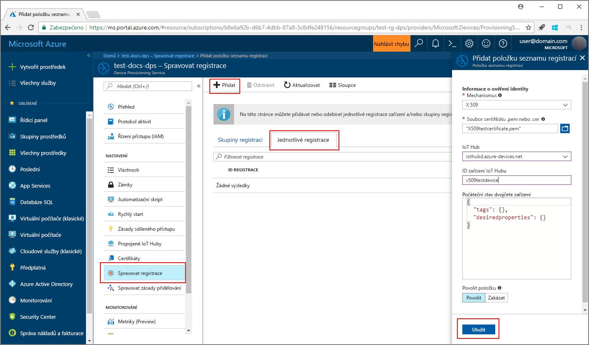
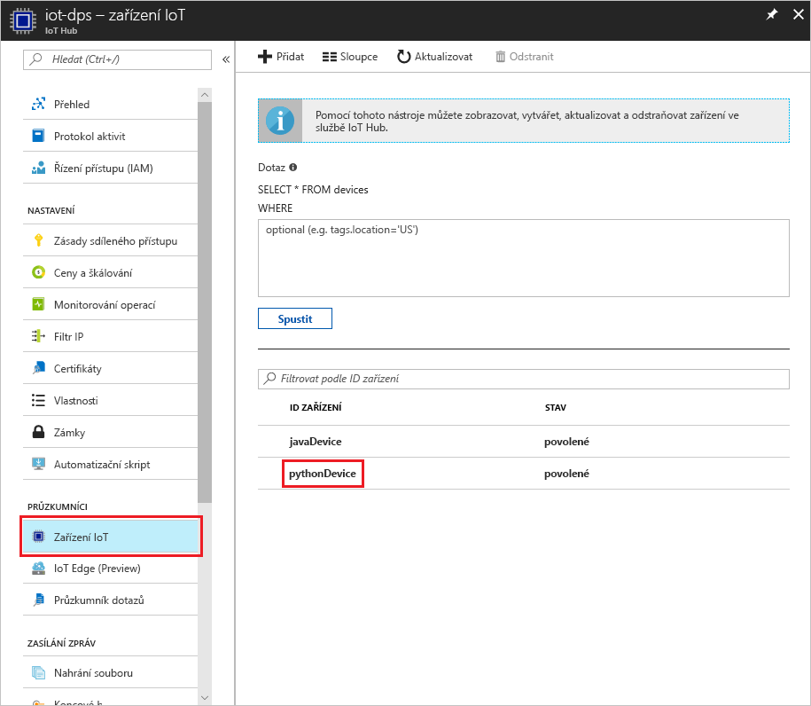

# <a name="create-and-provision-a-simulated-x509-device-using-python-device-sdk-for-iot-hub-device-provisioning-service"></a>Vytvoření a zřízení simulovaného zařízení X.509 pomocí sady Python SDK pro zařízení pro službu IoT Hub Device Provisioning
[!INCLUDE [iot-dps-selector-quick-create-simulated-device-x509](../../includes/iot-dps-selector-quick-create-simulated-device-x509.md)]

Tyto kroky ukazují, jak na vývojovém počítači s operačním systémem Windows simulovat zařízení X.509 a pomocí vzorového kódu Pythonu propojit toto simulované zařízení se službou Device Provisioning a centrem IoT. 

Než budete pokračovat, nezapomeňte dokončit kroky v tématu [Nastavení služby IoT Hub Device Provisioning pomocí webu Azure Portal](./quick-setup-auto-provision.md).


## <a name="prepare-the-environment"></a>Příprava prostředí 

1. Ujistěte se, že na svém počítači máte nainstalovanou sadu [Visual Studio 2015](https://www.visualstudio.com/vs/older-downloads/) nebo [Visual Studio 2017](https://www.visualstudio.com/vs/). Pro vaši instalaci sady Visual Studio musíte mít povolenou sadu funkcí 	Vývoj desktopových aplikací pomocí C++.

1. Stáhněte a nainstalujte [sestavovací systém CMake](https://cmake.org/download/).

1. Ujistěte se, že je na vašem počítači nainstalovaný `git` a že je přidaný do proměnných prostředí, ke kterým má příkazové okno přístup. Na stránce [klientských nástrojů Git organizace Software Freedom Conservancy](https://git-scm.com/download/) najdete nejnovější verzi nástrojů `git` k instalaci. Jejich součástí je i **Git Bash**, aplikace příkazového řádku, pomocí které můžete pracovat se svým místním úložištěm Git. 

1. Otevřete příkazový řádek nebo Git Bash. Naklonujte úložiště GitHub se vzorovým kódem pro simulaci zařízení.
    
    ```cmd/sh
    git clone https://github.com/Azure/azure-iot-sdk-python.git --recursive
    ```

1. V lokální kopii tohoto úložiště GitHub vytvořte složku pro proces sestavení CMake. 

    ```cmd/sh
    cd azure-iot-sdk-python/c
    mkdir cmake
    cd cmake
    ```

1. Spuštěním následujícího příkazu vytvořte v sadě Visual Studio řešení pro klienta zřizování.

    ```cmd/sh
    cmake -Duse_prov_client:BOOL=ON ..
    ```


## <a name="create-a-device-enrollment-entry"></a>Vytvoření položky registrace zařízení

1. Otevřete řešení `azure_iot_sdks.sln` vygenerované ve složce *cmake* a sestavte ho v sadě Visual Studio.

1. Klikněte pravým tlačítkem na projekt **dice\_device\_enrollment** ve složce **Provision\_Tools** a vyberte **Nastavit jako spouštěný projekt**. Spusťte řešení. Po zobrazení výzvy zadejte v okně Výstup `i` pro jednotlivou registraci. V okně Výstup se zobrazí místně vygenerovaný certifikát X.509 pro vaše simulované zařízení. Zkopírujte do schránky výstup začínající na *-----BEGIN CERTIFICATE-----* a končící na *-----END CERTIFICATE-----* a ujistěte se, že kopírujete i oba tyto řádky. 

    
 
1. Na svém počítači s Windows vytvořte soubor **_X509testcertificate.pem_**, otevřete ho v libovolném editoru a zkopírujte do něj obsah schránky. Uložte soubor. 

1. Přihlaste se k webu Azure Portal, v nabídce vlevo klikněte na tlačítko **Všechny prostředky** a otevřete svou službu zřizování.

1. V okně s přehledem služby Device Provisioning vyberte **Správa registrací**. Vyberte kartu **Jednotlivé registrace** a klikněte na tlačítko **Přidat** v horní části. 

1. V části **Přidat položku seznamu registrací** zadejte následující informace:
    - Jako *Mechanismus* ověření identity vyberte **X.509**.
    - V části *Soubor .pem nebo .cer certifikátu* vyberte soubor certifikátu **_X509testcertificate.pem_** vytvořený v předchozím kroku pomocí widgetu *Průzkumník souborů*.
    - Volitelně můžete zadat následující informace:
        - Vyberte centrum IoT propojené s vaší zřizovací službou.
        - Zadejte jedinečné ID zařízení. Při pojmenování zařízení se ujistěte, že nepoužíváte citlivá data. 
        - Aktualizujte **Počáteční stav dvojčete zařízení** s použitím požadované počáteční konfigurace zařízení.
    - Jakmile budete hotovi, klikněte na tlačítko **Uložit**. 

      

   Po úspěšné registraci se vaše zařízení X.509 zobrazí jako **riot-device-cert** ve sloupci *ID registrace* na kartě *Jednotlivé registrace*. 


## <a name="simulate-the-device"></a>Simulace zařízení

1. V okně s přehledem služby Device Provisioning vyberte **Přehled**. Poznamenejte si _Rozsah ID_ a _Globální koncový bod služby_.

    

1. Stáhněte a nainstalujte [Python 2.x nebo 3.x](https://www.python.org/downloads/). Ujistěte se, že používáte 32bitovou, nebo 64bitovou instalaci podle požadavků vašeho nastavení. Po zobrazení výzvy v průběhu instalace nezapomeňte přidat Python do proměnných prostředí pro konkrétní platformu. Pokud používáte Python 2.x, možná bude nutné [nainstalovat nebo upgradovat *pip*, systém správy balíčků Pythonu](https://pip.pypa.io/en/stable/installing/).
    - Pokud používáte operační systém Windows, je k povolení používání nativních knihoven DLL z Pythonu potřeba [balíček distribuovatelných součástí Visual C++](http://www.microsoft.com/download/confirmation.aspx?id=48145).

1. Pomocí [těchto pokynů](https://github.com/Azure/azure-iot-sdk-python/blob/master/doc/python-devbox-setup.md) sestavte balíčky Pythonu.

    > [!NOTE]
        > Pokud používáte `pip`, nezapomeňte nainstalovat také balíček `azure-iot-provisioning-device-client`.

1. Přejděte do složky s ukázkami.

    ```cmd/sh
    cd azure-iot-sdk-python/provisioning_device_client/samples
    ```

1. Pomocí svého integrovaného vývojového prostředí (IDE) pro Python upravte skript Pythonu **provisioning\_device\_client\_sample.py**. Proměnné _GLOBAL\_PROV\_URI_ a _ID\_SCOPE_ změňte na hodnoty, které jste si poznamenali dříve.

    ```python
    GLOBAL_PROV_URI = "{globalServiceEndpoint}"
    ID_SCOPE = "{idScope}"
    SECURITY_DEVICE_TYPE = ProvisioningSecurityDeviceType.X509
    PROTOCOL = ProvisioningTransportProvider.HTTP
    ```

1. Spusťte ukázku. 

    ```cmd/sh
    python provisioning_device_client_sample.py
    ```

1. Aplikace se připojí, zaregistruje zařízení a zobrazí zprávu o úspěšné registraci.

    

1. Na portálu přejděte k centru IoT propojenému s vaší službou zřizování a otevřete okno **Device Explorer**. Po úspěšném zřízení simulovaného zařízení X.509 pro toto centrum se ID tohoto zařízení zobrazí v okně **Device Explorer** a jeho *STAV* bude **povoleno**. Pokud jste okno otevřeli už před spuštěním ukázkové aplikace zařízení, možná bude potřeba kliknout na tlačítko **Aktualizovat** v horní části. 

     

> [!NOTE]
> Pokud jste v položce registrace pro vaše zařízení změnili *počáteční stav dvojčete zařízení* z výchozí hodnoty, může si zařízení požadovaný stav dvojčete vyžádat z centra a příslušně na něj reagovat. Další informace najdete v tématu [Principy a použití dvojčat zařízení ve službě IoT Hub](../iot-hub/iot-hub-devguide-device-twins.md).
>


## <a name="clean-up-resources"></a>Vyčištění prostředků

Pokud chcete pokračovat v práci s touto ukázkou klienta zařízení a jejím prozkoumáváním, nevyčišťujte prostředky vytvořené v rámci tohoto rychlého startu. Pokud pokračovat nechcete, pomocí následujícího postupu odstraňte všechny prostředky vytvořené tímto rychlým startem.

1. Zavřete na svém počítači okno výstupu ukázky klienta zařízení.
1. V nabídce vlevo na webu Azure Portal klikněte na **Všechny prostředky** a vyberte svou službu Device Provisioning. Otevřete okno **Správa registrací** pro vaši službu a pak klikněte na kartu **Jednotlivé registrace**. Vyberte *ID REGISTRACE* zařízení, které jste zaregistrovali v rámci tohoto rychlého startu, a klikněte na tlačítko **Odstranit** v horní části. 
1. V nabídce vlevo na webu Azure Portal klikněte na **Všechny prostředky** a vyberte své centrum IoT. Otevřete okno **Zařízení IoT** pro vaše centrum, vyberte *ID ZAŘÍZENÍ*, které jste zaregistrovali v rámci tohoto rychlého startu, a pak klikněte na tlačítko **Odstranit** v horní části.

## <a name="next-steps"></a>Další kroky

V rámci tohoto rychlého startu jste na svém počítači s Windows vytvořili simulované zařízení X.509 a pomocí služby Azure IoT Hub Device Provisioning na portálu jste ho zřídili pro své centrum IoT. Pokud chcete zjistit, jak zaregistrovat zařízení X.509 prostřednictvím kódu programu, pokračujte k rychlému startu pro registraci zařízení X.509 prostřednictvím kódu programu. 

> [!div class="nextstepaction"]
> [Rychlý start Azure – Registrace zařízení X.509 do služby Azure IoT Hub Device Provisioning](quick-enroll-device-x509-java.md)
