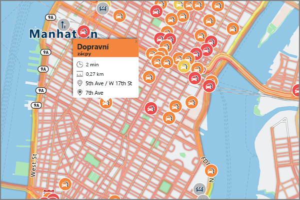

# <a name="an-introduction-to-azure-location-based-services-preview"></a>Úvod do služeb Azure Location Based Services (Preview)
Azure Location Based Services je portfolio geoprostorových služeb, mezi které patří rozhraní API pro mapy, vyhledávání, trasy, provoz a časová pásma. Portfolio služeb odpovídajících standardu Azure OneAPI umožňuje používat známé nástroje pro vývojáře k rychlému vývoji a škálování komponent, které integrují informace o poloze do vašich řešení v Azure. Azure Location Based Services poskytuje vývojářům ze všech odvětví výkonné geoprostorové funkce společně s čerstvými mapovými daty, které jsou nezbytné k zajištění geografického kontextu pro webové a mobilní aplikace. Azure Location Based Services je sada rozhraní odpovídajících standardu Azure One API doplněná o webové řízení v JavaScriptu pro zajištění snadného, flexibilního a přenositelného vývoje napříč různými médii. 

Služby Azure Location Based Services se skládají z pěti primární služeb pro podporu aplikací v Azure, které vyžadují geografický kontext. Každá ze služeb je podrobně popsána níže.

**Render Service** – Vykreslovací služba je určena vývojářům, kteří potřebují vytvářet webové a mobilní mapové aplikace. Služba nabízí buď vysoce kvalitní rastrové podklady v 19 úrovních přiblížení, nebo plně přizpůsobitelné vektorové obrazy.


**Route Service** – Služba generování tras využívá robustní výpočty na základě reálné geometrie a infrastruktury a trasy pro různé způsoby dopravy. Služba umožňuje vývojářům vypočítat trasy v několika různých režimech, např. auto, nákladní vůz, kolo nebo chůze, a také zohlednit různá další zadání, jako je aktuální provoz, omezení hmotnosti nebo doprava nebezpečných látek.


**Search Service** – Vyhledávací služba umožňuje vývojářům vyhledávat adresy, místa, výpisy firem a další podle názvu nebo kategorie a jiných zeměpisných údajů. Vyhledávací služba může také [reverzně geokódovat](https://en.wikipedia.org/wiki/Reverse_geocoding) adresy a křižovatky na základě zeměpisných souřadnic. 


**Time Zone Service** – Služba časových pásem umožňuje získávat aktuální, historické i budoucí informace související s časovými pásmy buď podle zeměpisné šířky a délky, nebo [ID organizace IANA](http://www.iana.org/). Služba časových pásem také umožňuje převod ID časových pásem Microsoft Windows na ID organizace IANA, zjištění rozdílu časového pásma od UTC a získání aktuálního času v zadaném časovém pásmu. Typická odpověď JSON na dotaz na službu časového pásma vypadá takto:

```JSON
{
    "Version": "2017c",
    "ReferenceUtcTimestamp": "2017-11-20T23:09:48.686173Z",
    "TimeZones": [{
        "Id": "America/Los_Angeles",
        "ReferenceTime": {
            "Tag": "PST",
            "StandardOffset": "-08:00:00",
            "DaylightSavings": "00:00:00",
            "WallTime": "2017-11-20T15:09:48.686173-08:00",
            "PosixTzValidYear": 2017,
            "PosixTz": "PST+8PDT,M3.2.0,M11.1.0"
        }
    }]
}
```

**Traffic Service** – Sada webových služeb určená pro vývojáře, kteří ve svých webových nebo mobilních aplikacích potřebují informace o provozu. Nabídka je rozdělená do následujících oblastí:
1. Aktuální provoz – poskytuje v reálném čase zjištěné rychlosti a doby průjezdu pro všechny klíčové silnice sítě, a 
2. Dopravní nehody – poskytuje přesné informace o zablokované dopravě a o nehodách na silniční síti.



Služby Azure Location Based Services jsou navržené pro mobilní aplikace a je možné na nich založit i víceplatformní aplikace, protože jejich programovací model je agnostický a podporuje výstup JSON prostřednictvím rozhraní REST API. Kromě toho služby Azure LBS nabízejí pohodlný javascriptový ovládací prvek mapy s jednoduchým programovacím modelem pro rychlý a snadný vývoj webových i mobilních aplikací. 

Služby Azure Location Based Services používá schéma ověřování na základě klíčů, takže přístup ke služby je otázkou přechodu na web [Azure Portal](http://portal.azure.com) a vytvoření účtu Azure Location Based Services. V účtu budou pro vás předem vygenerované dva klíče. Při zahájení integrace těchto polohových služeb do vaší aplikace můžete v požadavcích na službu Azure Location Based Services použít kterýkoli z obou klíčů.

## <a name="relationship-with-bing-maps"></a>Vztah ke službě Mapy Bing
Služby Azure Location Based Services popsané v tomto dokumentu se liší od těch, které poskytuje služba Mapy Bing.  Přestože tyto dvě služby sdílejí velmi podobné funkce, jsou rozdílné a vzájemně nesouvisejí.  Dostupnost této nové služby, která se bude spravovat samostatně, neovlivní plány nebo nabídku produktů Mapy Bing.

Cílem společnosti Microsoft je poskytnout komunitě vývojářů s ohledem na služby zjišťování polohy možnost volby.  Dál uvádíme stručné informace pro vývojáře, které služby jsou vhodné pro různé případy použití a zákaznické situace.  Upozorňujeme, že tyto informace se aktuálně vztahují na Azure LBS ve fázi Public Preview a budou se aktualizovat, jakmile tato služba v roce 2018 přejde do fáze obecné dostupnosti.

| Zákaznická kritéria | Azure Location Based Services použijte, když… | Mapy Bing použijte, když… |
| ------------- | ------------- | ------------- |
| Vývojové prostředí | Využíváte jiné služby Azure nebo v nich sestavujete | Využíváte cloud třetí strany nebo jiné vývojové prostředí |
| Vývojová fáze  | Vzhledem k tomu, že portfolio Azure LBS je aktuálně ve verzi Public Preview, je optimalizované pro vývoj testování konceptu a testování v počáteční fázi. | Pro produkční prostředí se vyžaduje smlouva SLA na podnikové úrovni. |
| Cenové možnosti | Postačují předběžné cenové možnosti pro vývojáře. | Vyžadují se individuální ceny na podnikové úrovni. |
| Prostředí pro případy použití | Vyžaduje se využití ve vozidle. | Nevyžaduje se využití ve vozidle. |
| Geografické pokrytí | Indie, Čína, Japonsko a Jižní Korea se nevyžadují. | Pokrytí pro Indii, Čínu, Japonsko a Jižní Koreu se vyžaduje. |
| Obsah map | Postačují standardní mapy povrchu. | Vyžadují se satelitní mapy, letecké mapy a obrázky ulic. |
| Základní zdroj map | Upřednostňují se mapovací data TomTom. | Upřednostňují se mapovací data HERE. |

Zaregistrujte si účet [Azure Location Based Services ještě dnes](http://aka.ms/azurelbsportal).

## <a name="next-steps"></a>Další kroky

Nyní máte přehled o službě Azure Location Based Services (Preview). Dalším krokem je vyzkoušení ukázkové aplikace demonstrující služby Location Based Services a scénář vytvoření kompletní webové aplikace.

> [!div class="nextstepaction"]
> [Spusťte ukázku interaktivního hledání v mapě s použitím Azure Location Based Services (Preview)](quick-demo-map-app.md)
> [Vyhledat okolní body zájmu pomocí Azure Location Based Services](tutorial-search-location.md)
