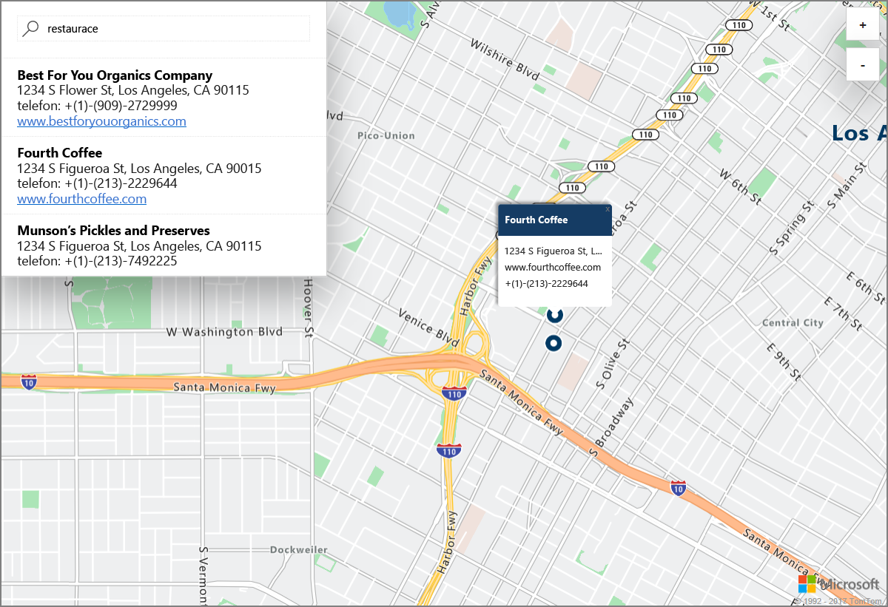

# Spuštění ukázky interaktivního hledání v mapách pomocí Azure Location Based Services (Preview)

Tento článek předvádí možnosti služeb Azure Location Based Services (Preview) nebo zkráceně LBS na příkladu interaktivního hledání s využitím map Azure. Také vás provede základními kroky k vytvoření vlastního účtu LBS a získání klíče účtu pro použití v ukázkové webové aplikaci. 

Pokud ještě nemáte předplatné Azure, vytvořte si [bezplatný účet](https://azure.microsoft.com/free/?WT.mc_id=A261C142F) před tím, než začnete.

## Přihlášení k portálu Azure Portal

Přihlaste se k portálu [Azure Portal](https://portal.azure.com/).

## Vytvoření účtu Location Based Services a získání klíče účtu

1. V levém horním rohu webu [Azure Portal](https://portal.azure.com) klikněte na **Vytvořit prostředek**.
2. Do pole *Hledat na Marketplace* zadejte **location based services**.
3. Ve *výsledcích* klikněte na **Location Based Services (Preview)**. Klikněte na tlačítko **Vytvořit**, které se zobrazí pod mapou. 
4. Na stránce **Vytvořit účet Location Based Services** zadejte *Název* nového účtu, vyberte *Předplatné*, které se má použít, a zadejte název nové nebo existující *skupiny prostředků*. Vyberte umístění pro skupinu prostředků, přijměte *Podmínky verze Preview* a klikněte na **Vytvořit**.

    

5. Po úspěšném vytvoření účtu ho otevřete a přejděte do **NASTAVENÍ** účtu. Klikněte na **Klíče** a získejte primární a sekundární klíče předplatného pro váš účet. Zkopírujte do místní schránky hodnotu **primárního klíče** pro použití v následující části. 

## Stažení ukázkové aplikace pro mapy Azure

1. Stáhněte nebo zkopírujte obsah souboru [interactiveSearch.html](https://github.com/Azure-Samples/location-based-services-samples/blob/master/src/interactiveSearch.html).
2. Uložte obsah tohoto souboru místně jako **AzureMapDemo.html** a otevřete ho v textovém editoru.
3. Vyhledejte řetězec **<insert-key>** a nahraďte ho hodnotou **primárního klíče**, kterou jste získali v předchozí části. 

## Spuštění ukázkové aplikace pro mapy Azure

1. V libovolném prohlížeči otevřete soubor **AzureMapDemo.html**.
2. Prohlédněte si zobrazenou mapu města Los Angeles. Město určuje hodnota páru `[longitude, latitude]` (zeměpisná délka a šířka) předaná do proměnné JavaScriptu s názvem **center** v souboru *AzureMapDemo.html*. Tyto souřadnice můžete změnit na libovolné jiné město. Například souřadnice města New York jsou *[-74.0060, 40.7128]*.
3. Do vyhledávacího pole v levém horním rohu ukázkové webové aplikace zadejte jakýkoli typ umístění nebo adresu, které chcete vyhledat. 
4. Najeďte myší na seznam adres a umístění, který se zobrazí pod vyhledávacím polem, a všimněte si, jak u odpovídajícího špendlíku na mapě vyskočí informace o tomto umístění. Například ukázkové spuštění této webové aplikace a vyhledání *restaurací* povede k následujícímu. Poznámka: Z důvodu zajištění ochrany soukromých podniků jsou zobrazené fiktivní názvy a adresy. 

    

## Vyčištění prostředků

Podrobný popis použití a konfigurace služeb Azure Location Based Services pro váš účet najdete v kurzech. Pokud chcete pokračovat v práci s těmito kurzy, neprovádějte čištění prostředků vytvořených v rámci tohoto rychlého startu. Pokud pokračovat nechcete, pomocí následujícího postupu odstraňte všechny prostředky vytvořené tímto rychlým startem.

1. Zavřete prohlížeč se spuštěnou webovou aplikací **AzureMapDemo.html**.
2. V nabídce vlevo na webu Azure Portal klikněte na **Všechny prostředky** a vyberte svůj účet LBS. V horní části okna **Všechny prostředky** klikněte na **Odstranit**.

## Další kroky

V tomto rychlém startu jste vytvořili svůj účet LBS a pomocí tohoto účtu jste spustili ukázkovou aplikaci. Pokud chcete zjistit, jak vytvořit vlastní aplikaci pomocí rozhraní API služeb Location Based Services, pokračujte k následujícímu kurzu.

> [!div class="nextstepaction"]
> [Kurz používání map Azure a služby Search](./tutorial-search-location.md)
