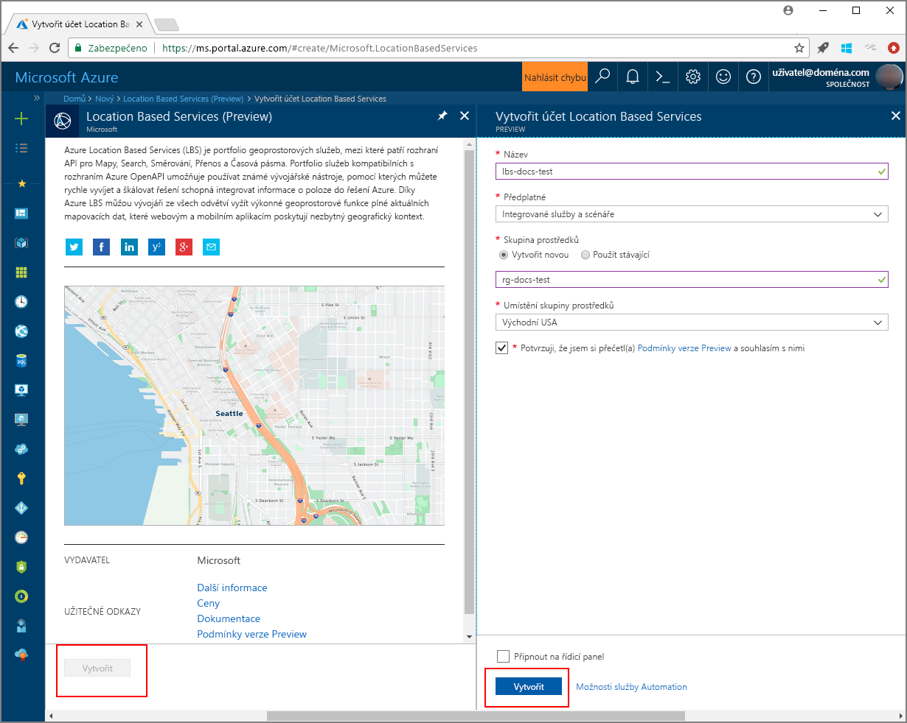

# <a name="search-nearby-points-of-interest-using-azure-location-based-services"></a>Hledání okolních bodů zájmu s použitím Azure Location Based Services

Tento kurz ukazuje, jak nastavit účet s Azure Location Based Services a pak pomocí poskytnutých rozhraní API vyhledat bod zájmu. V tomto kurzu se naučíte:

> [!div class="checklist"]
> * Vytvoření účtu s Azure Location Based Services
> * Získání primárního klíče pro váš účet Azure Location Based Services
> * Vytvoření nové webové stránky s použitím rozhraní API pro mapové ovládací prvky
> * Vyhledání okolního bodu zájmu pomocí služby Search Service

Pokud ještě nemáte předplatné Azure, vytvořte si [bezplatný účet](https://azure.microsoft.com/free/) před tím, než začnete.

## <a name="log-in-to-the-azure-portal"></a>Přihlášení k portálu Azure Portal
Přihlaste se k portálu [Azure Portal](https://portal.azure.com).

<a id="createaccount"></a>

## <a name="create-an-account-with-azure-location-based-services"></a>Vytvoření účtu s Azure Location Based Services

Pomocí následujícího postupu vytvořte nový účet Location Based Services.

1. V levém horním rohu webu [Azure Portal](https://portal.azure.com) klikněte na **Vytvořit prostředek**.
2. Do pole *Hledat na Marketplace* zadejte **location based services**.
3. Ve *výsledcích* klikněte na **Location Based Services (Preview)**. Klikněte na tlačítko **Vytvořit**, které se zobrazí pod mapou. 
4. Na stránce **Vytvořit účet Location Based Services** zadejte následující hodnoty:
    - *Název* vašeho nového účtu. 
    - *Předplatné*, které chcete pro tento účet použít.
    - Název *skupiny prostředků* pro tento účet. Můžete zvolit možnost *Vytvořit novou* nebo *Použít existující* skupinu prostředků.
    - Vyberte *Umístění skupiny prostředků*.
    - Přečtěte si *Podmínky verze Preview* a zaškrtnutím zaškrtávacího políčka tyto podmínky přijměte. 
    - Nakonec klikněte na tlačítko **Vytvořit**.
   
    


<a id="getkey"></a>

## <a name="get-the-primary-key-for-your-account"></a>Získání primárního klíče pro váš účet

Po úspěšném vytvoření účtu Location Based Services jej pomocí následujícího postupu propojte s rozhraními API pro hledání v mapách:

1. Otevřete na portálu svůj účet Location Based Services.
2. Přejděte do **NASTAVENÍ** vašeho účtu a vyberte **Klíče**.
3. Zkopírujte do schránky **Primární klíč**. Místně ho uložte, abyste ho mohli použít v následujících krocích. 

    


<a id="createmap"></a>

## <a name="create-new-web-page-using-azure-map-control-api"></a>Vytvoření nové webové stránky s použitím rozhraní API pro mapové ovládací prvky v Azure
Rozhraní API pro mapové ovládací prvky v Azure je praktická klientská knihovna, která umožňuje snadnou integraci Azure Location Based Services do webové aplikace. Skrývá složitost prostých volání služby REST a zvyšuje produktivitu díky přizpůsobitelným komponentám, které umožňují změnu stylu. Následující kroky ukazují, jak vytvořit statickou stránku HTML s vloženým rozhraním API pro mapové ovládací prvky služeb Location Based Services. 

1. Na místním počítači vytvořte nový soubor s názvem **MapSearch.html**. 
2. Přidejte do souboru následující komponenty HTML:

    ```HTML
    <!DOCTYPE html>
    <html lang="en">

    <head>
        <meta charset="utf-8" />
        <meta name="viewport" content="width=device-width, user-scalable=no" />
        <title>Map Search</title>

        <link rel="stylesheet" href="https://atlas.microsoft.com/sdk/css/atlas.min.css?api-version=1.0" type="text/css" />
        <script src="https://atlas.microsoft.com/sdk/js/atlas.min.js?api-version=1.0"></script>

        <style>
            html,
            body {
                width: 100%;
                height: 100%;
                padding: 0;
                margin: 0;
            }

            #map {
                width: 100%;
                height: 100%;
            }
        </style>
    </head>

    <body>
        <div id="map"></div>
        <script>
            // Embed Map Control JavaScript code here
        </script>
    </body>

    </html>
    ``` 
    Všimněte si, že hlavička HTML zahrnuje soubory prostředků šablon stylů CSS a JavaScriptu hostované knihovnou Ovládací prvek Mapa v Azure. Všimněte si segmentu *script* přidaného do části *body* souboru HTML. Tento segment bude obsahovat vložený kód JavaScriptu pro přístup k rozhraní API Azure Location Based Services.
 
3.  Do bloku *script* v souboru HTML přidejte následující kód JavaScriptu. Ve skriptu použijte primární klíč svého účtu Location Based Services. 

    ```JavaScript
    // Instantiate map to the div with id "map"
    var LBSAccountKey = "<_your account key_>";
    var map = new atlas.Map("map", {
        "subscription-key": LBSAccountKey
    });
    ```
    Tento segment vyvolá rozhraní API pro mapové ovládací prvky pro váš klíč účtu Azure Location Based Services. **Atlas** je obor názvů, který obsahuje rozhraní API pro mapové ovládací prvky v Azure a související vizuální komponenty. **atlas.Map** zajišťuje ovládací prvek pro vizuální a interaktivní webovou mapu. Stránku HTML můžete otevřít v prohlížeči a podívat se, jak mapa vypadá. 

4. Přidáním následujícího kódu JavaScriptu do bloku *script* přidejte do mapového ovládacího prvku vrstvu špendlíků vyhledávání:

    ```JavaScript
    // Initialize the pin layer for search results to the map
    var searchLayerName = "search-results";
    map.addPins([], {
        name: searchLayerName,
        cluster: false,
        icon: "pin-round-darkblue"
    });
    ```

5. Uložte soubor na svůj počítač. 


<a id="usesearch"></a>

## <a name="use-search-service-to-find-nearby-point-of-interest"></a>Vyhledání okolního bodu zájmu pomocí služby Search Service

Tato část ukazuje, jak pomocí rozhraní API služby Search Service v rámci Azure Location Based Services vyhledat na mapě bod zájmu. Jedná se o rozhraní RESTful API navržené pro vývojáře, kterým umožňuje hledat adresy, body zájmu a další geografické informace. Search Service přiřazuje k zadané adrese informace o zeměpisné délce a šířce. 

1. Otevřete soubor **MapSearch.html**, který jste vytvořili v předchozí části, a přidejte do bloku *script* následující kód JavaScriptu, který ilustruje použití služby Search Service. 
    ```JavaScript
    // Perform a request to the search service and create a pin on the map for each result
    var xhttp = new XMLHttpRequest();
    xhttp.onreadystatechange = function () {
        var searchPins = [];

        if (this.readyState === 4 && this.status === 200) {
            var response = JSON.parse(this.responseText);

            var poiResults = response.results.filter((result) => { return result.type === "POI" }) || [];

            searchPins = poiResults.map((poiResult) => {
                var poiPosition = [poiResult.position.lon, poiResult.position.lat];
                return new atlas.data.Feature(new atlas.data.Point(poiPosition), {
                    name: poiResult.poi.name,
                    address: poiResult.address.freeformAddress,
                    position: poiResult.position.lat + ", " + poiResult.position.lon
                });
            });

            map.addPins(searchPins, {
                name: searchLayerName
            });

            var lons = searchPins.map((pin) => { return pin.geometry.coordinates[0] });
            var lats = searchPins.map((pin) => { return pin.geometry.coordinates[1] });

            var swLon = Math.min.apply(null, lons);
            var swLat = Math.min.apply(null, lats);
            var neLon = Math.max.apply(null, lons);
            var neLat = Math.max.apply(null, lats);

            map.setCameraBounds({
                bounds: [swLon, swLat, neLon, neLat],
                padding: 50
            });
        }
    };
    ```
    Tento fragment kódu vytvoří požadavek [XMLHttpRequest](https://xhr.spec.whatwg.org/) a přidá obslužnou rutinu události pro parsování příchozí odpovědi. V případě úspěšné odpovědi shromáždí do proměnné `searchPins` informace o adresách, názvech a zeměpisné šířce a délce pro každou vrácenou polohu. Nakonec přidá tuto kolekci bodů polohy do ovládacího prvku `map` jako špendlíky. 

2. Přidejte do bloku *script* následující kód, který odešle požadavek XMLHttpRequest do služby Search Service v rámci Azure Location Based Services:

    ```JavaScript
    var url = "https://atlas.microsoft.com/search/fuzzy/json?";
    url += "&api-version=1.0";
    url += "&query=gasoline%20station";
    url += "&subscription-key=" + LBSAccountKey;
    url += "&lat=47.6292";
    url += "&lon=-122.2337";
    url += "&radius=100000";

    xhttp.open("GET", url, true);
    xhttp.send();
    ``` 
    Tento fragment kódu používá základní rozhraní API služby Search Service pro vyhledávání s názvem **Fuzzy Search**. Zpracovává většinu částečných shod vstupů a jakoukoli kombinaci adres nebo tokenů bodů zájmu (*POI*). Vyhledá nejbližší **čerpací stanici** pro zadanou adresu v příslušné zeměpisné šířce a délce a v zadaném okruhu. Pomocí primárního klíče vašeho účtu, který jste zadali dříve do ukázkového souboru, provede volání Location Based Services. Pro nalezené polohy vrátí výsledky jako páry zeměpisné šířky a délky. Stránku HTML můžete otevřít v prohlížeči a podívat se na špendlíky vyhledávání. 

3. Do bloku *script* přidejte následující řádky, které pro body zájmu vrácené službou Search Service vytvoří automaticky otevíraná okna:

    ```JavaScript
    // Add a popup to the map which will display some basic information about a search result on hover over a pin
    var popup = new atlas.Popup();
    map.addEventListener("mouseover", searchLayerName, (e) => {
        var popupContentElement = document.createElement("div");
        popupContentElement.style.padding = "5px";

        var popupNameElement = document.createElement("div");
        popupNameElement.innerText = e.features[0].properties.name;
        popupContentElement.appendChild(popupNameElement);

        var popupAddressElement = document.createElement("div");
        popupAddressElement.innerText = e.features[0].properties.address;
        popupContentElement.appendChild(popupAddressElement);

        var popupPositionElement = document.createElement("div");
        popupPositionElement.innerText = e.features[0].properties.position;
        popupContentElement.appendChild(popupPositionElement);

        popup.setPopupOptions({
            position: e.features[0].geometry.coordinates,
            content: popupContentElement
        });

        popup.open(map);
    });
    ```
    **atlas.Popup** v rozhraní API poskytuje okno s informacemi ukotvené na požadované pozici na mapě. Tento fragment kódu nastaví obsah a pozici automaticky otevíraného okna a do ovládacího prvku `map` přidá naslouchací proces událostí, který čeká na přejetí _myši_ přes automaticky otevírané okno. 

4. Uložte soubor **MapSearch.html** a pak ho otevřete ve webovém prohlížeči podle svého výběru a podívejte se na výsledek. V tuto chvíli mapa v prohlížeči při najetí myší na některý ze zobrazených špendlíků vyhledávání ukazuje automaticky otevíraná okna s informacemi, podobně jako v následujícím příkladu. 

    


## <a name="next-steps"></a>Další kroky
V tomto kurzu jste se naučili:

> [!div class="checklist"]
> * Vytvoření účtu s Azure Location Based Services
> * Získání primárního klíče pro váš účet
> * Vytvoření nové webové stránky s použitím rozhraní API pro mapové ovládací prvky
> * Vyhledání okolního bodu zájmu pomocí služby Search Service

Pokud chcete zjistit, jak pomocí Azure Location Based Services najít trasu k bodu zájmu, pokračujte ke kurzu [Trasa k bodu zájmu s použitím Azure Location Based Services](./tutorial-route-location.md). 
