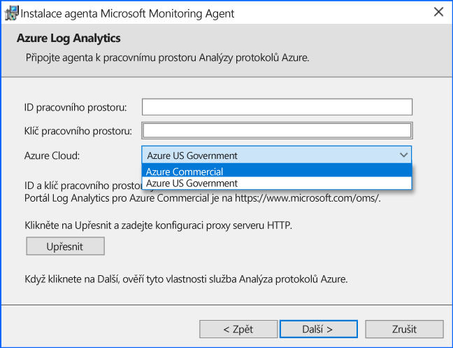
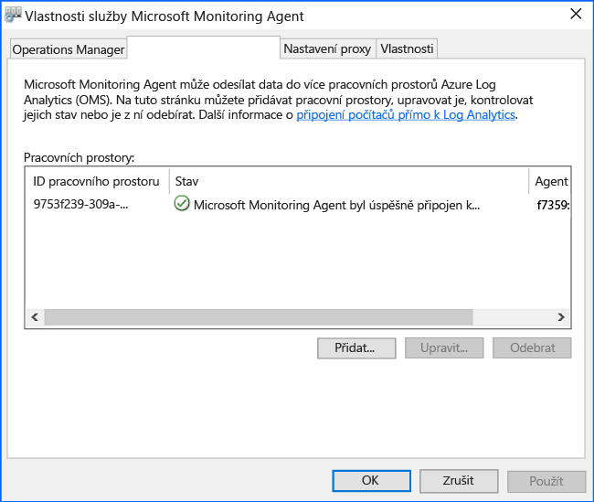

# <a name="connect-windows-computers-to-the-log-analytics-service-in-azure"></a>Připojení počítače se systémem Windows do služby analýzy protokolů Azure

Aby bylo možné sledovat a spravovat virtuální počítače nebo fyzického počítače ve vašem místním datovém centru nebo v jiném prostředí cloudu s analýzy protokolů, musíte nasadit Microsoft Monitoring Agent (MMA) a nakonfigurujte ji tak, aby odesílaly analýzy protokolů pro jeden nebo více pracovních prostorů.  Agenta podporuje i hybridní pracovní proces Runbooku role pro Azure Automation.  

Na monitorované počítače se systémem Windows je agent uveden jako služba Microsoft Monitoring Agent. Služba Microsoft Monitoring Agent shromažďuje události ze souborů protokolu a protokolu událostí systému Windows, údaje o výkonu a další telemetrií. I v případě, že agent není schopen komunikovat se službou analýzy protokolů, kterému předává sestavy, agent nadále spuštěna a shromážděná data na disk monitorovaného počítače fronty. Po obnovení připojení služby Microsoft Monitoring Agent odešle shromážděná data do služby.

Agent může být nainstalovaná pomocí jedné z následujících metod. Většina instalací použít kombinaci těchto metod k instalaci různé skupiny počítačů, podle potřeby.

* Ruční instalace. Instalační program je v počítači pomocí Průvodce instalací, z příkazového řádku spustit ručně nebo nasadit pomocí stávající nástroj pro distribuci softwaru.
* Služby Azure Automation konfigurace požadovaného stavu (DSC). Pomocí DSC ve službě Azure Automation pomocí skriptu pro počítače s Windows už nasazená ve vašem prostředí.  
* Skript prostředí PowerShell.
* Šablony Resource Manageru pro virtuální počítače běžící v Azure zásobníku Windows místní.  

Pochopit požadavky na sítě a systému nasazení agenta systému Windows, přečtěte si [shromažďovat data z prostředí s nástrojem Azure Log Analytics](log-analytics-concept-hybrid.md#prerequisites).

## <a name="obtain-workspace-id-and-key"></a>Získání ID a klíče pracovního prostoru
Před instalací Microsoft Monitoring agenta pro Windows, je nutné ID a klíč vašeho pracovního prostoru analýzy protokolů.  Tyto informace jsou nezbytné při instalaci z každé metody instalace správně nakonfigurovat agenta a zajistěte, aby že mohla úspěšně komunikovat s analýzy protokolů.  

1. Na webu Azure Portal klikněte v levém dolním rohu na **Další služby**. V seznamu prostředků zadejte **Log Analytics**. Seznam se průběžně filtruje podle zadávaného textu. Vyberte **Log Analytics**.
2. V seznamu analýzy protokolů pracovních prostorů vyberte pracovní prostor, který máte v úmyslu týkající se konfigurace agenta nahlásit.
3. Vyberte **Upřesňující nastavení**.<br><br> <br><br>  
4. Vyberte **připojené zdroje**a potom vyberte **servery Windows**.   
5. Napravo se zobrazí hodnoty **ID pracovního prostoru** a **Primární klíč**. Obě hodnoty zkopírujte a vložte do oblíbeného editoru.   
   
## <a name="install-the-agent-using-setup"></a>Instalace agenta pomocí instalačního programu
Následující kroky instalace a konfigurace agenta pro analýzy protokolů v cloudu Azure a Azure Government pomocí instalačního programu pro agenta Microsoft Monitoring Agent v počítači.  Instalační program pro agenta je součástí staženého souboru a musí být rozbalena za účelem 

1. Na **servery Windows** vyberte odpovídající **stáhnout agenta Windows** verzi ke stažení v závislosti na architektuře procesoru operačního systému Windows.
2. Spusťte instalační program pro instalaci agenta v počítači.
2. Na **úvodní** klikněte na tlačítko **Další**.
3. Na **licenční podmínky** , přečtěte si licenční a pak klikněte na tlačítko **souhlasím**.
4. Na **cílovou složku** stránky, změnit nebo ponechat výchozí instalační složku a pak klikněte na tlačítko **Další**.
5. Na **možnosti instalace agenta** vyberte připojit agenta k Azure Log Analytics (OMS) a potom klikněte na **Další**.   
6. Na **Azure Log Analytics** stránky, proveďte následující kroky:
   1. Vložení **ID pracovního prostoru** a **klíč pracovního prostoru (primární klíč)** který jste zkopírovali dříve.  Pokud počítač by měl nahlásit pracovní prostor analýzy protokolů v cloudu Azure Government, vyberte **Azure US Government** z **cloudu Azure** rozevíracího seznamu.  
   2. Pokud počítač musí komunikovat přes proxy server ke službě Analýza protokolů, klikněte na tlačítko **Upřesnit** a zadejte adresu URL a číslo portu proxy serveru.  Pokud proxy server vyžaduje ověřování, zadejte uživatelské jméno a heslo k ověření prostřednictvím proxy serveru a pak klikněte na tlačítko **Další**.  
7. Klikněte na tlačítko **Další** po dokončení poskytuje nezbytné nastavení konfigurace.<br><br> <br><br>
8. Na **připraveno k instalaci** , zkontrolujte vybrané možnosti a pak klikněte na tlačítko **nainstalovat**.
9. Na **konfigurace byla úspěšně dokončena** klikněte na tlačítko **Dokončit**.

Po dokončení **agenta Microsoft Monitoring Agent** se zobrazí v **ovládací panely**. Pokud chcete potvrdit, je generování sestav k analýze protokolů, zkontrolujte [ověřte připojení agenta k analýze protokolů](#verify-agent-connectivity-to-log-analytics). 

## <a name="install-the-agent-using-the-command-line"></a>Instalace agenta pomocí příkazového řádku
Stažený soubor pro agenta je samostatný instalační balíček vytvořen s IExpress.  Instalační program pro agenta a podpůrné soubory jsou obsažené v balíčku a potřeba extrahovat aby bylo možné správně nainstalovat pomocí příkazového řádku uvedené v následujících příkladech.  Tato metoda podporuje konfiguraci agenta tak, aby odesílaly komerční Azure a cloudu US Government.  

>[!NOTE]
>Pokud chcete provést upgrade agenta, budete muset použít analýzy protokolů skriptování rozhraní API. Podívejte se na téma [správu a údržbu agenta analýzy protokolů pro systém Windows a Linux](log-analytics-agent-manage.md) Další informace.

Následující tabulka obsahuje konkrétní parametry analýzy protokolů nepodporuje instalaci agenta, včetně při nasazení pomocí Automation DSC.

|MMA specifické možnosti                   |Poznámky         |
|---------------------------------------|--------------|
|ADD_OPINSIGHTS_WORKSPACE               | 1 = konfigurace agenta tak, aby odesílaly pracovního prostoru                |
|OPINSIGHTS_WORKSPACE_ID                | Id pracovního prostoru (guid) pro pracovní prostor pro přidání                    |
|OPINSIGHTS_WORKSPACE_KEY               | Klíč pracovního prostoru se používá k ověření původně s pracovním prostoru |
|OPINSIGHTS_WORKSPACE_AZURE_CLOUD_TYPE  | Zadejte cloudovém prostředí, kde se nachází v pracovním prostoru <br> 0 = komerční cloudu azure (výchozí) <br> 1 = azure Government |
|OPINSIGHTS_PROXY_URL               | Identifikátor URI pro proxy server používat |
|OPINSIGHTS_PROXY_USERNAME               | Uživatelské jméno pro přístup k ověřený server proxy |
|OPINSIGHTS_PROXY_PASSWORD               | Heslo pro přístup ověřený server proxy |

1. K extrakci instalačních souborů agenta z příkazového řádku se zvýšenými spustit `extract MMASetup-<platform>.exe` a zobrazí výzvu pro cestu k extrakci souborů.  Alternativně můžete zadat cestu předání argumentů `extract MMASetup-<platform>.exe /c:<Path> /t:<Path>`.  Další informace o příkazového řádku swtiches nepodporuje IExpress najdete v tématu [přepínače příkazového řádku pro IExpress](https://support.microsoft.com/help/197147/command-line-switches-for-iexpress-software-update-packages) a aktualizujte příklad podle svých potřeb.
2. Bezobslužná instalace agenta a nakonfigurovat ji tak, aby odesílaly pracovního prostoru v cloudu Azure komerční ze složky jste extrahovali instalační soubory na typ: 
   
     ```dos
    setup.exe /qn ADD_OPINSIGHTS_WORKSPACE=1 OPINSIGHTS_WORKSPACE_AZURE_CLOUD_TYPE=0 OPINSIGHTS_WORKSPACE_ID=<your workspace id> OPINSIGHTS_WORKSPACE_KEY=<your workspace key> AcceptEndUserLicenseAgreement=1
    ```

   nebo pokud chcete nastavit agenta pro sestavy do cloudu Azure US Government, zadejte: 

     ```dos
    setup.exe /qn ADD_OPINSIGHTS_WORKSPACE=1 OPINSIGHTS_WORKSPACE_AZURE_CLOUD_TYPE=1 OPINSIGHTS_WORKSPACE_ID=<your workspace id> OPINSIGHTS_WORKSPACE_KEY=<your workspace key> AcceptEndUserLicenseAgreement=1
    ```

## <a name="install-the-agent-using-dsc-in-azure-automation"></a>Instalace agenta pomocí DSC v Azure Automation.

Následující ukázkový skript můžete použít k instalaci agenta pomocí Azure Automation DSC.   Pokud nemáte účet služby Automation, přečtěte si téma [Začínáme s Azure Automation](../automation/automation-offering-get-started.md) pochopit požadavky a kroky pro vytvoření účtu Automation vyžaduje před použitím Automation DSC.  Pokud nejste obeznámeni s Automation DSC, přečtěte si [Začínáme s Automation DSC](../automation/automation-dsc-getting-started.md).

Následující příklad nainstaluje agenta nástroje 64-bit, identifikovaný `URI` hodnotu. Můžete taky 32bitová verze nahrazením hodnota identifikátoru URI. Identifikátory URI pro obě verze jsou:

- 64bitový agent Windows - https://go.microsoft.com/fwlink/?LinkId=828603
- 32bitový agent Windows - https://go.microsoft.com/fwlink/?LinkId=828604


>[!NOTE]
>Tento postup a skriptu příklad nepodporuje upgrade agenta, už nasazená na počítači se systémem Windows.

32bitové a 64bitové verze balíčku agenta mají jiným produktem kódy a vydání nové verze také mít jedinečnou hodnotu.  Kód produktu je identifikátor GUID, který slouží jako základní identifikátor aplikace nebo produktu a je reprezentována Instalační služby systému Windows **ProductCode** vlastnost.  `ProductId value` v **MMAgent.ps1** skriptu musí odpovídat kód produktu z instalačního balíčku 32bitové nebo 64bitové verze agenta.

Chcete-li načíst kód produktu z balíčku instalace agenta přímo, můžete použít Orca.exe z [Windows vývojáři sady SDK součásti pro Windows Installer](https://msdn.microsoft.com/library/windows/desktop/aa370834%27v=vs.85%28.aspx) který je součástí systému Windows Software Development Kit nebo pomocí Prostředí PowerShell následující [ukázkový skript](http://www.scconfigmgr.com/2014/08/22/how-to-get-msi-file-information-with-powershell/) napsané pomocí Microsoft cenné Professional (MVP).

1. Import xPSDesiredStateConfiguration DSC modulu z [http://www.powershellgallery.com/packages/xPSDesiredStateConfiguration](http://www.powershellgallery.com/packages/xPSDesiredStateConfiguration) do Azure Automation.  
2.  Vytvoření proměnných assetů Azure Automation pro *OPSINSIGHTS_WS_ID* a *OPSINSIGHTS_WS_KEY*. Nastavit *OPSINSIGHTS_WS_ID* ID pracovního prostoru analýzy protokolů a sadu *OPSINSIGHTS_WS_KEY* na primární klíč pracovního prostoru.
3.  Zkopírujte skript a uložte ho jako MMAgent.ps1

    ```PowerShell
    Configuration MMAgent
    {
        $OIPackageLocalPath = "C:\Deploy\MMASetup-AMD64.exe"
        $OPSINSIGHTS_WS_ID = Get-AutomationVariable -Name "OPSINSIGHTS_WS_ID"
        $OPSINSIGHTS_WS_KEY = Get-AutomationVariable -Name "OPSINSIGHTS_WS_KEY"

        Import-DscResource -ModuleName xPSDesiredStateConfiguration

        Node OMSnode {
            Service OIService
            {
                Name = "HealthService"
                State = "Running"
                DependsOn = "[Package]OI"
            }

            xRemoteFile OIPackage {
                Uri = "https://go.microsoft.com/fwlink/?LinkId=828603"
                DestinationPath = $OIPackageLocalPath
            }

            Package OI {
                Ensure = "Present"
                Path  = $OIPackageLocalPath
                Name = "Microsoft Monitoring Agent"
                ProductId = "8A7F2C51-4C7D-4BFD-9014-91D11F24AAE2"
                Arguments = '/C:Deploy"setup.exe /qn ADD_OPINSIGHTS_WORKSPACE=1 OPINSIGHTS_WORKSPACE_ID=' + $OPSINSIGHTS_WS_ID + ' OPINSIGHTS_WORKSPACE_KEY=' + $OPSINSIGHTS_WS_KEY + ' AcceptEndUserLicenseAgreement=1"'
                DependsOn = "[xRemoteFile]OIPackage"
            }
        }
    }

    ```

4. [Importovat konfigurační skript MMAgent.ps1](../automation/automation-dsc-getting-started.md#importing-a-configuration-into-azure-automation) do vašeho účtu Automation. 
5. [Počítač se systémem Windows nebo uzel přidělit](../automation/automation-dsc-getting-started.md#onboarding-an-azure-vm-for-management-with-azure-automation-dsc) ke konfiguraci. Během 15 minut uzlu zkontroluje konfiguraci a agenta vložena do uzlu.

## <a name="verify-agent-connectivity-to-log-analytics"></a>Ověřte připojení agenta k analýze protokolů

Po dokončení instalaltion agenta ověřování se úspěšně připojil a vytváření sestav můžete provést dvěma způsoby.  

Z počítače v **ovládací panely**, vyhledá položku **agenta Microsoft Monitoring Agent**.  Vyberte ho a na **Azure Log Analytics (OMS)** kartě agenta by se měl zobrazit zpráva s oznámením: **Microsoft Monitoring Agent úspěšně připojil ke službě Microsoft Operations Management Suite.**<br><br> 

Hledání jednoduchého protokolů můžete také provést na portálu Azure.  

1. Na webu Azure Portal klikněte v levém dolním rohu na **Další služby**. V seznamu prostředků zadejte **Log Analytics**. Seznam se průběžně filtruje podle zadávaného textu. Vyberte **Log Analytics**.  
2. Na stránce pracovní prostor analýzy protokolů vyberte cílový pracovní prostor a pak vyberte **hledání protokolů** dlaždici. 
2. V podokně hledání protokolů v poli typu dotazu:  

    ```
    search * 
    | where Type == "Heartbeat" 
    | where Category == "Direct Agent" 
    | where TimeGenerated > ago(30m)  
    ```

Ve výsledcích vyhledávání vrátí měli byste vidět záznamy prezenčního signálu pro počítač, což značí, že je připojený a vytváření sestav ke službě.   

## <a name="next-steps"></a>Další kroky

Zkontrolujte [správu a údržbu agenta analýzy protokolů pro systém Windows a Linux](log-analytics-agent-manage.md) Další informace o tom, jak Správa agenta během životního cyklu nasazení na vašich počítačích.  