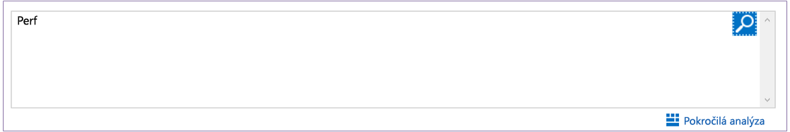

# Shromažďování dat o virtuálních počítačích Azure
[Azure Log Analytics](log-analytics-overview.md) může shromažďovat data přímo z virtuálních počítačů Azure a dalších prostředků ve vašem prostředí do jednoho úložiště pro účely podrobných analýz a korelace.  Tento rychlý start ukazuje, jak v několik snadných krocích nakonfigurovat virtuální počítače Azure s Linuxem nebo Windows a shromažďovat z nich data.  
 
Tento rychlý start předpokládá, že máte existující virtuální počítač Azure. Pokud ne, můžete [vytvořit virtuální počítač s Windows](../virtual-machines/windows/quick-create-portal.md) nebo [vytvořit virtuální počítač s Linuxem](../virtual-machines/linux/quick-create-cli.md) podle našich rychlých startů pro virtuální počítače.

## Přihlášení k webu Azure Portal
Přihlaste se k webu Azure Portal na adrese [https://portal.azure.com](https://portal.azure.com). 

## Vytvoření pracovního prostoru
1. Na webu Azure Portal klikněte v levém dolním rohu na **Další služby**. V seznamu prostředků zadejte **Log Analytics**. Seznam se průběžně filtruje podle zadávaného textu. Vyberte **Log Analytics**.     
2. Klikněte na **Vytvořit** a podle potřeby změňte hodnoty následujících položek:

  * Zadejte název nového **pracovního prostoru OMS**, například *DefaultLAWorkspace*. 
  * Vyberte **předplatné**, které má být cílem propojení, výběrem z rozevíracího seznamu, pokud výchozí vybrané předplatné není vhodné.
  * Jako **skupinu prostředků** vyberte existující skupinu prostředků, která obsahuje jeden nebo několik virtuálních počítačů Azure.  
  * Vyberte **Umístění**, do kterého jsou vaše virtuální počítače nasazené.  Další informace najdete na stránce uvádějící [oblasti, ve kterých je dostupná služba Log Analytics](https://azure.microsoft.com/regions/services/).
  * V Log Analytics si můžete vybrat mezi třemi různými **cenovými úrovněmi**, ale pro účely tohoto rychlého startu vyberete úroveň **Free**.  Další informace o jednotlivých úrovních najdete v [podrobnostech o cenách Log Analytics](https://azure.microsoft.com/pricing/details/log-analytics/).

           
3. Po zadání požadovaných informací v podokně **Pracovní prostor OMS** klikněte na **OK**.  

Během ověřování informací a vytváření pracovního prostoru můžete průběh zpracování sledovat prostřednictvím položky nabídky **Oznámení**. 

## Povolení rozšíření Log Analytics pro virtuální počítače
Pro virtuální počítače s Windows a Linuxem, které už jsou nasazené v Azure, můžete agenta Log Analytics nainstalovat pomocí rozšíření Log Analytics pro virtuální počítače.  Použití rozšíření zjednodušuje proces instalace a automaticky agenta nakonfiguruje pro odesílání dat do pracovního prostoru Log Analytics, který zadáte. Agent se také automaticky upgraduje a tím zajišťuje, abyste měli nejnovější funkce a opravy.

>[!NOTE]
>Agenta OMS pro Linux není možné nakonfigurovat tak, aby se hlásil více než jednomu pracovnímu prostoru Log Analytics. 

Pokud jste vytvořili pracovní prostor v cloudu Azure Government, v horní části stránky prostředku Log Analytics na portálu si můžete všimnout banneru vybízejícího k upgradu.  Pro účely tohoto rychlého startu upgrade není potřeba. 

.    
1. Na webu Azure Portal klikněte v levém dolním rohu na **Další služby**. V seznamu prostředků zadejte **Log Analytics**. Seznam se průběžně filtruje podle zadávaného textu. Vyberte **Log Analytics**.
2. V seznamu pracovních prostorů Log Analytics vyberte *DefaultLAWorkspace* vytvořený dříve.
3. V nabídce vlevo v části Zdroje dat pracovního prostoru klikněte na **Virtuální počítače**.  
4. V seznamu **virtuálních počítačů** vyberte virtuální počítač, na který chcete nainstalovat agenta. Všimněte si, že **Stav připojení OMS** pro tento virtuální počítač uvádí **Nepřipojeno**.
5. V podrobnostech pro váš virtuální počítač vyberte **Připojit**. Automaticky se nainstaluje a nakonfiguruje agent pro váš pracovní prostor Log Analytics. Tento proces trvá několik minut, během kterých **Stav** hlásí **Připojování**.
6. Po instalaci a připojení agenta se **Stav připojení OMS** aktualizuje na **Tento pracovní prostor**.

## Shromažďování dat o událostech a výkonu
Log Analytics může shromažďovat události z protokolů událostí Windows nebo protokolu Syslog v Linuxu a z čítačů výkonu, které určíte pro dlouhodobější analýzu a generování sestav, a provést akci při zjištění konkrétní podmínky.  Postupujte podle těchto kroků a pro začátek nakonfigurujte shromažďování událostí ze systémového protokolu Windows a protokolu Syslog v Linuxu a několika běžných čítačů výkonu.  

### Shromažďování dat z virtuálního počítače s Windows
1. Vyberte **Upřesňující nastavení**.    
3. Vyberte **Data** a pak vyberte **Protokoly událostí systému Windows**.  
4. Protokol událostí přidáte zadáním názvu protokolu.  Zadejte **Systém** a klikněte na symbol plus **+**.  
5. V tabulce zaškrtněte závažnosti **Chyby** a **Upozornění**.   
6. Uložte konfiguraci kliknutím na **Uložit** v horní části stránky.
7. Výběrem **Data o výkonu systému Windows** povolte shromažďování čítačů výkonu na počítači s Windows. 
8. Při první konfiguraci čítačů výkonu Windows pro nový pracovní prostor Log Analytics máte možnost rychle vytvořit několik běžných čítačů. Jsou zobrazené v seznamu a vedle každého je zaškrtávací políčko.    Klikněte na **Přidat vybrané čítače výkonu**.  Čítače se přidají a přednastaví s použitím ukázkového desetisekundového intervalu shromažďování.  
9. Uložte konfiguraci kliknutím na **Uložit** v horní části stránky.

### Shromažďování dat z virtuálního počítače s Linuxem

1. Vyberte **Syslog**.  
2. Protokol událostí přidáte zadáním názvu protokolu.  Zadejte **Syslog** a klikněte na symbol plus **+**.  
3. V tabulce zrušte zaškrtnutí závažností **Informace**, **Oznámení** a **Ladění**. 
4. Uložte konfiguraci kliknutím na **Uložit** v horní části stránky.
5. Výběrem **Data o výkonu systému Linux** povolte shromažďování čítačů výkonu na počítači s Linuxem. 
6. Při první konfiguraci linuxových čítačů výkonu pro nový pracovní prostor Log Analytics máte možnost rychle vytvořit několik běžných čítačů. Jsou zobrazené v seznamu a vedle každého je zaškrtávací políčko.    Klikněte na **Přidat vybrané čítače výkonu**.  Čítače se přidají a přednastaví s použitím ukázkového desetisekundového intervalu shromažďování.  
7. Uložte konfiguraci kliknutím na **Uložit** v horní části stránky.

## Zobrazení shromážděných dat
Teď, když jste povolili shromažďování dat, můžete spustit příklad jednoduchého prohledávání protokolu a zobrazit nějaká data z cílových virtuálních počítačů.  

1. Na webu Azure Portal přejděte do Log Analytics a vyberte pracovní prostor vytvořený dříve.
2. Klikněte na dlaždici **Prohledávání protokolu**, v podokně Prohledávání protokolu zadejte do pole dotazu `Perf` a stiskněte Enter nebo klikněte na tlačítko Vyhledat napravo od pole dotazu.    

   >[!NOTE]
   >Pokud je váš pracovní prostor vytvořený v cloudu Azure Government, použijete dotaz `Type=Perf`.  
   >

Například dotaz na následujícím obrázku vrátil 78 000 záznamů o výkonu.  Vašich výsledků bude výrazně méně.  

## Vyčištění prostředků
Až už pracovní prostor Log Analytics nebudete potřebovat, odstraňte ho. Provedete to výběrem pracovního prostoru Log Analytics, který jste vytvořili dříve, a kliknutím na **Odstranit** na stránce prostředku.  

## Další kroky
Teď, když shromažďujete data o provozu a výkonu z virtuálních počítačů s Windows nebo Linuxem, můžete jednoduše a *zdarma* začít zkoumat a analyzovat shromážděná data a provádět na jejich základě akce.  

Pokud chcete zjistit, jak zobrazit a analyzovat data, pokračujte k následujícímu kurzu.   

> [!div class="nextstepaction"]
> [Zobrazení nebo analýza dat v Log Analytics](log-analytics-tutorial-viewdata.md)
