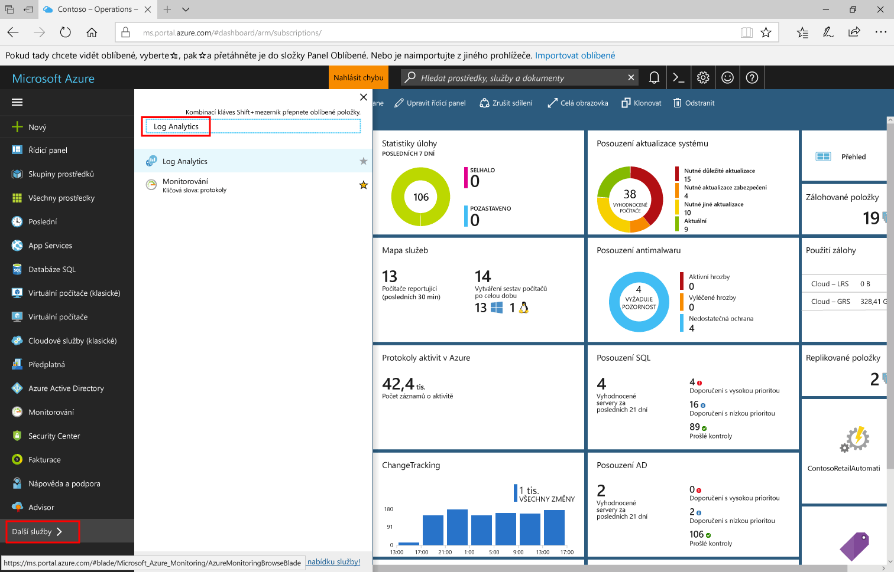
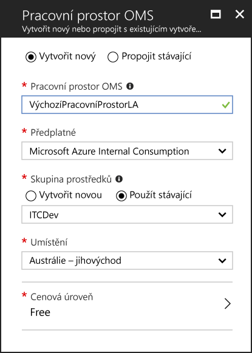
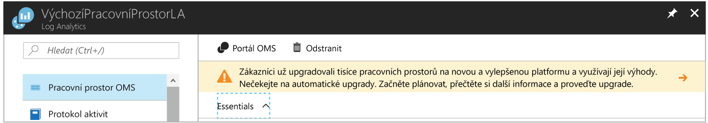
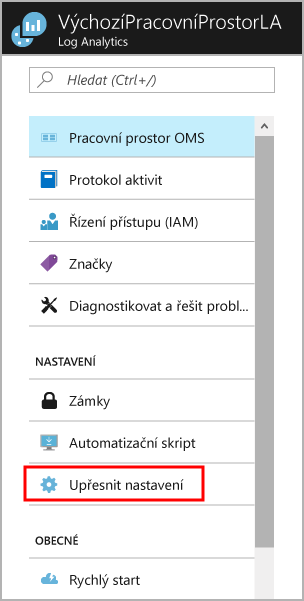
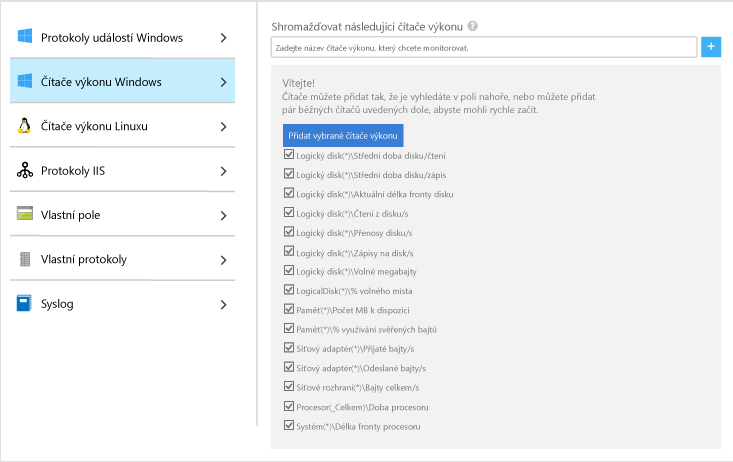
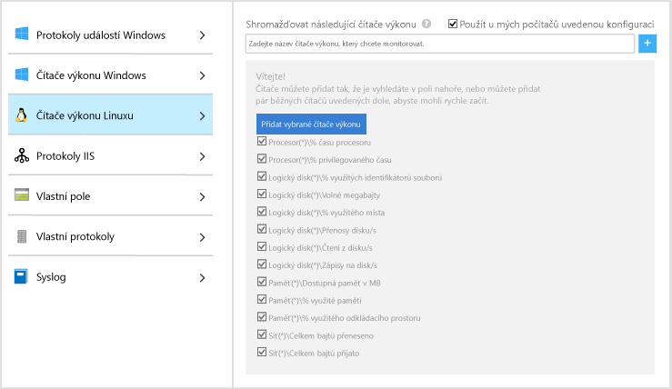
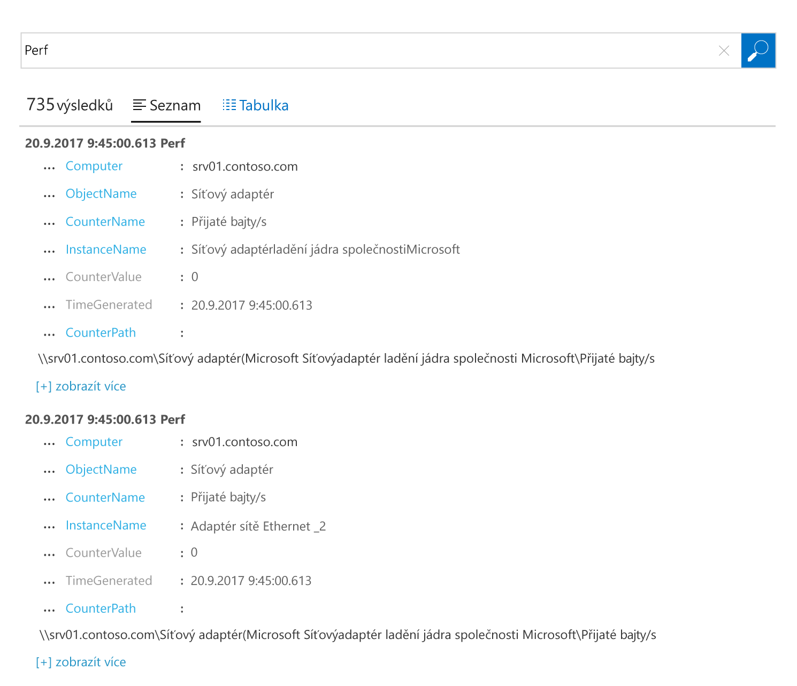
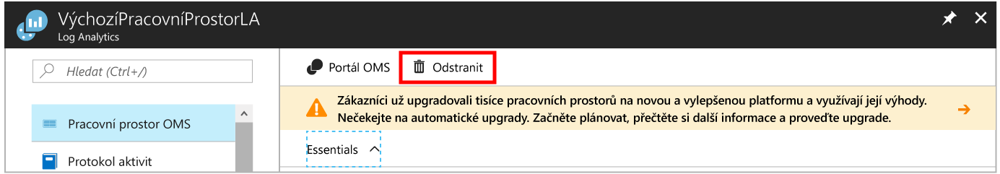

# Shromažďování dat o virtuálních počítačích Azure
[Azure Log Analytics](log-analytics-overview.md) shromažďovat data přímo z virtuálních počítačů Azure a dalším prostředkům ve vašem prostředí do jednoho úložiště pro podrobné analýzy a korelace.  Tento rychlý start se dozvíte, jak nakonfigurovat a shromažďovat data z virtuálních počítačů Windows nebo Azure Linux s několika jednoduchými kroky.  
 
Tento rychlý start předpokládá, že máte existující virtuální počítač Azure. Pokud není možné [vytvoření virtuálního počítače s Windows](../virtual-machines/windows/quick-create-portal.md) nebo [vytvoření virtuálního počítače s Linuxem](../virtual-machines/linux/quick-create-cli.md) následující naše – elementy QuickStart virtuálních počítačů.

## Přihlaste se k portálu Azure
Přihlaste se k portálu Azure v [https://portal.azure.com](https://portal.azure.com). 

## Vytvoření pracovního prostoru
1. Na portálu Azure klikněte na tlačítko **další služby** v levém dolním nalezen. V seznamu prostředků zadejte **Log Analytics**. Seznam se průběžně filtruje podle zadávaného textu. Vyberte **protokolu analýzy**.     
2. Klikněte na tlačítko **vytvořit**a potom vyberte možnosti pro následující položky:

  * Zadejte název nové **pracovním prostorem OMS**, jako například *DefaultLAWorkspace*. 
  * Vyberte **předplatné**, které má být cílem propojení, výběrem z rozevíracího seznamu, pokud výchozí vybrané předplatné není vhodné.
  * Pro **skupiny prostředků**, vyberte existující skupinu prostředků, který obsahuje jeden nebo více virtuálních počítačích Azure.  
  * Vyberte **umístění** nasazených virtuálních počítačů.  Další informace najdete v tématu který [analýzy protokolů je k dispozici v oblastech](https://azure.microsoft.com/regions/services/).
  * Můžete zvolit ze tří různých **cenové úrovně** v analýzy protokolů, ale pro tento rychlý start, chcete-li vybrat **volné** vrstvy.  Další informace o konkrétní úrovních najdete v tématu [podrobnosti o cenách na Log Analytics](https://azure.microsoft.com/pricing/details/log-analytics/).

           
3. Po zadání požadovaných informací na **pracovním prostorem OMS** podokně klikněte na tlačítko **OK**.  

Během ověřování informací a vytváření pracovního prostoru můžete průběh zpracování sledovat prostřednictvím položky nabídky **Oznámení**. 

## Povolit rozšíření virtuálního počítače analýzy protokolů
Pro systém Windows a Linux virtuální počítače nasazené v Azure nainstalujte agenta analýzy protokolů s příponou Log Analytics virtuálních počítačů.  Pomocí rozšíření zjednodušuje proces instalace a automaticky nakonfiguruje agenta k odesílání dat do pracovního prostoru analýzy protokolů, který určíte. Agent je také automaticky aktualizovány, zajistíte, že máte nejnovější funkce a opravy.

Můžete si všimnout hlavičky v horní části stránky na portálu můžete upgradovat pozvání prostředků analýzy protokolů.  Upgrade není potřeba pro účely tento rychlý start. 

.    
1. Na portálu Azure klikněte na tlačítko **další služby** v levém dolním nalezen. V seznamu prostředků zadejte **Log Analytics**. Seznam se průběžně filtruje podle zadávaného textu. Vyberte **protokolu analýzy**.
2. V seznamu analýzy protokolů pracovních prostorů, vyberte *DefaultLAWorkspace* vytvořili dříve.
3. V levé nabídce v části pracovní prostor datových zdrojů, klikněte na tlačítko **virtuální počítače**.  
4. V seznamu **virtuální počítače**, vyberte virtuální počítač, který chcete nainstalovat agenta na. Všimněte si, že **stav připojení OMS** pro virtuální počítač naznačuje, že je **Nepřipojeno**.
5. V podrobnostech pro virtuální počítač, vyberte **Connect**. Agent je automaticky nainstalovat a nakonfigurovat pro pracovní prostor analýzy protokolů. Tento proces trvat několik minut, během které doby **stav** je **připojení**.
6. Po dokončení instalace a připojit agenta, **stav připojení OMS** bude aktualizována **tento pracovní prostor**.

## Shromáždit data události a výkonu
Analýzy protokolů můžete shromažďovat události z protokolů událostí systému Windows nebo Linux Syslog a čítače výkonu, které zadáte pro delší období analýzu a vytváření sestav a provést akci, když je zjištěna určitá podmínka.  Postupujte podle těchto kroků nakonfigurujete začínat shromažďování událostí z protokolu systému Windows a Linux Syslog a několik běžných čítačů výkonu.  

### Shromažďování dat z virtuálního počítače Windows
1. Vyberte **upřesňující nastavení**.    
3. Vyberte **Data**a potom vyberte **protokoly událostí systému Windows**.  
4. Protokol událostí přidáte zadáním názvu do protokolu.  Typ **systému** a klikněte na symbol plus  **+** .  
5. V tabulce, zkontrolujte závažnosti **chyba** a **upozornění**.   
6. Klikněte na tlačítko **Uložit** v horní části stránky a uložte konfiguraci.
7. Vyberte **Data výkonu Windows** jak povolit kolekce čítače výkonu v počítači se systémem Windows. 
8. Při první konfiguraci čítače výkonu systému Windows pro nový pracovní prostor analýzy protokolů, budete mít možnost rychle vytvořit několik běžných čítačů. Jsou uvedeny s zaškrtávací políčko vedle každého.  .  Klikněte na tlačítko **přidat vybrané čítače výkonu**.  Jsou přidány a předvolby s ukázkového intervalu deset druhé kolekci.  
9. Klikněte na tlačítko **Uložit** v horní části stránky a uložte konfiguraci.

### Shromažďování dat z virtuálního počítače s Linuxem

1. Vyberte **Syslog**.  
2. Protokol událostí přidáte zadáním názvu do protokolu.  Typ **Syslog** a klikněte na symbol plus  **+** .  
3. V tabulce, zrušte zaškrtnutí políčka závažnosti **informace**, **oznámení** a **ladění**. 
4. Klikněte na tlačítko **Uložit** v horní části stránky a uložte konfiguraci.
5. Vyberte **údaje o výkonu Linux** jak povolit kolekce čítače výkonu v počítači se systémem Windows. 
6. Při první konfiguraci čítače výkonu Linux pro nový pracovní prostor analýzy protokolů, budete mít možnost rychle vytvořit několik běžných čítačů. Jsou uvedeny s zaškrtávací políčko vedle každého.  .  Klikněte na tlačítko **přidat vybrané čítače výkonu**.  Jsou přidány a předvolby s ukázkového intervalu deset druhé kolekci.  
7. Klikněte na tlačítko **Uložit** v horní části stránky a uložte konfiguraci.

## Zobrazení data shromážděná
Teď, když povolíte shromažďování dat, umožňuje spustit v příkladu jednoduché protokolu hledání se zobrazí některá data z cílového virtuálních počítačů.  

1. Na portálu Azure přejděte k analýze protokolů a vyberte pracovní prostor vytvořili dříve.
2. Klikněte na tlačítko **hledání protokolů** dlaždici a v podokně hledání protokolů v dotazu pole typu `Type=Perf` a potom stiskněte klávesu enter nebo klikněte na tlačítko vyhledávání napravo od pole dotazu.    Dotaz na následujícím obrázku například vrátil 78,000 výkonu záznamy.  Výsledky budou výrazně méně.  

## Vyčištění prostředků
Pokud již nepotřebujete, odstraňte pracovní prostor analýzy protokolů. To pokud chcete udělat, vyberte pracovní prostor analýzy protokolů, které jste vytvořili dříve a na stránce prostředků, klikněte na tlačítko **odstranit**.  

## Další kroky
Teď, když shromažďujete provozní a údaje o výkonu z virtuálních počítačů Windows nebo Linux, můžete snadno začít zkoumat, analýze a pořízení akce na data, která shromáždíte pro *volné*.  

Informace o tom můžete zobrazit a analyzovat data, i nadále tento kurz.   

> [!div class="nextstepaction"]
> [Zobrazit a analyzovat data v analýzy protokolů](log-analytics-tutorial-viewdata.md)
