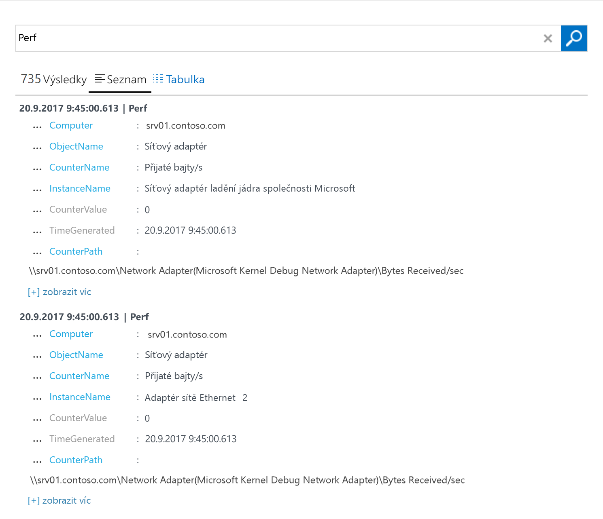

# Shromažďování dat z počítače se systémem Windows hostované ve vašem prostředí
[Azure Log Analytics](log-analytics-overview.md) shromažďovat data přímo z vašeho fyzický nebo virtuální počítače se systémem Windows a další prostředky ve vašem prostředí do jednoho úložiště pro podrobné analýzy a korelace.  Tento rychlý start se dozvíte, jak nakonfigurovat a shromažďovat data z počítače systému Windows s několika jednoduchými kroky.  Pro virtuální počítače Windows Azure, naleznete v následujícím tématu [shromažďovat data o virtuálních počítačích Azure](log-analytics-quick-collect-azurevm.md).  
 
Pokud ještě nemáte předplatné Azure, vytvořte si [bezplatný účet](https://azure.microsoft.com/free/?WT.mc_id=A261C142F) před tím, než začnete.

## Přihlaste se k portálu Azure
Přihlaste se k portálu Azure v [https://portal.azure.com](https://portal.azure.com). 

## Vytvoření pracovního prostoru
1. Na portálu Azure klikněte na tlačítko **další služby** v levém dolním nalezen. V seznamu prostředků zadejte **Log Analytics**. Seznam se průběžně filtruje podle zadávaného textu. Vyberte **protokolu analýzy**.       
2. Klikněte na tlačítko **vytvořit**a potom vyberte možnosti pro následující položky:

  * Zadejte název nové **pracovním prostorem OMS**, jako například *DefaultLAWorkspace*. 
  * Vyberte **předplatné**, které má být cílem propojení, výběrem z rozevíracího seznamu, pokud výchozí vybrané předplatné není vhodné.
  * Pro **skupiny prostředků**, vyberte existující skupinu prostředků, který obsahuje jeden nebo více virtuálních počítačích Azure.  
  * Vyberte **umístění** nasazených virtuálních počítačů.  Další informace najdete v tématu který [analýzy protokolů je k dispozici v oblastech](https://azure.microsoft.com/regions/services/).
  * Můžete zvolit ze tří různých **cenové úrovně** v analýzy protokolů, ale pro tento rychlý start, chcete-li vybrat **volné** vrstvy.  Další informace o konkrétní úrovních najdete v tématu [podrobnosti o cenách na Log Analytics](https://azure.microsoft.com/pricing/details/log-analytics/).

           
3. Po zadání požadovaných informací na **pracovním prostorem OMS** podokně klikněte na tlačítko **OK**.  

Během ověřování informací a vytváření pracovního prostoru můžete průběh zpracování sledovat prostřednictvím položky nabídky **Oznámení**. 

## Získání ID a klíč
Před instalací Microsoft Monitoring agenta pro Windows, je nutné ID a klíč vašeho pracovního prostoru analýzy protokolů.  Tyto informace se vyžadují instalačního průvodce správně nakonfigurovat agenta a zajistěte, aby že mohla úspěšně komunikovat s analýzy protokolů.  

1. Na portálu Azure klikněte na tlačítko **další služby** v levém dolním nalezen. V seznamu prostředků zadejte **Log Analytics**. Seznam se průběžně filtruje podle zadávaného textu. Vyberte **protokolu analýzy**.
2. V seznamu analýzy protokolů pracovních prostorů, vyberte *DefaultLAWorkspace* vytvořili dříve.
3. Vyberte **upřesňující nastavení**.       
4. Vyberte **připojené zdroje**a potom vyberte **servery Windows**.   
5. Hodnota napravo od **ID pracovního prostoru** a **primární klíč**. Zkopírujte a vložte do vašeho oblíbeného editoru.   

## Nainstalujte agenta pro Windows
Následující kroky instalace a konfigurace agenta pro analýzy protokolů v cloudu Azure a Azure Government pomocí instalačního programu pro agenta Microsoft Monitoring Agent v počítači.  

1. Na **servery Windows** vyberte odpovídající **stáhnout agenta Windows** verzi ke stažení v závislosti na architektuře procesoru operačního systému Windows.
2. Spusťte instalační program pro instalaci agenta v počítači.
2. Na **úvodní** klikněte na tlačítko **Další**.
3. Na **licenční podmínky** , přečtěte si licenční a pak klikněte na tlačítko **souhlasím**.
4. Na **cílovou složku** stránky, změnit nebo ponechat výchozí instalační složku a pak klikněte na tlačítko **Další**.
5. Na **možnosti instalace agenta** vyberte připojit agenta k Azure Log Analytics (OMS) a potom klikněte na **Další**.   
6. Na **Azure Log Analytics** stránky, proveďte následující kroky:
   1. Vložení **ID pracovního prostoru** a **klíč pracovního prostoru (primární klíč)** který jste zkopírovali dříve.  Pokud počítač by měl nahlásit pracovní prostor analýzy protokolů v cloudu Azure Government, vyberte **Azure US Government** z **cloudu Azure** rozevíracího seznamu.  
   2. Pokud počítač musí komunikovat přes proxy server ke službě Analýza protokolů, klikněte na tlačítko **Upřesnit** a zadejte adresu URL a číslo portu proxy serveru.  Pokud proxy server vyžaduje ověřování, zadejte uživatelské jméno a heslo k ověření prostřednictvím proxy serveru a pak klikněte na tlačítko **Další**.  
7. Klikněte na tlačítko **Další** po dokončení poskytuje nezbytné nastavení konfigurace.     
8. Na **připraveno k instalaci** , zkontrolujte vybrané možnosti a pak klikněte na tlačítko **nainstalovat**.
9. Na **konfigurace byla úspěšně dokončena** klikněte na tlačítko **Dokončit**.

Po dokončení **agenta Microsoft Monitoring Agent** se zobrazí v **ovládací panely**. Můžete zkontrolovat konfiguraci a ověřte, zda agent je připojena k analýze protokolů. Při připojení na **Azure Log Analytics (OMS)** agenta na kartě zobrazí zpráva s oznámením: **Microsoft Monitoring Agent úspěšně připojil ke službě Microsoft Operations Management Suite.**   

## Shromáždit data události a výkonu
Analýzy protokolů můžete shromažďovat události z protokolu událostí systému Windows a čítače výkonu, které zadáte pro delší období analýzu a vytváření sestav a provést akci, když je zjištěna určitá podmínka.  Postupujte podle těchto kroků nakonfigurujete začínat shromažďování událostí z protokolu událostí systému Windows a několik běžných čítačů výkonu.  

1. Na portálu Azure klikněte na tlačítko **další služby** v levém dolním nalezen. V seznamu prostředků zadejte **Log Analytics**. Seznam se průběžně filtruje podle zadávaného textu. Vyberte **protokolu analýzy**.
2. Vyberte **upřesňující nastavení**.      
3. Vyberte **Data**a potom vyberte **protokoly událostí systému Windows**.  
4. Protokol událostí přidáte zadáním názvu do protokolu.  Typ **systému** a klikněte na symbol plus  **+** .  
5. V tabulce, zkontrolujte závažnosti **chyba** a **upozornění**.   
6. Klikněte na tlačítko **Uložit** v horní části stránky a uložte konfiguraci.
7. Vyberte **Data výkonu Windows** jak povolit kolekce čítače výkonu v počítači se systémem Windows. 
8. Při první konfiguraci čítače výkonu systému Windows pro nový pracovní prostor analýzy protokolů, budete mít možnost rychle vytvořit několik běžných čítačů. Jsou uvedeny s zaškrtávací políčko vedle každého.  .  Klikněte na tlačítko **přidat vybrané čítače výkonu**.  Jsou přidány a předvolby s ukázkového intervalu deset druhé kolekci.  
9. Klikněte na tlačítko **Uložit** v horní části stránky a uložte konfiguraci.

## Zobrazení data shromážděná
Teď, když povolíte shromažďování dat, umožňuje spustit v příkladu jednoduché protokolu hledání se zobrazí některá data z cílového počítače.  

1. Na portálu Azure v části vybraný pracovní prostor, klikněte **hledání protokolů** dlaždici.  
2. V podokně hledání protokolů v dotazu pole typu `Perf` a potom stiskněte klávesu enter nebo klikněte na tlačítko vyhledávání napravo od pole dotazu.      Dotaz na následujícím obrázku například vrátil 735 záznamy výkonu.   

## Vyčištění prostředků
Pokud již nepotřebujete, můžete odebrat agenta z počítače se systémem Windows a odstranit pracovní prostor analýzy protokolů.  

Odebrat agenta, proveďte následující kroky.

1. Otevřete **Ovládací panely**.
2. Otevřete **programy a funkce**.
3. V **programy a funkce**, vyberte **agenta Microsoft Monitoring Agent** a klikněte na tlačítko **odinstalovat**.

Chcete-li odstranit pracovní prostor, vyberte pracovní prostor analýzy protokolů, které jste vytvořili dříve a na stránce prostředků, klikněte na tlačítko **odstranit**.   

## Další kroky
Teď, když shromažďujete provozní a údaje o výkonu z vašeho počítače Linux místně, můžete snadno začít zkoumat, analýze a pořízení akce na data, která shromáždíte pro *volné*.  

Informace o tom můžete zobrazit a analyzovat data, i nadále tento kurz.   

> [!div class="nextstepaction"]
> [Zobrazit a analyzovat data v analýzy protokolů](log-analytics-tutorial-viewdata.md)
