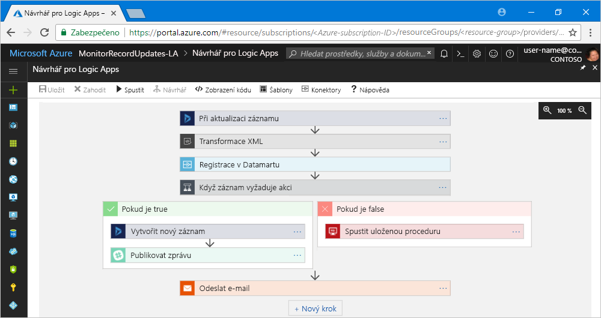

# Co je služba Azure Logic Apps?

[Logic Apps](https://azure.microsoft.com/services/logic-apps) pomáhá vytvářet, plánovat a automatizovat procesy jako [pracovní postupy](#logic-app-concepts), takže můžete integrovat aplikace, data, systémy a služby napříč podniky a organizacemi. Logic Apps zjednodušuje návrh a tvorbu škálovatelných řešení pro integraci aplikací, integraci dat, systémovou integraci, integraci podnikových aplikací (EAI) a komunikaci B2B, ať už v cloudu, místním prostředí nebo v obou.

Tady je například pouze několik úloh, které můžete pomocí aplikací logiky automatizovat:

* Objednávky procesů a tras napříč místními systémy a cloudovými službami.
* Přesun nahraných souborů ze serveru FTP do služby Azure Storage. 
* Monitorování výskytu konkrétního tématu ve tweetech, analýza mínění a vytváření upozornění na položky, které vyžadují kontrolu.

Při vytváření řešení integrace pomocí aplikací logiky si můžete vybrat z rozrůstající se galerie [přibližně 200 integrovaných konektorů](../connectors/apis-list.md), například pro SQL Database, služby Azure, Office 365, Salesforce, Google a další. Tyto [konektory](#logic-app-concepts) poskytují [triggery](#logic-app-concepts), [akce](#logic-app-concepts) nebo obojí pro vytváření aplikací logiky, které bezpečně přistupují k datům a zpracovávají je v reálném čase.

> [!VIDEO https://channel9.msdn.com/Blogs/Azure/Introducing-Azure-Logic-Apps/player]

## Jako Logic Apps funguje? 

Každý pracovní postup aplikace logiky se spouští triggerem, který se aktivuje při určité události nebo když nová dostupná data splní určitá kritéria. Řada triggerů obsahuje základní schopnosti plánování, takže můžete určit, jak často se vaše úlohy spouští. V případě dalších vlastních scénářů plánování můžete pracovní postup spustit pomocí triggeru plánovače. Další informace o [vytváření pracovních postupů založených na plánu](../logic-apps/tutorial-build-schedule-recurring-logic-app-workflow.md).

Pokaždé, když se trigger aktivuje, vytvoří modul Logic Apps instanci aplikace logiky, ve které se spustí akce pracovního postupu. Tyto akce můžou zahrnovat také konverze dat a ovládací prvky toků, jako jsou podmíněné příkazy, příkazy přepínače, smyčky a větvení. Například tato aplikace logiky se spouští triggerem Dynamics 365 s integrovaným kritériem Při aktualizaci záznamu. Pokud trigger rozpozná událost, která splňuje toto kritérium, aktivuje se a spustí akce pracovního postupu. V tomto případě mezi tyto akce patří transformace XML, aktualizace dat, větvení rozhodování a e-mailová oznámení.

Aplikace logiky můžete vytvářet vizuálně pomocí Návrháře pro Logic Apps, který je k dispozici v prohlížeči na webu Azure Portal a v sadě Visual Studio. V případě dalších vlastních aplikací logiky můžete vytvářet nebo upravovat definice aplikací logiky ve formátu JSON (JavaScript Object Notation) při práci v režimu Zobrazení kódu. Pro vybrané úlohy můžete použít také příkazy Azure PowerShellu a šablony Azure Resource Manageru. Aplikace logiky se nasazují a spouštění v cloudu Azure. Podrobnější informace najdete v tomto videu: [Použití služeb Azure pro podnikovou integraci k provozu cloudových aplikací ve velkém měřítku](https://channel9.msdn.com/Events/Connect/2017/T119/).

## Proč používat Azure Logic Apps?

S tím, jak se firmy přesouvají směrem k digitalizaci, pomáhají aplikace logiky snadněji a rychleji propojovat starší, moderní i ty nejmodernější systémy díky tomu, že poskytují předem připravená rozhraní API v podobě konektorů spravovaných Microsoftem. Díky tomu se můžete zaměřit na obchodní logiku a funkce vašich aplikací. Nemusíte se starat o vytváření, hostování, škálování, správu, údržbu ani monitorování svých aplikací. Logic Apps se o to postará za vás. Navíc platíte jenom za to, co využijete, podle [cenového modelu](../logic-apps/logic-apps-pricing.md) založeného na spotřebě. 

V řadě případů nebudete muset psát žádný kód. Pokud však nějaký kód napsat musíte, pomocí [Azure Functions](../azure-functions/functions-overview.md) můžete vytvářet fragmenty kódu a v aplikacích logiky spouštět tento kód na vyžádání. Navíc pokud vaše aplikace logiky potřebují interagovat s událostmi ze služeb Azure, vlastních aplikací nebo řešení třetích stran, můžete ve svých aplikacích logiky použít [Azure Event Grid](../event-grid/overview.md) zajišťující monitorování, směrování a publikování.

Logic Apps, Functions a Event Grid jsou plně spravované Microsoft Azure, takže nemusíte mít obavy o vytváření, hostování, škálování, správu, monitorování ani údržbu svých řešení. Díky možnosti vytvářet [aplikace a řešení bez serveru](../logic-apps/logic-apps-serverless-overview.md) se můžete zaměřit pouze na obchodní logiku. Tyto služby se automaticky škálují s ohledem na vaše požadavky, zrychlují integrace a pomáhají vytvářet robustní cloudové aplikace s minimem kódu. Navíc platíte jenom za to, co využijete, podle [cenového modelu](../logic-apps/logic-apps-pricing.md) založeného na spotřebě. 

Pokud chcete zjistit, jak společnosti díky kombinaci Logic Apps s dalšími službami Azure a produkty Microsoftu zlepšily svou flexibilitu a zvýšili zaměření na hlavní obchodní aktivity, přečtěte si tyto [příběhy zákazníků](https://aka.ms/logic-apps-customer-stories).

Tady jsou další podrobnosti o schopnostech a výhodách, které vám Logic Apps přinese:

* **Vizuální vytváření pracovních postupů pomocí snadno použitelných nástrojů**

  Šetřete čas a zjednodušte složité procesy pomocí nástrojů pro vizuální návrh. 
  Vytvářejte aplikace logiky můžete od začátku do konce pomocí Návrháře pro Logic Apps, a to v prohlížeči na webu Azure Portal nebo v sadě Visual Studio. Spouštějte pracovní postupy pomocí triggerů a přidejte jakýkoli počet akcí z [galerie konektorů](../connectors/apis-list.md).

* **Rychlejší začátek díky šablonám aplikací logiky**

  Vytvářejte běžně používaná řešení rychleji díky možnosti výběru předdefinovaných pracovních postupů z [galerie šablon](../logic-apps/logic-apps-create-logic-apps-from-templates.md). 
  Šablony jsou v rozsahu od jednoduché možnosti připojení pro aplikace typu software jako služba (SaaS) až po pokročilá řešení B2B a šablony jen pro zábavu. Zjistěte, jak [vytvářet aplikace logiky z předem připravených šablon](../logic-apps/logic-apps-create-logic-apps-from-templates.md).

* **Propojení různorodých systémů napříč různými prostředími**

  Některé vzory a pracovní postupy je snadné popsat, ale složité implementovat v kódu. 
  Aplikace logiky pomáhají bezproblémově propojit různorodé systémy napříč místním a cloudovým prostředím. Můžete například propojit cloudové marketingové řešení s místním fakturačním systémem nebo pomocí služby Service Bus úrovně Enterprise centralizovat zasílání zpráv napříč rozhraními API a systémy. Aplikace logiky poskytují rychlý, spolehlivý a konzistentní způsob doručování znovupoužitelných a znovu konfigurovatelných řešení pro tyto scénáře.

* **Prvotřídní podpora podnikové integrace a scénářů B2B**

  Podniky a organizace mezi sebou elektronicky komunikují s využitím standardních, ale rozdílných protokolů a formátů zpráv, jako jsou EDIFACT, AS2 a X12. 
  S využitím funkcí v sadě [Enterprise Integration Pack (EIP)](../logic-apps/logic-apps-enterprise-integration-overview.md) můžete vytvářet aplikace logiky transformující formáty zpráv, které používají vaši partneři, na formáty, které dokážou interpretovat a zpracovat systémy vaší organizace. Aplikace logiky tyto výměny zpracovávají plynule a zabezpečeně díky šifrování a digitálním podpisům.

  Začněte v malém se svými stávajícími systémy a službami a rozšiřujte se vlastním tempem. Jakmile budete připraveni, Logic Apps a EIP vám díky zajištění nejen těchto schopností pomůžou implementovat a vertikálně navýšit kapacitu na vyspělejší scénáře integrace:

  * Sestavení z těchto produktů a služeb: 
    * [Microsoft BizTalk Server](https://docs.microsoft.com/biztalk/core/introducing-biztalk-server) 
    * [API Management](../api-management/api-management-key-concepts.md) 
    * [Azure Functions](../azure-functions/functions-overview.md) 
    * [Azure Service Bus](../service-bus-messaging/service-bus-messaging-overview.md)
  * Zpracování [zpráv XML](../logic-apps/logic-apps-enterprise-integration-xml.md)
  * Zpracování [plochých souborů](../logic-apps/logic-apps-enterprise-integration-flatfile.md)
  * Výměna zpráv s využitím protokolů [EDIFACT](../logic-apps/logic-apps-enterprise-integration-edifact.md), [AS2](../logic-apps/logic-apps-enterprise-integration-as2.md) a [X12](../logic-apps/logic-apps-enterprise-integration-x12.md)
  * Ukládání a správa těchto artefaktů B2B a dalších na jednom místě díky [účtům integrace](../logic-apps/logic-apps-enterprise-integration-accounts.md):
    * [Partneři](../logic-apps/logic-apps-enterprise-integration-partners.md)
    * [Smlouvy](../logic-apps/logic-apps-enterprise-integration-agreements.md) 
    * [Mapy pro transformaci XML](../logic-apps/logic-apps-enterprise-integration-maps.md)
    * [Schémata pro ověřování XML](../logic-apps/logic-apps-enterprise-integration-schemas.md)

* **Časté používání jednou napsaného kódu**

  Vytvářejte aplikace logiky jako šablony, abyste [své aplikace mohli nasazovat a znovu konfigurovat](../logic-apps/logic-apps-create-deploy-template.md) napříč různými prostředími a oblastmi.

* **Integrovaná rozšiřitelnost**

  Pokud nenajdete požadovaný konektor nebo potřebujete spouštět vlastní kód, můžete aplikace logiky rozšířit vytvořením a voláním vlastních fragmentů kódu na vyžádání prostřednictvím služby [Azure Functions](../azure-functions/functions-overview.md). 
  Vytvářejte vlastní rozhraní [API](../logic-apps/logic-apps-create-api-app.md) a [vlastní konektory](../logic-apps/custom-connector-overview.md), které můžete volat z aplikací logiky.

* **Platíte jenom za to, co využijete**
  
  Pokud nemáte aplikace logiky vytvořené dříve s plány služby App Service, Logic Apps používá [ceny a měření](../logic-apps/logic-apps-pricing.md) založené na spotřebě.

Další informace o Logic Apps najdete v těchto úvodních videích:
* [Integrace s Logic Apps – Ze začátečníka profesionálem](https://channel9.msdn.com/Events/Build/2017/C9R17)
* [Podniková integrace s Microsoft Azure Logic Apps](https://channel9.msdn.com/Events/Ignite/Microsoft-Ignite-Orlando-2017/BRK2188)
* [Vytváření pokročilých obchodních procesů pomocí Logic Apps](https://channel9.msdn.com/Events/Ignite/Microsoft-Ignite-Orlando-2017/BRK3179)

## Klíčové pojmy

* **Pracovní postup:** Vizualizace, návrh, tvorba, automatizace a nasazování obchodních procesů jako série kroků.

* **Spravované konektory:** Aplikace logiky potřebují přístup k datům, službám a systémům. Můžete použít předem připravené konektory spravované Microsoftem, které jsou navržení pro připojení, přístup a práci s vašimi daty. Viz [Konektory pro Azure Logic Apps](../connectors/apis-list.md)

* **Triggery:** Řada konektorů spravovaných Microsoftem poskytuje triggery, které se aktivují, když událost nebo nová data splní zadané podmínky. Událostí může být například přijetí e-mailu nebo detekce změn v účtu služby Azure Storage. Pokaždé, když se trigger aktivuje, vytvoří modul Logic Apps novou instanci aplikace logiky, ve které se spustí pracovní postup.

* **Akce:** Akce jsou všechny kroky, které se stanou po aktivaci triggeru. Každá akce se obvykle mapuje na operaci definovanou spravovaným konektorem, vlastním rozhraním API nebo vlastním konektorem.

* **Enterprise Integration Pack:** Logic Apps zahrnuje možnosti z BizTalk Serveru a nabízí tak pokročilejší scénáře integrace. Enterprise Integration Pack poskytuje konektory, které aplikacím logiky pomáhají snadno provádět ověřování, transformaci a další operace.

## Jak se liší Logic Apps od Functions, WebJobs a Flow?

Všechny tyto služby pomáhají spojit a vzájemně propojit různorodé systémy. Každá služba má své výhody, takže nejlepším způsobem, jak rychle vytvořit škálovatelný a plně vybavený systém integrace, je kombinace jejich schopnosti. Další informace najdete v tématu [Výběr mezi službami Flow, Logic Apps, Functions a WebJobs](../azure-functions/functions-compare-logic-apps-ms-flow-webjobs.md).

## Začínáme 

Logic Apps je jednou z mnoha služeb hostovaných v Microsoft Azure. Takže než začnete, potřebujete předplatné Azure. Pokud předplatné nemáte, <a href="https://azure.microsoft.com/free/" target="_blank">zaregistrujte si bezplatný účet Azure</a>. 

Pokud máte předplatné Azure, vyzkoušejte tento [rychlý start k vytvoření první aplikace logiky](../logic-apps/quickstart-create-first-logic-app-workflow.md), která prostřednictvím informačního kanálu RSS monitoruje nový obsah na webu a odesílá e-mail, když se objeví nový obsah.

## Podpora a zpětná vazba

* Pokud máte dotazy, navštivte [fórum Azure Logic Apps](https://social.msdn.microsoft.com/Forums/en-US/home?forum=azurelogicapps).
* Pokud chcete zanechat své nápady na funkce nebo hlasovat, navštivte [web zpětné vazby od uživatelů Logic Apps](http://aka.ms/logicapps-wish).

## Další kroky

* [Kontrola provozu s využitím aplikace logiky založené na plánu](../logic-apps/tutorial-build-schedule-recurring-logic-app-workflow.md)
* Další informace o [řešeních bez serveru s využitím Azure](../logic-apps/logic-apps-serverless-overview.md)
* Další informace o [integraci B2B pomocí sady Enterprise Integration Pack](../logic-apps/logic-apps-enterprise-integration-overview.md)