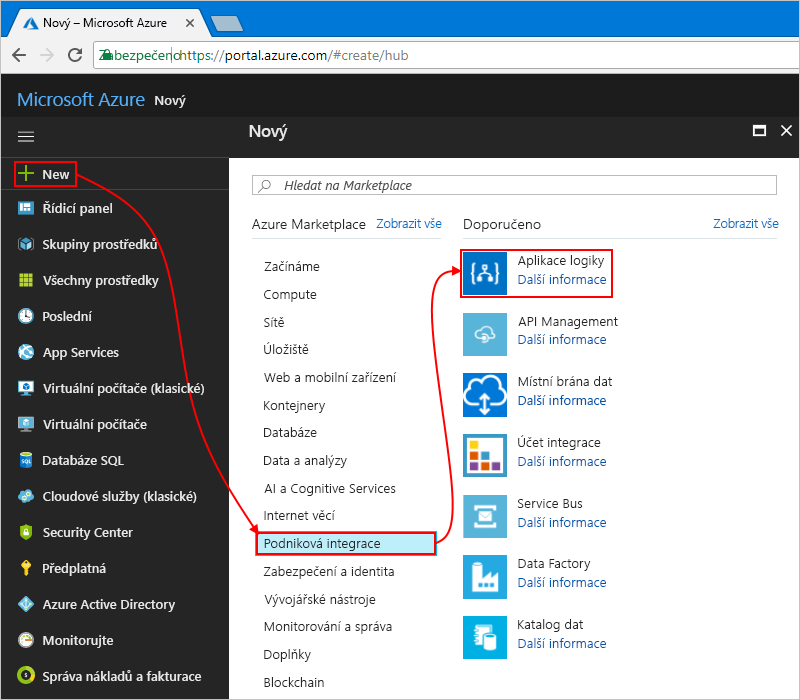

# <a name="manage-mailing-list-requests-with-a-logic-app"></a>Správa seznamu adresátů požadavky aplikace logiky

Aplikace logiky Azure umožňuje automatizovat pracovní postupy a integrovat data mezi službami Azure, služby společnosti Microsoft, další aplikace software jako služba (SaaS) a místních systémů. Tento kurz ukazuje, jak můžete vytvořit [aplikace logiky](../logic-apps/logic-apps-overview.md) která zpracovává požadavky předplatné na seznamu adresátů spravuje [MailChimp](https://mailchimp.com/) služby.
Tato aplikace logiky monitoruje e-mailový účet pro tyto požadavky, odešle tyto požadavky pro schválení a přidá do seznamu adresátů schválení členové.

V tomto kurzu se naučíte:

> [!div class="checklist"]
> * Vytvoření prázdné aplikace logiky
> * Přidejte aktivační událost, která monitoruje e-mailů pro žádostí o odběr.
> * Přidáte akci, která odešle e-mailů pro schválení nebo odmítnutí tyto požadavky.
> * Přidejte podmínku, která kontroluje odpověď na schválení.
> * Přidáte akci, která se přidá do seznamu adresátů schválení členové.
> * Přidejte podmínku, která kontroluje, zda tito členové se úspěšně připojila k seznamu.
> * Přidáte akci, která odešle e-mailů potvrzení, zda tito členové se úspěšně připojila k seznamu.

Když jste hotovi, vypadá svou aplikaci logiky tento pracovní postup na vysoké úrovni:


Pokud ještě nemáte předplatné Azure, <a href="https://azure.microsoft.com/free/" target="_blank">zaregistrujte si bezplatný účet Azure</a> před tím, než začnete.

## <a name="prerequisites"></a>Požadavky

* Účet Mailchimpu. Vytvoří seznam s názvem "test členy ML" kde aplikace logiky můžete přidat e-mailové adresy pro schválení členové. Pokud nemáte účet, [si zaregistrovat bezplatný účet](https://login.mailchimp.com/signup/) a další [jak můžete vytvořit seznam](https://us17.admin.mailchimp.com/lists/#). 

* E-mailový účet s Office 365 Outlook nebo Outlook.com, kteří podporují schválení pracovních postupů. Tento článek používá Office 365 Outlook. Pokud používáte jinou e-mailový účet, obecné kroky zůstaly stejné, ale uživatelské rozhraní se může objevit mírně lišit.

## <a name="sign-in-to-the-azure-portal"></a>Přihlášení k webu Azure Portal

Přihlaste se k <a href="https://portal.azure.com" target="_blank">portál Azure</a> pomocí svých přihlašovacích údajů účtu Azure.

## <a name="create-your-logic-app"></a>Vytvoření aplikace logiky

1. V hlavní nabídce Azure zvolte **Nový** > **Podniková integrace** > **Aplikace logiky**.

   

2. V části **vytvořit aplikaci logiky**, zadejte tyto informace o aplikaci logiky jako uvedené a popsané. Až budete hotovi, zvolte **Připnout na řídicí panel** > **Vytvořit**.

   

   | Nastavení | Hodnota | Popis | 
   | ------- | ----- | ----------- | 
   | **Název** | LA MailingList | Název pro svou aplikaci logiky | 
   | **Předplatné** | <*your-Azure-subscription-name*> | Název pro vaše předplatné Azure | 
   | **Skupina prostředků** | LA-MailingList-RG | Název [skupina prostředků Azure](../azure-resource-manager/resource-group-overview.md) sloužící k organizování související informační zdroje | 
   | **Umístění** | Východní USA 2 | Oblast kam se mají ukládat informace o aplikaci logiky | 
   | **Log Analytics** | Vypnuto | Zachovat **vypnout** nastavení pro protokolování diagnostiky. | 
   |||| 

3. Po Azure nasadí vaší aplikace, Návrhář aplikace logiky otevře a zobrazuje stránku s video úvod a šablony pro obecné vzory aplikace logiky. V části **Šablony** zvolte **Prázdná aplikace logiky**.

   

Dál přidejte [aktivační událost](../logic-apps/logic-apps-overview.md#logic-app-concepts) který naslouchá pro příchozí e-maily s žádostí o odběr.
Všechny aplikace logiky musí začínat aktivační událost, která se stane, aktivuje se při určité události, nebo když nová data splňuje určité podmínky. Další informace najdete v tématu [vytvoření první aplikace logiky](../logic-apps/quickstart-create-first-logic-app-workflow.md).

## <a name="add-trigger-to-monitor-emails"></a>Přidat aktivační události k monitorování e-mailů

1. V designeru zadejte do vyhledávacího pole "když e-mail přijde". Vyberte aktivační událost pro váš poskytovatel e-mailu:  **< *vaše e-mailu zprostředkovatele*> – při doručení nových e-mailů**
   
   

   * Pro pracovní nebo školní účty Azure vyberte Office 365 Outlook.
   * Pro osobní účty Microsoft vyberte Outlook.com.

2. Pokud budete vyzváni k zadání pověření, přihlaste se k e-mailového účtu tak, aby aplikace logiky můžete vytvořit připojení k e-mailový účet.

3. Nyní zadejte kritéria, která kontroluje, aktivační události ve všech nových e-mailů.

   1. Zadejte složku, intervalu a četnost kontroly e-mailů.

      

      | Nastavení | Hodnota | Popis | 
      | ------- | ----- | ----------- | 
      | **Složka** | Doručená pošta | E-mailové složky k monitorování | 
      | **Interval** | 1 | Počet intervalů čekat mezi kontrolami | 
      | **Frekvence** | Hodina | Jednotka času pro každý interval mezi kontroluje  | 
      |  |  |  | 

   2. Zvolte **zobrazit rozšířené možnosti**. V **subjektu filtru** zadejte tento text pro aktivační událost najít v předmětu e-mailu:```subscribe-test-members-ML```

      

4. Skrýt podrobnosti aktivační události pro nyní, klikněte na záhlaví aktivační události.

   

5. Uložte svou aplikaci logiky. Na panelu nástrojů návrháře zvolte **Uložit**.

   Aplikace logiky je teď za provozu, ale nic se neděje než zkontrolujte příchozích e-mailu. 
   Ano přidáte akci, která odpovědí, pokud aktivuje aktivační událost.

## <a name="send-approval-email"></a>Poslat e-mail se schválením

Teď, když máte aktivační událost, přidejte [akce](../logic-apps/logic-apps-overview.md#logic-app-concepts) , odešle e-mail s schválit nebo odmítnout žádosti. 

1. V části aktivační událost, zvolte **+ nový krok** > **přidat akci**. Vyhledejte "schválení" a vyberte tuto akci:  **< *vaše e-mailu zprostředkovatele*>-odeslání e-mailu schválení**

   

2. Zadejte informace pro tuto akci jako uvedené a popisuje: 

   

   | Nastavení | Hodnota | Popis | 
   | ------- | ----- | ----------- | 
   | **Komu** | <*approver-email-address*> | Jeho e-mailovou adresu. Pro účely testování můžete použít vlastní adresu. | 
   | **Možnosti uživatele** | Schválit, Zamítnout | Možnosti odpovědi, které můžete vybrat schvalovatele. Ve výchozím nastavení, můžete zvolit schvalovatel buď "schválit" nebo "Odmítnout" jako odpovědi. | 
   | **Předmět** | Schválit žádost člena pro testovací. Členové ML | Předmět popisný e-mailu | 
   |  |  |  | 

   Prozatím ignorujte dynamického obsahu seznam nebo seznam vložených parametrů, které se zobrazí po kliknutí na tlačítko uvnitř konkrétní úpravy polí. 
   Tento seznam umožňuje vybrat parametry z předchozí akce, které můžete použít jako vstupy do svého pracovního postupu. 
   Váš prohlížeč šířka Určuje, které se zobrazí. 
 
4. Uložte svou aplikaci logiky.

Dál přidejte podmínku pro kontrolu jeho zvolené odpovědi.

## <a name="check-approval-response"></a>Zkontrolujte odpověď na žádost

1. V části **odeslání e-mailu schválení** akce, zvolte **+ nový krok** > **přidat podmínku**.

   Obrazec podmínky se zobrazí spolu se všechny dostupné parametry, které můžete použít jako vstup do pracovního postupu. 

2. Přejmenujte podmínku s lepší popis.

   1. V záhlaví podmínka, zvolte **výpustky** (**...** ) tlačítko > **přejmenovat**.

      Například, pokud je váš prohlížeč v úzké zobrazení:

      

      Pokud váš prohlížeč je v široké zobrazení a bloky obsahu seznamu dynamických přístup k se třemi tečkami, zavřete seznamu tak, že zvolíte **přidávat dynamický obsah** uvnitř podmínku.

   2. Přejmenujte vaše podmínky se tento popis:```If request approved```

3. Sestavení podmínku, která kontroluje, zda je zaškrtnuto schvalovatel **schválit**:

   1. V podmínce, klikněte na tlačítko uvnitř **zvolte hodnotu** pole, která se nachází na levé straně (zobrazení široké prohlížeče) nebo v horní (zobrazení úzké prohlížeče).
   Ze seznamu parametrů nebo dynamického obsahu seznamu, vyberte **SelectedOption** pole v části **odeslání e-mailu schválení**.

      Například pokud pracujete v zobrazení široké, vaše podmínky vypadá v tomto příkladu:

      

   2. V rozevíracím seznamu operátor porovnání, vyberte tento operátor: **je rovno**

   3. V pravém (wide zobrazení) nebo dolní (úzké zobrazení) **zvolte hodnotu** zadejte tuto hodnotu:```Approve```

      Když jste hotovi, vaše podmínky vypadá v tomto příkladu:

      

4. Uložte svou aplikaci logiky.

Potom zadejte akci, která aplikaci logiky provede při kontrolorovi schvalovat žádosti. 

## <a name="add-member-to-mailchimp-list"></a>Přidat člena do seznamu MailChimp

Nyní přidáte akci, která se přidá do vašeho seznamu schválených člena.

1. Uvnitř podmínka **v případě hodnoty true** větev, zvolte **přidat akci**.
Vyhledejte "mailchimp" a vyberte tuto akci: **MailChimp – přidání člena do seznamu**

   

3. Pokud budete vyzváni k přihlášení k účtu MailChimp, přihlaste se pomocí přihlašovacích údajů Mailchimpu.

4. Zadejte informace pro tuto akci jako uvedené a popsané tady:

   

   | Nastavení | Hodnota | Popis | 
   | ------- | ----- | ----------- | 
   | **Seznam Id** | Test členy ML | Název seznamu adresátů MailChimp | 
   | **Stav** | předplatné | Stav odběru pro nového člena. Další informace najdete v tématu <a href="https://developer.mailchimp.com/documentation/mailchimp/guides/manage-subscribers-with-the-mailchimp-api/" target="_blank">spravovat odběratelé s rozhraním API MailChimp</a>. | 
   | **E-mailová adresa** | <*new-member-email-address*> | Z seznam parametrů nebo dynamického obsahu seznamu, vyberte **z** pod **při přijetí nové e-maily**, která předá v e-mailová adresa pro nového člena. 
   |  |  |  | 

5. Uložte svou aplikaci logiky.

Abyste mohli zkontrolovat, zda nový člen se úspěšně připojila k seznamu adresátů dále přidejte podmínku. Tímto způsobem svou aplikaci logiky vás upozorní, zda tato operace úspěšná nebo neúspěšná.

## <a name="check-for-success-or-failure"></a>Zkontrolujte úspěch nebo neúspěch

1. V **v případě hodnoty true** větev, v části **přidat člena do seznamu** akce, zvolte **více...**   >  **Přidat podmínku**.

2. Přejmenujte podmínky se tento popis:```If add member succeeded```

3. Sestavení podmínku, která kontroluje, zda schválené člen úspěšná nebo neúspěšná v seznamu adresátů připojení:

   1. V podmínce, klikněte na tlačítko uvnitř **zvolte hodnotu** pole, která se nachází na levé straně (zobrazení široké prohlížeče) nebo v horní (zobrazení úzké prohlížeče).
   Ze seznamu parametrů nebo dynamického obsahu seznamu, vyberte **stav** pole v části **přidat člena do seznamu**.

      Například pokud pracujete v zobrazení široké, vaše podmínky vypadá v tomto příkladu:

      

   2. V rozevíracím seznamu operátor porovnání, vyberte tento operátor: **je rovno**

   3. V pravém (wide zobrazení) nebo dolní (úzké zobrazení) **zvolte hodnotu** zadejte tuto hodnotu:```subscribed```

   Když jste hotovi, vaše podmínky vypadá v tomto příkladu:

   

Potom si nastavte e-maily odesílat v případě schválené člen úspěšná nebo neúspěšná v seznamu adresátů připojení.

## <a name="send-email-if-member-added"></a>Odesílání e-mailů, pokud člen přidán

1. V **v případě hodnoty true** větve pro podmínku **-li přidat členů proběhlo úspěšně**, zvolte **přidat akci**.

   

2. Vyhledejte "odesílání outlook e-mailu" a vyberte tuto akci:  **< *vaše e-mailu zprostředkovatele*>-Odeslat e-mail**

   

3. Akce s Tento popis přejmenujte:```Send email on success```

4. Zadejte informace pro tuto akci jako uvedené a popisuje:

   

   | Nastavení | Hodnota | Popis | 
   | ------- | ----- | ----------- | 
   | **Komu** | <*your-email-address*> | E-mailovou adresu, kam můžete odesílat e-mailu, úspěch. Pro účely testování můžete použít svou vlastní e-mailovou adresu. | 
   | **Předmět** | <*subject-for-success-email*> | Předmět e-mailu úspěch. V tomto kurzu, zadejte tento text a vyberte pole zadané v části **přidat člena do seznamu** z seznam parametrů nebo seznamu dynamických obsahu: <p>"Success! Člen přidat do 'test členy ML': **e-mailovou adresu**" | 
   | **Text** | <*body-for-success-email*> | Obsah textu pro úspěch e-mailu. V tomto kurzu, zadejte tento text a vyberte zadaná pole v části **přidat člena do seznamu** z seznam parametrů nebo seznamu dynamických obsahu:  <p>"Nový člen připojil 'test členy ML': **e-mailovou adresu**"</br>"Člen stavu potvrzení podpory: **stav**" | 
   | | | | 

5. Uložte svou aplikaci logiky.

## <a name="send-email-if-member-not-added"></a>Odesílání e-mailů, pokud člen nebyl přidán.

1. V **když má hodnotu false** větve pro podmínku **-li přidat členů proběhlo úspěšně**, zvolte **přidat akci**.

   

2. Vyhledejte "odesílání outlook e-mailu" a vyberte tuto akci:  **< *vaše e-mailu zprostředkovatele*>-Odeslat e-mail**

   

3. Akce s Tento popis přejmenujte:```Send email on failure```

4. Zadejte informace pro tuto akci jako uvedené a popsané tady:

   

   | Nastavení | Hodnota | Popis | 
   | ------- | ----- | ----------- | 
   | **Komu** | <*your-email-address*> | E-mailovou adresu, kam můžete odeslat e-mail o selhání. Pro účely testování můžete použít svou vlastní e-mailovou adresu. | 
   | **Předmět** | <*subject-for-failure-email*> | Předmět e-mailu selhání. V tomto kurzu, zadejte tento text a vyberte pole zadané v části **přidat člena do seznamu** z seznam parametrů nebo seznamu dynamických obsahu: <p>"Se nezdařilo, člen není přidán do 'test členy ML': **e-mailovou adresu**" | 
   | **Text** | <*body-for-failure-email*> | Obsah textu e-mailu selhání. V tomto kurzu zadejte tento text: <p>"Člen možná již existuje. Zkontrolujte váš účet Mailchimpu." | 
   | | | | 

5. Uložte svou aplikaci logiky. 

V dalším kroku testovací aplikace logiky, která teď vypadá podobně jako tento příklad:

 

## <a name="run-your-logic-app"></a>Spusťte aplikaci logiky

1. Pošlete sami sobě e-mailu požadavek na připojení k seznamu adresátů.
Počkejte, než pro požadavek se objeví v doručené poště.

3. Pokud chcete aplikaci logiky spustit ručně, na panelu nástrojů návrháře zvolte **Spustit**. 

   Pokud subjektem, který má aktivační procedura filtru subjektu odpovídá e-mailu, odešle aplikace logiky že e-mailu schválení žádosti o odběr.

4. V e-mailu schválení, zvolte **schválit**.

5. Pokud e-mailovou adresu odběratele neexistuje v seznamu adresátů, aplikace logiky, přidá tato osoba e-mailovou adresu a vám pošle e-mailu jako tento ukázkový:

   

   Pokud svou aplikaci logiky nelze přidat odběratele, získáte e-mailem následujícím způsobem:

   

   Pokud neobdržíte žádné e-mailů, zkontrolujte složku nevyžádanou poštou e-mailu. 
   Filtr nevyžádanou poštou vaše e-mailu může přesměruje tyto druhy e-mailů. 
   Pokud si nejste jisti správným spuštěním aplikace logiky, přečtěte si téma [Řešení potíží s aplikací logiky](../logic-apps/logic-apps-diagnosing-failures.md).

Blahopřejeme, nyní jste vytvořili, a spouštění aplikace logiky, která integruje informace napříč službami Azure, Microsoft a jiných aplikací SaaS.

## <a name="clean-up-resources"></a>Vyčištění prostředků

Pokud již nepotřebujete, odstraňte skupinu prostředků, která obsahuje aplikaci logiky a související prostředky. V hlavní nabídce Azure, přejděte na **skupiny prostředků**a vyberte skupinu prostředků pro svou aplikaci logiky. Zvolte **odstranit skupinu prostředků**. Zadejte název skupiny prostředků jako potvrzení a vyberte **odstranit**.


## <a name="get-support"></a>Získat podporu

* Pokud máte dotazy, navštivte [fórum Azure Logic Apps](https://social.msdn.microsoft.com/Forums/en-US/home?forum=azurelogicapps).
* Pokud chcete zanechat své nápady na funkce nebo hlasovat, navštivte [web zpětné vazby od uživatelů Logic Apps](http://aka.ms/logicapps-wish).

## <a name="next-steps"></a>Další postup

V tomto kurzu jste vytvořili aplikaci logiky, která spravuje schválení seznamu adresátů požadavky. Nyní Naučte se vytvářet aplikaci logiky, která zpracovává a uloží přílohy e-mailu díky integraci služby Azure, například Azure Storage a Azure Functions.

> [!div class="nextstepaction"]
> [Proces e-mailových příloh](../logic-apps/tutorial-process-email-attachments-workflow.md)