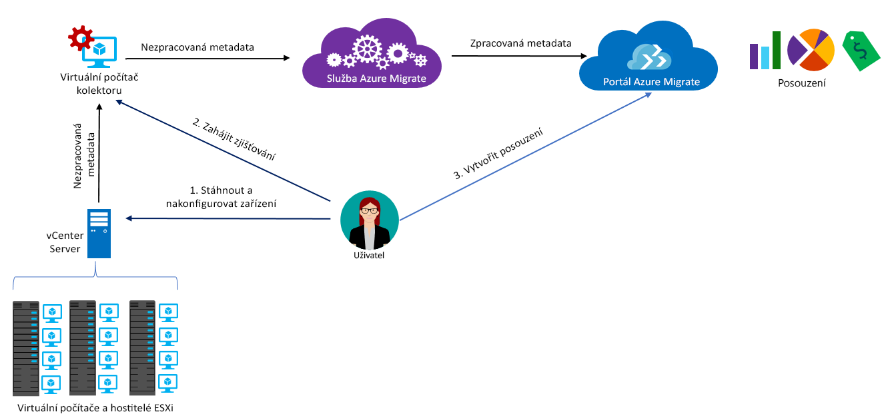

# Informace o službě Azure Migrate

Služba Azure Migrate posuzuje místní úlohy pro migraci do Azure. Služba posuzuje vhodnost k migraci a velikost na základě výkonu a poskytuje odhad nákladů na provoz místních počítačů v Azure. Pokud zvažujete migrace metodou „lift and shift“ nebo se nacházíte v počátečních fázích posuzování migrace, tato služba je určená přímo pro vás. Po posouzení můžete počítače migrovat do Azure pomocí služeb, jako jsou Azure Site Recovery a Azure Database Migration.

> [!NOTE]
> Azure Migrate je aktuálně ve verzi Preview a podporuje produkční úlohy.

## Proč používat službu Azure Migrate?

Azure Migrate vám pomůže s následujícími úlohami:

- **Posouzení připravenosti pro Azure:** Posuďte, jestli jsou vaše místní počítače vhodné pro provoz v Azure. 
- **Získání doporučení týkajících se velikosti:** Získejte doporučení k velikosti pro virtuální počítače Azure na základě historie výkonu místních virtuálních počítačů. 
- **Odhadované měsíční náklady:** Získejte odhadované náklady na provoz místních počítačů v Azure.  
- **Migrace s větší jistotou:** Vizualizací závislostí místních počítačů můžete vytvářet skupiny počítačů, které budete posuzovat a migrovat společně. Můžete přesně zobrazit závislosti pro konkrétní počítač nebo všechny počítače ve skupině.

## Aktuální omezení

- Aktuálně můžete posuzovat vhodnost k migraci na virtuální počítače Azure u místních virtuálních počítačů VMware.

> [!NOTE]
> Podpora Hyper-V se plánuje a bude brzy povolená. Prozatím doporučujeme k plánování migrace úloh Hyper-V použít [Plánovač nasazení služby Azure Site Recovery](http://aka.ms/asr-dp-hyperv-doc). 

- Je možné vyhledat až 1 000 virtuálních počítačů v rámci jednoho zjišťování a až 1 500 virtuálních počítačů v jednom projektu. Kromě toho můžete v rámci jednoho interního hodnocení vyhodnotit až 400 virtuálních počítačů. Pokud jich potřebuje vyhledat nebo posoudit víc, můžete zvýšit počet zjišťování nebo hodnocení. [Další informace](how-to-scale-assessment.md).
- Virtuální počítač, který chcete posoudit, musí být spravovaný systémem vCenter Server verze 5.5, 6.0 nebo 6.5.
- Projekt Azure Migrate můžete vytvořit pouze v oblasti Západní USA – střed. To však nemá vliv na možnost plánování migrace pro jiné cílové umístění Azure. Umístění projektu migrace slouží pouze k uložení metadat zjištěných v místním prostředí.
- Azure Migrate podporuje pro posouzení migrace jenom spravované disky.

## Za co musím platit?

Další informace o cenách služby Azure Migrate najdete [zde](https://azure.microsoft.com/en-in/pricing/details/azure-migrate/).

## Co je součástí posouzení?

Posouzení pomáhá identifikovat vhodnost Azure pro místní virtuální počítače a získat doporučení pro správné velikosti a odhady nákladů pro provoz virtuálních počítačů v Azure. Posouzení jsou založená na vlastnostech, jejichž souhrn je uvedený v následující tabulce. Tyto vlastnosti můžete upravit na portálu Azure Migrate. 

**Vlastnost** | **Podrobnosti**
--- | ---
**Cílové umístění** | Umístění Azure, do kterého chcete migrovat. Cílové umístění je standardně nastavené na Západní USA 2. 
**Redundance úložiště** | Typ úložiště, které budou po migraci používat virtuální počítače Azure. Výchozím typem je místně redundantní úložiště (LRS).
**Cenové plány** | Při posuzování se bere v úvahu, jestli jste zaregistrováni v programu Software Assurance a jestli můžete využívat [Zvýhodněné hybridní využití Azure](https://azure.microsoft.com/pricing/hybrid-use-benefit/). V úvahu se berou také nabídky Azure, které by se měly použít, a máte možnost zadat slevy (%) specifické pro předplatné, na které máte nárok nad rámec nabídky. 
**Cenová úroveň** | Můžete zadat [cenovou úroveň (Basic nebo Standard)](../virtual-machines/windows/sizes-general.md) virtuálních počítačů Azure. Díky tomu můžete migrovat na vhodnou řadu virtuálních počítačů Azure podle toho, jestli jste v produkčním prostředí. Ve výchozím nastavení se použije úroveň [Standard](../virtual-machines/windows/sizes-general.md).
**Historie výkonu** | Azure Migrate ve výchozím nastavení vyhodnocuje výkon místních počítačů s využitím měsíční historie a hodnoty 95. percentilu. Toto nastavení můžete upravit.
**Faktor komfortu** | Azure Migrate při posuzování počítá s rezervou (faktor komfortu). Tato rezerva se použije nad rámec dat o využití počítače pro virtuální počítače (procesor, paměť, disk a síť). Důvodem použití faktoru komfortu jsou problémy, jako jsou sezónní využití, krátká historie výkonu a pravděpodobný růst budoucího využití.   Například z virtuálního počítače s 10 jádry a 20% využitím je normálně ve výsledku virtuální počítač se 2 jádry. S faktorem komfortu 2,0× je však výsledkem virtuální počítač se 4 jádry. Výchozí nastavení komfortu je 1,3×.

## Jak služba Azure Migrate funguje?

1.  Vytvoříte projekt Azure Migrate.
2.  Azure Migrate pomocí místního počítače označovaného jako zařízení kolektoru zjistí informace o místních počítačích. Toto zařízení vytvoříte tak, že stáhnete instalační soubor ve formátu .ova (Open Virtualization Appliance) a importujete ho jako virtuální počítač na místní vCenter Server.
3.  Připojíte se k virtuálnímu počítači pomocí připojení konzoly ve vCenter Serveru, během připojování zadáte nové heslo pro virtuální počítač a potom ve virtuálním počítači spustíte aplikaci kolektoru, aby se zahájilo zjišťování.
4.  Kolektor pomocí rutin VMware PowerCLI shromáždí metadata virtuálního počítače. Zjišťování probíhá bez agenta a na hostitele VMware ani virtuální počítače se nic neinstaluje. Shromážděná metadata obsahují informace o virtuálním počítači (jádra, paměť, disky, velikosti disků a síťové adaptéry). Shromáždí se také data o výkonu virtuálních počítačů, včetně využití procesoru a paměti, IOPS disku, propustnosti disku (Mb/s) a výstupu sítě (MB/s).
5.  Metadata se vloží do projektu Azure Migrate. Můžete je zobrazit na webu Azure Portal.
6.  Pro účely posouzení shromáždíte zjištěné virtuální počítače do skupin. Můžete například seskupit virtuální počítače, na kterých běží stejná aplikace. Pro přesnější seskupení můžete použít vizualizaci závislostí, zobrazit závislosti pro konkrétní počítač nebo pro všechny počítače ve skupině a skupinu upřesnit.
7.  Jakmile je skupina zformována, vytvoříte posouzení pro skupinu. 
8.  Po dokončení můžete posouzení zobrazit na portálu nebo si ho stáhnout ve formátu aplikace Excel.

  

## Jaké jsou požadavky na porty?

Tabulka shrnuje porty potřebné ke komunikaci služby Azure Migrate.

|Komponenta          |Komunikace s     |Požadovaný port  |Důvod   |
|-------------------|------------------------|---------------|---------|
|Kolektor          |Služba Azure Migrate   |TCP 443        |Kolektor se ke službě připojuje přes port SSL 443.|
|Kolektor          |vCenter Server          |Výchozí 9443   | Ve výchozím nastavení se kolektor připojuje k serveru vCenter na portu 9443. Pokud server naslouchá na jiném portu, tento port musí být nakonfigurovaný jako odchozí port na virtuálním počítači kolektoru. |
|Místní virtuální počítač     | Pracovní prostor Operations Management Suite (OMS)          |[TCP 443](../log-analytics/log-analytics-windows-agent.md) |Agent MMA používá port TCP 443 pro připojení k Log Analytics. Tento port potřebujete pouze v případě, že využíváte funkci vizualizace závislostí a instalujete agenta Microsoft Monitoring Agent (MMA). |

  
## Co se stane po posouzení?

Po posouzení místních počítačů pro migraci pomocí služby Azure Migrate můžete provést migraci pomocí několika nástrojů:

- **Azure Site Recovery:** Pomocí Azure Site Recovery můžete provést migraci do Azure následujícím způsobem:
  - Připravte prostředky Azure, včetně předplatného Azure, virtuální sítě Azure a účtu úložiště.
  - Připravte místní servery VMware na migraci. Ověříte požadavky na podporu VMware pro Site Recovery, připravíte servery VMware na zjišťování a připravíte se na instalaci služby mobility Site Recovery na virtuální počítače, které chcete migrovat. 
  - Nastavte migraci. Nastavíte trezor služby Recovery Services, nakonfigurujete nastavení migrace pro zdroj a cíl, nastavíte zásady replikace a povolíte replikaci. Můžete spustit postup zotavení po havárii a zkontrolovat, že migrace virtuálního počítače do Azure funguje správně.
  - Spusťte převzetí služeb při selhání a migrujte místní počítače do Azure. 
  - [Další informace](../site-recovery/tutorial-migrate-on-premises-to-azure.md) najdete v kurzu migrace pomocí Site Recovery.

- **Azure Database Migration:** Pokud na místních počítačích běží databáze, jako je SQL Server, MySQL nebo Oracle, pomocí služby Azure Database Migration Service je můžete migrovat do Azure. [Další informace](https://azure.microsoft.com/campaigns/database-migration/).

## Další kroky 
[Postupujte podle kurzu](tutorial-assessment-vmware.md) a vytvořte posouzení pro místní virtuální počítač VMware.