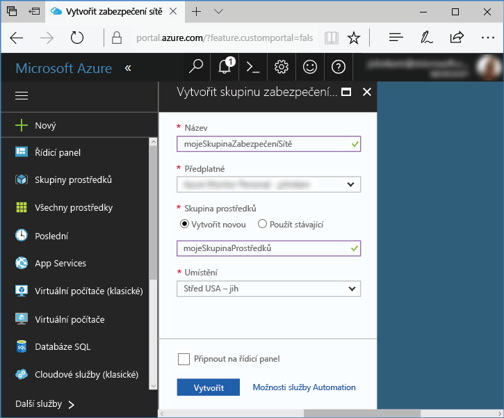
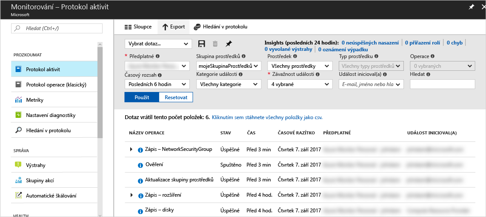
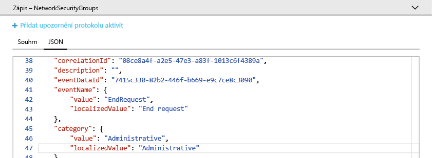
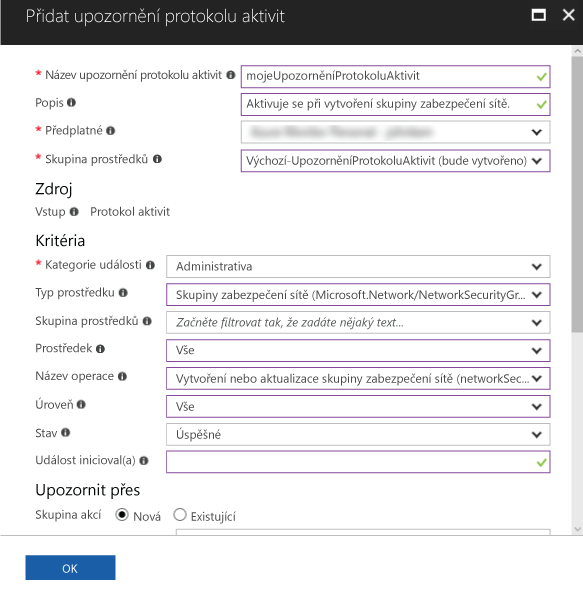
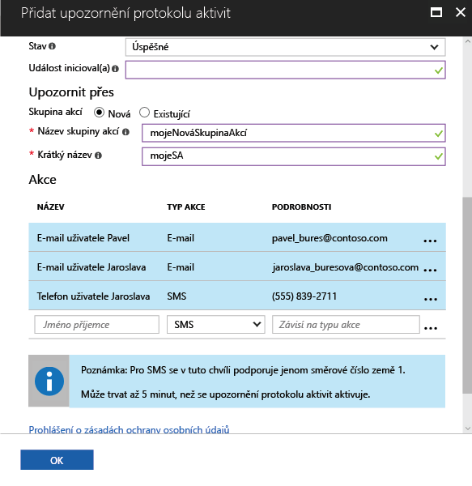

# Audit a přijímání oznámení o důležitých akcích ve vašem předplatném Azure

**Protokol aktivit Azure** poskytuje historii událostí na úrovni předplatného v Azure. Nabízí informace o tom, *kdo* vytvořil, aktualizoval nebo odstranil *jaké* prostředky a *kdy* k tomu došlo. Můžete vytvořit **upozornění protokolu aktivit** a přijímat emailová, SMS nebo webhooková oznámení v případě, že dojde k aktivitě, která splňuje podmínky upozornění. Tento rychlý start prochází jednotlivé kroky k vytvoření jednoduché skupiny zabezpečení sítě, procházení protokolu aktivit pro porozumění události, ke které došlo, a následnému vytvoření upozornění protokolu aktivit, abyste byli informováni o vytvoření jakékoli další skupiny zabezpečení sítě.

Pokud ještě nemáte předplatné Azure, vytvořte si [bezplatný účet](https://azure.microsoft.com/free/) před tím, než začnete.

## Přihlášení k portálu Azure Portal

Přihlaste se k portálu [Azure Portal](https://portal.azure.com/).

## Vytvoření skupiny zabezpečení sítě

1. Klikněte na tlačítko **Nový** v levém horním rohu webu Azure Portal.

2. Vyberte **Sítě** a pak **Skupina zabezpečení sítě**.

3. Jako **Název** zadejte myNetworkSG a vytvořte novou skupinu prostředků **myResourceGroup**. Klikněte na tlačítko **Vytvořit**.

    

## Procházení protokolu aktivit na portálu

Nyní se do protokolu aktivit přidala událost, která popisuje vytvoření skupiny zabezpečení sítě. Pomocí následujících pokynů tuto událost identifikujte.

1. V levém navigačním seznamu klikněte na tlačítko **Monitorování**. Otevře se část Protokol aktivit. Tato část obsahuje historii všech akcí provedených uživateli s prostředky ve vašem předplatném, které můžete filtrovat podle několika vlastností, jako jsou **Skupina prostředků**, **Časový rozsah** a **Kategorie**.

2. V části **Protokol aktivit** klikněte na rozevírací nabídku **Skupina prostředků** a vyberte **myResourceGroup**. V rozevírací nabídce **Časový rozsah** změňte hodnotu na **Poslední 1 hodina**. Klikněte na tlačítko **Použít**.

    

3. V zobrazené tabulce událostí klikněte na událost **Write NetworkSecurityGroups**.

## Procházení události v protokolu aktivit

Zobrazená část obsahuje základní podrobnosti o provedené operaci, včetně názvu, časového razítka a uživatele nebo aplikace, která ji provedla.

Klikněte na kartu **JSON** a zobrazte úplné podrobnosti o události. Mezi tyto podrobnosti patří podrobné informace o oprávnění uživatele nebo aplikace k provedení operace, kategorii a úrovni události a stavu operace.

## Vytvoření upozornění protokolu aktivit

1. Kliknutím na kartu **Souhrn** se vraťte k souhrnu události.

2. V zobrazené části Souhrn klikněte na **Přidat upozornění protokolu aktivit**.

    

3. V zobrazené části zadejte název a popis upozornění protokolu aktivit.

4. V části **Kritéria** se ujistěte, že **Kategorie události** je nastavená na **Správa**, **Typ prostředku** je nastavený na **Skupiny zabezpečení sítě**, **Název operace** je nastavený na **Vytvoření nebo aktualizace skupiny zabezpečení sítě**, **Stav** je nastavený na **Úspěch** a všechna ostatní kritéria jsou buď prázdná, nebo nastavená na **Vše**. Tato kritéria definují pravidla sloužící k určení, jestli se má toto upozornění aktivovat, když se v protokolu aktivit objeví nová událost.

    

5. V části **Upozornit přes** vyberte **Nová** skupina akcí a zadejte **název** a **krátký název** skupiny akcí. Skupina akcí definuje sadu akcí, které se provedou při aktivaci upozornění (když kritéria odpovídají nové události).

6. V části **Akce** přidejte 1 nebo několik akcí tak, že zadáte **Název akce**, **Typ akce** (například e-mail nebo SMS) a **Podrobnosti** pro příslušný konkrétní typ akce (například adresa URL webhooku, e-mailová adresa nebo číslo SMS).

    

7. Uložte upozornění protokolu aktivit kliknutím na **Ok**.

## Testování upozornění protokolu aktivit

> [!NOTE]
> Úplné povolení upozornění protokolu aktivit trvá přibližně 10 minut. Nové události, ke kterým dojde před úplným povolením upozornění protokolu aktivit, nevygenerují oznámení.
>
>

Pokud chcete upozornění otestovat, zopakujte postup v předchozí části **Vytvoření skupiny zabezpečení sítě**, ale zadejte jiný název této skupiny zabezpečení sítě a znovu použijte existující skupinu prostředků. Během několika minut obdržíte oznámení o vytvoření skupiny zabezpečení sítě.

## Vyčištění prostředků

Pokud už je nepotřebujete, odstraňte skupinu prostředků a skupinu zabezpečení sítě. Uděláte to tak, že do vyhledávacího pole v horní části portálu zadáte název skupiny prostředků, kterou jste vytvořili, a kliknete na název skupiny prostředků. V zobrazené části klikněte na tlačítko **Odstranit skupinu prostředků**, zadejte název skupiny prostředků a klikněte na **Odstranit**.

## Další kroky

V tomto rychlém startu jste provedli operaci pro vygenerování události protokolu aktivit a následně jste vytvořili upozornění protokolu aktivit, abyste byli informováni o dalším výskytu této operace v budoucnu. Pak jste upozornění otestovali opětovným provedením této operace. Azure zpřístupňuje události protokolu aktivit za posledních 90 dnů. Pokud potřebujete události uchovávat déle než 90 dnů, zkuste data protokolu aktivit archivovat společně s dalšími daty monitorování.

> [!div class="nextstepaction"]
> [Archivace dat monitorování](./monitor-tutorial-archive-monitoring-data.md)
