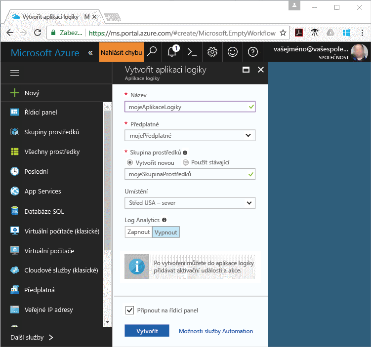
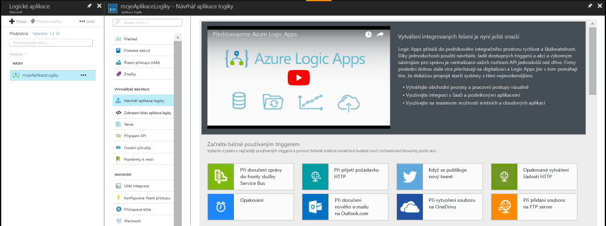
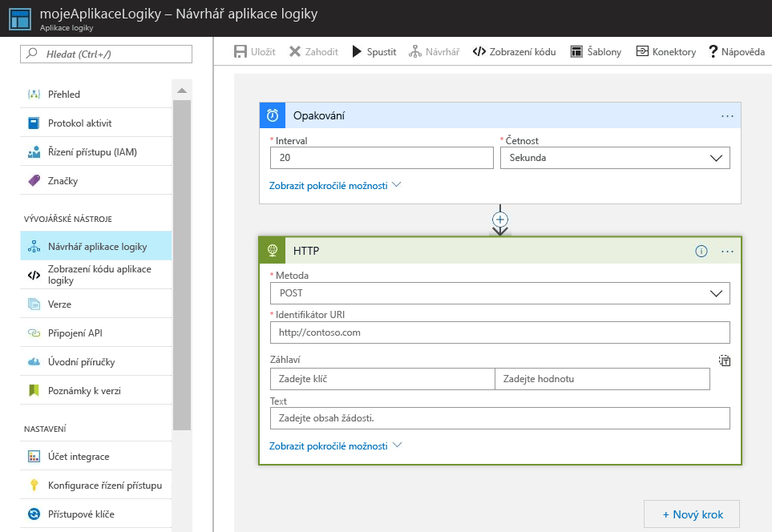
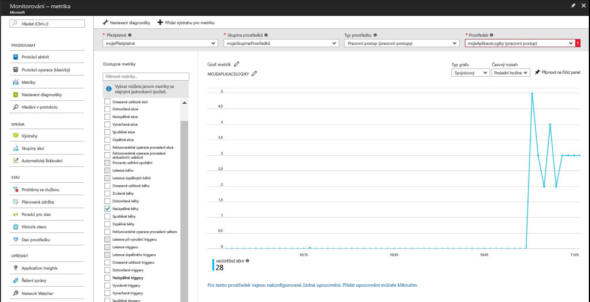

# Přijímání oznámení, když hodnota metriky splní určitou podmínku

Azure Monitor zpřístupňuje metriky pro řadu prostředků Azure. Tyto metriky vyjadřují výkon a stav těchto prostředků. Hodnoty metrik můžou v řadě případů ukazovat na nějaký problém s daným prostředkem. Můžete vytvářet upozornění metrik, která budou monitorovat neobvyklé chování a v případě, že k němu dojde, vás na to upozorní. Tento rychlý start prochází jednotlivé kroky k vytvoření aplikace logiky, vytvoření úlohy a vizualizaci metrik pro aplikaci logiky. Dále prochází kroky k vytvoření upozornění a přijetí oznámení na metriku pro prostředek aplikace logiky.

Další informace o metrikách a upozorněních metrik najdete v tématech [Přehled metrik služby Azure Monitor](./monitoring-overview-metrics.md) a [Přehled upozornění služby Azure Monitor](./monitoring-overview-alerts.md). 

Pokud ještě nemáte předplatné Azure, vytvořte si [bezplatný účet](https://azure.microsoft.com/free/) před tím, než začnete.

## Přihlášení k webu Azure Portal

Přihlaste se k webu [Azure Portal](https://portal.azure.com/).

## Vytvoření aplikace logiky

1. Klikněte na tlačítko **Vytvořit prostředek** v levém horním rohu webu Azure Portal.

2. Vyhledejte a vyberte **Aplikace logiky**. Klikněte na tlačítko **Vytvořit**.

3. Zadejte informace o aplikaci logiky, jak je znázorněno na následujícím obrázku.  Použijte výchozí umístění. Zaškrtněte možnost **Připnout na řídicí panel**.  Jakmile budete hotovi, klikněte na **Vytvořit**. 

      

4. Aplikace logiky by měla být připnutá na řídicím panelu. Kliknutím na aplikaci logiky do ní přejděte.

5. Na panelu aplikace logiky vyberte **Návrhář aplikace logiky**.

       

6. Nastavte hodnoty podle následujícího diagramu.

    . 

7. V návrháři vyberte trigger **Opakování**.

8. Interval nastavte na 20 a frekvenci na sekundy. Tím zajistíte, že se aplikace logiky bude aktivovat každých 20 sekund.

9. Klikněte na tlačítko **Nový krok** a vyberte **Přidat akci**.

10. Zvolte možnost **HTTP** a vyberte **HTTP-HTTP**.

11. Nastavte **Metodu** na POST a identifikátor **URI** na libovolnou webovou adresu.

12. Klikněte na **Uložit**.

13. Spuštění akcí aplikací logiky může trvat až 5 minut.  

## Zobrazení metrik pro aplikaci logiky

1. V levém navigačním podokně klikněte na možnost **Monitorování**.

2. Vyberte kartu **Metriky** a jako **Předplatné**, **Skupina prostředků**, **Typ prostředku** a **Prostředek** vyplňte informace o vaší aplikaci logiky.

3. Ze seznamu metrik vyberte **Spuštěné běhy**.

4. Upravte **Časový rozsah** grafu tak, aby zobrazoval data za poslední hodinu.

5. Nyní byste měli vidět, jak graf vykresluje celkový počet běhů, které vaše aplikace logiky spustila za poslední hodinu. Pokud se žádné nezobrazí, ujistěte se, že jste počkali alespoň 5 minut, jak je uvedeno v předchozím kroku. Potok aktualizujte svůj prohlížeč. 

    

## Vytvoření upozornění metriky pro aplikaci logiky

1.  V pravé horní části panelu metrik klikněte na tlačítko **Přidat upozornění metriky**.

2. Pojmenujte upozornění metriky myLogicAppAlert a zadejte stručný popis upozornění.

3. Nastavte **Podmínku** pro upozornění metriky na Vetší než, **Prahovou hodnotu** nastavte na 10 a **Období** nastavte na Za posledních 5 minut.

4. Nakonec v části **Další e-maily správce** zadejte svou e-mailovou adresu. Toto upozornění zajišťuje, že obdržíte e-mail v případě, že ve vaší aplikaci logiky dojde během 5 minut k více než 10 běhům, které selžou.

    

## Přijímání oznámení na upozornění metrik pro aplikaci logiky
1. Během chvíle byste měli od odesilatele Microsoft Azure Alerts obdržet e-mail s informací o aktivaci upozornění.

2. Přejděte zpět do aplikace logiky a v triggeru opakování upravte interval na 1 a frekvenci na hodiny.

3. Během několika minut byste měli od odesilatele Microsoft Azure Alerts obdržet e-mail s informací o vyřešení upozornění.

## Vyčištění prostředků

Další rychlé starty v této kolekci vycházejí z tohoto rychlého startu. Pokud chcete pokračovat v práci s dalšími rychlými starty nebo kurzy, nevyčišťujte prostředky vytvořené v rámci tohoto rychlého startu. Pokud pokračovat nechcete, pomocí následujících kroků odstraňte všechny prostředky vytvořené tímto rychlým startem na portálu Azure Portal.

1. V nabídce vlevo na webu Azure Portal klikněte na **Monitorování**.

2. Vyberte kartu **Upozornění**, vyhledejte upozornění, které jste vytvořili v rámci této úvodní příručky, a klikněte na něj.

3. Na panelu upozornění metriky klikněte na **Odstranit**.

4. V nabídce vlevo na webu Azure Portal vyhledejte **Aplikace logiky** a pak klikněte na **Aplikace logiky**.

5. Na panelu klikněte v textovém poli na aplikaci logiky, kterou jste vytvořili v rámci tohoto rychlého startu, a pak klikněte na **Odstranit**.

## Další kroky

V tomto rychlém startu jste zjistili, jak vytvořit upozornění metriky pro vaše prostředky. Další informace o upozorněních metrik najdete po proklikání k našemu přehledu upozornění.

> [!div class="nextstepaction"]
> [Upozornění na akce předplatného ve službě Azure Monitor](./monitor-quick-audit-notify-action-in-subscription.md )
