# Začínáme se službou Azure Monitor
Azure Monitor je služba platformy, která poskytuje jeden zdroj pro monitorování prostředků Azure. Prostřednictvím služby Azure Monitor můžete vizualizovat metriky a protokoly pocházející z prostředků v Azure, zadávat na ně dotazy, směrovat je, archivovat je a provádět s nimi příslušné akce. S těmito daty můžete pracovat prostřednictvím okna portálu Monitor, [rutin prostředí PowerShell pro monitorování](insights-powershell-samples.md), [rozhraní příkazového řádku pro různé platformy](insights-cli-samples.md) nebo [rozhraní API REST služby Azure Monitor](https://msdn.microsoft.com/library/dn931943.aspx). V tomto článku vás seznámíme s několika klíčovými komponentami služby Azure Monitor a pro ukázky budeme používat portál.

## Názorný postup
1. Na portálu přejděte na **Další služby** a najděte možnost **Monitor**. Kliknutím na ikonu hvězdičky si tuto možnost přidejte do seznamu oblíbených položek, abyste k ní neustále měli snadný přístup z levého navigačního panelu.

    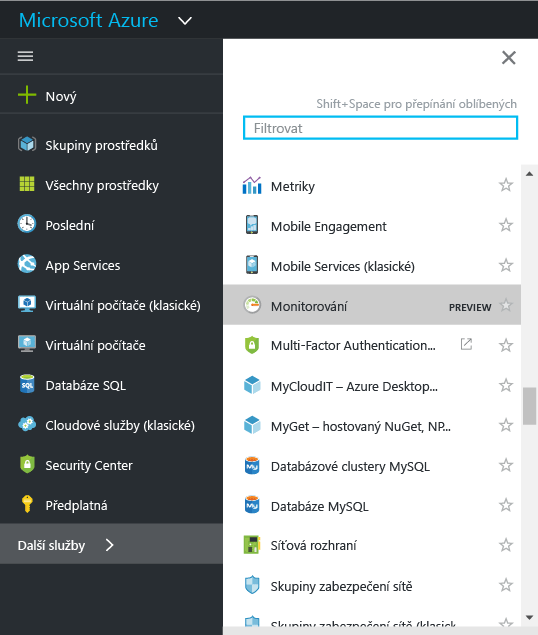
2. Kliknutím na možnost **Monitor** otevřete okno **Monitor**. V tomto okně jsou uvedená veškerá vaše nastavení monitorování a data v jednom konsolidovaném zobrazení. Nejprve se otevře část **Protokol aktivit**.

    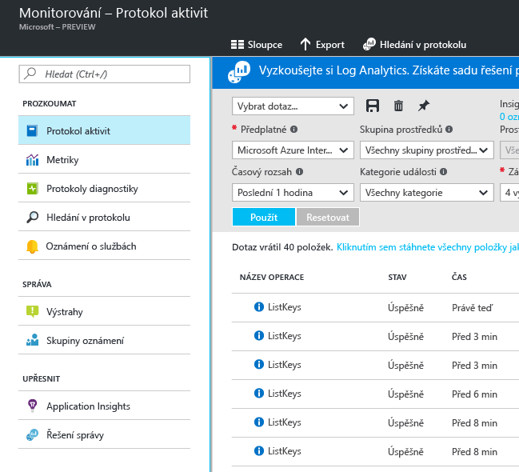

    Azure Monitor nabízí tři základní kategorie monitorování dat: **protokol aktivit**, **metriky** a **diagnostické protokoly**.
3. Kliknutím na **Protokol aktivit** zajistíte zobrazení části s protokolem aktivit.

    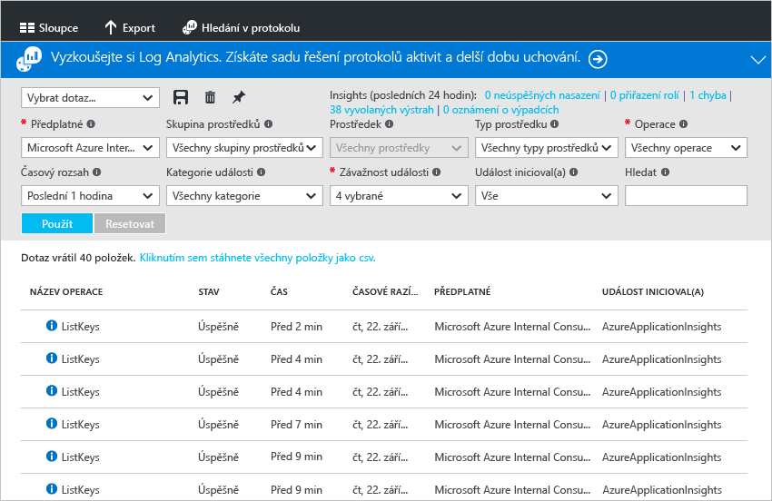

    [**Protokol aktivit**](monitoring-overview-activity-logs.md) popisuje všechny operace prováděné s prostředky v rámci vašeho předplatného. Na základě protokolu aktivit můžete určit „co, kdo a kdy“ pro každou operaci vytvoření, aktualizace nebo odstranění týkající se prostředků v rámci vašeho předplatného. Protokol aktivit například obsahuje informace o tom, kdy byla webová aplikace zastavena a kdo ji zastavil. Události protokolu aktivit se ukládají v rámci platformy a pro dotazy jsou k dispozici po dobu 90 dní.

    Můžete vytvářet a ukládat dotazy pro běžné filtry a pak připnout nejdůležitější dotazy na řídicí panel portálu. Díky tomu se dozvíte o všech výskytech událostí, které splňují příslušná kritéria.
4. V zobrazení nastavte filtrování konkrétní skupiny prostředků za poslední týden. Pak klikněte na tlačítko **Uložit**.

    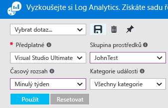
5. Nyní klikněte na tlačítko **Pin** (Připnout).

    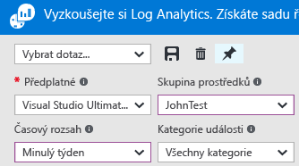

    Většinu zobrazení v tomto návodu je možné připnout na řídicí panel. Díky tomu si můžete vytvořit jediný zdroj informací o provozních datech pro služby.
6. Vraťte se na řídicí panel. Nyní je vidět, že se na řídicím panelu zobrazuje příslušný dotaz (a počet výsledků). To je užitečné, pokud chcete rychle zobrazit všechny vysoce profil akce, které nedávno došlo v rámci vašeho předplatného, například byl přiřazen novou roli nebo virtuální počítač byl odstraněn.

    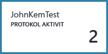
7. Vraťte se na dlaždici **Monitor** a klikněte na sekci **Metriky**. Je nutné nejprve vybrat prostředek filtrování a výběrem pomocí možností v rozevírací seznam v horní části okna.

    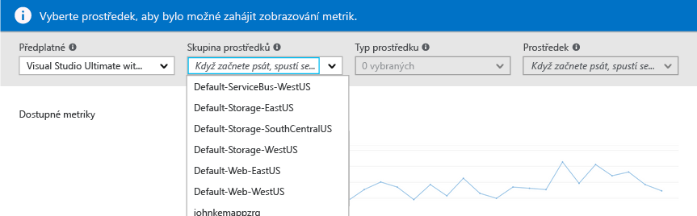

    Všechny prostředky Azure generují [**metriky**](monitoring-overview-metrics.md). V toto zobrazení jsou všechny metriky uvedeny společně v podokně ze skla. Díky tomu je možné snadno zjistit, jak prostředky fungují. Také, podívejte se na naše brand [nové metrika grafů prostředí](https://aka.ms/azuremonitor/new-metrics-charts) kliknutím na **metriky (preview)** kartě.
8. Po výběru prostředku se veškeré prostředky k dispozici zobrazí na levé straně okna. V grafu můžete najednou zobrazit několik metrik, pokud je vyberete a upravíte typ grafu a časový rozsah. Můžete také zobrazit všechna upozornění na metriky, která jsou pro tento prostředek nastavená.

    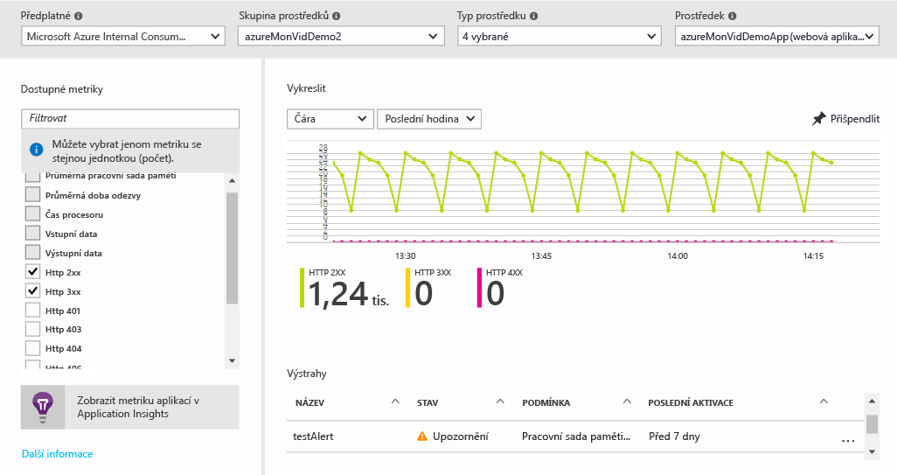

   > [!NOTE]
   > Některé metriky jsou k dispozici jen po povolení [Application Insights](../application-insights/app-insights-overview.md) a případně diagnostiky Azure pro Windows nebo Linux pro příslušný prostředek.
   >
   >
9. Až budete s grafem spokojeni, můžete ho připnout na řídicí panel pomocí tlačítka **Pin** (Připnout).
10. Vraťte se do okna **Monitor** a klikněte na **Diagnostické protokoly**.

    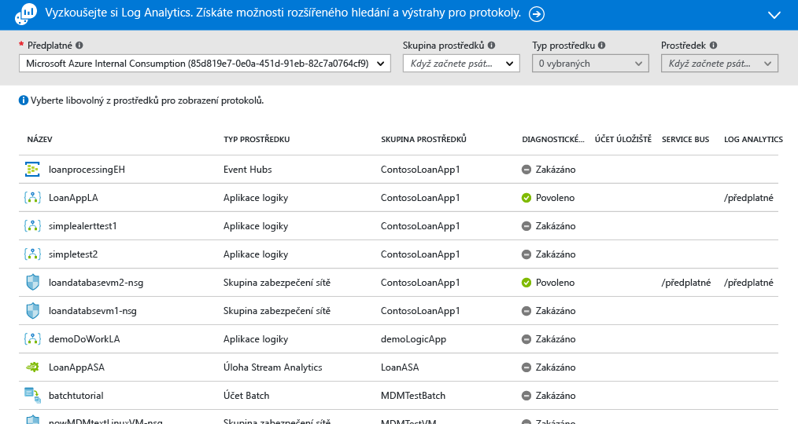

    [**Diagnostické protokoly**](monitoring-overview-of-diagnostic-logs.md) jsou protokoly generované *prostředkem* a poskytují data o provozu příslušného prostředku. Mezi typy diagnostických protokolů patří například počítadla pravidel skupin zabezpečení sítě nebo protokoly pracovního postupu aplikací logiky. Tyto protokoly se můžou ukládat v rámci účtu úložiště, streamovat do Centra událostí a případně odesílat do [Log Analytics](../log-analytics/log-analytics-overview.md). Log Analytics je produkt Microsoftu, který pracuje s provozními analytickými informacemi a umožňuje pokročilé hledání a generování upozornění.

    Na portálu můžete zobrazit a filtrovat seznam všech prostředků v rámci svého předplatného a ověřit, jestli jsou pro ně povolené diagnostické protokoly.
11. Klikněte na prostředek v okně Diagnostické protokoly. Pokud se diagnostické protokoly ukládají v rámci účtu úložiště, zobrazí se seznam protokolů po hodinách. Tyto protokoly můžete přímo stahovat.

    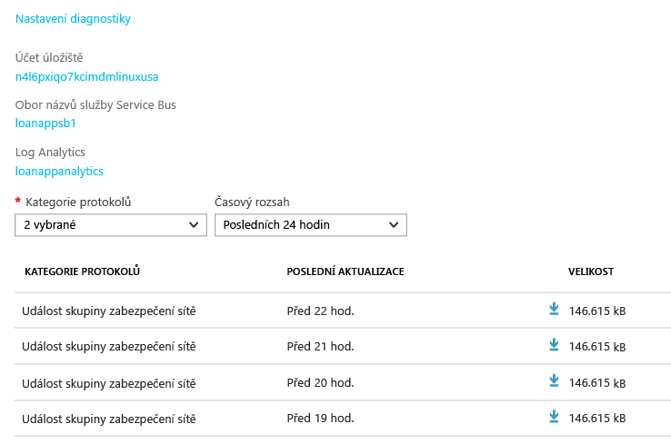

    Můžete také kliknout na **Nastavení diagnostiky**. Tímto způsobem můžete nastavit nebo změnit nastavení pro archivaci do účtu úložiště, streamování do služby Event Hubs nebo odesílání do pracovního prostoru Log Analytics.

    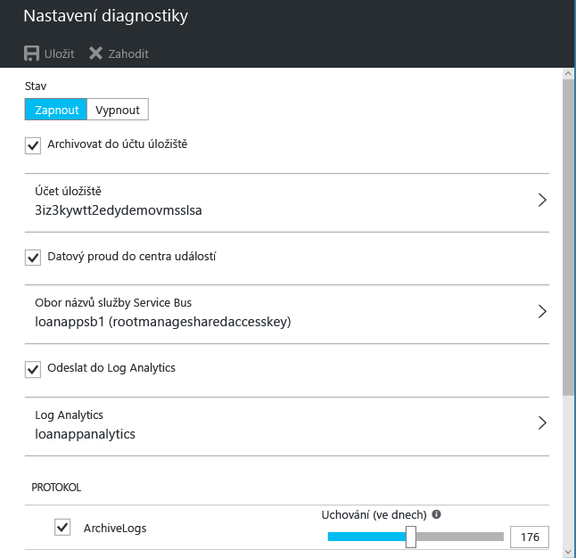

    Pokud jste nastavili odesílání diagnostických protokolů do Log Analytics, můžete v nich pak hledat na portálu v části **Hledání v protokolu**.
12. V okně Monitor přejděte do části **Alerts** (Upozornění).

    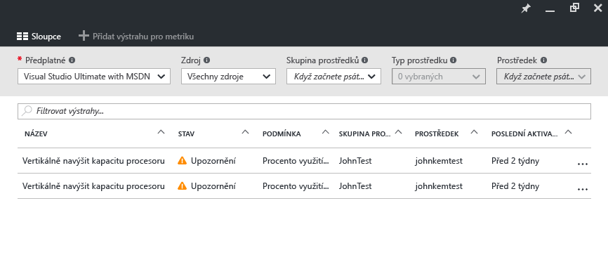

    Tady můžete spravovat všechna [**upozornění**](monitoring-overview-alerts.md) týkající se vašich prostředků Azure. To zahrnuje výstrahy na metriky, aktivity protokolu události, testy webu Application Insights (umístění) a proaktivní diagnostics Application Insights. Upozornění můžou aktivovat odeslání e-mailu nebo předání dat typu HTTP POST na adresu URL webhooku.
13. Klikněte na **Add metric alert** (Přidat upozornění metriky) a vytvořte upozornění.

    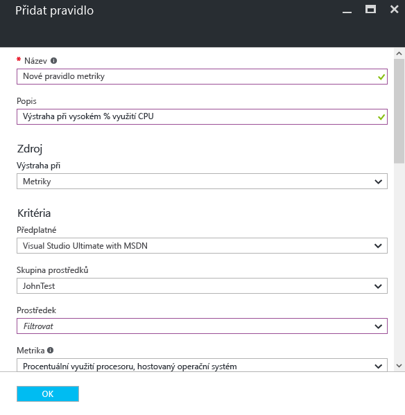

    Pak můžete upozornění připnout na řídicí panel, abyste mohli kdykoli snadno zjistit jeho stav.

    Azure monitorování teď má také [ **metriky výstrahy téměř v reálném čase**](https://aka.ms/azuremonitor/near-real-time-alerts)(preview), může být vyhodnocen frekvencí co nejnižší každou minutu!
    
14. Sekce Monitor obsahuje také odkazy na aplikace [Application Insights](../application-insights/app-insights-overview.md) a na řešení správy [Log Analytics](../log-analytics/log-analytics-overview.md). Tyto produkty společnosti Microsoft jsou hluboce integrovány se službou Azure Monitor.
15. Pokud nepoužíváte Application Insights nebo Log Analytics, je pravděpodobné, že je služba Azure Monitor propojená s vašimi aktuálními produkty zajišťujícími monitorování, protokolování a generování upozornění. Úplný seznam spolu s pokyny k integraci najdete na naší [stránce s přehledem partnerů](monitoring-partners.md).

Provedením těchto kroků a připnutím všech relevantních dlaždic na řídicí panel můžete vytvářet komplexní zobrazení svých aplikací a infrastruktury, například takto:

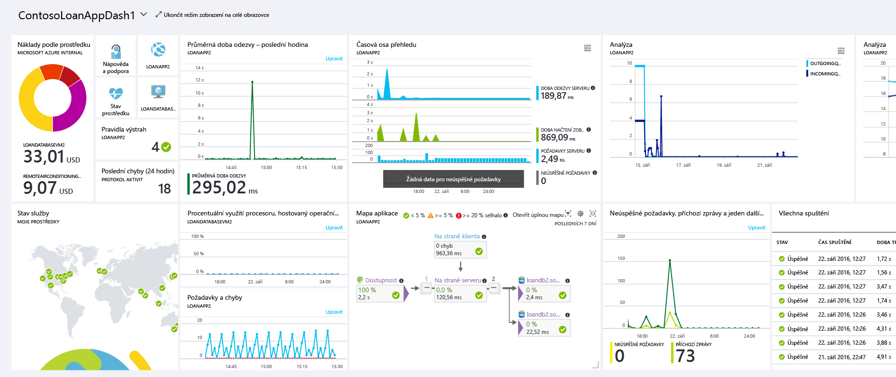

## Další kroky
* Přečtěte si článek [Přehled služby Azure Monitor](monitoring-overview.md)
