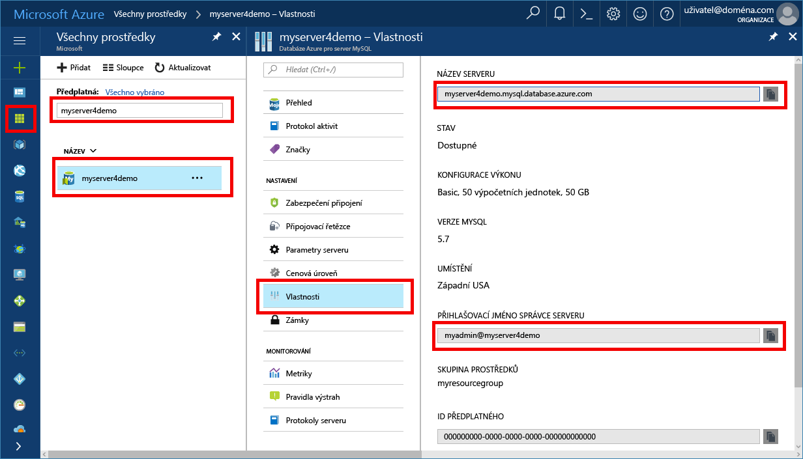

# <a name="azure-database-for-mysql-use-net-c-to-connect-and-query-data"></a>Azure Database for MySQL: Připojení a dotazování dat pomocí .NET (jazyk C#)
Tento rychlý start ukazuje, jak se připojit ke službě Azure Database for MySQL pomocí aplikace v jazyce C#. Ukazuje, jak pomocí příkazů jazyka SQL dotazovat, vkládat, aktualizovat a odstraňovat data v databázi. V krocích v tomto článku se předpokládá, že máte zkušenosti s vývojem pomocí jazyka C# a teprve začínáte pracovat se službou Azure Database for MySQL.

## <a name="prerequisites"></a>Požadavky
Tento rychlý start jako výchozí bod využívá prostředky vytvořené v některém z těchto průvodců:
- [Vytvoření serveru Azure Database for MySQL pomocí webu Azure Portal](./quickstart-create-mysql-server-database-using-azure-portal.md)
- [Vytvoření serveru Azure Database for MySQL pomocí Azure CLI](./quickstart-create-mysql-server-database-using-azure-cli.md)

Budete také muset:
- Nainstalovat [.Net Framework](https://www.microsoft.com/net/download)
- Nainstalovat [Visual Studio](https://www.visualstudio.com/downloads/)
- Nainstalovat [ovladač ODBC pro MySQL](https://dev.mysql.com/downloads/connector/odbc/) 

## <a name="install-visual-studio-and-net"></a>Instalace sady Visual Studio a .NET
Kroky v této části předpokládají, že máte zkušenosti s vývojem pomocí rozhraní .NET.

### <a name="windows-net-framework-and-net-core"></a>**Windows .NET Framework a .NET Core**
Visual Studio 2017 Community je plně vybavené, rozšiřitelné a bezplatné integrované vývojové prostředí (IDE) pro vytváření moderních aplikací pro Android, iOS a Windows, stejně jako webových a databázových aplikací a cloudových služeb. Můžete nainstalovat buď úplné rozhraní .NET Framework, nebo jenom jádro .NET Core. Fragmenty kódu v rychlém startu pracují s oběma. Pokud již máte v počítači nainstalovanou sadu Visual Studio, přeskočte několik dalších kroků.

1. Stáhněte si [instalační program sady Visual Studio 2017](https://www.visualstudio.com/thank-you-downloading-visual-studio/?sku=Community&rel=15). 
2. Spusťte instalační program a podle zobrazených pokynů instalaci dokončete.

### <a name="mac-os"></a>**Mac OS**
Otevřete terminál a přejděte do adresáře, kde plánujete vytvoření projektu .NET Core. Zadejte následující příkazy, abyste nainstalovali **brew**, **OpenSSL** a **.NET Core**. 

```bash
ruby -e "$(curl -fsSL https://raw.githubusercontent.com/Homebrew/install/master/install)"
brew update
brew install openssl
mkdir -p /usr/local/lib
ln -s /usr/local/opt/openssl/lib/libcrypto.1.0.0.dylib /usr/local/lib/
ln -s /usr/local/opt/openssl/lib/libssl.1.0.0.dylib /usr/local/lib/
```

V systému macOS nainstalujte .NET Core. Stáhněte [oficiální instalační program](https://go.microsoft.com/fwlink/?linkid=843444). Tento instalační program nainstaluje nástroje a umístí je do proměnné PATH, abyste mohli .net spustit z konzoly.

### <a name="linux-ubuntu"></a>**Linux (Ubuntu)**
Otevřete terminál a přejděte do adresáře, kde plánujete vytvoření projektu .NET Core. Zadáním následujících příkazů nainstalujte **.NET Core**.

```bash
sudo sh -c 'echo "deb [arch=amd64] https://apt-mo.trafficmanager.net/repos/dotnet-release/ xenial main" > /etc/apt/sources.list.d/dotnetdev.list'
sudo apt-key adv --keyserver hkp://keyserver.ubuntu.com:80 --recv-keys 417A0893
sudo apt-get update
sudo apt-get install dotnet-dev-1.0.1
```


## <a name="get-connection-information"></a>Získání informací o připojení
Získejte informace o připojení potřebné pro připojení ke službě Azure Database for MySQL. Potřebujete plně kvalifikovaný název serveru a přihlašovací údaje.

1. Přihlaste se k [portálu Azure](https://portal.azure.com/).
2. V nabídce vlevo na webu Azure Portal klikněte na **Všechny prostředky** a vyhledejte vytvořený server, například **myserver4demo**.
3. Klikněte na název serveru.
4. Vyberte stránku **Vlastnosti** serveru. Poznamenejte si **Název serveru** a **Přihlašovací jméno správce serveru**.
 
5. Pokud zapomenete přihlašovací údaje pro váš server, přejděte na stránku **Přehled**, kde můžete zobrazit přihlašovací jméno správce serveru a v případě potřeby obnovit heslo.

## <a name="connect-create-table-and-insert-data"></a>Připojení, vytvoření tabulky a vložení dat
Použijte následující kód k připojení a načtení dat pomocí příkazů **CREATE TABLE** a **INSERT INTO** jazyka SQL. Tento kód pro navázání připojení k MySQL využívá třídu ODBC s metodou [Open()](https://msdn.microsoft.com/en-us/library/system.data.odbc.odbcconnection.open(v=vs.110).aspx). Potom tento kód použije metodu [CreateCommand()](https://msdn.microsoft.com/en-us/library/system.data.odbc.odbcconnection.createcommand(v=vs.110).aspx), nastaví vlastnost CommandText a volá metodu [ExecuteNonQuery()](https://msdn.microsoft.com/en-us/library/system.data.odbc.odbccommand.executenonquery(v=vs.110).aspx) pro spuštění databázových příkazů. 

Nahraďte parametry Host (hostitel), DBName (název databáze), User (uživatel) a Password (heslo) hodnotami, které jste zadali při vytváření vlastního serveru a databáze. 

```csharp
using System;
using System.Collections.Generic;
using System.Linq;
using System.Text;
using System.Threading.Tasks;
using MySql.Data;
using System.Data.Odbc;

namespace driver
{
    class MySQLCreate
    {
        static void Main(string[] args)
        {
            var conn = new OdbcConnection("DRIVER={MySQL ODBC 5.3 unicode Driver}; Server=myserver4demo.mysql.database.azure.com; Port=3306;" +
            " Database=quickstartdb; Uid=myadmin@myserver4demo; Pwd=server_admin_password; sslverify=0; Option=3;MULTI_STATEMENTS=1");

            Console.Out.WriteLine("Opening connection");
            conn.Open();

            var command = conn.CreateCommand();
            command.CommandText = "DROP TABLE IF EXISTS inventory;";
            command.ExecuteNonQuery();
            Console.Out.WriteLine("Finished dropping table (if existed)");

            command.CommandText = "CREATE TABLE inventory (id serial PRIMARY KEY, name VARCHAR(50), quantity INTEGER);";
            command.ExecuteNonQuery();
            Console.Out.WriteLine("Finished creating table");

            command.CommandText =
                String.Format(
                    @"INSERT INTO inventory (name, quantity) VALUES ({0}, {1});
                    INSERT INTO inventory (name, quantity) VALUES ({2}, {3});
                    INSERT INTO inventory (name, quantity) VALUES ({4}, {5});",
                    "\'banana\'", 150,
                    "\'orange\'", 154,
                    "\'apple\'", 100
                    );

            int nRows = command.ExecuteNonQuery();
            Console.Out.WriteLine(String.Format("Number of rows inserted={0}", nRows));

            Console.Out.WriteLine("Closing connection");
            conn.Close();

            Console.WriteLine("Press RETURN to exit");
            Console.ReadLine();
        }

    }
}

```

## <a name="read-data"></a>Čtení dat

Pomocí následujícího kódu se připojte a načtěte data s využitím příkazu **SELECT** jazyka SQL. Tento kód pro navázání připojení k MySQL využívá třídu ODBC s metodou [Open()](https://msdn.microsoft.com/en-us/library/system.data.odbc.odbcconnection.open(v=vs.110).aspx). Potom tento kód použije metodu [CreateCommand()](https://msdn.microsoft.com/en-us/library/system.data.odbc.odbcconnection.createcommand(v=vs.110).aspx) a metodu [ExecuteReader()](https://msdn.microsoft.com/en-us/library/system.data.odbc.odbccommand.executereader(v=vs.110).aspx) pro spuštění databázových příkazů. Dál tento kód použije [Read()](https://msdn.microsoft.com/en-us/library/system.data.odbc.odbcdatareader.read(v=vs.110).aspx) k přechodu na záznamy ve výsledcích. Potom tento kód použije GetInt32 a GetString k parsování hodnot v záznamu.

Nahraďte parametry Host (hostitel), DBName (název databáze), User (uživatel) a Password (heslo) hodnotami, které jste zadali při vytváření vlastního serveru a databáze. 

```csharp
using System;
using System.Collections.Generic;
using System.Linq;
using System.Text;
using System.Threading.Tasks;
using MySql.Data;
using System.Data.Odbc;


namespace driver
{
    class MySQLRead
    {

        static void Main(string[] args)
        {
            var conn = new OdbcConnection("DRIVER={MySQL ODBC 5.3 unicode Driver}; Server=myserver4demo.mysql.database.azure.com; Port=3306;" +
            " Database=quickstartdb; Uid=myadmin@myserver4demo; Pwd=server_admin_password; sslverify=0; Option=3;MULTI_STATEMENTS=1");

            Console.Out.WriteLine("Opening connection");
            conn.Open();

            var command = conn.CreateCommand();
            command.CommandText = "SELECT * FROM inventory;";

            var reader = command.ExecuteReader();
            while (reader.Read())
            {
                Console.WriteLine(
                    string.Format(
                        "Reading from table=({0}, {1}, {2})",
                        reader.GetInt32(0).ToString(),
                        reader.GetString(1),
                        reader.GetInt32(2).ToString()
                        )
                    );
            }

            Console.Out.WriteLine("Closing connection");
            conn.Close();

            Console.WriteLine("Press RETURN to exit");
            Console.ReadLine();
        }
    }
}


```

## <a name="update-data"></a>Aktualizace dat
Použijte následující kód k připojení a čtení dat pomocí příkazu **UPDATE** jazyka SQL. Tento kód pro navázání připojení k MySQL využívá třídu ODBC s metodou [Open()](https://msdn.microsoft.com/en-us/library/system.data.odbc.odbcconnection.open(v=vs.110).aspx). Potom tento kód použije metodu [CreateCommand()](https://msdn.microsoft.com/en-us/library/system.data.odbc.odbcconnection.createcommand(v=vs.110).aspx), nastaví vlastnost CommandText a volá metodu [ExecuteNonQuery()](https://msdn.microsoft.com/en-us/library/system.data.odbc.odbccommand.executenonquery(v=vs.110).aspx) pro spuštění databázových příkazů.

Nahraďte parametry Host (hostitel), DBName (název databáze), User (uživatel) a Password (heslo) hodnotami, které jste zadali při vytváření vlastního serveru a databáze. 

```csharp
using System;
using System.Collections.Generic;
using System.Linq;
using System.Text;
using System.Threading.Tasks;
using System.Data.Odbc;

namespace driver
{
    class MySQLUpdate
    {
        static void Main(string[] args)
        {
            var conn = new OdbcConnection("DRIVER={MySQL ODBC 5.3 unicode Driver}; Server=myserver4demo.mysql.database.azure.com; Port=3306;" +
            " Database=quickstartdb; Uid=myadmin@myserver4demo; Pwd=server_admin_password; sslverify=0; Option=3;MULTI_STATEMENTS=1");

            Console.Out.WriteLine("Opening connection");
            conn.Open();

            var command = conn.CreateCommand();
            command.CommandText =
            String.Format("UPDATE inventory SET quantity = {0} WHERE name = {1};",
                200,
                "\'banana\'"
                );

            int nRows = command.ExecuteNonQuery();
            Console.Out.WriteLine(String.Format("Number of rows updated={0}", nRows));

            Console.Out.WriteLine("Closing connection");
            conn.Close();

            Console.WriteLine("Press RETURN to exit");
            Console.ReadLine();
        }
    }
}


```


## <a name="delete-data"></a>Odstranění dat
Pomocí následujícího kódu se připojte a načtěte data s využitím příkazu **DELETE** jazyka SQL. 

Tento kód pro navázání připojení k MySQL využívá třídu ODBC s metodou [Open()](https://msdn.microsoft.com/en-us/library/system.data.odbc.odbcconnection.open(v=vs.110).aspx). Potom tento kód použije metodu [CreateCommand()](https://msdn.microsoft.com/en-us/library/system.data.odbc.odbcconnection.createcommand(v=vs.110).aspx), nastaví vlastnost CommandText a volá metodu [ExecuteNonQuery()](https://msdn.microsoft.com/en-us/library/system.data.odbc.odbccommand.executenonquery(v=vs.110).aspx) pro spuštění databázových příkazů.

Nahraďte parametry Host (hostitel), DBName (název databáze), User (uživatel) a Password (heslo) hodnotami, které jste zadali při vytváření vlastního serveru a databáze. 

```csharp
using System;
using System.Collections.Generic;
using System.Linq;
using System.Text;
using System.Threading.Tasks;
using System.Data.Odbc;

namespace driver
{
    class MySQLDelete
    {
        static void Main(string[] args)
        {
            var conn = new OdbcConnection("DRIVER={MySQL ODBC 5.3 unicode Driver}; Server=myserver4demo.mysql.database.azure.com; Port=3306;" +
            " Database=quickstartdb; Uid=myadmin@myserver4demo; Pwd=server_admin_password; sslverify=0; Option=3;MULTI_STATEMENTS=1");

            Console.Out.WriteLine("Opening connection");
            conn.Open();

            var command = conn.CreateCommand();
            command.CommandText =
                String.Format("DELETE FROM inventory WHERE name = {0};",
                    "\'orange\'");
            int nRows = command.ExecuteNonQuery();
            Console.Out.WriteLine(String.Format("Number of rows deleted={0}", nRows));

            Console.Out.WriteLine("Closing connection");
            conn.Close();

            Console.WriteLine("Press RETURN to exit");
            Console.ReadLine();
        }
    }
}

```

## <a name="next-steps"></a>Další kroky
> [!div class="nextstepaction"]
> [Migrace databáze MySQL do služby Azure Database for MySQL pomocí výpisu a obnovení.](concepts-migrate-dump-restore.md)

