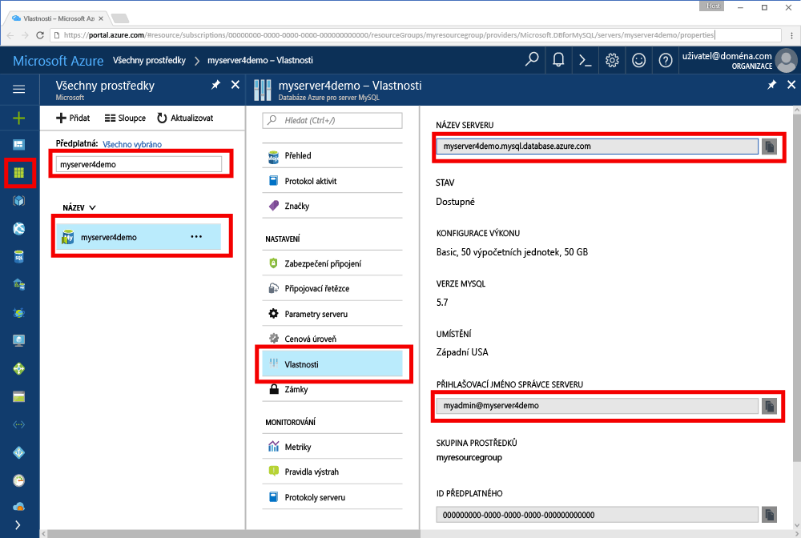

# <a name="azure-database-for-mysql-use-go-language-to-connect-and-query-data"></a>Azure Database for MySQL: Připojení a dotazování dat pomocí jazyka Go
Tento rychlý start ukazuje, jak se připojit ke službě Azure Database for MySQL z platforem Windows, Ubuntu Linux a Apple macOS pomocí kódu napsaného v jazyce [Go](https://golang.org/). Ukazuje, jak pomocí příkazů jazyka SQL dotazovat, vkládat, aktualizovat a odstraňovat data v databázi. Tento článek předpokládá, že máte zkušenosti s vývojem pomocí jazyka Go a teprve začínáte pracovat se službou Azure Database for MySQL.

## <a name="prerequisites"></a>Požadavky
Tento rychlý start jako výchozí bod využívá prostředky vytvořené v některém z těchto průvodců:
- [Vytvoření serveru Azure Database for MySQL pomocí webu Azure Portal](./quickstart-create-mysql-server-database-using-azure-portal.md)
- [Vytvoření serveru Azure Database for MySQL pomocí Azure CLI](./quickstart-create-mysql-server-database-using-azure-cli.md)

## <a name="install-go-and-mysql-connector"></a>Instalace jazyka Go a konektoru MySQL
Nainstalujte na svém počítači jazyk [Go](https://golang.org/doc/install) a ovladač [go-sql-driver for MySQL](https://github.com/go-sql-driver/mysql#installation) (minimálně verze 1.3). V závislosti na vaší platformě postupujte podle kroků v příslušné části:

### <a name="windows"></a>Windows
1. [Stáhněte](https://golang.org/dl/) a nainstalujte jazyk Go pro Microsoft Windows podle [pokynů k instalaci](https://golang.org/doc/install).
2. Z nabídky Start spusťte příkazový řádek.
3. Vytvořte složku pro váš projekt, například: `mkdir  %USERPROFILE%\go\src\mysqlgo`.
4. Změňte adresář na složku projektu, například `cd %USERPROFILE%\go\src\mysqlgo`.
5. Nastavte proměnnou prostředí GOPATH tak, aby odkazovala na adresář se zdrojovým kódem. `set GOPATH=%USERPROFILE%\go`.
6. Nainstalujte ovladač [go-sql-driver for mysql](https://github.com/go-sql-driver/mysql#installation) spuštěním příkazu`go get github.com/go-sql-driver/mysql`. Minimální požadovaná verze je verze 1.3.

   Stručně řečeno, nainstalujte jazyk Go a potom na příkazovém řádku spusťte následující příkazy:
   ```cmd
   mkdir  %USERPROFILE%\go\src\mysqlgo
   cd %USERPROFILE%\go\src\mysqlgo
   set GOPATH=%USERPROFILE%\go
   go get github.com/go-sql-driver/mysql
   ```

### <a name="linux-ubuntu"></a>Linux (Ubuntu)
1. Spusťte prostředí Bash. 
2. Nainstalujte jazyk Go spuštěním příkazu `sudo apt-get install golang-go`.
3. Ve svém domovském adresáři vytvořte složku pro projekt, například `mkdir -p ~/go/src/mysqlgo/`.
4. Změňte adresář na tuto složku, například `cd ~/go/src/mysqlgo/`.
5. Nastavte proměnnou prostředí GOPATH tak, aby odkazovala na platný zdrojový adresář, jako je například aktuální složka go ve vašem domovském adresáři. Spuštěním příkazu `export GOPATH=~/go` v prostředí Bash přidejte adresář go jako hodnotu proměnné GOPATH pro aktuální relaci prostředí.
6. Nainstalujte ovladač [go-sql-driver for mysql](https://github.com/go-sql-driver/mysql#installation) spuštěním příkazu`go get github.com/go-sql-driver/mysql`. Minimální požadovaná verze je verze 1.3.

   Stručně řečeno, spusťte tyto příkazy Bash:
   ```bash
   sudo apt-get install golang-go
   mkdir -p ~/go/src/mysqlgo/
   cd ~/go/src/mysqlgo/
   export GOPATH=~/go/
   go get github.com/go-sql-driver/mysql
   ```

### <a name="apple-macos"></a>Apple macOS
1. Stáhněte a nainstalujte jazyk Go podle [pokynů k instalaci](https://golang.org/doc/install) odpovídajících vaší platformě. 
2. Spusťte prostředí Bash.
3. Ve svém domovském adresáři vytvořte složku pro projekt, například `mkdir -p ~/go/src/mysqlgo/`.
4. Změňte adresář na tuto složku, například `cd ~/go/src/mysqlgo/`.
5. Nastavte proměnnou prostředí GOPATH tak, aby odkazovala na platný zdrojový adresář, jako je například aktuální složka go ve vašem domovském adresáři. Spuštěním příkazu `export GOPATH=~/go` v prostředí Bash přidejte adresář go jako hodnotu proměnné GOPATH pro aktuální relaci prostředí.
6. Nainstalujte ovladač [go-sql-driver for mysql](https://github.com/go-sql-driver/mysql#installation) spuštěním příkazu`go get github.com/go-sql-driver/mysql`. Minimální požadovaná verze je verze 1.3.

   Stručně řečeno, nainstalujte jazyk Go a potom spusťte tyto příkazy Bash:
   ```bash
   mkdir -p ~/go/src/mysqlgo/
   cd ~/go/src/mysqlgo/
   export GOPATH=~/go/
   go get github.com/go-sql-driver/mysql
   ```

## <a name="get-connection-information"></a>Získání informací o připojení
Získejte informace o připojení potřebné pro připojení ke službě Azure Database for MySQL. Potřebujete plně kvalifikovaný název serveru a přihlašovací údaje.

1. Přihlaste se k portálu [Azure Portal](https://portal.azure.com/).
2. V nabídce vlevo na webu Azure Portal klikněte na **Všechny prostředky** a vyhledejte vytvořený server (například **myserver4demo**).
3. Klikněte na název serveru **myserver4demo**.
4. Vyberte stránku **Vlastnosti** serveru a potom si poznamenejte **Název serveru** a **Přihlašovací jméno správce serveru**.
 
5. Pokud zapomenete přihlašovací údaje pro váš server, přejděte na stránku **Přehled**, kde můžete zobrazit přihlašovací jméno správce serveru a v případě potřeby obnovit heslo.
   

## <a name="build-and-run-go-code"></a>Sestavení a spuštění kódu jazyka Go 
1. K psaní kódu jazyka Go můžete použít jednoduchý textový editor, jako je Poznámkový blok v systému Microsoft Windows, [vi](http://manpages.ubuntu.com/manpages/xenial/man1/nvi.1.html#contenttoc5) nebo [Nano](https://www.nano-editor.org/) v systému Ubuntu nebo TextEdit v systému macOS. Pokud dáváte přednost bohatšímu integrovanému vývojovému prostředí (IDE), vyzkoušejte [Gogland](https://www.jetbrains.com/go/) od JetBrains, [Visual Studio Code](https://code.visualstudio.com/) od Microsoftu nebo [Atom](https://atom.io/).
2. Kód jazyka Go z dalších částí vložte do textových souborů a tyto soubory uložte s příponou \*.go do složky vašeho projektu (například `%USERPROFILE%\go\src\mysqlgo\createtable.go` (cesta ve Windows) nebo `~/go/src/mysqlgo/createtable.go` (cesta v Linuxu)).
3. Vyhledejte v kódu konstanty `HOST`, `DATABASE`, `USER` a `PASSWORD` a příklady hodnot nahraďte vlastními hodnotami. 
4. Spusťte příkazový řádek nebo prostředí Bash. Změňte adresář na složku vašeho projektu. Například ve Windows pomocí příkazu `cd %USERPROFILE%\go\src\mysqlgo\`. V Linuxu pomocí příkazu `cd ~/go/src/mysqlgo/`.  Některá ze zmíněných integrovaných vývojových prostředí (IDE) nabízejí možnosti ladění a modulu runtime, které nevyžadují příkazy prostředí.
5. Spusťte kód zadáním příkazu `go run createtable.go`, který aplikaci zkompiluje a spustí. 
6. Alternativně, pokud z kódu chcete sestavit nativní aplikaci, spusťte příkaz `go build createtable.go` a pak aplikaci spusťte pomocí souboru `createtable.exe`.

## <a name="connect-create-table-and-insert-data"></a>Připojení, vytvoření tabulky a vložení dat
Pomocí následujícího kódu se připojte k serveru, vytvořte tabulku a nahrajte data s využitím příkazu **INSERT** jazyka SQL. 

Kód importuje tři balíčky: [balíček sql](https://golang.org/pkg/database/sql/), balíček [go sql driver for mysql](https://github.com/go-sql-driver/mysql#installation) jako ovladač pro komunikaci se službou Azure Database for MySQL a [balíček fmt](https://golang.org/pkg/fmt/) pro tisk vstupů a výstupů na příkazovém řádku.

Kód volá metodu [sql.Open()](http://go-database-sql.org/accessing.html) pro připojení ke službě Azure Database for MySQL a pomocí metody [db.Ping()](https://golang.org/pkg/database/sql/#DB.Ping) zkontroluje stav připojení. Po celou dobu se používá [popisovač databáze](https://golang.org/pkg/database/sql/#DB), který uchovává fond připojení pro databázový server. Kód několikrát volá metodu [Exec()](https://golang.org/pkg/database/sql/#DB.Exec) pro spuštění několika příkazů jazyka DDL. Kód také pomocí metod [Prepare()](http://go-database-sql.org/prepared.html) a Exec() spouští připravené příkazy s různými parametry pro vložení tří řádků. Pokaždé se pomocí vlastní metody checkError() zkontroluje, jestli nedošlo k chybě, a pokud k nějaké dojde, kód se nouzově ukončí.

Nahraďte konstanty `host`, `database`, `user` a `password` vlastními hodnotami. 

```Go
package main

import (
    "database/sql"
    "fmt"

    _ "github.com/go-sql-driver/mysql"
)

const (
    host     = "myserver4demo.mysql.database.azure.com"
    database = "quickstartdb"
    user     = "myadmin@myserver4demo"
    password = "yourpassword"
)

func checkError(err error) {
    if err != nil {
        panic(err)
    }
}

func main() {

    // Initialize connection string.
    var connectionString = fmt.Sprintf("%s:%s@tcp(%s:3306)/%s?allowNativePasswords=true", user, password, host, database)

    // Initialize connection object.
    db, err := sql.Open("mysql", connectionString)
    checkError(err)
    defer db.Close()

    err = db.Ping()
    checkError(err)
    fmt.Println("Successfully created connection to database.")

    // Drop previous table of same name if one exists.
    _, err = db.Exec("DROP TABLE IF EXISTS inventory;")
    checkError(err)
    fmt.Println("Finished dropping table (if existed).")

    // Create table.
    _, err = db.Exec("CREATE TABLE inventory (id serial PRIMARY KEY, name VARCHAR(50), quantity INTEGER);")
    checkError(err)
    fmt.Println("Finished creating table.")

    // Insert some data into table.
    sqlStatement, err := db.Prepare("INSERT INTO inventory (name, quantity) VALUES (?, ?);")
    res, err := sqlStatement.Exec("banana", 150)
    checkError(err)
    rowCount, err := res.RowsAffected()
    fmt.Printf("Inserted %d row(s) of data.\n", rowCount)

    res, err = sqlStatement.Exec("orange", 154)
    checkError(err)
    rowCount, err = res.RowsAffected()
    fmt.Printf("Inserted %d row(s) of data.\n", rowCount)

    res, err = sqlStatement.Exec("apple", 100)
    checkError(err)
    rowCount, err = res.RowsAffected()
    fmt.Printf("Inserted %d row(s) of data.\n", rowCount)
    fmt.Println("Done.")
}

```

## <a name="read-data"></a>Čtení dat
Pomocí následujícího kódu se připojte a načtěte data s využitím příkazu **SELECT** jazyka SQL. 

Kód importuje tři balíčky: [balíček sql](https://golang.org/pkg/database/sql/), balíček [go sql driver for mysql](https://github.com/go-sql-driver/mysql#installation) jako ovladač pro komunikaci se službou Azure Database for MySQL a [balíček fmt](https://golang.org/pkg/fmt/) pro tisk vstupů a výstupů na příkazovém řádku.

Kód volá metodu [sql.Open()](http://go-database-sql.org/accessing.html) pro připojení ke službě Azure Database for MySQL a pomocí metody [db.Ping()](https://golang.org/pkg/database/sql/#DB.Ping) zkontroluje stav připojení. Po celou dobu se používá [popisovač databáze](https://golang.org/pkg/database/sql/#DB), který uchovává fond připojení pro databázový server. Kód volá metodu [Query()](https://golang.org/pkg/database/sql/#DB.Query) pro spuštění příkazu select. Potom spustí metodu [Next()](https://golang.org/pkg/database/sql/#Rows.Next) pro iteraci sadou výsledků dotazu a metodu [Scan()](https://golang.org/pkg/database/sql/#Rows.Scan) pro parsování hodnot sloupců a uložení těchto hodnot do proměnných. Pokaždé se pomocí vlastní metody checkError() zkontroluje, jestli nedošlo k chybě, a pokud k nějaké dojde, kód se nouzově ukončí.

Nahraďte konstanty `host`, `database`, `user` a `password` vlastními hodnotami. 

```Go
package main

import (
    "database/sql"
    "fmt"

    _ "github.com/go-sql-driver/mysql"
)

const (
    host     = "myserver4demo.mysql.database.azure.com"
    database = "quickstartdb"
    user     = "myadmin@myserver4demo"
    password = "yourpassword"
)

func checkError(err error) {
    if err != nil {
        panic(err)
    }
}

func main() {

    // Initialize connection string.
    var connectionString = fmt.Sprintf("%s:%s@tcp(%s:3306)/%s?allowNativePasswords=true", user, password, host, database)

    // Initialize connection object.
    db, err := sql.Open("mysql", connectionString)
    checkError(err)
    defer db.Close()

    err = db.Ping()
    checkError(err)
    fmt.Println("Successfully created connection to database.")

    // Variables for printing column data when scanned.
    var (
        id       int
        name     string
        quantity int
    )

    // Read some data from the table.
    rows, err := db.Query("SELECT id, name, quantity from inventory;")
    checkError(err)
    defer rows.Close()
    fmt.Println("Reading data:")
    for rows.Next() {
        err := rows.Scan(&id, &name, &quantity)
        checkError(err)
        fmt.Printf("Data row = (%d, %s, %d)\n", id, name, quantity)
    }
    err = rows.Err()
    checkError(err)
    fmt.Println("Done.")
}
```

## <a name="update-data"></a>Aktualizace dat
Pomocí následujícího kódu se připojte a aktualizujte data s využitím příkazu **UPDATE** jazyka SQL. 

Kód importuje tři balíčky: [balíček sql](https://golang.org/pkg/database/sql/), balíček [go sql driver for mysql](https://github.com/go-sql-driver/mysql#installation) jako ovladač pro komunikaci se službou Azure Database for MySQL a [balíček fmt](https://golang.org/pkg/fmt/) pro tisk vstupů a výstupů na příkazovém řádku.

Kód volá metodu [sql.Open()](http://go-database-sql.org/accessing.html) pro připojení ke službě Azure Database for MySQL a pomocí metody [db.Ping()](https://golang.org/pkg/database/sql/#DB.Ping) zkontroluje stav připojení. Po celou dobu se používá [popisovač databáze](https://golang.org/pkg/database/sql/#DB), který uchovává fond připojení pro databázový server. Kód volá metodu [Exec()](https://golang.org/pkg/database/sql/#DB.Exec) pro spuštění příkazu update. Pokaždé se pomocí vlastní metody checkError() zkontroluje, jestli nedošlo k chybě, a pokud k nějaké dojde, kód se nouzově ukončí.

Nahraďte konstanty `host`, `database`, `user` a `password` vlastními hodnotami. 

```Go
package main

import (
    "database/sql"
    "fmt"

    _ "github.com/go-sql-driver/mysql"
)

const (
    host     = "myserver4demo.mysql.database.azure.com"
    database = "quickstartdb"
    user     = "myadmin@myserver4demo"
    password = "yourpassword"
)

func checkError(err error) {
    if err != nil {
        panic(err)
    }
}

func main() {

    // Initialize connection string.
    var connectionString = fmt.Sprintf("%s:%s@tcp(%s:3306)/%s?allowNativePasswords=true", user, password, host, database)

    // Initialize connection object.
    db, err := sql.Open("mysql", connectionString)
    checkError(err)
    defer db.Close()

    err = db.Ping()
    checkError(err)
    fmt.Println("Successfully created connection to database.")

    // Modify some data in table.
    rows, err := db.Exec("UPDATE inventory SET quantity = ? WHERE name = ?", 200, "banana")
    checkError(err)
    rowCount, err := rows.RowsAffected()
    fmt.Printf("Deleted %d row(s) of data.\n", rowCount)
    fmt.Println("Done.")
}
```

## <a name="delete-data"></a>Odstranění dat
Pomocí následujícího kódu se připojte a odeberte data s využitím příkazu **DELETE** jazyka SQL. 

Kód importuje tři balíčky: [balíček sql](https://golang.org/pkg/database/sql/), balíček [go sql driver for mysql](https://github.com/go-sql-driver/mysql#installation) jako ovladač pro komunikaci se službou Azure Database for MySQL a [balíček fmt](https://golang.org/pkg/fmt/) pro tisk vstupů a výstupů na příkazovém řádku.

Kód volá metodu [sql.Open()](http://go-database-sql.org/accessing.html) pro připojení ke službě Azure Database for MySQL a pomocí metody [db.Ping()](https://golang.org/pkg/database/sql/#DB.Ping) zkontroluje stav připojení. Po celou dobu se používá [popisovač databáze](https://golang.org/pkg/database/sql/#DB), který uchovává fond připojení pro databázový server. Kód volá metodu [Exec()](https://golang.org/pkg/database/sql/#DB.Exec) pro spuštění příkazu delete. Pokaždé se pomocí vlastní metody checkError() zkontroluje, jestli nedošlo k chybě, a pokud k nějaké dojde, kód se nouzově ukončí.

Nahraďte konstanty `host`, `database`, `user` a `password` vlastními hodnotami. 

```Go
package main

import (
    "database/sql"
    "fmt"
    _ "github.com/go-sql-driver/mysql"
)

const (
    host     = "myserver4demo.mysql.database.azure.com"
    database = "quickstartdb"
    user     = "myadmin@myserver4demo"
    password = "yourpassword"
)

func checkError(err error) {
    if err != nil {
        panic(err)
    }
}

func main() {

    // Initialize connection string.
    var connectionString = fmt.Sprintf("%s:%s@tcp(%s:3306)/%s?allowNativePasswords=true", user, password, host, database)

    // Initialize connection object.
    db, err := sql.Open("mysql", connectionString)
    checkError(err)
    defer db.Close()

    err = db.Ping()
    checkError(err)
    fmt.Println("Successfully created connection to database.")

    // Modify some data in table.
    rows, err := db.Exec("DELETE FROM inventory WHERE name = ?", "orange")
    checkError(err)
    rowCount, err := rows.RowsAffected()
    fmt.Printf("Deleted %d row(s) of data.\n", rowCount)
    fmt.Println("Done.")
}
```

## <a name="next-steps"></a>Další kroky
> [!div class="nextstepaction"]
> [Migrace vaší databáze pomocí exportu a importu](./concepts-migrate-import-export.md)
