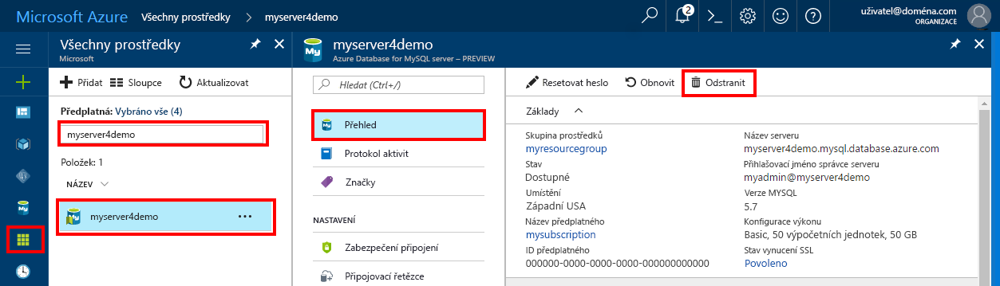

# <a name="create-an-azure-database-for-mysql-server-by-using-the-azure-portal"></a>Vytvoření serveru Azure Database for MySQL pomocí webu Azure Portal
Azure Database for MySQL je spravovaná služba, která slouží k provozu, správě a škálování vysoce dostupných databází MySQL v cloudu. V tomto rychlém startu se dozvíte, jak přibližně během pěti minut vytvořit server Azure Database for MySQL pomocí webu Azure Portal.  

Pokud ještě nemáte předplatné Azure, vytvořte si [bezplatný účet Azure](https://azure.microsoft.com/free/) před tím, než začnete.

## <a name="sign-in-to-azure"></a>Přihlášení k Azure
Otevřete webový prohlížeč a přejděte na web [Azure Portal](https://portal.azure.com/). Zadejte přihlašovací údaje pro přihlášení k portálu. Výchozím zobrazením je váš řídicí panel služby.

## <a name="create-an-azure-database-for-mysql-server"></a>Vytvoření serveru Azure Database for MySQL
Server Azure Database for MySQL vytvoříte s definovanou sadou [výpočetních prostředků a prostředků úložiště](./concepts-compute-unit-and-storage.md). Server vytvoříte v rámci [skupiny prostředků Azure](../azure-resource-manager/resource-group-overview.md).

Server Azure Database for MySQL vytvoříte pomocí tohoto postupu:

1. Vyberte tlačítko **Nový** (+) v levém horním rohu portálu.

2. Vyberte **Databáze** > **Azure Database for MySQL**. Službu můžete vyhledat také zadáním **MySQL** do vyhledávacího pole.

    

4. Vyplňte formulář podrobností nového serveru pomocí následujících informací, jak je vidět na předchozím obrázku:

    **Nastavení** | **Navrhovaná hodnota** | **Popis pole** 
    ---|---|---
    Název serveru | myserver4demo | Jedinečný název, který identifikuje váš server Azure Database for MySQL. K zadanému názvu serveru se připojí název domény *mysql.database.azure.com*. Název serveru může obsahovat pouze malá písmena, číslice a znak spojovníku (-). Musí se skládat ze 3 až 63 znaků.
    Předplatné | Vaše předplatné | Předplatné Azure, které chcete použít pro váš server. Pokud máte více předplatných, zvolte předplatné, ve kterém se vám prostředek účtuje.
    Skupina prostředků | myresourcegroup | Název nové nebo existující skupiny prostředků.
    Přihlašovací jméno správce serveru | myadmin | Přihlašovací účet, který budete používat při připojování k serveru. Přihlašovací jméno správce nemůže být **azure_superuser**, **admin**, **administrator**, **root**, **guest** ani **public**.
    Heslo | *Nějaké si zvolte* | Nové heslo pro účet správce serveru. Musí se skládat z 8 až 128 znaků. Heslo musí obsahovat znaky ze tří z těchto kategorií: velká písmena anglické abecedy, malá písmena anglické abecedy, číslice (0–9) a jiné než alfanumerické znaky (!, $, #, % apod.).
    Potvrzení hesla | *Nějaké si zvolte*| Potvrzené heslo účtu správce.
    Umístění | *Oblast nejbližší vašim uživatelům*| Umístění co nejblíže vašim uživatelům nebo dalším aplikacím Azure.
    Verze | *Nejnovější verze*| Nejnovější verze (pokud nemáte specifické požadavky vyžadující jinou verzi).
    Cenová úroveň | **Basic**, **50 výpočetních jednotek**, **50 GB** | Úroveň služby a výkonu nové databáze. Na kartě v horní části vyberte **Úroveň Basic**. Vyberte levý konec posuvníku **Výpočetní jednotky** a pro účely tohoto rychlého startu upravte hodnotu na nejnižší dostupné množství. Vyberte **OK** a uložte výběr cenové úrovně. Další informace najdete na následujícím snímku obrazovky.
    Připnutí na řídicí panel | Zaškrtnout | Umožňuje snadné sledování vašeho serveru na úvodní stránce řídicího panelu na webu Azure Portal.

    > [!IMPORTANT]
    > Zde zadané přihlašovací jméno a heslo správce serveru se vyžadují pro přihlášení k serveru a jeho databázím dále v tomto rychlém startu. Tyto informace si zapamatujte nebo poznamenejte pro pozdější použití.
    > 

    

4.  Vyberte **Vytvořit**, aby se server zřídil. Zřizování může trvat až 20 minut.
   
5.  Pokud chcete monitorovat proces nasazení, vyberte **Oznámení** (ikona zvonku) na panelu nástrojů.

## <a name="configure-a-server-level-firewall-rule"></a>Konfigurace pravidla brány firewall na úrovni serveru

Služba Azure Database for MySQL vytváří bránu firewall na úrovni serveru. Ta brání externím aplikacím a nástrojům v připojení k serveru a kterékoli databázi na serveru, pokud není vytvořené pravidlo brány firewall k otevření brány firewall pro konkrétní IP adresy. 

1.   Po dokončení nasazení najděte váš server. V případě potřeby ho můžete vyhledat. Vyberte například **Všechny prostředky** z nabídky na levé straně. Pak zadejte název serveru, například ukázkový **myserver4demo**. Vyhledáte tak nově vytvořený server. Vyberte název serveru ze seznamu výsledků hledání. Otevře se stránka **Přehled** vašeho serveru a poskytne vám možnosti další konfigurace.

2. Na stránce serveru vyberte **Zabezpečení připojení**.

3.  Pod nadpisem **Pravidla brány firewall** vyberte prázdné textové pole ve sloupci **Název pravidla** a začněte vytvářet pravidlo brány firewall. 

    Pro účely tohoto rychlého startu povolíme provoz do serveru ze všech IP adres tak, že do pole v každém sloupci vyplníme následující hodnoty:

    Název pravidla | Počáteční IP adresa | Koncová IP adresa 
    ---|---|---
    AllowAllIps |  0.0.0.0 | 255.255.255.255

4. Na horním panelu nástrojů na stránce **Zabezpečení připojení** vyberte **Uložit**. Než budete pokračovat, počkejte na zobrazení oznámení o úspěšném dokončení aktualizace. 

    > [!NOTE]
    > Připojení ke službě Azure Database for MySQL komunikují přes port 3306. Pokud se pokoušíte připojit z podnikové sítě, odchozí provoz přes port 3306 nemusí být povolený. V takovém případě se k serveru nemůžete připojit, dokud vaše IT oddělení neotevře port 3306.
    > 

## <a name="get-the-connection-information"></a>Získání informací o připojení
Pokud se chcete připojit ke svému databázovému serveru, potřebujete úplný název serveru a přihlašovací údaje správce. Pravděpodobně jste si tyto hodnoty poznamenali v dřívější části tohoto článku Rychlý start. Pokud ne, název serveru a přihlašovací údaje můžete snadno vyhledat na stránce **Přehled** nebo **Vlastnosti** serveru na webu Azure Portal.

Pokud je chcete vyhledat, postupujte následovně: 

1. Otevřete stránku **Přehled** vašeho serveru. Poznamenejte si **Název serveru** a **Přihlašovací jméno správce serveru**. 

2. Přejeďte kurzorem přes jednotlivá pole a vpravo od textu se zobrazí ikona kopírování. Podle potřeby hodnoty zkopírujte výběrem ikony kopírování.

V tomto příkladu je název serveru **myserver4demo.mysql.database.azure.com** a přihlašovací jméno správce serveru je **myadmin@myserver4demo**.

## <a name="connect-to-mysql-by-using-the-mysql-command-line-tool"></a>Připojení k MySQL pomocí nástroje pro příkazový řádek mysql
Existuje řada aplikací, které můžete použít pro připojení k vašemu serveru Azure Database for MySQL. 

Nejprve si ukážeme, jak se k serveru připojit pomocí nástroje pro příkazový řádek [mysql](https://dev.mysql.com/doc/refman/5.7/en/mysql.html). Můžete také použít webový prohlížeč a Azure Cloud Shell, jak je zde popsáno, bez instalace dalšího softwaru. Pokud máte nástroj mysql nainstalovaný místně, můžete se připojit i z něj.

1. Spusťte Azure Cloud Shell pomocí ikony terminálu (**>_**) v pravém horním rohu webu Azure Portal.

2.  V prohlížeči se otevře Azure Cloud Shell, kde můžete zadávat příkazy prostředí Bash.

    

3. V příkazovém řádku služby Cloud Shell se zadáním příkazového řádku mysql připojte k serveru Azure Database for MySQL.

    Pro připojení k serveru Azure Database for MySQL pomocí nástroje mysql použijte následující formát:

    ```bash
    mysql --host <yourserver> --user <server admin login> --password
    ```

    Například následující příkaz se připojí k našemu ukázkovému serveru:

    ```azurecli-interactive
    mysql --host myserver4demo.mysql.database.azure.com --user myadmin@myserver4demo --password
    ```

    Parametr mysql |Navrhovaná hodnota|Popis
    ---|---|---
    --host | *Název serveru* | Hodnota názvu serveru, kterou jste použili dříve při vytváření serveru Azure Database for MySQL. Server v našem příkladu je **myserver4demo.mysql.database.azure.com**. Použijte plně kvalifikovaný název domény (**\*.mysql.database.azure.com**), jak je znázorněno v příkladu. Pokud si název vašeho serveru nepamatujete, získejte informace o připojení pomocí postupu v předchozí části. 
    --user | *Přihlašovací jméno správce serveru* |Přihlašovací uživatelské jméno správce serveru, které jste zadali dříve při vytváření serveru Azure Database for MySQL. Pokud si uživatelské jméno nepamatujete, získejte informace o připojení pomocí postupu v předchozí části. Formát je *username@servername*.
    --password | *Počkejte na zobrazení výzvy* |Stejné heslo, které jste zadali při vytváření serveru. Poznámka: při zadávání hesla se na příkazovém řádku Bash nezobrazují zadávané znaky. Po zadání hesla stiskněte **Enter**.

   Jakmile bude nástroj mysql připojený, zobrazí příkazový řádek `mysql>`, na kterém můžete zadávat příkazy. 

   Následuje příklad výstupu nástroje mysql:

    ```bash
    Welcome to the MySQL monitor.  Commands end with ; or \g.
    Your MySQL connection id is 65505
    Server version: 5.6.26.0 MySQL Community Server (GPL)
    
    Copyright (c) 2000, 2017, Oracle and/or its affiliates. All rights reserved.
    
    Oracle is a registered trademark of Oracle Corporation and/or its
    affiliates. Other names may be trademarks of their respective
    owners.

    Type 'help;' or '\h' for help. Type '\c' to clear the current input statement.
    
    mysql>
    ```
    > [!TIP]
    > Pokud brána firewall není nakonfigurovaná k povolení IP adres služby Azure Cloud Shell, dojde k následující chybě:
    >
    > ERROR 2003 (28000): Client with IP address 123.456.789.0 is not allowed to access the server. (CHYBA 2003 (28000): Klient s IP adresou 123.456.789.0 nemá povolený přístup k tomuto serveru.)
    >
    > Pokud chcete chybu vyřešit, ujistěte se, že konfigurace serveru odpovídá postupu v části Konfigurace pravidla brány firewall na úrovni serveru tohoto článku.

4. Pokud chcete ověřit funkčnost připojení, zobrazte stav serveru zadáním `status` na příkazovém řádku mysql>.

    ```sql
    status
    ```

   > [!TIP]
   > Další příkazy najdete v [Referenční příručce k MySQL 5.7 – v kapitole 4.5.1](https://dev.mysql.com/doc/refman/5.7/en/mysql.html).

5.  Vytvořte prázdnou databázi zadáním následujícího příkazu na příkazovém řádku **mysql>**:
    ```sql
    CREATE DATABASE quickstartdb;
    ```
    Dokončení příkazu může chvíli trvat. 

    V rámci serveru Azure Database for MySQL můžete vytvořit jednu nebo několik databází. Můžete se rozhodnout vytvořit jednu databázi na server pro využití všech prostředků nebo vytvořit několik databází, které budou prostředky sdílet. Neexistuje žádné omezení počtu databází, které můžete vytvořit, ale více databází sdílí stejné prostředky serveru. 

6. Zobrazte výpis databází zadáním následujícího příkazu na příkazovém řádku **mysql>**:

    ```sql
    SHOW DATABASES;
    ```

7.  Zadejte `\q` a pak stisknutím klávesy **Enter** ukončete nástroj mysql. Jakmile budete hotovi, můžete zavřít Azure Cloud Shell.

Právě jste se připojili k serveru Azure Database for MySQL a vytvořili prázdnou uživatelskou databázi. Pokračujte k další části, kde najdete podobné cvičení. V dalším cvičení se ke stejnému serveru připojíte pomocí dalšího běžného nástroje MySQL Workbench.

## <a name="connect-to-the-server-by-using-the-mysql-workbench-gui-tool"></a>Připojení k serveru pomocí nástroje s grafickým uživatelským rozhraním MySQL Workbench
Pokud se chcete připojit k serveru pomocí nástroje s grafickým uživatelským rozhraním MySQL Workbench, postupujte následovně:

1.  Na klientském počítači otevřete aplikaci MySQL Workbench. MySQL Workbench můžete stáhnout a nainstalovat ze [stránky pro stažení nástroje MySQL Workbench](https://dev.mysql.com/downloads/workbench/).

2.  V dialogovém okně pro **nastavení nového připojení** zadejte na kartě **Parametry** následující informace:

    

    |Nastavení |Navrhovaná hodnota|Popis pole|
    |---|---|---|
     Název připojení | Ukázkové připojení | Popisek pro toto připojení. |
    Způsob připojení | Standard (TCP/IP) | Standard (TCP/IP) je dostačující. |
    Název hostitele | *Název serveru* | Hodnota názvu serveru, kterou jste použili dříve při vytváření serveru Azure Database for MySQL. Server v našem příkladu je **myserver4demo.mysql.database.azure.com**. Použijte plně kvalifikovaný název domény (**\*.mysql.database.azure.com**), jak je znázorněno v příkladu. Pokud si název vašeho serveru nepamatujete, získejte informace o připojení pomocí postupu v předchozí části.|
     Port | 3306 | Port, který se má použít při připojování k serveru Azure Database for MySQL. |
    Uživatelské jméno |  *Přihlašovací jméno správce serveru* | Přihlašovací údaje správce serveru, které jste zadali dříve při vytváření serveru Azure Database for MySQL. Uživatelské jméno v našem příkladu je **myadmin@myserver4demo**. Pokud si uživatelské jméno nepamatujete, získejte informace o připojení pomocí postupu v předchozí části. Formát je *username@servername*.
    Heslo | *Vaše heslo* | Výběrem tlačítka **Uložit v trezoru...** heslo uložte. |

3. Pokud chcete otestovat, jestli jsou všechny parametry správně nakonfigurované, vyberte **Test připojení**. Potom vyberte **OK** a uložte připojení. 

    > [!NOTE]
    > Ve výchozím nastavení se na vašem serveru vynucuje SSL, což vyžaduje další konfiguraci pro úspěšné připojení. Další informace najdete v tématu [Konfigurace připojení SSL v aplikaci pro zabezpečené připojení k Azure Database for MySQL](./howto-configure-ssl.md). Pokud chcete pro tento rychlý start zakázat SSL, přejděte na web Azure Portal. Potom vyberte stránku Zabezpečení připojení a deaktivujte přepínací tlačítko **Vynucení připojení SSL**.

## <a name="clean-up-resources"></a>Vyčištění prostředků
Prostředky, které jste vytvořili v rámci tohoto rychlého startu, můžete vyčistit dvěma způsoby. Můžete odstranit [skupinu prostředků Azure](../azure-resource-manager/resource-group-overview.md), což zahrnuje odstranění všech prostředků v této skupině prostředků. Pokud chcete ostatní prostředky zachovat beze změny, odstraňte pouze příslušný prostředek serveru.

> [!TIP]
> Další rychlé starty v této kolekci jsou postavené na tomto rychlém startu. Pokud chcete pokračovat v práci s dalšími rychlými starty, neprovádějte čištění prostředků, které jste vytvořili v rámci tohoto rychlého startu. Pokud pokračovat nechcete, pomocí následujících kroků odstraňte všechny prostředky, které jste v tomto rychlém startu vytvořili.
>

Pokud chcete odstranit celou skupinu prostředků včetně nově vytvořeného serveru, postupujte následovně:

1.  Vyhledejte skupinu prostředků na webu Azure Portal. V nabídce na levé straně vyberte **Skupiny prostředků** a potom vyberte název vaší skupiny prostředků (jako je **myresourcegroup** v našem příkladu).

2.  Na stránce vaší skupiny prostředků vyberte **Odstranit**. Pak pro potvrzení odstranění zadejte do pole název vaší skupiny prostředků (jako je **myresourcegroup** v našem příkladu) a vyberte **Odstranit**.

Pokud chcete odstranit pouze nově vytvořený server, postupujte následovně:

1.  Vyhledejte server na webu Azure Portal, pokud ho ještě nemáte otevřený. Z nabídky na levé straně webu Azure Portal vyberte **Všechny prostředky**. Pak vyhledejte server, který jste vytvořili.

2.  Na stránce **Přehled** vyberte **Odstranit**. 

    

3.  Potvrďte název serveru, který chcete odstranit, a zobrazte jeho databáze, které tím ovlivníte. Do pole zadejte název vašeho serveru (jako je **myserver4demo** v našem příkladu). Vyberte **Odstranit**.

## <a name="next-steps"></a>Další kroky

> [!div class="nextstepaction"]
> [Návrh první databáze Azure Database for MySQL](./tutorial-design-database-using-portal.md)


