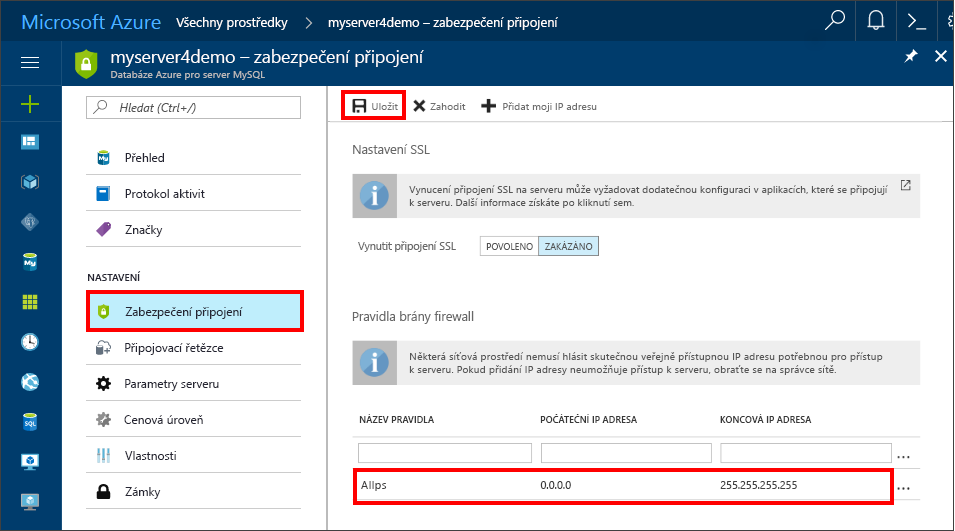

# <a name="create-an-azure-database-for-mysql-server-using-azure-portal"></a>Vytvoření serveru Azure Database for MySQL pomocí portálu Azure Portal

Tento článek vás provede vytvořením ukázkového serveru Azure Database for MySQL v pěti minutách pomocí portálu Azure Portal. 

Pokud ještě nemáte předplatné Azure, vytvořte si [bezplatný účet](https://azure.microsoft.com/free/) před tím, než začnete.

## <a name="log-in-to-azure"></a>Přihlaste se k Azure.
Otevřete svůj webový prohlížeč a přejděte na [portál Microsoft Azure Portal](https://portal.azure.com/). Zadejte přihlašovací údaje pro přihlášení k portálu. Výchozím zobrazením je váš řídicí panel služby.


## <a name="create-azure-database-for-mysql-server"></a>Vytvoření serveru Azure Database for MySQL

1. Přejděte na **Databáze** > **MySQL**. Pokud server Azure Database for MySQL nemůžete najít v kategorii **Databáze**, klikněte na **Zobrazit vše** pro zobrazení všech dostupných databázových služeb. Pokud chcete službu najít rychle, můžete do vyhledávacího pole zadat **MySQL**.


2. Klikněte na ikonu **MySQL** a pak klikněte na **Vytvořit**.
V našem příkladu vyplňte na stránce Azure Database for MySQL následující informace:

| **Pole formuláře** | **Popis pole** |
|----------------|-----------------------|
| *Název serveru* | mysqlserver4demo (název serveru je globálně jedinečný) |
| *Předplatné* | MySQLaaS (vyberte z rozevíracího seznamu) |
| *Skupina prostředků* | myresource (vytvořte skupinu prostředků nebo použijte stávající) |
| *Přihlašovací jméno správce serveru* | myadmin (název účtu správce instalace) |
| *Heslo* | nastavte heslo účtu správce |
| *Potvrdit heslo* | potvrďte heslo účtu správce |
| *Umístění* | Severní Evropa (vyberte mezi možnostmi **Severní Evropa** a **Západní USA**) |
| *Verze* | 5.6 (zvolte verzi serveru MySQL) |
| *Konfigurovat výkon* | Basic (zvolte **Úroveň výkonu**, **Výpočetní jednotky**, **Úložiště** a potom klikněte na **OK**) |


Po několika minutách bude váš server Azure Database for MySQL zřízený a spuštěný. Pokud chcete monitorovat proces nasazení, můžete kliknout na tlačítko **Oznámení** (ikona zvonku) na panelu nástrojů.

> [!TIP]
> Doporučujeme umístit služby Azure do stejné oblasti a zvolit umístění, které je k vám co nejblíže. Dále můžete zaškrtnout možnost **Připnout na řídicí panel**, abyste povolili snadné sledování vašich nasazení.

## <a name="configure-the-firewall"></a>Konfigurace brány firewall
Dříve než se poprvé připojíte z klienta k Azure Database for MySQL, musíte nakonfigurovat bránu firewall a přidat IP adresu veřejné sítě klienta (nebo rozsah IP adres) na seznam povolených adres.

1. Klikněte na nově vytvořený server a pak klikněte na **Nastavení**.
  

2. V části **OBECNÉ** klikněte na **Nastavení brány firewall**. Pokud chcete přidat IP adresu místního počítače nebo nakonfigurovat rozsah IP adres, můžete kliknout na **Přidat moji IP adresu**. Po vytvoření pravidel nezapomeňte kliknout na **Uložit**.
  

## <a name="get-connection-information"></a>Získání informací o připojení
Na portálu Azure Portal získejte plně kvalifikovaný název domény pro server Azure MySQL. Plně kvalifikovaný název domény použijte pro připojení k vašemu serveru pomocí nástroje příkazového řádku **mysql.exe**.

1.    Na portálu [Azure Portal](https://portal.azure.com/) klikněte v levé nabídce na **Všechny prostředky** a klikněte na server Azure Database for MySQL.

2.    Klikněte na **Vlastnosti**. Poznamenejte si **NÁZEV SERVERU** a **PŘIHLAŠOVACÍ JMÉNO SPRÁVCE SERVERU**.
V tomto příkladu je název serveru *mysql4doc.database.windows.net* a přihlašovací jméno správce serveru je *mysqladmin@mysql4doc*.

## <a name="connect-to-the-server-using-mysqlexe-command-line-tool"></a>Připojení k serveru pomocí nástroje příkazového řádku mysqlexe
V rámci serveru MySQL můžete vytvořit více databází. Neexistuje žádné omezení počtu databází, které je možné vytvořit. Více databází ale sdílí stejné prostředky serveru.  Pokud se k serveru chcete připojit pomocí nástroje příkazového řádku **mysql.exe**, otevřete na portálu **Azure Cloud Shell** a zadejte toto:

1. Připojení k serveru pomocí nástroje příkazového řádku **mysql**:
```dos
 mysql -h mysqlserver4demo.database.windows.net -u myadmin@mysqlserver4demo -p
```

2. Zobrazení stavu serveru:
```dos
 mysql> status
```
  

> [!TIP]
> Další příkazy najdete v [Referenční příručce k MySQL 5.6 – v kapitole 4.5.1](https://dev.mysql.com/doc/refman/5.6/en/mysql.html).

## <a name="connect-to-the-server-using-the-mysql-workbench-gui-tool"></a>Připojení k serveru pomocí nástroje grafického uživatelského rozhraní MySQL Workbench
1.    Na klientském počítači spusťte aplikaci MySQL Workbench. MySQL Workbench můžete stáhnout a nainstalovat [odtud](https://dev.mysql.com/downloads/workbench/).

2.    V dialogovém okně pro **nastavení nového připojení** zadejte na kartě **Parametry** následující informace:

| **Parametry** | **Popis** |
|----------------|-----------------|
|    *Název připojení* | zadejte název pro toto připojení (libovolný) |
| *Způsob připojení* | zvolte Standardní (TCP/IP) |
| *Název hostitele* | mycliserver.database.windows.net (NÁZEV SERVERU, který jste si dříve poznamenali) |
| *Port* | 3306 |
| *Uživatelské jméno* | myadmin@mycliserver(PŘIHLAŠOVACÍ JMÉNO SPRÁVCE SERVERU, které jste si dříve poznamenali) |
| *Heslo* | heslo účtu správce můžete uložit do trezoru |


3.    Pokud chcete otestovat, jestli jsou všechny parametry správně nakonfigurované, klikněte na **Test připojení**.

4.    Teď můžete kliknout na právě vytvořené připojení a úspěšně se připojit k serveru.

> Ve výchozím nastavení se na vašem serveru vynucuje SSL, což vyžaduje další konfiguraci, která zajistí úspěšné připojení. Podívejte se na téma [Konfigurace připojení SSL v aplikaci pro zabezpečené připojení k Azure Database for MySQL](./howto-configure-ssl.md).  Pokud chcete SSL pro tento rychlý start zakázat, můžete na portálu přejít na „Zabezpečení připojení“ a zakázat vynucování SSL.

## <a name="clean-up-resources"></a>Vyčištění prostředků

Pokud tyto prostředky nepotřebujete pro další rychlý start nebo kurz, můžete je následujícím způsobem odstranit:

1. Na portálu Azure Portal v nabídce vlevo klikněte na **Skupiny prostředků** a pak na **myresource**. 
2. Na stránce skupiny prostředků klikněte na **Odstranit**, do textového pole zadejte **myresource** a pak klikněte na **Odstranit**.

## <a name="next-steps"></a>Další kroky

> [!div class="nextstepaction"]
> [Návrh první databáze Azure Database for MySQL](./tutorial-design-database-using-portal.md)


