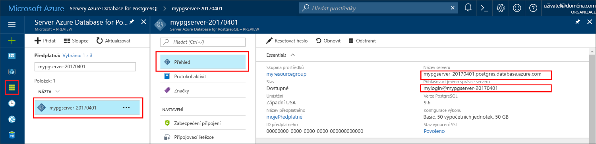

# <a name="azure-database-for-postgresql-use-nodejs-to-connect-and-query-data"></a>Azure Database for PostgreSQL: Použití Node.js k připojení a dotazování dat
Tento rychlý start ukazuje, jak se připojit ke službě Azure Database for PostgreSQL pomocí [Node.js](https://nodejs.org/) z platforem Windows, Ubuntu Linux a Mac. Ukazuje, jak pomocí příkazů jazyka SQL dotazovat, vkládat, aktualizovat a odstraňovat data v databázi. Kroky v tomto článku předpokládají, že máte zkušenosti s vývojem pomocí Node.js a teprve začínáte pracovat se službou Azure Database for PostgreSQL.

## <a name="prerequisites"></a>Požadavky
Tento rychlý start využívá jako výchozí bod prostředky vytvořené v některém z těchto průvodců:
- [Vytvoření databáze – portál](quickstart-create-server-database-portal.md)
- [Vytvoření databáze – rozhraní příkazového řádku](quickstart-create-server-database-azure-cli.md)

Budete také muset:
- Instalovat [Node.js](https://nodejs.org)
- Instalovat balíček [pg](https://www.npmjs.com/package/pg) 

## <a name="install-nodejs"></a>Instalovat Node.js 
Postup instalace Node.js v závislosti na platformě:

### <a name="mac-os"></a>**Mac OS**
Zadejte následující příkazy, abyste nainstalovali **brew**, snadno použitelného správce balíčků pro Mac OS X a **Node.js**.

```bash
ruby -e "$(curl -fsSL https://raw.githubusercontent.com/Homebrew/install/master/install)"
brew install node
```

### <a name="linux-ubuntu"></a>**Linux (Ubuntu)**
Zadejte následující příkazy, abyste nainstalovali **Node.js** a **npm** – správce balíčků pro Node.js.

```bash
sudo apt-get install -y nodejs npm
```

### <a name="windows"></a>**Windows**
Přejděte na [stránky pro stažení Node.js](https://nodejs.org/en/download/) a vyberte požadovanou možnost Instalační služby systému Windows.

## <a name="install-pg-client"></a>Instalace klienta pg
Nainstalujte [pg](https://www.npmjs.com/package/pg), což je čistě javascriptový neblokující klient pro node.js, užitečný pro připojení a dotazování PostgreSQL.

Abyste to mohli udělat, spusťte správce balíčků pro uzly (npm) pro JavaScript z příkazového řádku, abyste instalovali klienta pg.
```bash
npm install pg
```

Ověřte instalaci tak, že vypíšete nainstalované balíčky.
```bash
npm list
```
Výstup vypisujícího příkazu potvrdí verzi jednotlivých komponent. 
```
`-- pg@6.2.3
  +-- buffer-writer@1.0.1
  +-- packet-reader@0.3.1
etc...
```

## <a name="get-connection-information"></a>Získání informací o připojení
Získejte informace o připojení potřebné pro připojení ke službě Azure Database for PostgreSQL. Potřebujete plně kvalifikovaný název serveru a přihlašovací údaje.

1. Přihlaste se k portálu [Azure Portal](https://portal.azure.com/).
2. V nabídce na levé straně na portálu Azure Portal klikněte na **Všechny prostředky** a vyhledejte právě vytvořený server **mypgserver-20170401**.
3. Klikněte na název serveru **mypgserver-20170401**.
4. Vyberte stránku **Přehled** serveru. Poznamenejte si **Název serveru** a **Přihlašovací jméno správce serveru**.
 
5. Pokud zapomenete přihlašovací údaje k serveru, přejděte na stránku **Přehled**, kde můžete zobrazit přihlašovací jméno správce serveru a v případě potřeby resetovat heslo.

## <a name="running-the-javascript-code-in-nodejs"></a>Spuštění kódu jazyka JavaScript v Node.js
Node.js můžete spouštět z prostředí Bash nebo příkazového řádku Windows tak, že zadáte `node` a potom interaktivně spustíte příklad kódu jazyka JavaScript tak, že ho zkopírujete a vložíte na příkazový řádek. Případně můžete kód jazyka JavaScript uložit do textového souboru a provést příkaz `node filename.js`, kdy název souboru se bude shodovat s parametrem, který ho spouští.

## <a name="connect-create-table-and-insert-data"></a>Připojení, vytvoření tabulky a vložení dat
Použijte následující kód k připojení a načtení dat pomocí příkazů **CREATE TABLE** a **INSERT INTO** jazyka SQL.
Objekt [pg.Client](https://github.com/brianc/node-postgres/wiki/Client) slouží k vytvoření rozhraní pro server PostgreSQL. Funkce [pg.Client.connect()](https://github.com/brianc/node-postgres/wiki/Client#method-connect) se používá k navázání připojení k serveru. Funkce [pg.Client.query()](https://github.com/brianc/node-postgres/wiki/Query) se používá k provedení dotazu SQL na databázi PostgreSQL. 

Nahraďte parametry host (hostitel), dbname (název databáze), user (uživatel) a password (heslo) hodnotami, které jste zadali při vytváření serveru a databáze. 

```javascript
const pg = require('pg');

var config =
{
    host: 'mypgserver-20170401.postgres.database.azure.com',
    user: 'mylogin@mypgserver-20170401',
    password: '<server_admin_password>',
    database: 'mypgsqldb',
    port: 5432,
    ssl: true
};

const client = new pg.Client(config);

client.connect(function (err)
{
    if (err)
        throw err;
    else
    {
        queryDatabase();
    }
});

function queryDatabase()
{
    client.query(
        ' \
            DROP TABLE IF EXISTS inventory; \
            CREATE TABLE inventory (id serial PRIMARY KEY, name VARCHAR(50), quantity INTEGER); \
            INSERT INTO inventory (name, quantity) VALUES (\'banana\', 150); \
            INSERT INTO inventory (name, quantity) VALUES (\'orange\', 154); \
            INSERT INTO inventory (name, quantity) VALUES (\'apple\', 100); \
        ',
        function (err)
    {
        console.log("Connection established");

        if (err)
            throw err;
        else
        {
            client.end(function (err)
            {
                if (err)
                    throw err;

                // Else closing connection finished without error
                console.log("Closed client connection");
            });

            console.log("Finished execution, exiting now");
            process.exit()
        }
    });
}
```

## <a name="read-data"></a>Čtení dat
Pomocí následujícího kódu se připojte a načtěte data s využitím příkazu **SELECT** jazyka SQL. Objekt [pg.Client](https://github.com/brianc/node-postgres/wiki/Client) slouží k vytvoření rozhraní pro server PostgreSQL. Funkce [pg.Client.connect()](https://github.com/brianc/node-postgres/wiki/Client#method-connect) se používá k navázání připojení k serveru. Funkce [pg.Client.query()](https://github.com/brianc/node-postgres/wiki/Query) se používá k provedení dotazu SQL na databázi PostgreSQL. 

Nahraďte parametry host (hostitel), dbname (název databáze), user (uživatel) a password (heslo) hodnotami, které jste zadali při vytváření serveru a databáze. 

```javascript
const pg = require('pg');

var config =
{
    host: 'mypgserver-20170401.postgres.database.azure.com',
    user: 'mylogin@mypgserver-20170401',
    password: '<server_admin_password>',
    database: 'mypgsqldb',
    port: 5432,
    ssl: true
};


const client = new pg.Client(config);

client.connect(function (err)
{
    if (err)
        throw err;

    else
    {
        console.log("Connected to Azure Database for PostgreSQL server:" + config.host);
        queryDatabase();
    }
});

function queryDatabase()
{
    // Declare array to hold query result set
    const results = [];

    console.log("Running query to PostgreSQL server:" + config.host);

    // Perform query
    var query = client.query('SELECT * FROM inventory;');

    // Print result set
    query.on('row', function(row)
    {
        console.log("Read " + JSON.stringify(row));
    });

    // Exit program after execution
    query.on('end', function(row)
    {
        console.log("Finished execution, exiting now");
        process.exit()
    });
}
```

## <a name="update-data"></a>Aktualizace dat
Použijte následující kód k připojení a čtení dat pomocí příkazu **UPDATE** jazyka SQL. Objekt [pg.Client](https://github.com/brianc/node-postgres/wiki/Client) slouží k vytvoření rozhraní pro server PostgreSQL. Funkce [pg.Client.connect()](https://github.com/brianc/node-postgres/wiki/Client#method-connect) se používá k navázání připojení k serveru. Funkce [pg.Client.query()](https://github.com/brianc/node-postgres/wiki/Query) se používá k provedení dotazu SQL na databázi PostgreSQL. 

Nahraďte parametry host (hostitel), dbname (název databáze), user (uživatel) a password (heslo) hodnotami, které jste zadali při vytváření serveru a databáze. 

```javascript
const pg = require('pg');

var config =
{
    host: 'mypgserver-20170401.postgres.database.azure.com',
    user: 'mylogin@mypgserver-20170401',
    password: '<server_admin_password>',
    database: 'mypgsqldb',
    port: 5432,
    ssl: true
};

const client = new pg.Client(config);

client.connect(function (err)
{
    if (err)
        throw err;
    else
    {
        queryDatabase();
    }   
});

function queryDatabase()
{
    client.query('UPDATE inventory SET quantity= 1000 WHERE name=\'banana\';', function (err, result)
    {
        console.log("Connection established");

        if (err)
            throw err;
        else
        {
            client.end(function (err)
            {
                if (err)
                    throw err;
                
                // Else closing connection finished without error
                console.log("Closed client connection");
            });             
        }

        console.log("Finished execution, exiting now");
        process.exit()
    });
}
```

## <a name="delete-data"></a>Odstranění dat
Pomocí následujícího kódu se připojte a načtěte data s využitím příkazu **DELETE** jazyka SQL. Objekt [pg.Client](https://github.com/brianc/node-postgres/wiki/Client) slouží k vytvoření rozhraní pro server PostgreSQL. Funkce [pg.Client.connect()](https://github.com/brianc/node-postgres/wiki/Client#method-connect) se používá k navázání připojení k serveru. Funkce [pg.Client.query()](https://github.com/brianc/node-postgres/wiki/Query) se používá k provedení dotazu SQL na databázi PostgreSQL. 

Nahraďte parametry host (hostitel), dbname (název databáze), user (uživatel) a password (heslo) hodnotami, které jste zadali při vytváření serveru a databáze. 

```javascript
const pg = require('pg');

var config =
{
    host: 'mypgserver-20170401.postgres.database.azure.com',
    user: 'mylogin@mypgserver-20170401',
    password: '<server_admin_password>',
    database: 'mypgsqldb',
    port: 5432,
    ssl: true
};

const client = new pg.Client(config);

client.connect(function (err)
{
    if (err)
        throw err;
    else
    {
        queryDatabase();
    }   
});

function queryDatabase()
{
    client.query('DELETE FROM inventory WHERE name=\'apple\';', function (err, result)
    {
        console.log("Connection established");
        
        if (err)
            throw err;
        else
        {
            client.end(function (err)
            {
                if (err)
                    throw err;
                
                // Else closing connection finished without error
                console.log("Closed client connection");
            });

            console.log("Finished execution, exiting now");
            process.exit()          
        }
    }); 
}
```

## <a name="next-steps"></a>Další kroky
> [!div class="nextstepaction"]
> [Migrace vaší databáze pomocí exportu a importu](./howto-migrate-using-export-and-import.md)

