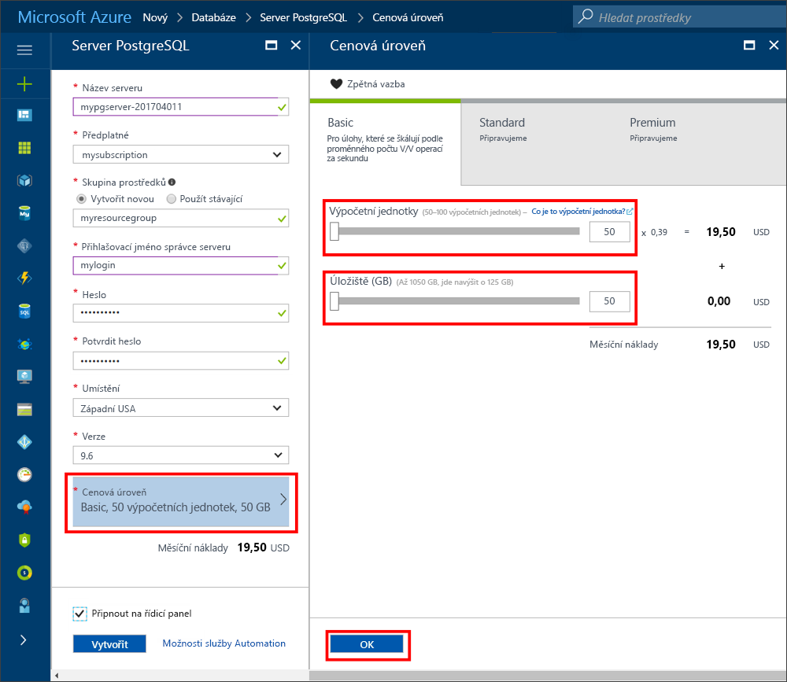
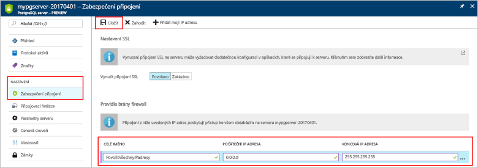
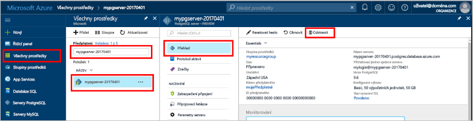

# <a name="create-an-azure-database-for-postgresql-in-the-azure-portal"></a>Vytvoření Azure Database for PostgreSQL na portálu Azure Portal

Azure Database for PostgreSQL je spravovaná služba, která umožňuje spouštět, spravovat a škálovat vysoce dostupné databáze PostgreSQL v cloudu. V tomto rychlém startu se dozvíte, jak vytvořit server Azure Database for PostgreSQL pomocí portálu Azure Portal.

Pokud ještě nemáte předplatné Azure, vytvořte si [bezplatný účet](https://azure.microsoft.com/free/) před tím, než začnete.

## <a name="log-in-to-the-azure-portal"></a>Přihlášení k portálu Azure Portal

Přihlaste se k [portálu Azure](https://portal.azure.com).

## <a name="create-an-azure-database-for-postgresql"></a>Vytvoření Azure Database for PostgreSQL

Server Azure Database for PostgreSQL se vytvoří s definovanou sadou [výpočetních prostředků a prostředků úložiště](./concepts-compute-unit-and-storage.md). Server se vytvoří v rámci [skupiny prostředků Azure](../azure-resource-manager/resource-group-overview.md).

Server Azure Database for PostgreSQL vytvoříte pomocí tohoto postupu:
1.  Klikněte na tlačítko **Nový** v levém horním rohu portálu Azure Portal.
2.  Na stránce **Nový** vyberte **Databáze** a na stránce **Databáze** vyberte **Azure Database for PostgreSQL**.
 

3.  Vyplňte formulář podrobností nového serveru pomocí následujících informací, jak je vidět na předchozím obrázku:
    - Název serveru: **mypgserver-20170401** (Zvolte globálně jedinečný název serveru, protože tento název se mapuje na název DNS.)
    - Předplatné: Pokud máte více předplatných, vyberte odpovídající předplatné, ve kterém prostředek existuje nebo je účtován.
    - Skupina prostředků: **myresourcegroup**
    - Přihlašovací jméno správce serveru a heslo dle vašeho výběru
    - Umístění: Zvolte nejbližší umístění.
    - Verze PostgreSQL: Zvolte nejnovější verzi.

  > [!IMPORTANT]
  > Zde zadané jméno správce serveru a heslo se vyžadují k přihlášení na server a jeho databáze dále v tomto rychlém startu. Tyto informace si zapamatujte nebo poznamenejte pro pozdější použití.

4.  Klikněte na **Cenová úroveň** a určete úroveň služby a úroveň výkonu pro novou databázi. Pro tento rychlý start vyberte úroveň **Basic**, **50 výpočetních jednotek** a **50 GB** zahrnutého úložiště.
 
5.  Klikněte na tlačítko **OK**.
6.  Klikněte na **Vytvořit**, aby se server zřídil. Zřizování trvá několik minut.

  > [!TIP]
  > Zaškrtněte možnost **Připnout na řídicí panel**, abyste povolili snadné sledování vašich nasazení.

7.  Na panelu nástrojů klikněte na **Oznámení** a sledujte proces nasazení.
 
   
  Ve výchozím nastavení se databáze **postgres** vytvoří v rámci vašeho serveru. Databáze [postgres](https://www.postgresql.org/docs/9.6/static/app-initdb.html) je výchozí databáze určená pro uživatele, nástroje a aplikace třetích stran. 

## <a name="configure-a-server-level-firewall-rule"></a>Konfigurace pravidla brány firewall na úrovni serveru

Služba Azure Database for PostgreSQL vytváří bránu firewall na úrovni serveru. Tato brána firewall brání externím aplikacím a nástrojům v připojení k serveru a kterékoli databázi na serveru, pokud není vytvořené pravidlo brány firewall k otevření brány firewall pro konkrétní IP adresy. 

1.  Jakmile se nasazení dokončí, klikněte na **Všechny prostředky** v levé nabídce a zadejte název **mypgserver-20170401**. Vyhledáte tak nově vytvořený server. Klikněte na název serveru uvedený ve výsledcích hledání. Otevře se stránka **Přehled** vašeho serveru a poskytne vám možnosti další konfigurace.
 
 

2.  V okně serveru vyberte **Zabezpečení připojení**. 
3.  Klikněte do textového pole pod **Názvem pravidla** a přidejte nové pravidlo brány firewall, kterým povolíte připojení rozsahu IP adres. Pro tento rychlý start můžeme povolit všechny IP adresy zadáním **Název pravidla = AllowAllIps**, **Počáteční IP adresa = 0.0.0.0** a **Koncová IP adresa = 255.255.255.255**. Pak klikněte na **Uložit**. Abyste se mohli připojit z vaší sítě, můžete nastavit pravidlo brány firewall, které pokrývá rozsah IP adres.

 

4.  Klikněte na **Uložit** a pak kliknutím na **X** zavřete stránku **Zabezpečení připojení**.

  > [!NOTE]
  > Server Azure PostgreSQL komunikuje přes port 5432. Pokud se pokoušíte připojit z podnikové sítě, nemusí být odchozí provoz přes port 5432 bránou firewall vaší sítě povolený. Pokud je to tak, nebudete se moct připojit k serveru Azure SQL Database, dokud vaše IT oddělení neotevře port 5432.
  >

## <a name="get-the-connection-information"></a>Získání informací o připojení

Při vytvoření našeho serveru Azure Database for PostgreSQL se vytvoří i výchozí databáze **postgres**. Pokud se chcete připojit k databázovému serveru, budete muset zadat informace o hostiteli a přihlašovací údaje pro přístup.

1. V nabídce na levé straně na portálu Azure Portal klikněte na **Všechny prostředky** a vyhledejte právě vytvořený server **mypgserver-20170401**.

  

2. Klikněte na název serveru **mypgserver-20170401**.
3. Vyberte stránku **Přehled** serveru. Poznamenejte si **Název serveru** a **Přihlašovací jméno správce serveru**.

 

## <a name="connect-to-postgresql-database-using-psql-in-cloud-shell"></a>Připojení k databázi PostgreSQL pomocí psql ve službě Cloud Shell

Teď pro připojení k serveru Azure Database for PostgreSQL použijeme nástroj příkazového řádku psql. 
1. Pomocí ikony terminálu v horním navigačním podokně spusťte službu Azure Cloud Shell.

   

2. Služba Azure Cloud Shell se otevře v prohlížeči a umožní vám zadat příkazy Bash.

   

3. V příkazovém řádku služby Cloud Shell se zadáním příkazového řádku psql připojte k serveru Azure Database for PostgreSQL. Následující formát se používá pro připojení k serveru Azure Database for PostgreSQL s nástrojem [psql](https://www.postgresql.org/docs/9.6/static/app-psql.html):
   ```bash
   psql --host=<myserver> --port=<port> --username=<server admin login> --dbname=<database name>
   ```

   Třeba tento příkaz provádí pomocí přihlašovacích údajů pro přístup připojení k výchozí databázi s názvem **postgres** na serveru PostgreSQL **mypgserver-20170401.postgres.database.azure.com**. Při připojování vždy používejte port **5432**. Po zobrazení výzvy zadejte heslo správce serveru. Mezi přepínači uvozenými znaky -- používejte v příkazu mezery, ale nepoužívejte mezery mezi symboly rovná se a hodnotami parametrů.

   ```bash
   psql --host=mypgserver-20170401.postgres.database.azure.com --port=5432 --username=mylogin@mypgserver-20170401 --dbname=postgres
   ```
4.  Po připojení k serveru vytvořte v příkazovém řádku prázdnou databázi.
```bash
CREATE DATABASE mypgsqldb;
```

5.  V příkazovém řádku proveďte následující příkaz pro přepnutí připojení na nově vytvořenou databázi **mypgsqldb**.
```bash
\c mypgsqldb
```

## <a name="connect-to-postgresql-database-using-pgadmin"></a>Připojení k databázi PostgreSQL pomocí aplikace pgAdmin

Připojení k serveru Azure PostgreSQL pomocí grafického uživatelského rozhraní aplikace _pgAdmin_
1.  Na klientském počítači spusťte aplikaci _pgAdmin_. _pgAdmin_ můžete nainstalovat ze stránky http://www.pgadmin.org/.
2.  V nabídce **Rychlé odkazy** zvolte **Přidat nový server**.
3.  V dialogovém okně **Vytvořit – server** na kartě **Obecné** zadejte jedinečný popisný název serveru, jako například **Azure PostgreSQL Server**.

4.  V dialogovém okně **Vytvořit – server** na kartě **Připojení** použijte uvedená nastavení a klikněte na **Uložit**.
   
    - **Název hostitele / adresa**: mypgserver-20170401.postgres.database.azure.com 
        - Plně kvalifikovaný název serveru
    - **Port:**  5432
        - Číslo portu používaného tímto databázovým serverem je 5432.
    - **Databáze údržby**: postgres 
        - Výchozí systémem generovaný název databáze
    - **Uživatelské jméno:** mylogin@mypgserver-20170401 
        - Přihlašovací jméno správce serveru (user@mypgserver) získané dříve v tomto rychlém startu
    - **Heslo**: Heslo, které jste si zvolili při vytváření serveru dříve v tomto rychlém startu.
    - **Režim SSL**: Vyžadovat
        - Ve výchozím nastavení jsou všechny servery Azure PostgreSQL vytvořeny se zapnutým vynucováním SSL. Pokud chcete vynucování SSL vypnout, přečtěte si podrobnosti v tématu [Vynucování SSL](./concepts-ssl-connection-security.md).
5.  Klikněte na **Uložit**.
6.  V levém podokně prohlížeče rozbalte **Skupiny serverů**. Vyberte svůj server **Azure PostgreSQL Server**.
7.  Vyberte **Server**, ke kterému jste se připojili, a potom vyberte jeho **Databáze**. 
8.  Pravým tlačítkem myši klikněte na **Databáze** a vytvořte databázi.
9.  Vyberte název databáze **mypgsqldb** a jako vlastníka zadejte přihlašovací jméno správce serveru **mylogin**.
10. Kliknutím na **Uložit** vytvořte prázdnou databázi.
11. V **Prohlížeči** rozbalte **Server**. Rozbalte vámi vytvořený server a zobrazte v něm databázi **mypgsqldb**.
 


## <a name="clean-up-resources"></a>Vyčištění prostředků
Všechny prostředky, které jste v rychlém startu vytvořili, můžete vyčistit odstraněním [skupiny prostředků Azure](../azure-resource-manager/resource-group-overview.md).

> [!TIP]
> Další rychlé starty v této kolekci vycházejí z tohoto rychlého startu. Pokud chcete pokračovat v práci s dalšími rychlými starty, neprovádějte čištění prostředků vytvořených v rámci tohoto rychlého startu. Pokud pokračovat nechcete, pomocí následujících kroků odstraňte všechny prostředky vytvořené tímto rychlým startem na portálu Azure Portal.

1.  Na portálu Azure Portal v nabídce vlevo klikněte na **Skupiny prostředků** a pak klikněte na **myresourcegroup**.
2.  Na stránce skupiny prostředků klikněte na **Odstranit**, do textového pole zadejte **myresourcegroup** a pak klikněte na Odstranit.

Pokud byste chtěli odstranit nově vytvořený server:
1.  V nabídce na levé straně na portálu Azure Portal klikněte na servery PostgreSQL a vyhledejte právě vytvořený server.
2.  Na stránce Přehled klikněte na tlačítko Odstranit v horním podokně .
3.  Potvrďte název serveru, který chcete odstranit, a zobrazte jeho databáze, které tím ovlivníte. Do textového pole zadejte **mypgserver-20170401** a pak klikněte na Odstranit.

## <a name="next-steps"></a>Další kroky
> [!div class="nextstepaction"]
> [Migrace vaší databáze pomocí exportu a importu](./howto-migrate-using-export-and-import.md)

