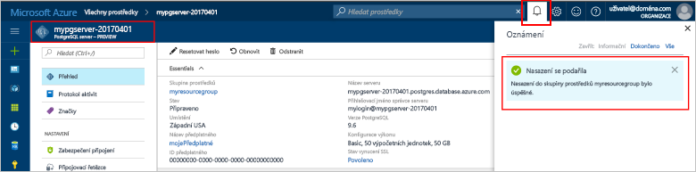
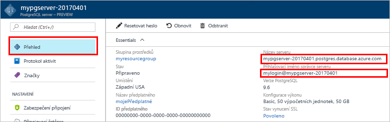

# <a name="design-your-first-azure-database-for-postgresql-using-the-azure-portal"></a>Navrhnout první databáze Azure pro PostgreSQL pomocí portálu Azure

Azure Database for PostgreSQL je spravovaná služba, která umožňuje spouštět, spravovat a škálovat vysoce dostupné databáze PostgreSQL v cloudu. Pomocí portálu Azure, můžete snadno spravovat váš server a návrhu databáze.

V tomto kurzu pomocí portálu Azure další postup:
> [!div class="checklist"]
> * Vytvoření serveru Azure Database for PostgreSQL
> * Konfigurace brány firewall serveru
> * Použití [ **psql** ](https://www.postgresql.org/docs/9.6/static/app-psql.html) nástroj k vytvoření databáze
> * Načíst ukázková data
> * Dotazování dat
> * Aktualizace dat
> * Obnovení dat

## <a name="prerequisites"></a>Požadavky
Pokud ještě nemáte předplatné Azure, vytvořte si [bezplatný účet](https://azure.microsoft.com/free/) před tím, než začnete.

## <a name="log-in-to-the-azure-portal"></a>Přihlášení k portálu Azure Portal
Přihlaste se k [portálu Azure](https://portal.azure.com).

## <a name="create-an-azure-database-for-postgresql"></a>Vytvoření Azure Database for PostgreSQL

Server Azure Database for PostgreSQL se vytvoří s definovanou sadou [výpočetních prostředků a prostředků úložiště](./concepts-compute-unit-and-storage.md). Server se vytvoří v rámci [skupiny prostředků Azure](../azure-resource-manager/resource-group-overview.md).

Server Azure Database for PostgreSQL vytvoříte pomocí tohoto postupu:
1.  Klikněte **+ nový** nalezeno tlačítko v levém horním rohu portálu Azure.
2.  Na stránce **Nový** vyberte **Databáze** a na stránce **Databáze** vyberte **Azure Database for PostgreSQL**.
 

3.  Vyplňte formulář podrobností nového serveru pomocí následujících informací, jak je vidět na předchozím obrázku:
    - Název serveru: **mypgserver-20170401** (název serveru se mapuje na název DNS a proto musí být globálně jedinečný) 
    - Předplatné: Pokud máte více předplatných, vyberte odpovídající předplatné, ve kterém prostředek existuje nebo je účtován.
    - Skupina prostředků: **myresourcegroup**
    - Přihlašovací jméno správce serveru a heslo dle vašeho výběru
    - Umístění
    - Verze PostgreSQL

  > [!IMPORTANT]
  > K přihlášení na server a její databáze později v tento rychlý start se vyžadují přihlašovací jméno správce serveru a heslo, které zde určíte. Tyto informace si zapamatujte nebo poznamenejte pro pozdější použití.

4.  Klikněte na **Cenová úroveň** a určete úroveň služby a úroveň výkonu pro novou databázi. Tento rychlý start, vyberte **základní** vrstvy, **50 výpočetní jednotky** a **50 GB** součástí úložiště.
 
5.  Klikněte na tlačítko **OK**.
6.  Klikněte na **Vytvořit**, aby se server zřídil. Zřizování trvá několik minut.

  > [!TIP]
  > Zaškrtněte možnost **Připnout na řídicí panel**, abyste povolili snadné sledování vašich nasazení.

7.  Na panelu nástrojů klikněte na **Oznámení** a sledujte proces nasazení.
 
   
  Ve výchozím nastavení se databáze **postgres** vytvoří v rámci vašeho serveru. Databáze [postgres](https://www.postgresql.org/docs/9.6/static/app-initdb.html) je výchozí databáze určená pro uživatele, nástroje a aplikace třetích stran. 

## <a name="configure-a-server-level-firewall-rule"></a>Konfigurace pravidla brány firewall na úrovni serveru

Služba Azure Database for PostgreSQL vytváří bránu firewall na úrovni serveru. Ve výchozím nastavení tato brána firewall brání všechny externí aplikace a nástroje pro připojení k serveru a všechny databáze na serveru, pokud není vytvořená pravidla brány firewall pro otevření brány firewall pro konkrétní rozsah IP adres. 

1.  Jakmile se nasazení dokončí, klikněte na **Všechny prostředky** v levé nabídce a zadejte název **mypgserver-20170401**. Vyhledáte tak nově vytvořený server. Klikněte na název serveru uvedený ve výsledcích hledání. Otevře se stránka **Přehled** vašeho serveru a poskytne vám možnosti další konfigurace.
 
 

2.  V okně server vyberte **zabezpečení připojení**. 
3.  Klikněte do textového pole pod **Názvem pravidla** a přidejte nové pravidlo brány firewall, kterým povolíte připojení rozsahu IP adres. V tomto kurzu budeme povolit všechny IP adresy a to zadáním **název pravidla = AllowAllIps**, **počáteční IP = 0.0.0.0** a **Koncová IP adresa = 255.255.255.255** a pak klikněte na tlačítko **uložit** . Můžete nastavit pravidlo konkrétní brány firewall, které pokrývá menší rozsah IP být schopni připojit z vaší sítě.
 
 

4.  Klikněte na **Uložit** a klikněte **X** zavřete **zabezpečení připojení** stránky.

  > [!NOTE]
  > Server Azure PostgreSQL komunikuje přes port 5432. Pokud se pokoušíte připojit z podnikové sítě, nemusí být odchozí provoz přes port 5432 bránou firewall vaší sítě povolený. Pokud je to tak, nebudete se moct připojit k serveru Azure SQL Database, dokud vaše IT oddělení neotevře port 5432.
  >


## <a name="get-the-connection-information"></a>Získání informací o připojení

Při vytvoření našeho serveru Azure Database for PostgreSQL se vytvoří i výchozí databáze **postgres**. Pokud se chcete připojit k databázovému serveru, budete muset zadat informace o hostiteli a přihlašovací údaje pro přístup.

1. Z nabídky na levé straně na portálu Azure, klikněte na tlačítko **všechny prostředky** a vyhledávání pro server, kterou jste právě vytvořili **mypgserver 20170401**.

  

3. Klikněte na název serveru **mypgserver-20170401**.
4. Vyberte stránku **Přehled** serveru. Poznamenejte si **Název serveru** a **Přihlašovací jméno správce serveru**.

 


## <a name="connect-to-postgresql-database-using-psql-in-cloud-shell"></a>Připojení k databázi PostgreSQL pomocí psql ve službě Cloud Shell

Teď umožňuje použít [psql](https://www.postgresql.org/docs/9.6/static/app-psql.html) nástroj příkazového řádku pro připojení k databázi Azure pro PostgreSQL server. 
1. Pomocí ikony terminálu v horním navigačním podokně spusťte službu Azure Cloud Shell.

   

2. Služba Azure Cloud Shell se otevře v prohlížeči a umožní vám zadat příkazy Bash.

   

3. V příkazovém řádku služby Cloud Shell se pomocí příkazů psql připojte k serveru Azure Database for PostgreSQL. Následující formát se používá pro připojení k serveru Azure Database for PostgreSQL s nástrojem [psql](https://www.postgresql.org/docs/9.6/static/app-psql.html):
   ```bash
   psql --host=<myserver> --port=<port> --username=<server admin login> --dbname=<database name>
   ```

   Například tento příkaz provádí připojení k výchozí databázi s názvem **postgres** na vašem serveru PostgreSQL **mypgserver-20170401.postgres.database.azure.com** pomocí přihlašovacích údajů k přístupu. Po zobrazení výzvy zadejte heslo správce serveru.

   ```bash
   psql --host=mypgserver-20170401.postgres.database.azure.com --port=5432 --username=mylogin@mypgserver-20170401 --dbname=postgres
   ```

## <a name="create-a-new-database"></a>Vytvoření nové databáze
Po připojení k serveru vytvořte v příkazovém řádku prázdnou databázi.
```bash
CREATE DATABASE mypgsqldb;
```

V příkazovém řádku proveďte následující příkaz pro přepnutí připojení na nově vytvořenou databázi **mypgsqldb**.
```bash
\c mypgsqldb
```
## <a name="create-tables-in-the-database"></a>Vytváření tabulek v databázi
Teď, když víte, jak se připojit k databázi Azure pro PostgreSQL, jsme projít jak provést některé základní úlohy.

Jsme nejprve vytvořit tabulku a načíst určitými daty. Umožňuje vytvořit tabulku, která sleduje informace o inventáři.
```sql
CREATE TABLE inventory (
    id serial PRIMARY KEY, 
    name VARCHAR(50), 
    quantity INTEGER
);
```

Nyní jsou zobrazeny nově vytvořené tabulky seznam tabulek zadáním:
```sql
\dt
```

## <a name="load-data-into-the-tables"></a>Načtení dat do tabulky
Teď, když máme tabulku, jsme do něj vložte některá data. V okně Otevřít příkazového řádku spusťte následující dotaz vložit některé řádky dat.
```sql
INSERT INTO inventory (id, name, quantity) VALUES (1, 'banana', 150); 
INSERT INTO inventory (id, name, quantity) VALUES (2, 'orange', 154);
```

Máte nyní dva řádky ukázkových dat do tabulky inventáře, které jste vytvořili dříve.

## <a name="query-and-update-the-data-in-the-tables"></a>Dotaz a aktualizovat data v tabulkách
Spustíte následující dotaz pro načtení informací z tabulky databáze inventáře. 
```sql
SELECT * FROM inventory;
```

Můžete také aktualizovat data v tabulce.
```sql
UPDATE inventory SET quantity = 200 WHERE name = 'banana';
```

Při načítání dat uvidíte aktualizovanými hodnotami.
```sql
SELECT * FROM inventory;
```

## <a name="restore-data-to-a-previous-point-in-time"></a>Obnovení dat do předchozího bodu v čase
Představte si, že jste omylem odstranili této tabulky. Tato situace je něco, které nelze snadno obnovit z. Azure databázi PostgreSQL můžete přejít zpět k žádné bodu v čase (v poslední až do 7 dnů (Basic) a 35 dní (standardní)) a obnovit tento bod v čase na nový server. Tento nový server můžete obnovit odstraněná data. Následující postup obnovení **mypgserver 20170401** server tak, aby bod před přidáním tabulku inventáře.

1.  V databázi Azure pro PostgreSQL **přehled** stránky pro váš server, klikněte na tlačítko **obnovení** na panelu nástrojů. **Obnovení** otevře se stránka.
  
2.  Vyplňte **obnovení** formuláře se požadované informace:

  
  - **Bod obnovení**: Vyberte bodu v čase, k níž dojde před server byl změněn
  - **Cílový server**: Zadejte nový název serveru, kterou chcete obnovit
  - **Umístění**: nelze vyberte oblast, ve výchozím nastavení je stejné jako na zdrojovém serveru
  - **Cenová úroveň**: tuto hodnotu nelze změnit, při obnovení serveru. Je stejný jako zdrojový server. 
3.  Klikněte na tlačítko **OK** [obnovit serveru v daném okamžiku](./howto-restore-server-portal.md) předtím, než tabulka byla odstraněna. Obnovení serveru do jiného bodu v čase vytvoří duplicitní nový server jako původní server od bodu v čase, které zadáte, za předpokladu, že je v rámci dobu uchování vašeho [vrstvy služby](./concepts-service-tiers.md).

## <a name="next-steps"></a>Další kroky
V tomto kurzu jste zjistili, jak používat portál Azure a další nástroje na:
> [!div class="checklist"]
> * Vytvoření serveru Azure Database for PostgreSQL
> * Konfigurace brány firewall serveru
> * Použití [ **psql** ](https://www.postgresql.org/docs/9.6/static/app-psql.html) nástroj k vytvoření databáze
> * Načíst ukázková data
> * Dotazování dat
> * Aktualizace dat
> * Obnovení dat

V dalším kroku Naučte se používat rozhraní příkazového řádku Azure provádění podobných úloh, přečtěte si v tomto kurzu: [navrhnout první databáze Azure pro PostgreSQL pomocí rozhraní příkazového řádku Azure](tutorial-design-database-using-azure-cli.md)
