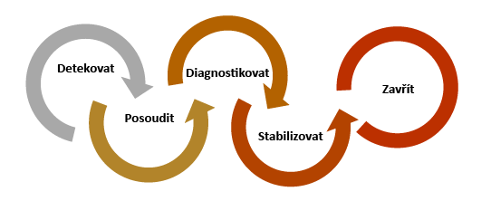
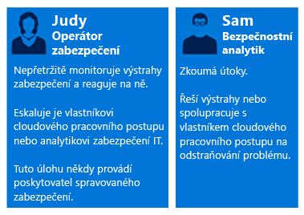
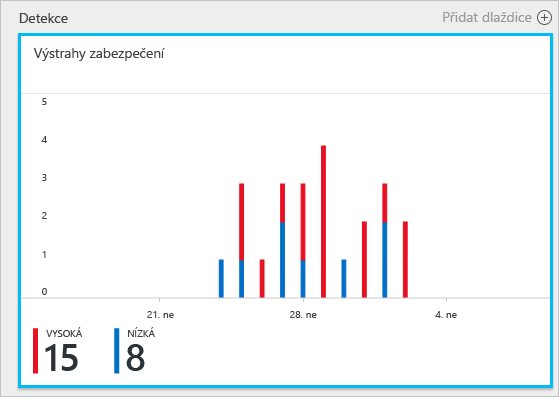
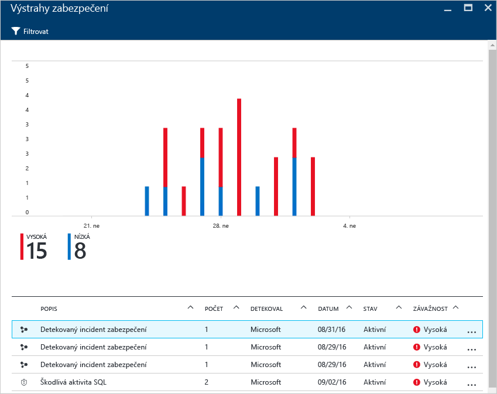
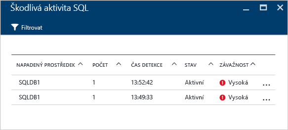
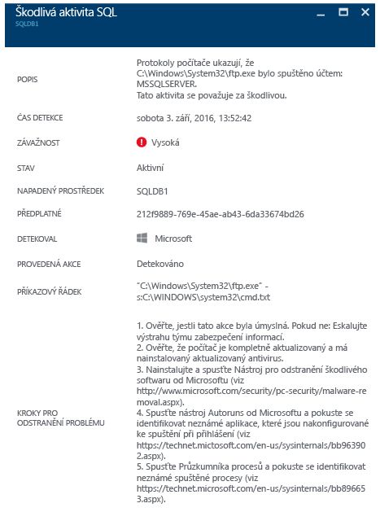

# Využití Azure Security Center při reakci na incidenty
Mnoho organizací se naučí reagovat na incidenty zabezpečení teprve když se stanou obětí útoku. Kvůli snížení nákladů a minimalizaci škod je důležité mít hotový plán reakce na incidenty ještě před tím, než k útoku dojde. Azure Security Center můžete využít v různých fázích reakce na incidenty.

## Plánování reakce na incidenty
Efektivní plán závisí na třech základních schopnostech: chránit se před hrozbami, zjišťovat je a reagovat na ně. Účelem ochrany je předcházet incidentům, detekce slouží k včasné identifikaci hrozeb a schopnost reagovat umožňuje vyhnání útočníka a obnovení systému pro zmírnění dopadů porušení zabezpečení.

V tomto článku se budou používat fáze reakce na incidenty zabezpečení z článku [Reakce zabezpečení Microsoft Azure v cloudu](https://gallery.technet.microsoft.com/Azure-Security-Response-in-dd18c678), jak je znázorněno na následujícím diagramu:

Security Center můžete použít během fází Zjištění, Posouzení a Diagnostika. Zde jsou příklady toho, jak může být Security Center užitečná během těchto tří počátečních fází reakce na incidenty:

* **Zjištění**: Přezkoumání první indikace vyšetřování události.
  * Příklad: Přezkoumání počátečního ověření, že v řídicím panelu Security Center došlo k vydání výstrahy zabezpečení s vysokou prioritou.
* **Posouzení**: Počáteční zhodnocení a získávání dalších informací o podezřelé aktivitě.
  * Příklad: Získání dalších informací o dané výstraze zabezpečení.
* **Diagnostika**: Provedení technického vyšetřování a určení strategií pro zadržení, zmírnění škod a alternativní řešení.
  * Příklad: Postupujte podle nápravných kroků, které Security Center popisuje v konkrétní výstraze zabezpečení.

Následující scénář vám ukáže, jak můžete využít Security Center během fází incidentu zabezpečení Zjištění, Posouzení a Diagnostika/Reakce. V Security Center představuje [incident zabezpečení](security-center-incident.md) souhrn všech výstrah pro určitý prostředek, které odpovídají schématům modelu [Kill Chain](https://blogs.technet.microsoft.com/office365security/addressing-your-cxos-top-five-cloud-security-concerns/). Incidenty se zobrazí na dlaždici a v okně [Výstrahy zabezpečení](security-center-managing-and-responding-alerts.md). Incident odhalí seznam souvisejících výstrah, který vám umožní získat další informace o každém výskytu. V Security Center jsou k dispozici také samostatné výstrahy zabezpečení, které lze použít k vysledování podezřelé aktivity.

## Scénář
Společnost Contoso nedávno provedla migraci některých místních prostředků do Azure, včetně některých databází SQL a úloh obchodního systému založených na virtuálních počítačích. Nyní má Hlavní tým reakce na incidenty zabezpečení počítačů (CSIRT) společnosti Contoso problém s vyšetřováním problémů zabezpečení kvůli tomu, že analytické funkce zabezpečení nejsou integrované se současnými nástroji reakce na incidenty. Tato nedostatečná integrace představuje problém během fáze Zjištění (příliš mnoho falešných poplachů) a také během fází Posouzení a Diagnostika. Jako součást této migrace se rozhodli vyjádřit výslovný souhlas s tím, aby jim Security Center pomohl vyřešit tento problém.

První fáze migrace byla dokončena po připojení všech prostředků a vyřešení všech doporučení zabezpečení od Security Center. CSIRT společnosti Contoso je ústředním bodem řešení incidentů zabezpečení počítačů. Tým se skládá ze skupiny lidí, kteří mají odpovědnost za řešení všech incidentů zabezpečení. Členové týmu mají jasně určené povinnosti, aby se zajistilo, že jsou pokryté všechny oblasti reakce.

Pro účely tohoto scénáře se soustředíme na role následujících osob, které jsou součástí týmu CSIRT společnosti Contoso:

Judy pracuje v oddělení zabezpečení. Mezi její oblasti odpovědnosti patří:

* Nepřetržité monitorování a reagování na ohrožení zabezpečení.
* Předávání řešení ohrožení vlastníkovi cloudových úloh nebo analytikovi zabezpečení (podle potřeby).

Sam je analytik zabezpečení a mezi jeho povinnosti patří:

* Vyšetřování útoků.
* Napravování výstrah.
* Práce s vlastníky úloh na určování a aplikaci nápravných kroků.

Jak vidíte, Judy a Sam mají rozdílné povinnosti a musí spolupracovat na sdílení informací ze Security Center.

## Doporučené řešení
Vzhledem k tomu, že Judy a Sam mají rozdílné role, budou k získávání relevantních informací pro své denní aktivity používat různé části Security Center. Judy bude používat jako součást denního monitorování **Výstrahy zabezpečení**.

Judy bude používat Výstrahy zabezpečení během fází Detekce a Vyhodnocení. Když Judy dokončí počáteční vyhodnocení, může v případě potřeby dalšího vyšetřování předat problém Samovi. V tomto okamžiku Sam použije informace, které obdržel ze Security Center, někdy i ve spojení s dalšími zdroji dat, a přejde k fázi Diagnostika.

## Postup implementace tohoto řešení
Pro ukázku toho, jak byste použili Azure Security Center ve scénáři reakce na incident, budeme sledovat kroky Judy ve fázích Detekce a Vyhodnocení. Následně se podíváme, co udělá Sam, aby problém diagnostikoval.

### Fáze reakce na incidenty Detekce a Vyhodnocení
Judy se přihlásila k portálu Azure Portal a pracuje v konzole Security Center. Jako součást denních aktivit monitorování začala kontrolovat výstrahy zabezpečení s vysokou prioritou provedením následujících kroků:

1. Kliknutím na dlaždici **Výstrahy zabezpečení** otevřete okno **Výstrahy zabezpečení**.
    

   > [!NOTE]
   > Pro účely tohoto scénáře provede Judy vyhodnocení výstrahy Škodlivá aktivita SQL, jak je znázorněno na předchozím obrázku.
   >
   >
2. Klikněte na výstrahu **Škodlivá aktivita SQL** a zkontrolujte napadené prostředky v okně **Škodlivá aktivita SQL**:  

    V tomto okně si Judy může dělat poznámky týkající se napadených prostředků, četnosti útoku a době jeho zjištění.
3. Kliknutím na **napadený prostředek** získáte další informace o daném útoku.

Po přečtení popisu je Judy přesvědčená, že se nejedná o falešný poplach, a že by měla předat tento případ Samovi.

### Fáze reakce na incidenty Diagnostika
Sam od Judy obdržel případ a začíná s kontrolováním nápravných kroků, které navrhuje Security Center.

### Další zdroje
Tým, který reaguje na incidenty, může využívat i výhody možnosti [zabezpečení Center Power BI](security-center-powerbi.md) a zobrazovat různé typy sestav. Tyto sestavy mu mohou pomoci při dalším šetření, protože doporučení a výstrahy zabezpečení je možné vizualizovat, analyzovat a filtrovat. V případě společnosti, které při procesu šetření používají jeho řešení správy událostí a informací o zabezpečení (SIEM), může také [integrovat Security Center s vlastním řešením](security-center-integrating-alerts-with-log-integration.md). Můžete také integrovat protokoly auditu a události zabezpečení virtuálních počítačů Azure pomocí [nástroje pro integraci protokolů Azure](https://blogs.msdn.microsoft.com/azuresecurity/2016/07/21/microsoft-azure-log-integration-preview/). Při vyšetřování útoku můžete tyto informace použít ve spojení s informacemi, které poskytuje Security Center.

## Závěr
Sestavení týmu dříve, než dojde k incidentu, je pro vaši organizaci velmi důležité a pozitivně to ovlivní způsob zpracování incidentů. Dostupnost správných nástrojů pro monitorování prostředků může tomuto týmu pomoci s výběrem správného postupu k napravení incidentu zabezpečení. [Funkce detekce](security-center-detection-capabilities.md) v Security Center mohou IT oddělení pomoci s rychlou reakcí na incidenty zabezpečení a s nápravou problémů zabezpečení.

