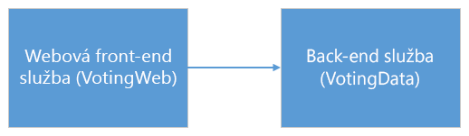
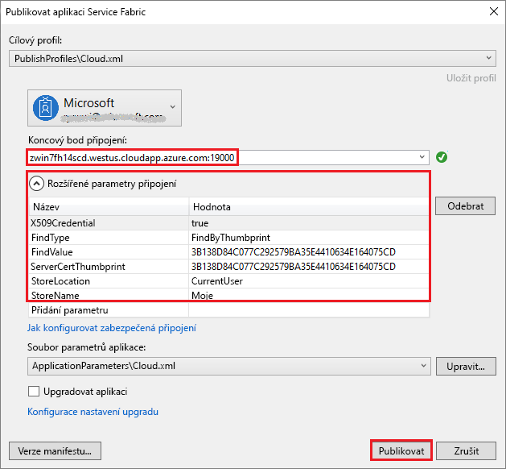
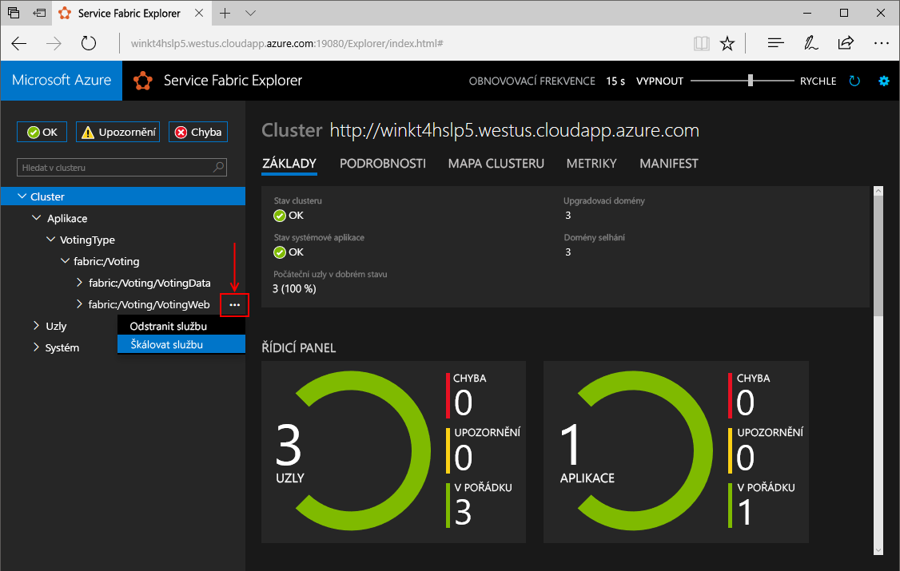
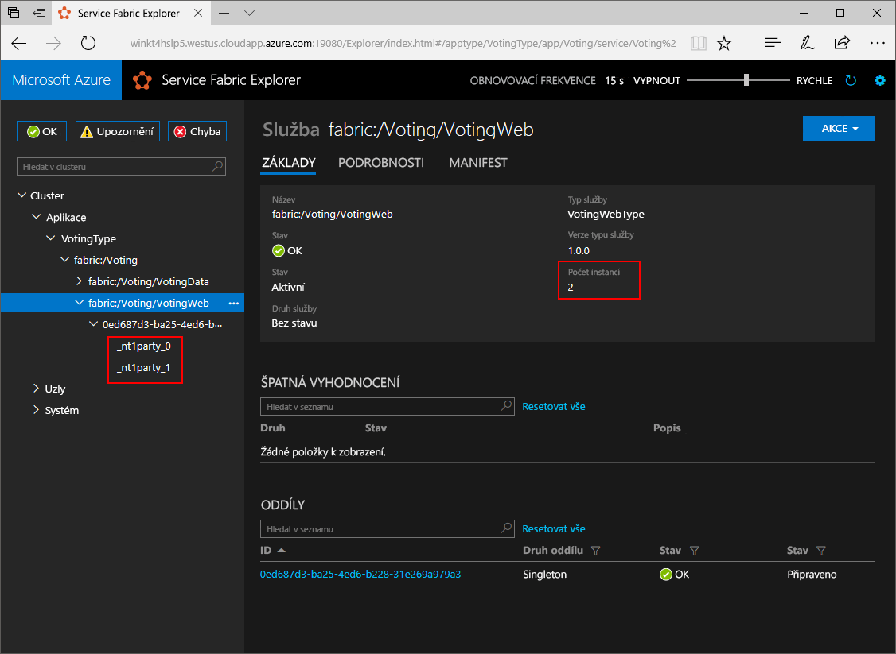
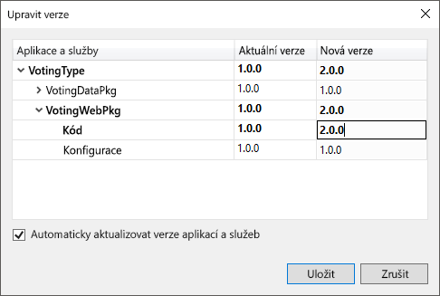
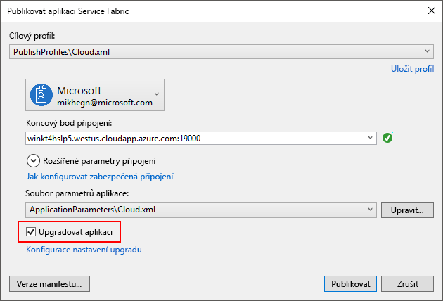
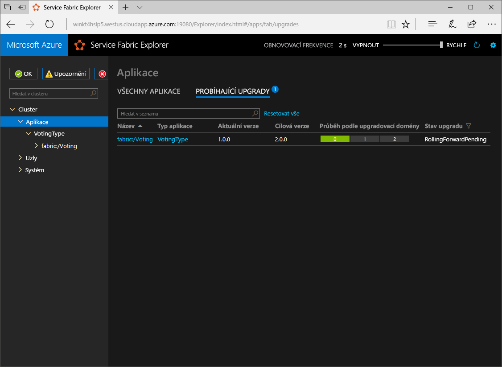

# <a name="create-a-net-service-fabric-application-in-azure"></a>Vytvoření aplikace .NET Service Fabric v Azure
Azure Service Fabric je platforma distribuovaných systémů pro nasazování a správu škálovatelných a spolehlivých mikroslužeb a kontejnerů. 

Tento rychlý start ukazuje, jak nasadit vaší první aplikace .NET do Service Fabric. Jakmile budete hotovi, máte hlasovací aplikaci s ASP.NET Core web, který je front-end, který uloží výsledků hlasování ve stavové služby back-end v clusteru.


Pomocí této aplikace se dozvíte, jak:
> [!div class="checklist"]
> * Vytvoření aplikace pomocí rozhraní .NET a Service Fabric
> * Pomocí ASP.NET core jako webového front-endu
> * Ukládání dat aplikací ve stavové služby
> * Ladění aplikace místně
> * Nasaďte aplikaci do clusteru s podporou v Azure
> * Škálování aplikací mezi několika uzly
> * Provedení postupného upgradu aplikace

## <a name="prerequisites"></a>Požadavky
K provedení kroků v tomto kurzu Rychlý start je potřeba:
1. [Nainstalovat Visual Studio 2017](https://www.visualstudio.com/) s **Azure development** a **ASP.NET a webové vývoj** úlohy.
2. [Nainstalovat Git](https://git-scm.com/).
3. [Nainstalovat Microsoft Azure Service Fabric SDK](http://www.microsoft.com/web/handlers/webpi.ashx?command=getinstallerredirect&appid=MicrosoftAzure-ServiceFabric-CoreSDK)
4. Spusťte následující příkaz, který povolit Visual Studio k nasazení na místní cluster Service Fabric:
    ```powershell
    Set-ExecutionPolicy -ExecutionPolicy Unrestricted -Force -Scope CurrentUser
    ```

## <a name="download-the-sample"></a>Stažení ukázky
V příkazovém okně spusťte následující příkaz, který klonovat úložiště ukázkové aplikace do místního počítače.
```
git clone https://github.com/Azure-Samples/service-fabric-dotnet-quickstart
```

## <a name="run-the-application-locally"></a>Místní spuštění aplikace
Klikněte pravým tlačítkem na ikonu sady Visual Studio v nabídce Start a vyberte **spustit jako správce**. Aby bylo možné připojit ladicí program k vašim službám, budete muset spustit sadu Visual Studio jako správce.

Otevřete **Voting.sln** řešení sady Visual Studio z úložiště, které jste naklonovali.  

Ve výchozím nastavení je Voting aplikace nastavena tak, aby naslouchala na portu 8080.  Port aplikace je nastavena v */VotingWeb/PackageRoot/ServiceManifest.xml* souboru.  Port aplikace můžete změnit při aktualizaci **Port** atribut **koncový bod** elementu.  K nasazení a spuštění aplikace místně, port aplikace musí být otevřené a dostupné ve vašem počítači.  Pokud změníte port aplikace, nahraďte nová hodnota portu aplikace "8080" v tomto článku.

Chcete-li nasadit aplikaci, stiskněte **F5**.

> [!NOTE]
> Při prvním spuštění a nasazení aplikace, Visual Studio vytvoří místní cluster pro ladění. Tato operace může chvíli trvat. Stav vytváření clusteru se zobrazí v okně výstupu sady Visual Studio.  Ve výstupu se zobrazí zpráva "Adresa URL aplikace není nastaven, nebo není adresu URL protokolu HTTP nebo HTTPS, takže se neotevře prohlížeče do aplikace."  Tato zpráva neindikuje chybu, ale tento prohlížeč nebude automatické spuštění.

Po dokončení nasazení se spustí prohlížeč a otevřete tuto stránku: `http://localhost:8080` -webové aplikace front-endu.


Teď můžete přidat sadu hlasovací tlačítka a spuštění trvá hlasy. Aplikace běží a ukládá všechna data v clusteru Service Fabric, bez nutnosti samostatné databáze.

## <a name="walk-through-the-voting-sample-application"></a>Provede hlasujících ukázkové aplikace
Hlasovací aplikaci se skládá ze dvou služeb:
- Webová služba front-endu (VotingWeb) – ASP.NET Core webových front-endové služby, která obsluhuje webové stránky a zpřístupňuje rozhraní API pro komunikaci s back-end službu.
- Služba back endu (VotingData)-ASP.NET Core webová služba, která zpřístupňuje rozhraní API můžete ukládat výsledky hlas ve slovníku spolehlivé trvalé na disku.



Když hlasovat v aplikaci dojít k následujícím událostem:
1. JavaScript odešle žádost hlas webovému rozhraní API ve front-endové webové službě jako požadavek HTTP PUT.

2. Webovou službu front-endu používá proxy server pro vyhledání a předávat požadavek HTTP PUT ve službě back-end.

3. Back endové službě přijímá příchozí požadavky a ukládá aktualizované výsledek v spolehlivé slovník, který získá replikují do několika uzly v clusteru a trvalé na disku. Všechny aplikační data se ukládají v clusteru, takže se žádná databáze.

## <a name="debug-in-visual-studio"></a>Ladění v sadě Visual Studio
Při ladění aplikace v sadě Visual Studio, kterou používáte místní cluster Service Fabric vývoj. Máte možnost upravit prostředí ladění pro váš scénář. V této aplikaci uložíme data v naší službě back-end pomocí slovník spolehlivé. Visual Studio odebere aplikaci za výchozí při zastavení ladicího programu. Odebrání aplikace způsobí, že data ve službě back-end taky odeberou. Chcete-li zachovat data mezi relace ladění, můžete změnit **režim ladění aplikací** jako vlastnost na **Voting** projektu v sadě Visual Studio.

Podívat se na co se stane, že v kódu, proveďte následující kroky:
1. Otevřete **VotesController.cs** souboru a nastavit zarážky ve webové rozhraní API **Put** – metoda (řádku 47) – můžete vyhledat soubor v Průzkumníku řešení v sadě Visual Studio.

2. Otevřete **VoteDataController.cs** souboru a nastavit zarážky v tomto rozhraní web API **Put** – metoda (řádku 50).

3. Přejděte zpět do prohlížeče a klikněte na hlasování možnost nebo přidat novou možnost hlasování. Kliknutí na první zarážky do kontroleru webového přední konci na rozhraní api.
    - Toto je, kde JavaScript v prohlížeči odešle požadavek na kontroler API web ve službě front-endu.
    
    

    - Nejprve jsme vytvořit adresu URL ReverseProxy pro naši službu back-end **(1)**.
    - Potom jsme poslat PUT požadavek HTTP ReverseProxy **(2)**.
    - Nakonec vrátíme odpověď z back-end službu do klienta **(3)**.

4. Stiskněte klávesu **F5** pokračovat
    - Nyní jste na zarážce ve službě back-end.
    
    

    - Na prvním řádku v metodě **(1)** používáme `StateManager` nebo přidat spolehlivé slovník nazývaný `counts`.
    - Všechny interakce s hodnotami ve slovníku spolehlivé vyžadují transakci, této konfigurace pomocí příkazu **(2)** vytvoří této transakce.
    - V transakci, jsme potom aktualizujte hodnotu relevantní klíče pro možnost hlasování a provede operaci **(3)**. Po potvrzení metoda vrátí, data aktualizovat ve slovníku a replikovat do jiných uzlů v clusteru. Data jsou teď bezpečně uložená v clusteru, a může převzít back-end službu do dalších uzlů, i nadále s dostupná data.
5. Stiskněte klávesu **F5** pokračovat

Chcete-li ukončit relaci ladění, stiskněte **Shift + F5**.

## <a name="deploy-the-application-to-azure"></a>Nasazení aplikace v Azure
Pokud chcete nasadit aplikaci do Azure, je nutné cluster Service Fabric, který se spouští aplikace. 

### <a name="join-a-party-cluster"></a>Připojit ke clusteru strany
Party clustery jsou bezplatné, časově omezené clustery Service Fabric hostované v Azure a provozované týmem Service Fabric, na kterých může kdokoli nasazovat aplikace a seznamovat se s platformou. 

Přihlaste se a [připojení clusteru se systémem Windows](http://aka.ms/tryservicefabric). Mějte na paměti, **koncového bodu připojení** hodnotu, která se používá v následující kroky.

> [!Note]
> Ve výchozím nastavení je front-end webové nakonfigurován pro naslouchání na portu 8080 pro příchozí provoz. Port 8080 je otevřený v clusteru strany.  Pokud potřebujete změnit port aplikace, změňte jej na jednu z porty, které jsou otevřeny v clusteru strany.
>

### <a name="deploy-the-application-using-visual-studio"></a>Nasazení aplikace pomocí sady Visual Studio
Aplikace je teď připravená a přímo ze sady Visual Studio ji můžete nasadit do clusteru.

1. Klikněte pravým tlačítkem na **Voting** v Průzkumníku řešení a zvolte **publikovat**. Zobrazí se dialogové okno Publikovat.

    

2. Kopírování **koncového bodu připojení** ze strany stránky clusteru do **koncového bodu připojení** pole a klikněte na tlačítko **publikovat**. Například, `winh1x87d1d.westus.cloudapp.azure.com:19000`.

    Každá aplikace v clusteru musí mít jedinečný název.  Strany clustery jsou veřejné, sdílené prostředí ale a může být ke konfliktu s existující aplikaci.  Pokud dojde ke konfliktu názvů, přejmenování projektu sady Visual Studio a znovu nasaďte.

3. Otevřete prohlížeč a zadejte v foolowed adresu clusteru podle ': 8080' přístup k aplikaci v clusteru – například `http://winh1x87d1d.westus.cloudapp.azure.com:8080`. Teď byste měli vidět aplikace běžící v clusteru v Azure.


## <a name="scale-applications-and-services-in-a-cluster"></a>Škálování aplikací a služeb v clusteru
Service Fabric služby je možné snadno rozšířit mezi clustery pro přizpůsobení pro změnu zatížení v rámci služeb. Služby se škálují změnou počtu instancí spuštěných v clusteru. Máte více způsobů škálování vašim službám, můžete použít skripty nebo příkazy z prostředí PowerShell nebo Service Fabric rozhraní příkazového řádku (sfctl). V tomto příkladu používáme Service Fabric Exploreru.

Service Fabric Explorer běží v na všech clusterech Service Fabric a je přístupný z prohlížeče, procházením port pro správu clusterů HTTP (19080), například `http://winh1x87d1d.westus.cloudapp.azure.com:19080`.

Pokud chcete škálovat webovou front-end službu, proveďte následující kroky:

1. Otevřete ve vašem clusteru Service Fabric Explorer – například `http://winh1x87d1d.westus.cloudapp.azure.com:19080`.
2. Klikněte na znak výpustky (tři tečky) vedle položky **fabric: / Voting/VotingWeb** uzlu ve stromovém zobrazení a zvolte **škálování služby**.

    

    Nyní můžete škálovat počet instancí webové front-end služby.

3. Změňte počet na **2** a klikněte na **Škálovat službu**.
4. Klikněte na **fabric: / Voting/VotingWeb** uzlu ve stromovém zobrazení a rozbalte uzel oddílu (představované identifikátor GUID).

    

    Nyní můžete vidět, že služba má dvě instance, a ve stromovém zobrazení uzlů, které instance spustili.

Touto jednoduchou úlohou správy jsme zdvojnásobili prostředky, které má naše front-end služba k dispozici pro zpracování uživatelské zátěže. Je důležité si uvědomit, že pro spolehlivý provoz služby nepotřebujete více jejích instancí. Pokud služba selže, Service Fabric zajistí v clusteru spuštění nové instance služby.

## <a name="perform-a-rolling-application-upgrade"></a>Provedení postupného upgradu aplikace
Při nasazování nové aktualizace do vaší aplikace, Service Fabric zavede aktualizace bezpečným způsobem. Vrácení upgradu vám dává žádné výpadky při upgradu a také automatické vrácení zpět, musí dojít k chybám.

Pokud chcete upgradovat aplikaci, postupujte takto:

1. Otevřete **Index.cshtml** souborů v sadě Visual Studio – můžete vyhledat soubor v Průzkumníku řešení v sadě Visual Studio.
2. Nadpis na stránce změníte tak, že přidáte některé text – například.
    ```html
        <div class="col-xs-8 col-xs-offset-2 text-center">
            <h2>Service Fabric Voting Sample v2</h2>
        </div>
    ```
3. Uložte soubor.
4. Klikněte pravým tlačítkem na **Voting** v Průzkumníku řešení a zvolte **publikovat**. Zobrazí se dialogové okno Publikovat.
5. Klikněte **Manifest verze** tlačítko Změna verze služby a aplikace.
6. Změna verze **kód** prvek v rámci **VotingWebPkg** na "2.0.0", například a klikněte na tlačítko **Uložit**.

    
7. V **publikovat aplikace Service Fabric** dialogové okno, zkontrolujte upgradu aplikace políčko a klikněte na **publikovat**.

    
8. Otevřete prohlížeč a přejděte na adresu clusteru na portu 19080 – například `http://winh1x87d1d.westus.cloudapp.azure.com:19080`.
9. Klikněte na **aplikace** uzlu ve stromovém zobrazení a potom **upgrady v průběhu** v pravém podokně. Zobrazí způsob upgradu zahrnuje prostřednictvím upgradovacích domén v clusteru, ujistěte se, že každá doména, je v pořádku, než budete pokračovat na další.
    

    Service Fabric lze upgrady bezpečné tím, že dvě minuty po upgradu služby v každém uzlu v clusteru. Očekávejte celou aktualizace trvat přibližně osm minut.

10. Při upgradu, můžete dál používat aplikaci. Vzhledem k tomu, že máte dvě instance služby spuštěné v clusteru, některé z vašich žádosti o může získat upgradované verzi aplikace, zatímco ostatní může stále dojít k předchozí verzi aplikace.

## <a name="next-steps"></a>Další kroky
V tomto rychlém startu jste se naučili:

> [!div class="checklist"]
> * Vytvoření aplikace pomocí rozhraní .NET a Service Fabric
> * Pomocí ASP.NET core jako webového front-endu
> * Ukládání dat aplikací ve stavové služby
> * Ladění aplikace místně
> * Nasaďte aplikaci do clusteru s podporou v Azure
> * Škálování aplikací mezi několika uzly
> * Provedení postupného upgradu aplikace

Další informace o Service Fabric a .NET, podívejte se na tomto kurzu:
> [!div class="nextstepaction"]
> [Aplikace .NET v Service Fabric](service-fabric-tutorial-create-dotnet-app.md)