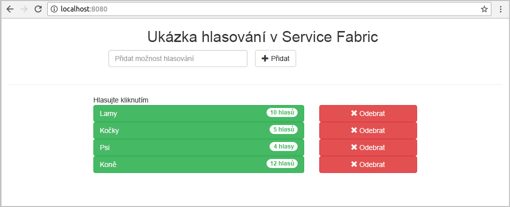
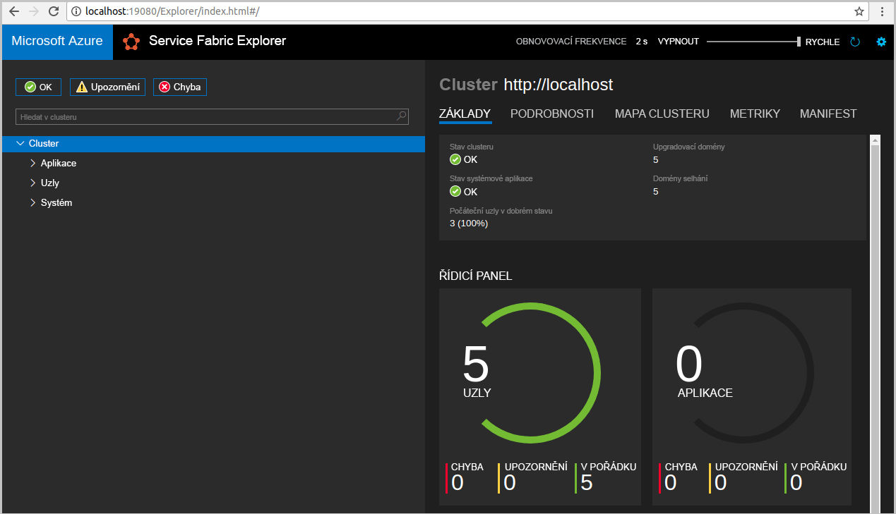
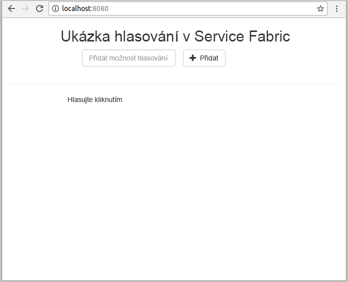
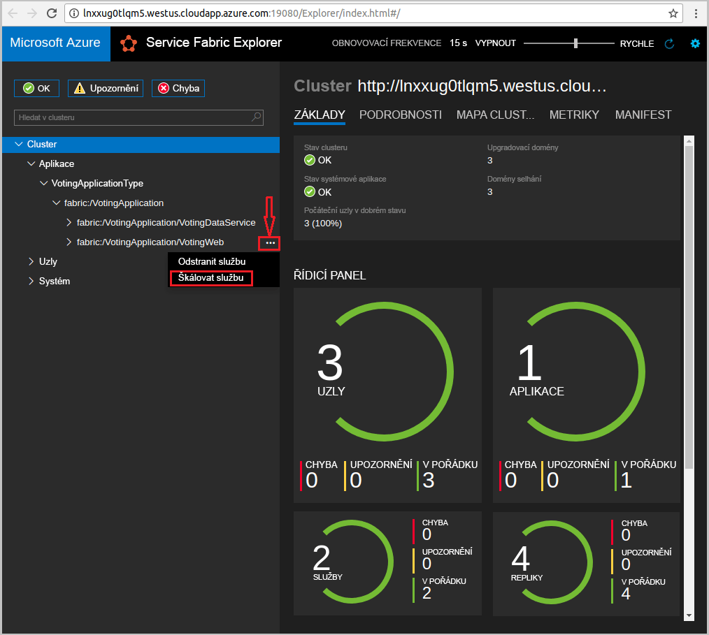
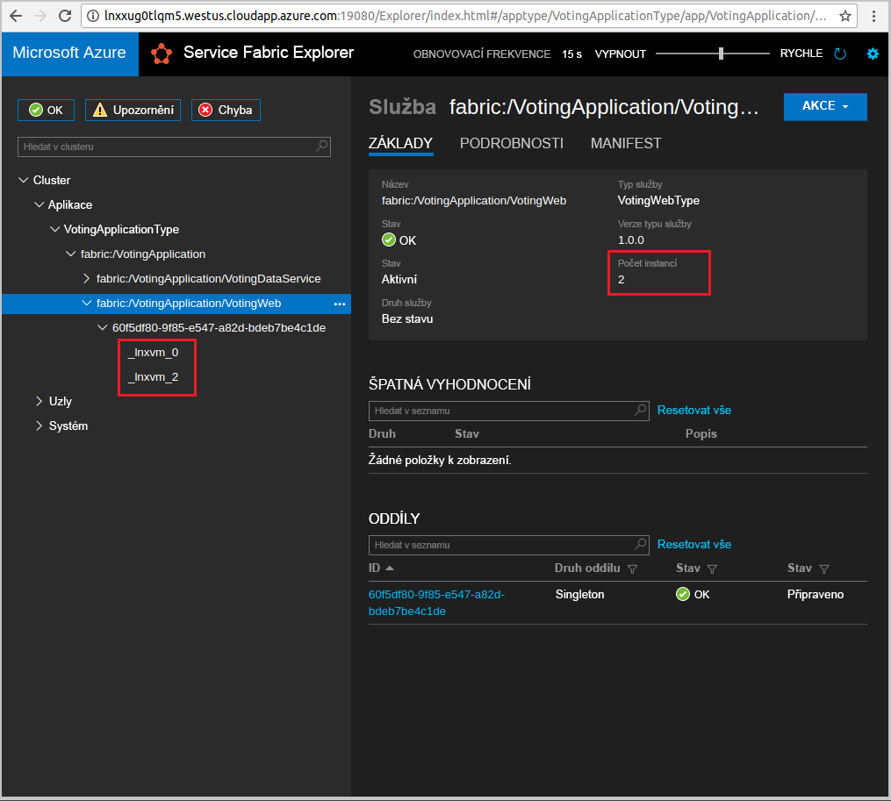

# <a name="create-a-java-application"></a>Vytvoření aplikace v Javě
Azure Service Fabric je platforma distribuovaných systémů pro nasazování a správu mikroslužeb a kontejnerů. 

Tento rychlý start ukazuje, jak nasadit první aplikaci v Javě do Service Fabric pomocí integrovaného vývojového prostředí (IDE) Eclipse na vývojovém počítači s Linuxem. Až budete hotovi, budete mít hlasovací aplikaci s webovým front-endem v Javě, která ukládá výsledky hlasování do stavové back-end služby v clusteru.



V tomto rychlém startu se naučíte:

> [!div class="checklist"]
> * Používat Eclipse jako nástroj pro aplikace Service Fabric v Javě.
> * Nasadit aplikaci do místního clusteru. 
> * Nasazení aplikace do clusteru v Azure
> * Škálování aplikace na více instancí napříč několika uzly

## <a name="prerequisites"></a>Požadavky
K provedení kroků v tomto kurzu Rychlý start je potřeba:
1. [Nainstalovat sadu Service Fabric SDK a rozhraní příkazového řádku (CLI) Service Fabric](https://docs.microsoft.com/azure/service-fabric/service-fabric-get-started-linux#installation-methods).
2. [Nainstalovat Git](https://git-scm.com/).
3. [Nainstalovat Eclipse](https://www.eclipse.org/downloads/).
4. [Nastavit prostředí Java](https://docs.microsoft.com/azure/service-fabric/service-fabric-get-started-linux#set-up-java-development) a provést volitelné kroky pro instalaci modulu plug-in pro Eclipse. 

## <a name="download-the-sample"></a>Stažení ukázky
V příkazovém okně naklonujte spuštěním následujícího příkazu úložiště ukázkové aplikace do místního počítače.
```
git clone https://github.com/Azure-Samples/service-fabric-java-quickstart.git
```

## <a name="run-the-application-locally"></a>Místní spuštění aplikace
1. Spusťte místní cluster spuštěním následujícího příkazu:

    ```bash
    sudo /opt/microsoft/sdk/servicefabric/common/clustersetup/devclustersetup.sh
    ```
    Spuštění místního clusteru nějakou dobu trvá. Pokud chcete potvrdit, že je cluster plně funkční, přejděte do nástroje Service Fabric Explorer na adrese **http://localhost:19080**. Pět uzlů v pořádku značí, že je místní cluster zprovozněný. 
    
    

2. Otevřete Eclipse.
3. Klikněte na File (Soubor) > Open Projects from File System... (Otevřít projekty ze systému souborů...). 
4. Klikněte na Directory (Adresář) a zvolte adresář `Voting` ze složky `service-fabric-java-quickstart`, kterou jste naklonovali z GitHubu. Klikněte na tlačítko Dokončit. 

    
    
5. V průzkumníku balíčků v Eclipse teď máte projekt `Voting`. 
6. Klikněte na projekt pravým tlačítkem a v rozevíracím seznamu **Service Fabric** vyberte **Publish Application...** (Publikovat aplikaci...). Jako Target Profile (Cílový profil) zvolte **PublishProfiles/Local.json** a klikněte na Publish (Publikovat). 

    
    
7. Otevřete oblíbený webový prohlížeč a přejděte do aplikace na adrese **http://localhost:8080**. 

    
    
Teď můžete přidat sadu možností hlasování a začít přijímat hlasy. Aplikace je spuštěná a ukládá veškerá data v clusteru Service Fabric, aniž by potřebovala samostatnou databázi.

## <a name="deploy-the-application-to-azure"></a>Nasazení aplikace v Azure

### <a name="set-up-your-azure-service-fabric-cluster"></a>Nastavení clusteru Azure Service Fabric
Pokud chcete nasadit aplikaci do clusteru v Azure, vytvořte si vlastní cluster.

Party Clustery jsou bezplatné, časově omezené clustery Service Fabric hostované v Azure. Jsou provozované týmem Service Fabric a kdokoli na nich může nasazovat aplikace a seznamovat se s platformou. Pokud chcete získat přístup k Party Clusteru, [postupujte podle těchto pokynů](http://aka.ms/tryservicefabric). 

K provádění operací správy na zabezpečeném Party Clusteru můžete použít Service Fabric Explorer, rozhraní příkazového řádku nebo PowerShell. Pokud chcete použít Service Fabric Explorer, budete muset z webu Party Clusteru stáhnout soubor PFX a importovat certifikát do svého úložiště certifikátů (Windows nebo Mac) nebo do samotného prohlížeče (Ubuntu). K certifikátům podepsaným svým držitelem z Party Clusteru není žádné heslo. 

Pokud chcete provádět operace správy pomocí PowerShellu nebo rozhraní příkazového řádku, budete potřebovat soubor PFX (PowerShell) nebo PEM (rozhraní příkazového řádku). Pokud chcete převést soubor PFX na soubor PEM, spusťte následující příkaz:  

```bash
openssl pkcs12 -in party-cluster-1277863181-client-cert.pfx -out party-cluster-1277863181-client-cert.pem -nodes -passin pass:
```

Informace o vytvoření vlastního clusteru najdete v tématu věnovaném [vytvoření clusteru Service Fabric v Azure](service-fabric-tutorial-create-vnet-and-linux-cluster.md).

> [!Note]
> Služba Spring Bot je nakonfigurovaná k naslouchání příchozímu provozu na portu 8080. Ujistěte se, že je ve vašem clusteru tento port otevřený. Pokud používáte Party Cluster, je tento port otevřený.
>

### <a name="add-certificate-information-to-your-application"></a>Přidání informací o certifikátu do aplikace

Vzhledem k tomu, že aplikace používá programovací modely Service Fabric, je potřeba do ní přidat kryptografický otisk certifikátu. 

1. Při spouštění aplikace na zabezpečeném clusteru budete muset mít kryptografický otisk certifikátu v souboru ```Voting/VotingApplication/ApplicationManiest.xml```. Spuštěním následujícího příkazu extrahujte kryptografický otisk certifikátu.

    ```bash
    openssl x509 -in [CERTIFICATE_FILE] -fingerprint -noout
    ```

2. V souboru ```Voting/VotingApplication/ApplicationManiest.xml``` přidejte pod značku **ApplicationManifest** následující fragment kódu. **X509FindValue** by měl být kryptografický otisk z předchozího kroku (bez středníků). 

    ```xml
    <Certificates>
        <SecretsCertificate X509FindType="FindByThumbprint" X509FindValue="0A00AA0AAAA0AAA00A000000A0AA00A0AAAA00" />
    </Certificates>   
    ```
    
### <a name="deploy-the-application-using-eclipse"></a>Nasazení aplikace pomocí Eclipse
Když jsou teď aplikace i cluster připravené, můžete aplikaci nasadit do clusteru přímo z Eclipse.

1. Otevřete soubor **Cloud.json** z adresáře **PublishProfiles** a odpovídajícím způsobem vyplňte pole `ConnectionIPOrURL` a `ConnectionPort`. Tady je příklad: 

    ```bash
    {
         "ClusterConnectionParameters": 
         {
            "ConnectionIPOrURL": "lnxxug0tlqm5.westus.cloudapp.azure.com",
            "ConnectionPort": "19080",
            "ClientKey": "[path_to_your_pem_file_on_local_machine]",
            "ClientCert": "[path_to_your_pem_file_on_local_machine]"
         }
    }
    ```

2. Klikněte na projekt pravým tlačítkem a v rozevíracím seznamu **Service Fabric** vyberte **Publish Application...** (Publikovat aplikaci...). Jako Target Profile (Cílový profil) zvolte **PublishProfiles/Cloud.json** a klikněte na Publish (Publikovat). 

    

3. Otevřete oblíbený webový prohlížeč a přejděte do aplikace na adrese **http://\<ConnectionIPOrURL>:8080**. 

    
    
## <a name="scale-applications-and-services-in-a-cluster"></a>Škálování aplikací a služeb v clusteru
Služby je možné škálovat napříč clusterem a vyřešit tak změny v jejich zatížení. Služby se škálují změnou počtu instancí spuštěných v clusteru. Služby můžete škálovat několika způsoby – můžete použít skripty nebo příkazy v Service Fabric CLI (sfctl). V tomto příkladu používáme Service Fabric Explorer.

Nástroj Service Fabric Explorer běží na všech clusterech Service Fabric a je přístupný z prohlížeče po přechodu na port HTTP pro správu clusteru (19080), například `http://lnxxug0tlqm5.westus.cloudapp.azure.com:19080`.

Pokud chcete škálovat webovou front-end službu, proveďte následující kroky:

1. Otevřete ve vašem clusteru Service Fabric Explorer – například `https://lnxxug0tlqm5.westus.cloudapp.azure.com:19080`.
2. Ve stromovém zobrazení klikněte na tři tečky vedle uzlu **fabric:/Voting/VotingWeb** a zvolte **Škálovat službu**.

    

    Nyní můžete škálovat počet instancí webové front-end služby.

3. Změňte počet na **2** a klikněte na **Škálovat službu**.
4. Ve stromovém zobrazení klikněte na uzel **fabric:/Voting/VotingWeb** a rozbalte uzel oddílu (reprezentovaný identifikátorem GUID).

    

    Nyní je vidět, že služba má dvě instance, a ve stromovém zobrazení vidíte, na kterých uzlech jsou tyto instance spuštěné.

Touto jednoduchou úlohou správy jsme zdvojnásobili prostředky, které má naše front-end služba k dispozici pro zpracování uživatelské zátěže. Je důležité si uvědomit, že pro spolehlivý provoz služby nepotřebujete více jejích instancí. Pokud služba selže, Service Fabric zajistí v clusteru spuštění nové instance služby.

## <a name="next-steps"></a>Další kroky
V tomto rychlém startu jste se naučili:

> [!div class="checklist"]
> * Používat Eclipse jako nástroj pro aplikace Service Fabric v Javě.
> * Nasazovat aplikace v Javě do místního clusteru. 
> * Nasazovat aplikace v Javě do clusteru v Azure.
> * Škálování aplikace na více instancí napříč několika uzly

* Další informace o [službách ladění v Javě s použitím Eclipse](service-fabric-debugging-your-application-java.md)
* Další informace o [nastavení průběžné integrace a nasazování pomocí Jenkinse](service-fabric-cicd-your-linux-applications-with-jenkins.md)
* Podívejte se na další [ukázky v Javě](https://github.com/Azure-Samples/service-fabric-java-getting-started).