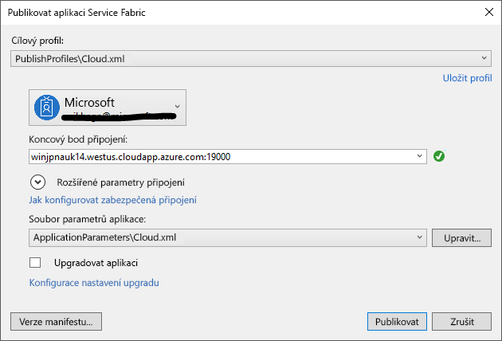

# <a name="deploy-an-application-to-a-party-cluster-in-azure"></a>Nasazení aplikace do clusteru s podporou strany v Azure
V tomto kurzu je součástí dvě řady a ukazuje, jak nasadit aplikaci Azure Service Fabric do clusteru s podporou strany v Azure.

V druhé části kurzu řady zjistíte, jak:
> [!div class="checklist"]
> * Nasazení aplikace do vzdáleného clusteru pomocí sady Visual Studio
> * Odebrání aplikace z clusteru pomocí Service Fabric Exploreru

V této série kurzu zjistíte, jak:
> [!div class="checklist"]
> * [Sestavení aplikace .NET Service Fabric](service-fabric-tutorial-create-dotnet-app.md)
> * Nasazení aplikace na vzdálený cluster
> * [Konfigurace CI/CD pomocí Visual Studio Team Services](service-fabric-tutorial-deploy-app-with-cicd-vsts.md)
> * [Nastavení monitorování a diagnostiky pro aplikaci](service-fabric-tutorial-monitoring-aspnet.md)

## <a name="prerequisites"></a>Požadavky
Před zahájením tohoto kurzu:
- Pokud nemáte předplatné Azure, vytvořte [bezplatný účet](https://azure.microsoft.com/free/?WT.mc_id=A261C142F)
- [Nainstalovat Visual Studio 2017](https://www.visualstudio.com/) a nainstalujte **Azure development** a **ASP.NET a webové vývoj** úlohy.
- [Instalace Service Fabric SDK](service-fabric-get-started.md)

## <a name="download-the-voting-sample-application"></a>Stažení ukázkové aplikace Voting
Pokud není sestavení Voting ukázkovou aplikaci [součástí jeden z této série kurz](service-fabric-tutorial-create-dotnet-app.md), můžete ho stáhnout. V příkazovém okně spusťte následující příkaz, který klonovat úložiště ukázkové aplikace do místního počítače.

```
git clone https://github.com/Azure-Samples/service-fabric-dotnet-quickstart
```

## <a name="set-up-a-party-cluster"></a>Nastavení clusteru strany
Party clustery jsou bezplatné, časově omezené clustery Service Fabric hostované v Azure a provozované týmem Service Fabric, na kterých může kdokoli nasazovat aplikace a seznamovat se s platformou. Zdarma!

Chcete-li získat přístup ke clusteru s podporou strany, přejděte do této lokality: http://aka.ms/tryservicefabric a postupujte podle pokynů a získat přístup ke clusteru. Potřebujete účet Facebook nebo Githubu a získat přístup ke clusteru s podporou strany.

Pokud chcete, můžete použít vlastní cluster místo strany clusteru.  Jádro ASP.NET front-end web používá ke komunikaci s back-end stavové služby reverzní proxy server.  Strany clustery a místního vývojového clusteru mít ve výchozím nastavení povolená reverzní proxy server.  Pokud nasadíte Voting ukázkovou aplikaci pro vlastní cluster, musíte [povolit reverzní proxy server v clusteru](service-fabric-reverseproxy.md#setup-and-configuration).

> [!NOTE]
> Strany clustery není zabezpečená, aby vaše aplikace a všechna data, která jste uložili v nich může být vidět další uživatelé. Nenasazujte nic nechcete vidět. Nezapomeňte si přečíst přes naše podmínky použití pro všechny podrobnosti.

## <a name="deploy-the-app-to-the-azure"></a>Nasazení aplikace na Azure
Teď, když je aplikace připravená, můžete ho nasadit do clusteru strany přímé ze sady Visual Studio.

1. Klikněte pravým tlačítkem na **Voting** v Průzkumníku řešení a zvolte **publikovat**.

    

2. Typ v koncovém bodě připojení clusteru, strana **koncového bodu připojení** pole a klikněte na tlačítko **publikovat**.

    Po dokončení publikování, byste měli mít k odeslání požadavku na aplikaci prostřednictvím prohlížeče.

3. Otevřít vaše preferované prohlížeč a zadejte adresu clusteru (koncového bodu připojení bez informace o portu – například win1kw5649s.westus.cloudapp.azure.com).

    Teď byste měli vidět stejného výsledku, jako jste viděli při spuštění aplikace místně.

    

## <a name="remove-the-application-from-a-cluster-using-service-fabric-explorer"></a>Odebrání aplikace z clusteru pomocí Service Fabric Exploreru
Service Fabric Explorer je grafické uživatelské rozhraní umožní zkoumat a správě aplikací v clusteru Service Fabric.

Lze aplikaci odebrat z clusteru strany:

1. Přejděte do Service Fabric Explorer pomocí odkazu poskytované stránku pro přihlášení strany clusteru. Například http://win1kw5649s.westus.cloudapp.azure.com:19080/Explorer/index.html.

2. V Service Fabric Exploreru, přejděte na **fabric://Voting** uzlu ve stromovém zobrazení na levé straně.

3. Klikněte **akce** tlačítko v pravém **Essentials** podokně a zvolte **odstranit aplikaci**. Potvrďte odstranění instanci aplikace, která odebere instanci naše aplikace běžící v clusteru.


## <a name="remove-the-application-type-from-a-cluster-using-service-fabric-explorer"></a>Typ aplikace odebrat z clusteru pomocí Service Fabric Exploreru
Aplikace jsou nasazeny jako typy aplikací v clusteru Service Fabric, která umožňuje mít víc instancí a verze aplikace běžící v rámci clusteru. Po odebrání spuštěnou instanci aplikace, jsme rovněž můžete odebrat typu, k dokončení vyčištění nasazení.

Další informace o modelu aplikace v Service Fabric najdete v tématu [Model aplikace v Service Fabric](service-fabric-application-model.md).

1. Přejděte na **VotingType** uzlu ve stromovém zobrazení.

2. Klikněte na tlačítko **akce** tlačítko v pravém **Essentials** podokně a zvolte **Unprovision typu**. Potvrďte rušení zajišťování typ aplikace.


Tím je kurz ukončen.

## <a name="next-steps"></a>Další kroky
V tomto kurzu jste se naučili:

> [!div class="checklist"]
> * Nasazení aplikace do vzdáleného clusteru pomocí sady Visual Studio
> * Odebrání aplikace z clusteru pomocí Service Fabric Exploreru

Přechodu na další kurz:
> [!div class="nextstepaction"]
> [Nastavte průběžnou integraci pomocí Visual Studio Team Services](service-fabric-tutorial-deploy-app-with-cicd-vsts.md)