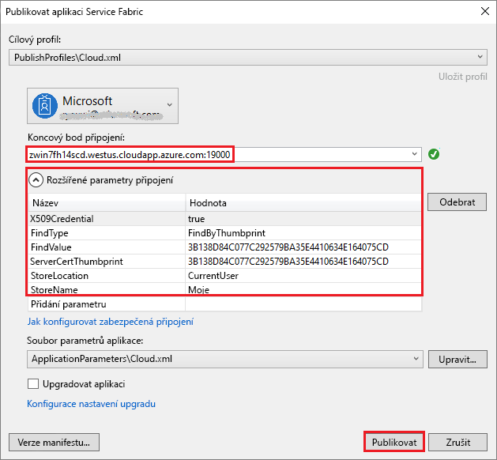

# <a name="deploy-an-application-to-a-party-cluster-in-azure"></a>Nasazení aplikace do Party Clusteru v Azure
Tento kurz představuje druhý díl série kurzů a ukáže vám, jak nasadit aplikaci Azure Service Fabric do Party Clusteru v Azure.

Ve druhé části této série kurzů se naučíte:
> [!div class="checklist"]
> * [Sestavit aplikaci .NET pro Service Fabric](service-fabric-tutorial-create-dotnet-app.md)
> * Nasadit aplikaci do vzdáleného clusteru
> * [Nakonfigurovat CI/CD pomocí Visual Studio Team Services](service-fabric-tutorial-deploy-app-with-cicd-vsts.md)
> * [Nastavit monitorování a diagnostiku aplikace](service-fabric-tutorial-monitoring-aspnet.md)

V této sérii kurzů se naučíte:
> [!div class="checklist"]
> * Nasadit aplikaci do vzdáleného clusteru pomocí sady Visual Studio
> * Odebrat aplikaci z clusteru pomocí rozhraní Service Fabric Explorer

## <a name="prerequisites"></a>Požadavky
Než začnete s tímto kurzem:
- Pokud ještě nemáte předplatné Azure, vytvořte si [bezplatný účet](https://azure.microsoft.com/free/?WT.mc_id=A261C142F).
- [Nainstalujte sadu Visual Studio 2017](https://www.visualstudio.com/) se sadami funkcí **Vývoj pro Azure** a **Vývoj pro ASP.NET a web**.
- [Nainstalujte sadu Service Fabric SDK](service-fabric-get-started.md).

## <a name="download-the-voting-sample-application"></a>Stažení ukázkové aplikace Voting
Pokud jste nesestavili ukázkovou aplikaci Voting v [první části této série kurzů](service-fabric-tutorial-create-dotnet-app.md), můžete si ji stáhnout. V příkazovém okně naklonujte spuštěním následujícího příkazu úložiště ukázkové aplikace do místního počítače.

```
git clone https://github.com/Azure-Samples/service-fabric-dotnet-quickstart
```

## <a name="set-up-a-party-cluster"></a>Vytvoření Party Clusteru
Party clustery jsou bezplatné, časově omezené clustery Service Fabric hostované v Azure a provozované týmem Service Fabric, na kterých může kdokoli nasazovat aplikace a seznamovat se s platformou. Zadarmo!

Pokud chcete získat přístup k Party Clusteru, přejděte na web http://aka.ms/tryservicefabric a postupujte podle pokynů pro přístup ke clusteru. K získání přístupu k Party Clusteru potřebujete účet na Facebooku nebo GitHubu.

Pokud chcete, můžete místo Party Clusteru použít vlastní cluster.  Front-end jádra webu ASP.NET používá ke komunikaci s back-endem stavové služby reverzní proxy server.  Party Clustery a místní vývojový cluster mají ve výchozím nastavení reverzní proxy server povolený.  Pokud nasazujete ukázkovou aplikaci Voting do vlastního clusteru, je potřeba [povolit v clusteru reverzní proxy server](service-fabric-reverseproxy.md#setup-and-configuration).

> [!NOTE]
> Party Clustery nejsou zabezpečené, takže vaše aplikace a všechna data, která do nich umístíte, můžou vidět jiní uživatelé. Nenasazujte nic, co nechcete ukazovat ostatním. Nezapomeňte si přečíst všechny podrobnosti v našich podmínkách použití.

Přihlaste se a [připojte se ke clusteru Windows](http://aka.ms/tryservicefabric). Stáhněte si certifikát PFX do počítače kliknutím na odkaz **PFX**. Certifikát a hodnota **Koncový bod připojení** použijete v následujících krocích.


Na počítači s Windows nainstalujte PFX do úložiště certifikátů *CurrentUser\My*.

```powershell
PS C:\mycertificates> Import-PfxCertificate -FilePath .\party-cluster-873689604-client-cert.pfx -CertStoreLocation Cert:
\CurrentUser\My


  PSParentPath: Microsoft.PowerShell.Security\Certificate::CurrentUser\My

Thumbprint                                Subject
----------                                -------
3B138D84C077C292579BA35E4410634E164075CD  CN=zwin7fh14scd.westus.cloudapp.azure.com
```


## <a name="deploy-the-app-to-the-azure"></a>Nasazení aplikace do Azure
Aplikace je teď připravená a vy ji můžete přímo ze sady Visual Studio nasadit do Party Clusteru.

1. V Průzkumníku řešení klikněte pravým tlačítkem na **Voting** a zvolte **Publikovat**. 

    

2. Do pole **Koncový bod připojení** zkopírujte **Koncový bod připojení** ze stránky Party clusteru. Například, `zwin7fh14scd.westus.cloudapp.azure.com:19000`. Klikněte na **Rozšířené parametry připojení** a vyplňte následující informace.  Hodnoty *FindValue* and *ServerCertThumbprint* musí odpovídat kryptografickému otisku certifikátu nainstalovanému v předchozím kroku. Klikněte na **Publikovat**. 

    Po dokončení publikování by mělo být možné odeslat do aplikace požadavek z prohlížeče.

3. Otevřete svůj upřednostňovaný prohlížeč a zadejte adresu clusteru (koncový bod připojení bez informací o portu, třeba win1kw5649s.westus.cloudapp.azure.com).

    Teď byste měli vidět stejný výsledek, jako když jste aplikaci spustili v místním prostředí.

    

## <a name="remove-the-application-from-a-cluster-using-service-fabric-explorer"></a>Odebrání aplikace z clusteru pomocí rozhraní Service Fabric Explorer
Service Fabric Explorer je grafické uživatelské rozhraní, které umožňuje procházení a správu aplikací v clusteru Service Fabric.

Odebrání aplikace z Party Clusteru:

1. Přejděte do rozhraní Service Fabric Explorer pomocí odkazu uvedeného na registrační stránce Party Clusteru. Například https://win1kw5649s.westus.cloudapp.azure.com:19080/Explorer/index.html.

2. V Service Fabric Exploreru přejděte v zobrazení stromu na levé straně do uzlu **fabric:/Voting**.

3. V pravém podokně **Essentials** klikněte na tlačítko **Akce** a vyberte **Odstranit aplikaci**. Potvrďte odstranění instance aplikace, při kterém dojde k odebrání instance naší aplikace spuštěné v clusteru.


## <a name="remove-the-application-type-from-a-cluster-using-service-fabric-explorer"></a>Odebrání typu aplikace z clusteru pomocí rozhraní Service Fabric Explorer
Aplikace se v clusteru Service Fabric nasazují jako typy aplikací, takže můžete mít v clusteru spuštěných několik instancí a verzí aplikace. Po odebrání spuštěné instance aplikace můžete odebrat také daný typ, abyste nasazení úplně vyčistili.

Další informace o modelu aplikací ve službě Service Fabric najdete v tématu [Modelování aplikace v Service Fabric](service-fabric-application-model.md).

1. V zobrazení stromu přejděte na uzel **VotingType**.

2. V pravém podokně **Essentials** klikněte na tlačítko **Akce** a vyberte **Unprovision Type** (Zrušit zřízení typu). Potvrďte zrušení zřízení typu aplikace.


Tímto je kurz u konce.

## <a name="next-steps"></a>Další kroky
V tomto kurzu jste se naučili:

> [!div class="checklist"]
> * Nasadit aplikaci do vzdáleného clusteru pomocí sady Visual Studio
> * Odebrat aplikaci z clusteru pomocí rozhraní Service Fabric Explorer

Přejděte k dalšímu kurzu:
> [!div class="nextstepaction"]
> [Nastavení průběžné integrace s Visual Studio Team Services](service-fabric-tutorial-deploy-app-with-cicd-vsts.md)
