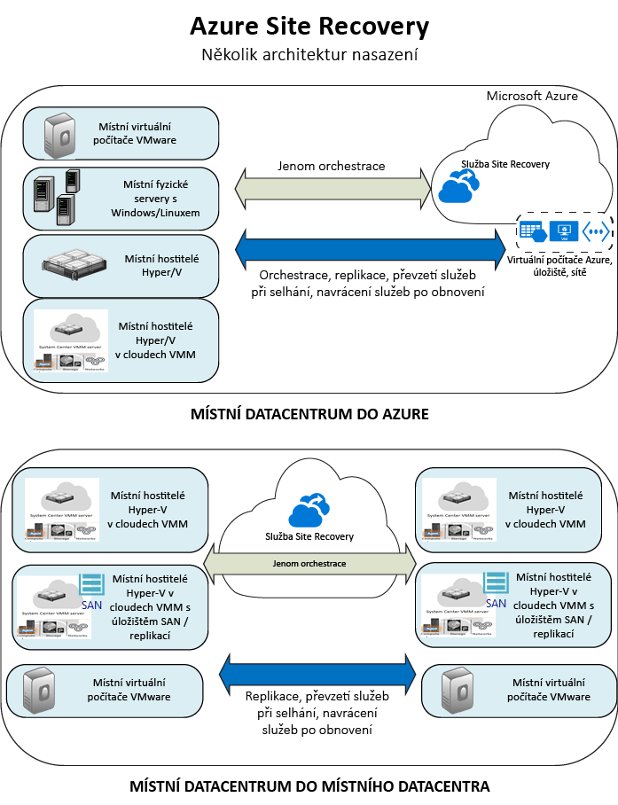

<properties
    pageTitle="Co je Site Recovery? | Microsoft Azure" 
    description="Přehled služby Azure Site Recovery a vysvětlení způsobu jejího nasazení" 
    services="site-recovery" 
    documentationCenter="" 
    authors="rayne-wiselman" 
    manager="jwhit" 
    editor=""/>

<tags 
    ms.service="site-recovery" 
    ms.devlang="na"
    ms.topic="get-started-article"
    ms.tgt_pltfrm="na"
    ms.workload="storage-backup-recovery" 
    ms.date="02/22/2016" 
    ms.author="raynew"/>

#  Co je Site Recovery?

Vítejte v Azure Site Recovery! Začněte tímto článkem. Poskytne vám rychlý přehled služby Site Recovery a popíše, čím může služba přispět ke strategii pro provozní kontinuitu a zotavení po havárii (BCDR).

## Přehled

Organizace potřebují strategii BCDR, která určuje, jak aplikace, úlohy a data zůstanou spuštěné a dostupné během plánovaných a neplánovaných výpadků a jak co nejdříve obnovit normální provozní podmínky. Strategie BCDR by měla zajistit bezpečnost a obnovitelnost firemních dat a zajistit, aby v případě, že dojde k havárii, byly zpracovávané úlohy stále k dispozici. 

Site Recovery je služba Azure, která přispívá ke strategie BCDR orchestrací replikace místní fyzických serverů a virtuálních počítačů do cloudu (Azure) nebo do sekundárního datového centra. Pokud dojde k výpadkům ve vašem primárním umístění, předáte služby při selhání do sekundárního umístění, aby aplikace a úlohy zůstaly dostupné. Až se obnoví normální provozní podmínky, vrátíte služby po obnovení zpět do primárního umístění. Potřebujete další informace [O službě Site Recovery?](site-recovery-overview.md)

## Site Recovery na portálu Azure

Azure má dva různé [modely nasazení](../resource-manager-deployment-model.md) pro vytváření prostředků a práci s nimi: Azure Resource Manager a klasický model správy služeb. Azure má také dva portály – [portál Azure Classic](https://manage.windowsazure.com/), který podporuje klasický model nasazení, a [portál Azure](https://portal.azure.com) s podporou pro oba modely nasazení.

Site Recovery je k dispozici na klasickém portálu a na portálu Azure. Na portálu Azure Classic můžete podporovat službu Site Recovery s klasickým modelem správy služeb. Na portálu Azure můžete podporovat klasický model nasazení nebo nasazení nástroje Resource Manager. [Další informace](site-recovery-overview.md#site-recovery-in-the-azure-portal) o nasazení pomocí portálu Azure.

Informace v tomto článku se vztahují na klasické nasazení i na nasazení portálu Azure. Rozdíly jsou popsány v případě potřeby.

## Proč používat Site Recovery? 

Zde je výčet, co může Site Recovery poskytnout vašemu podniku:

- **Zjednodušení strategie BCDR** – Site Recovery usnadňuje řešení replikace, převzetí služeb při selhání a obnovení několika podnikových úloh a aplikací z jediné lokality. Site Recovery orchestruje replikaci a převzetí služeb při selhání, ale nezachycuje data aplikací ani o nich nemá žádné informace.
- **Flexibilní replikace** – Pomocí Site Recovery můžete replikovat úlohy běžící ve virtuálních počítačích Hyper-V a VMware a na fyzických serverech s Windows nebo Linuxem. 
- **Snadné převzetí služeb při selhání a obnovení** – Site Recovery poskytuje testovací převzetí služeb při selhání, což umožňuje nácvik zotavení po havárii, aniž by to mělo dopad na produkční prostředí. Pro očekávané výpadky je možné spouštět plánovaná převzetí služeb při selhání bez ztráty dat. V případě neočekávaných havárií pak mohou proběhnout neplánovaná převzetí služeb s minimálními ztrátami dat (podle četnosti replikací). Po obnovení můžete služby, které byly převzaty při selhání, navrátit na primární lokality. Site Recovery poskytuje plány obnovení, které mohou obsahovat skripty a sešity automatizace Azure, což vám umožní přizpůsobit si přebírání služeb při selhání a obnovování vícevrstvých aplikací. 
- **Eliminace sekundárních datacenter** – Můžete replikovat na sekundární místní lokalitu nebo do Azure. Využitím Azure jako cíle pro zotavení po havárii se eliminují náklady a složitost spojené s udržováním sekundární lokality. Replikovaná data se uchovávají v Azure Storage se vší odolností, kterou tato služba nabízí.
- **Integrace s existujícími technologiemi BCDR** – Site Recovery spolupracuje s funkcemi BCDR jiných aplikací. Site Recovery je například možné použít k ochraně back-endu SQL Serveru u firemních úloh, včetně nativní podpory pro SQL Server AlwaysOn, pokud jde o přebírání služeb skupin dostupnosti při selhání. 

## Co mohu replikovat?

Zde naleznete souhrn toho, co dokáže nástroj Site Recovery replikovat.

**REPLIKACE** | **REPLIKACE Z (LOKÁLNĚ)** | **DO** | **ČLÁNEK**
---|---|---|---
Virtuální počítače VMware | Server VMware | Azure | [Další informace](site-recovery-vmware-to-azure-classic.md)
Virtuální počítače VMware | Server VMware | Sekundární lokalita VMware | [Další informace](site-recovery-vmware-to-vmware.md) 
Virtuální počítače Hyper-V | Hostitel Hyper-V v cloudu VMM | Azure | [Další informace](site-recovery-vmm-to-azure.md) 
Virtuální počítače Hyper-V | Hostitel Hyper-V v cloudu VMM | Sekundární lokalita VMM | [Další informace](site-recovery-vmm-to-vmm.md)
Virtuální počítače Hyper-V | Hostitel Hyper-V v cloudu VMM s úložištěm pro sítě SAN| Sekundární lokalita VMM s úložištěm pro sítě SAN | [Další informace](site-recovery-vmm-san.md)
Virtuální počítače Hyper-V | Hostitel Hyper-V (bez VMM) | Azure | [Další informace](site-recovery-hyper-v-site-to-azure.md)
Fyzické servery Windows/Linux | Fyzický server | Azure | [Další informace](site-recovery-vmware-to-azure-classic.md)
Úlohy běžící na fyzických serverech s Windows nebo Linuxem | Fyzický server | Sekundární datacentrum | [Další informace](site-recovery-vmware-to-vmware.md) 

## Jaké úlohy mohu ochránit?

Site Recovery může pomoci se strategií BCDR se sledováním aplikací, aby úlohy a aplikace neustále běžely, i když dojde k výpadku. Site Recovery poskytuje následující: 

- **Snímky konzistentní vzhledem k aplikacím** – Replikace pomocí snímků konzistentních vzhledem k aplikacím s jednou nebo N vrstvami
- **Téměř synchronní replikace** – Frekvence replikací pouhých 30 sekund pro Hyper-V a neustálá replikace pro VMware
- **Integrace s SQL Server AlwaysOn** – Správa převzetí služeb skupin dostupnosti při selhání v plánech obnovení Site Recovery 
- **Flexibilní plány obnovení** – Vytváření a přizpůsobení plánů obnovení pomocí externích skriptů, manuálních akcí a runbooků služby Azure Automation, které umožňují obnovit celý zásobník aplikací jediným kliknutím.
- **Knihovna Automation** – Bohatá knihovna Azure Automation obsahující předpřipravené skripty specifické pro aplikace, které je možné stáhnout a integrovat se Site Recovery
- **Jednoduchá správa sítě** – Pokročilá správa sítě v Site Recovery a Azure, která zjednodušuje požadavky aplikací na síť, včetně rezervace IP adres, konfigurace nástrojů pro vyrovnávání zatížení a integrace Azure Traffic Manageru pro efektivní přepínání sítí.

## Další kroky

- Více informací o Site Recovery najdete v tématu [Jaké úlohy je možné chránit pomocí Site Recovery?](site-recovery-workload.md).
- Další informace o architektuře Site Recovery najdete v článku [Jak funguje Site Recovery?](site-recovery-components.md).
 

<!--HONumber=Aug16_HO4-->

