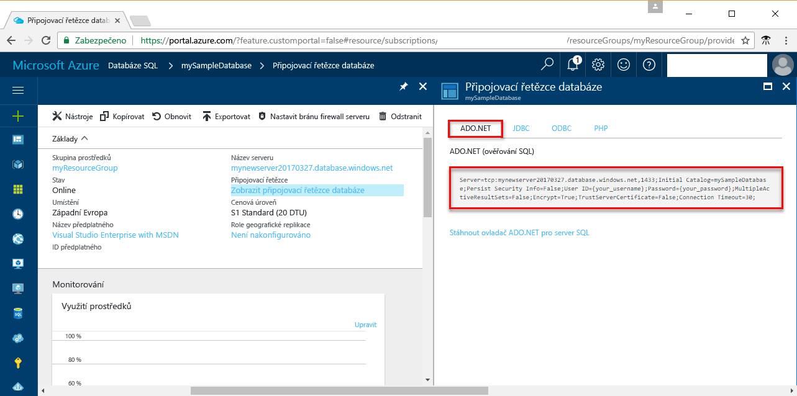

# <a name="use-net-core-c-to-query-an-azure-sql-database"></a>Použití .NET Core (jazyk C#) k dotazování databáze SQL Azure

Tento rychlý úvodní kurz ukazuje použití [.NET Core](https://www.microsoft.com/net/) v systému Windows, Linux nebo macOS k vytvoření programu v jazyce C# pro připojení k databázi SQL Azure a použití příkazů jazyka Transact-SQL k dotazování dat.

## <a name="prerequisites"></a>Požadavky

Abyste mohli absolvovat tento rychlý úvodní kurz, ujistěte se, že máte následující:

[!INCLUDE [prerequisites-create-db](../../includes/sql-database-connect-query-prerequisites-create-db-includes.md)]

- [Pravidlo brány firewall na úrovni serveru](sql-database-get-started-portal.md#create-a-server-level-firewall-rule) pro veřejnou IP adresu počítače, který používáte pro tento rychlý úvodní kurz.

- Nainstalované [.NET Core pro váš operační systém](https://www.microsoft.com/net/core). 

## <a name="sql-server-connection-information"></a>Informace o připojení k SQL serveru

[!INCLUDE [prerequisites-server-connection-info](../../includes/sql-database-connect-query-prerequisites-server-connection-info-includes.md)]

#### <a name="for-adonet"></a>ADO.NET

1. Pokračujte kliknutím na **Zobrazit databázové připojovací řetězce**.

2. Zkontrolujte úplný připojovací řetězec **ADO.NET**.

    

> [!IMPORTANT]
> Musíte mít nastavené pravidlo brány firewall pro veřejnou IP adresu počítače, na kterém provádíte tento kurz. Pokud jste na jiném počítači nebo máte jinou veřejnou IP adresu, vytvořte [pravidlo brány firewall na úrovni serveru pomocí webu Azure Portal](sql-database-get-started-portal.md#create-a-server-level-firewall-rule). 
>
  
## <a name="create-a-new-net-project"></a>Vytvoření nového projektu .NET

1. Otevřete příkazový řádek a vytvořte složku *sqltest*. Přejděte do složky, kterou jste vytvořili, a spusťte následující příkaz:

    ```
    dotnet new console
    ```

2. Otevřete soubor ***sqltest.csproj*** v oblíbeném textovém editoru a pomocí následujícího kódu přidejte System.Data.SqlClient jako závislost:

    ```xml
    <ItemGroup>
        <PackageReference Include="System.Data.SqlClient" Version="4.4.0" />
    </ItemGroup>
    ```

## <a name="insert-code-to-query-sql-database"></a>Vložení kódu pro dotazování databáze SQL

1. Ve vývojovém prostředí nebo oblíbeném textovém editoru otevřete soubor **Program.cs**.

2. Nahraďte jeho obsah následujícím kódem a přidejte odpovídající hodnoty pro váš server, databázi, uživatele a heslo.

```csharp
using System;
using System.Data.SqlClient;
using System.Text;

namespace sqltest
{
    class Program
    {
        static void Main(string[] args)
        {
            try 
            { 
                SqlConnectionStringBuilder builder = new SqlConnectionStringBuilder();
                builder.DataSource = "your_server.database.windows.net"; 
                builder.UserID = "your_user";            
                builder.Password = "your_password";     
                builder.InitialCatalog = "your_database";

                using (SqlConnection connection = new SqlConnection(builder.ConnectionString))
                {
                    Console.WriteLine("\nQuery data example:");
                    Console.WriteLine("=========================================\n");
                    
                    connection.Open();       
                    StringBuilder sb = new StringBuilder();
                    sb.Append("SELECT TOP 20 pc.Name as CategoryName, p.name as ProductName ");
                    sb.Append("FROM [SalesLT].[ProductCategory] pc ");
                    sb.Append("JOIN [SalesLT].[Product] p ");
                    sb.Append("ON pc.productcategoryid = p.productcategoryid;");
                    String sql = sb.ToString();

                    using (SqlCommand command = new SqlCommand(sql, connection))
                    {
                        using (SqlDataReader reader = command.ExecuteReader())
                        {
                            while (reader.Read())
                            {
                                Console.WriteLine("{0} {1}", reader.GetString(0), reader.GetString(1));
                            }
                        }
                    }                    
                }
            }
            catch (SqlException e)
            {
                Console.WriteLine(e.ToString());
            }
            Console.ReadLine();
        }
    }
}
```

## <a name="run-the-code"></a>Spuštění kódu

1. V příkazovém řádku spusťte následující příkazy:

   ```csharp
   dotnet restore
   dotnet run
   ```

2. Ověřte, že se vrátilo prvních 20 řádků, a potom zavřete okno aplikace.


## <a name="next-steps"></a>Další kroky

- [Začínáme s .NET Core v systému Windows, Linux nebo macOS pomocí příkazového řádku](/dotnet/core/tutorials/using-with-xplat-cli)
- Informace o [připojení k databázi SQL Azure a jejím dotazování pomocí rozhraní .NET Framework a sady Visual Studio](sql-database-connect-query-dotnet-visual-studio.md)  
- Informace o [návrhu první databáze SQL Azure pomocí aplikace SSMS](sql-database-design-first-database.md) nebo [návrhu první databáze SQL Azure pomocí .NET](sql-database-design-first-database-csharp.md)
- Další informace o .NET najdete v [dokumentaci rozhraní .NET](https://docs.microsoft.com/dotnet/).
