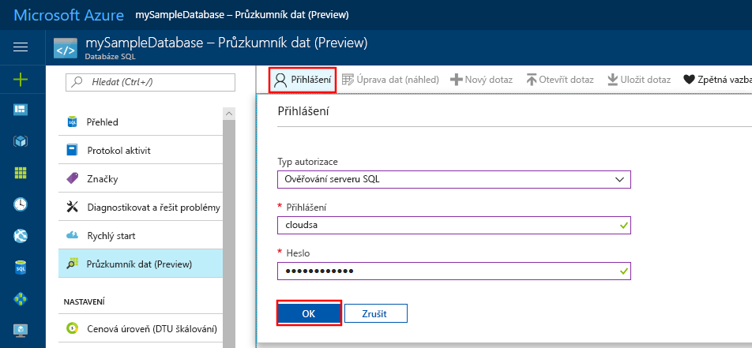
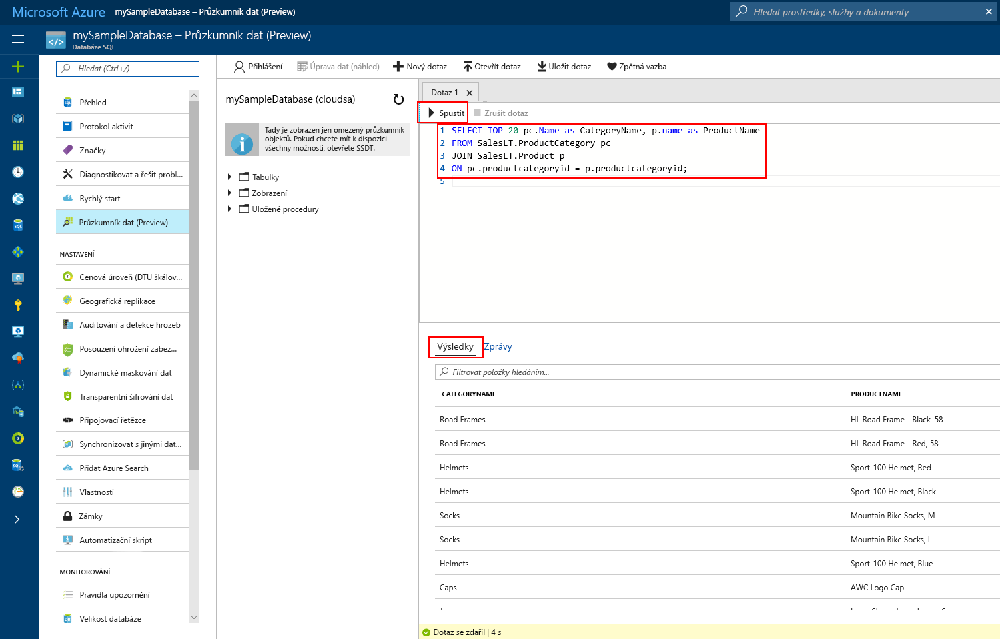

# <a name="azure-portal-use-the-sql-query-editor-to-connect-and-query-data"></a>Azure Portal: Použití editoru dotazů SQL k připojení a dotazování dat

Editor dotazů SQL je dotazovací nástroj založený na prohlížeči, který poskytuje efektivní a jednoduchý způsob zpracování dotazů SQL pro Azure SQL Database nebo Azure SQL Data Warehouse, aniž byste museli opustit Azure Portal. Tento rychlý start ukazuje použití editoru dotazů pro připojení k databázi SQL a následné použití příkazů jazyka Transact-SQL k dotazování, vkládání, aktualizaci a odstraňování dat v databázi.

## <a name="prerequisites"></a>Požadavky

Tento rychlý start používá jako výchozí bod prostředky vytvořené v některém z těchto rychlých startů:

[!INCLUDE [prerequisites-create-db](../../includes/sql-database-connect-query-prerequisites-create-db-includes.md)]

## <a name="log-in-to-the-azure-portal"></a>Přihlášení k portálu Azure Portal

Přihlaste se k portálu [Azure Portal](https://portal.azure.com/).


## <a name="connect-using-sql-authentication"></a>Připojení s využitím ověřování SQL
> [!NOTE]
> Ověřte, že v nastavení brány firewall SQL Serveru je zapnutá možnost Povolit přístup ke službám Azure. Tato možnost poskytuje editoru dotazů SQL přístup k databázi a datovým skladům.

1. V nabídce nalevo klikněte na **Databáze SQL** a potom klikněte na databázi, pro kterou chcete zadat dotaz.

2. Na stránce databáze SQL pro vaši databázi klikněte v levé nabídce na **Průzkumník dat (Preview)**.

    

3. Klikněte na **Přihlásit**, na vyzvání vyberte **Ověřování SQL Serveru** a potom zadejte přihlašovací jméno a heslo správce serveru, které jste zadali při vytváření této databáze.

    

4. Přihlaste se kliknutím na **OK**.


## <a name="connect-using-azure-ad"></a>Připojení pomocí Azure AD

Konfigurace správce služby Active Directory umožňuje používat jednu identitu pro přihlášení k webu Azure Portal i k databázi SQL. Při konfiguraci správce Active Directory pro SQL Server, kterého jste vytvořili, použijte následující postup.

> [!NOTE]
> E-mailové účty (například outlook.com, hotmail.com, live.com, gmail.com, yahoo.com) se zatím jako správce Active Directory nepodporují. Nezapomeňte vybrat uživatele, který byl buď v Azure Active Directory vytvořený nativně, nebo který byl do Azure Active Directory federovaný.

1. V nabídce nalevo vyberte **SQL servery** a v seznamu serverů vyberte váš SQL Server.

2. V nabídce nastavení SQL Serveru vyberte nastavení **Správce Active Directory**.

3. V okně správce Active Directory klikněte na příkaz **Nastavit správce** a vyberte uživatele nebo skupinu, kteří budou správcem Active Directory.

    

4. Kliknutím na příkaz **Uložit** v horní části okna správce Active Directory nastavíte správce Active Directory.

Přejděte k databázi SQL, pro kterou chcete zadat dotaz, a v nabídce vlevo klikněte na **Průzkumník dat (Preview)**. Průzkumník dat se otevře a automaticky vás připojí k databázi.


## <a name="run-query-using-query-editor"></a>Spuštění dotazu pomocí editoru dotazů

Po ověření zadejte do podokna editoru dotazů následující dotaz pro zobrazení nejlepších 20 produktů podle kategorie.

```sql
 SELECT TOP 20 pc.Name as CategoryName, p.name as ProductName
 FROM SalesLT.ProductCategory pc
 JOIN SalesLT.Product p
 ON pc.productcategoryid = p.productcategoryid;
```

Klikněte na **Spustit** a pak zkontrolujte výsledky dotazu v podokně **Výsledky**.



## <a name="insert-data-using-query-editor"></a>Vložení dat pomocí editoru dotazů

Použijte následující kód k vložení nového produktu do tabulky SalesLT.Product pomocí příkazu jazyka Transact-SQL [INSERT](https://msdn.microsoft.com/library/ms174335.aspx).

1. V okně dotazu nahraďte předchozí dotaz následujícím dotazem:

   ```sql
   INSERT INTO [SalesLT].[Product]
           ( [Name]
           , [ProductNumber]
           , [Color]
           , [ProductCategoryID]
           , [StandardCost]
           , [ListPrice]
           , [SellStartDate]
           )
     VALUES
           ('myNewProduct'
           ,123456789
           ,'NewColor'
           ,1
           ,100
           ,100
           ,GETDATE() );
   ```

2. Kliknutím na **Spustit** na panelu nástrojů vložíte nový řádek do tabulky Product.

## <a name="update-data-using-query-editor"></a>Aktualizace dat pomocí editoru dotazů

Použijte následující kód k aktualizaci nového produktu, který jste přidali dříve, pomocí příkazu jazyka Transact-SQL [UPDATE](https://msdn.microsoft.com/library/ms177523.aspx).

1. V okně dotazu nahraďte předchozí dotaz následujícím dotazem:

   ```sql
   UPDATE [SalesLT].[Product]
   SET [ListPrice] = 125
   WHERE Name = 'myNewProduct';
   ```

2. Kliknutím na **Spustit** na panelu nástrojů aktualizujete zadaný řádek v tabulce Product.

## <a name="delete-data-using-query-editor"></a>Odstranění dat pomocí editoru dotazů

Použijte následující kód k odstranění nového produktu, který jste přidali dříve, pomocí příkazu jazyka Transact-SQL [DELETE](https://msdn.microsoft.com/library/ms189835.aspx).

1. V okně dotazu nahraďte předchozí dotaz následujícím dotazem:

   ```sql
   DELETE FROM [SalesLT].[Product]
   WHERE Name = 'myNewProduct';
   ```

2. Kliknutím na **Spustit** na panelu nástrojů odstraníte zadaný řádek v tabulce Product.


## <a name="query-editor-considerations"></a>Požadavky editoru dotazů

Při práci s editorem dotazů ve verzi Preview byste měli vědět pár věcí:

1. Ověřte, že jste v nastavení brány firewall Azure SQL Serveru zapnuli možnost Povolit přístup ke službám Azure. Tato možnost poskytuje editoru dotazů SQL přístup k datovým skladům a databázím SQL.

2. Přihlášení správce Azure Active Directory nefunguje pro účty, které mají povolené dvoufaktorové ověřování.

3. E-mailové účty (například outlook.com, hotmail.com, live.com, gmail.com, yahoo.com) se zatím jako správce Active Directory nepodporují. Nezapomeňte vybrat uživatele, který byl buď v Azure Active Directory vytvořený nativně, nebo který byl do Azure Active Directory federovaný.

4. Editor dotazů ještě nepodporuje dotazy na prostorové datové typy. Výsledkem dotazu na prostorový sloupec bude chyba System.IO.FileNotFoundException.

5. IntelliSense pro databázové tabulky a zobrazení se nepodporuje. Editor ale podporuje automatické dokončování názvů, které jste už zadali.

6. Stisknutí klávesy F5 aktualizuje stránku editoru dotazů a způsobí ztrátu dotazu, který se právě zpracovává. K provádění dotazů použijte tlačítko Spustit na panelu nástrojů.


## <a name="next-steps"></a>Další kroky

- Další informace o jazyku Transact-SQL, který je podporovaný v databázích Azure SQL, najdete v tématu věnovaném [rozdílům Transact-SQL v databázi SQL](sql-database-transact-sql-information.md).
