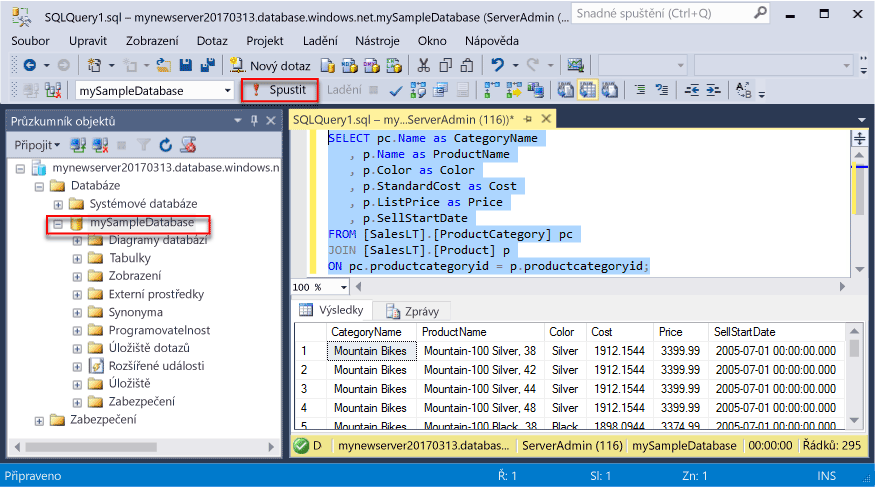
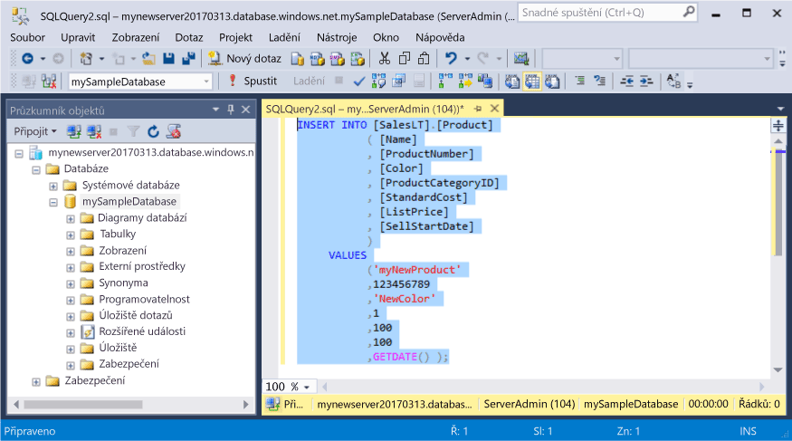
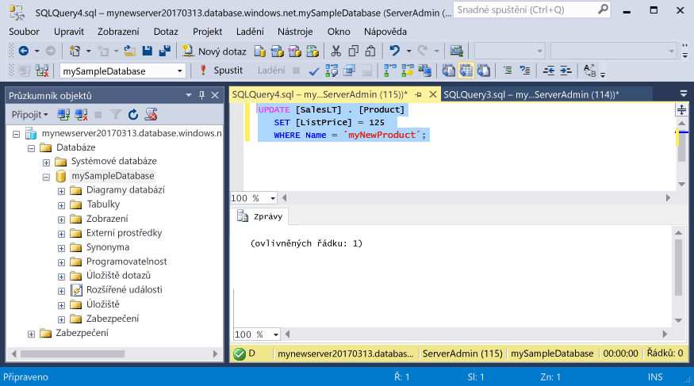
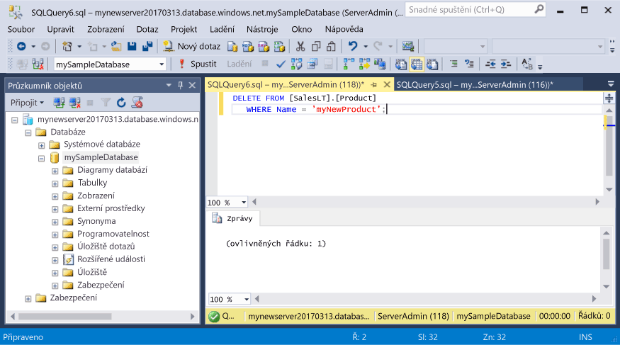

# <a name="azure-sql-database-use-sql-server-management-studio-to-connect-and-query-data"></a>Azure SQL Database: Připojení a dotazování dat pomocí aplikace SQL Server Management Studio

Pomocí aplikace [SQL Server Management Studio](https://msdn.microsoft.com/library/ms174173.aspx) můžete vytvářet a spravovat prostředky SQL Serveru z uživatelského rozhraní nebo ve skriptech. Tento rychlý start podrobně popisuje použití aplikace SSMS pro připojení k databázi SQL Azure a následné provádění příkazů k dotazování, vložení, aktualizaci a odstranění.

Tento rychlý start používá jako výchozí bod prostředky vytvořené v některém z těchto rychlých startů:

- [Vytvoření databáze – portál](sql-database-get-started-portal.md)
- [Vytvoření databáze – rozhraní příkazového řádku](sql-database-get-started-cli.md)

Než začnete, ujistěte se, že máte nainstalovanou nejnovější verzi aplikace [SSMS](https://msdn.microsoft.com/library/mt238290.aspx). 

## <a name="get-connection-information"></a>Získání informací o připojení

Na webu Azure Portal získejte plně kvalifikovaný název serveru služby Azure SQL Database. Plně kvalifikovaný název serveru použijete k připojení k serveru pomocí aplikace SQL Server Management Studio.

1. Přihlaste se k [portálu Azure](https://portal.azure.com/).
2. V nabídce vlevo vyberte **SQL Database** a na stránce **Databáze SQL** klikněte na vaši databázi. 
3. V podokně **Základy** na stránce webu Azure Portal pro vaši databázi vyhledejte a potom zkopírujte **Název serveru**.

    

## <a name="connect-to-the-server-and-your-new-database"></a>Připojení k serveru a nové databázi

Pomocí aplikace SQL Server Management Studio navažte připojení k serveru služby Azure SQL Database.

1. Otevřete SQL Server Management Studio.

2. V dialogovém okně **Připojení k serveru** zadejte následující informace:
   - **Typ serveru:** Zadejte Databázový stroj.
   - **Název serveru:** Zadejte plně kvalifikovaný název serveru, například **mynewserver20170313.database.windows.net**.
   - **Ověřování:** Zadejte Ověřování SQL Serveru.
   - **Přihlášení:** Zadejte účet správce serveru.
   - **Heslo:** Zadejte heslo pro účet správce serveru.
 
    

3. Klikněte na **Připojit**. V aplikaci SSMS se otevře okno Průzkumníka objektů. 

    

4. V Průzkumníku objektů zobrazte objekty v ukázkové databázi rozbalením **Databáze** a potom **mySampleDatabase**.

## <a name="query-data"></a>Dotazování dat

K dotazování dat v databázi SQL Azure použijte příkaz jazyka Transact-SQL [SELECT](https://msdn.microsoft.com/library/ms189499.aspx).

1. V Průzkumníku objektů klikněte pravým tlačítkem na **mySampleDatabase** a potom klikněte na **Nový dotaz**. Otevře se prázdné okno dotazu připojené k vaší databázi.
2. V okně dotazu zadejte následující dotaz:

   ```sql
   SELECT pc.Name as CategoryName, p.name as ProductName
   FROM [SalesLT].[ProductCategory] pc
   JOIN [SalesLT].[Product] p
   ON pc.productcategoryid = p.productcategoryid;
   ```

3. Kliknutím na **Provést** na panelu nástrojů načtěte data z tabulek Product a ProductCategory.

    

## <a name="insert-data"></a>Vložení dat

K vložení dat do databáze SQL Azure použijte příkaz jazyka Transact-SQL [INSERT](https://msdn.microsoft.com/library/ms174335.aspx).

1. Na panelu nástrojů klikněte na **Nový dotaz**. Otevře se prázdné okno dotazu připojené k vaší databázi.
2. V okně dotazu zadejte následující dotaz:

   ```sql
   INSERT INTO [SalesLT].[Product]
           ( [Name]
           , [ProductNumber]
           , [Color]
           , [ProductCategoryID]
           , [StandardCost]
           , [ListPrice]
           , [SellStartDate]
           )
     VALUES
           ('myNewProduct'
           ,123456789
           ,'NewColor'
           ,1
           ,100
           ,100
           ,GETDATE() );
   ```

3. Kliknutím na **Provést** na panelu nástrojů vložte nový řádek do tabulky Product.

    

## <a name="update-data"></a>Aktualizace dat

K aktualizaci dat v databázi SQL Azure použijte příkaz jazyka Transact-SQL [UPDATE](https://msdn.microsoft.com/library/ms177523.aspx).

1. Na panelu nástrojů klikněte na **Nový dotaz**. Otevře se prázdné okno dotazu připojené k vaší databázi.
2. V okně dotazu zadejte následující dotaz:

   ```sql
   UPDATE [SalesLT].[Product]
   SET [ListPrice] = 125
   WHERE Name = 'myNewProduct';
   ```

3. Kliknutím na **Provést** na panelu nástrojů aktualizujte zadaný řádek v tabulce Product.

    

## <a name="delete-data"></a>Odstranění dat

K odstranění dat z databáze SQL Azure použijte příkaz jazyka Transact-SQL [DELETE](https://msdn.microsoft.com/library/ms189835.aspx).

1. Na panelu nástrojů klikněte na **Nový dotaz**. Otevře se prázdné okno dotazu připojené k vaší databázi.
2. V okně dotazu zadejte následující dotaz:

   ```sql
   DELETE FROM [SalesLT].[Product]
   WHERE Name = 'myNewProduct';
   ```

3. Kliknutím na **Provést** na panelu nástrojů odstraňte zadaný řádek z tabulky Product.

    

## <a name="next-steps"></a>Další kroky

- Další informace o aplikaci SSMS najdete v tématu [Použití aplikace SQL Server Management Studio](https://msdn.microsoft.com/library/ms174173.aspx).
- Informace o dotazování a upravování dat pomocí nástroje Visual Studio Code najdete na stránce [Visual Studio Code](https://code.visualstudio.com/docs).

