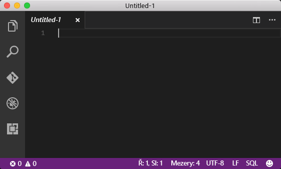
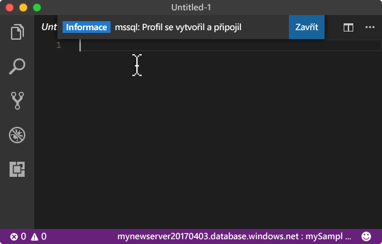
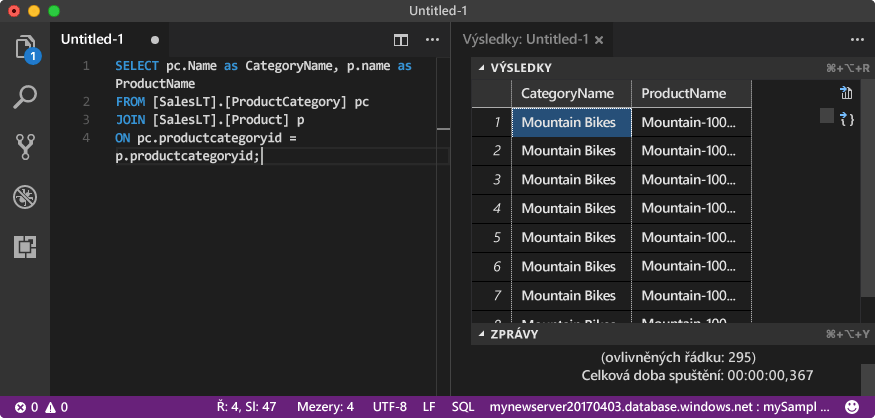

# <a name="azure-sql-database-use-visual-studio-code-to-connect-and-query-data"></a>Azure SQL Database: Použití nástroje Visual Studio Code k připojení a dotazování dat

[Visual Studio Code](https://code.visualstudio.com/docs) je grafický editor kódu pro Linux, macOS a Windows, který podporuje rozšíření, včetně [rozšíření mssql](https://aka.ms/mssql-marketplace) pro dotazování Microsoft SQL Serveru, Azure SQL Database a SQL Data Warehousu. Tento rychlý start ukazuje použití Visual Studio Code k připojení k Azure SQL Database a následné použití příkazů jazyka Transact-SQL k dotazování, vkládání, aktualizaci a odstraňování dat v databázi.

Tento rychlý start používá jako výchozí bod prostředky vytvořené v některém z těchto rychlých startů:

- [Vytvoření databáze – portál](sql-database-get-started-portal.md)
- [Vytvoření databáze – rozhraní příkazového řádku](sql-database-get-started-cli.md)

Než začnete, ujistěte se, že máte nainstalovanou nejnovější verzi nástroje [Visual Studio Code](https://code.visualstudio.com/Download) a načtené [rozšíření mssql](https://aka.ms/mssql-marketplace). Pokyny k instalaci rozšíření mssql najdete v tématu popisujícím [instalaci nástroje VS Code](https://docs.microsoft.com/sql/linux/sql-server-linux-develop-use-vscode#install-vs-code) a [mssql pro Visual Studio Code](https://marketplace.visualstudio.com/items?itemName=ms-mssql.mssql). 

## <a name="configure-vs-code-mac-os-only"></a>Konfigurace VS Code (pouze Mac OS)

### <a name="mac-os"></a>**Mac OS**
Pro macOS musíte nainstalovat OpenSSL, což je předpoklad pro DotNet Core, který rozšíření mssql používá. Otevřete terminál a zadejte následující příkazy, abyste nainstalovali **brew** a **OpenSSL**. 

```bash
ruby -e "$(curl -fsSL https://raw.githubusercontent.com/Homebrew/install/master/install)"
brew update
brew install openssl
mkdir -p /usr/local/lib
ln -s /usr/local/opt/openssl/lib/libcrypto.1.0.0.dylib /usr/local/lib/
ln -s /usr/local/opt/openssl/lib/libssl.1.0.0.dylib /usr/local/lib/
```

## <a name="get-connection-information"></a>Získání informací o připojení

Na webu Azure Portal získejte plně kvalifikovaný název serveru služby Azure SQL Database. Plně kvalifikovaný název serveru použijete k připojení k serveru pomocí nástroje Visual Studio Code.

1. Přihlaste se k [portálu Azure](https://portal.azure.com/).
2. V nabídce vlevo vyberte **SQL Database** a na stránce **Databáze SQL** klikněte na vaši databázi. 
3. Na stránce **Přehled** pro vaši databázi si prohlédněte plně kvalifikovaný název serveru, jak je znázorněno na následujícím obrázku. Pokud na název serveru najedete myší, můžete vyvolat možnost **Kopírování kliknutím**.

    

4. Pokud jste zapomněli přihlašovací informace pro váš server Azure SQL Database, přejděte na stránku serveru SQL Database, abyste zobrazili jméno správce serveru a v případě potřeby obnovili heslo. 

## <a name="set-language-mode-to-sql"></a>Nastavení jazykového režimu na SQL

Nastavte v nástroji Visual Studio Code jazykový režim na **SQL**, abyste povolili příkazy mssql a technologii IntelliSense jazyka T-SQL.

1. Otevřete nové okno nástroje Visual Studio Code. 

2. Klikněte na **Prostý text** v pravém dolním rohu stavového řádku.
3. V rozevírací nabídce **Vybrat režim jazyka**, která se otevře, zadejte **SQL** a potom stisknutím klávesy **ENTER** nastavte režim jazyka SQL. 

   

## <a name="connect-to-your-database-in-the-sql-database-logical-server"></a>Připojení k vaší databázi na logickému serveru SQL Database

Pomocí nástroje Visual Studio Code navažte připojení k serveru služby Azure SQL Database.

> [!IMPORTANT]
> Než budete pokračovat, ujistěte se, že máte připravené informace o vašem serveru, databázi a přihlašovacích údajích. Jakmile začnete zadávat informace o profilu připojení a pak změníte fokus na něco jiného než Visual Studio Code, budete muset vytváření profilu připojení začít znovu.
>

1. V nástroji VS Code stisknutím kombinace kláves **CTRL + SHIFT + P** (nebo **F1**) otevřete paletu příkazů.

2. Zadejte **sqlcon** a stiskněte klávesu **ENTER**.

3. Stisknutím klávesy **ENTER** vyberte **Vytvořit profil připojení**. Tím se vytvoří profil připojení pro vaši instanci SQL Serveru.

4. Postupujte podle výzev a zadejte vlastnosti připojení pro nový profil připojení. Po zadání všech hodnot pokračujte stisknutím klávesy **ENTER**. 

   Následující tabulka popisuje vlastnosti profilu připojení.

   | Nastavení | Popis |
   |-----|-----|
   | **Název serveru** | Zadejte plně kvalifikovaný název serveru, například **mynewserver20170313.database.windows.net**. |
   | **Název databáze** | Zadejte název databáze, například **mySampleDatabase**. |
   | **Ověřování** | Vyberte Přihlášení SQL. |
   | **Uživatelské jméno** | Zadejte účet správce serveru. |
   | **Heslo (Přihlášení SQL)** | Zadejte heslo pro účet správce serveru. | 
   | **Uložit heslo?** | Vyberte **Ano** nebo **Ne**. |
   | **[Volitelné] Zadejte název pro tento profil.** | Zadejte název profilu připojení, například **mySampleDatabase**. 

5. Stisknutím klávesy **ESC** zavřete zprávu informující o vytvoření a připojení profilu.

6. Na stavovém řádku ověřte připojení.

   

## <a name="query-data"></a>Dotazování dat

K dotazování dat v databázi SQL Azure použijte příkaz jazyka Transact-SQL [SELECT](https://msdn.microsoft.com/library/ms189499.aspx).

1. V okně **Editor** zadejte do prázdného okna dotazu následující dotaz:

   ```sql
   SELECT pc.Name as CategoryName, p.name as ProductName
   FROM [SalesLT].[ProductCategory] pc
   JOIN [SalesLT].[Product] p
   ON pc.productcategoryid = p.productcategoryid;
   ```

2. Stisknutím kombinace kláves **CTRL + SHIFT + E** načtěte data z tabulek Product a ProductCategory.

    

## <a name="insert-data"></a>Vložení dat

K vložení dat do databáze SQL Azure použijte příkaz jazyka Transact-SQL [INSERT](https://msdn.microsoft.com/library/ms174335.aspx).

1. V okně **Editor** smažte předchozí dotaz a zadejte následující dotaz:

   ```sql
   INSERT INTO [SalesLT].[Product]
           ( [Name]
           , [ProductNumber]
           , [Color]
           , [ProductCategoryID]
           , [StandardCost]
           , [ListPrice]
           , [SellStartDate]
           )
     VALUES
           ('myNewProduct'
           ,123456789
           ,'NewColor'
           ,1
           ,100
           ,100
           ,GETDATE() );
   ```

2. Stisknutím kombinace kláves **CTRL + SHIFT + E** vložte nový řádek do tabulky Product.

## <a name="update-data"></a>Aktualizace dat

K aktualizaci dat v databázi SQL Azure použijte příkaz jazyka Transact-SQL [UPDATE](https://msdn.microsoft.com/library/ms177523.aspx).

1.  V okně **Editor** smažte předchozí dotaz a zadejte následující dotaz:

   ```sql
   UPDATE [SalesLT].[Product]
   SET [ListPrice] = 125
   WHERE Name = 'myNewProduct';
   ```

2. Stisknutím kombinace kláves **CTRL + SHIFT + E** aktualizujte zadaný řádek v tabulce Product.

## <a name="delete-data"></a>Odstranění dat

K odstranění dat z databáze SQL Azure použijte příkaz jazyka Transact-SQL [DELETE](https://msdn.microsoft.com/library/ms189835.aspx).

1. V okně **Editor** smažte předchozí dotaz a zadejte následující dotaz:

   ```sql
   DELETE FROM [SalesLT].[Product]
   WHERE Name = 'myNewProduct';
   ```

2. Stisknutím kombinace kláves **CTRL + SHIFT + E** odstraňte zadaný řádek v tabulce Product.

## <a name="next-steps"></a>Další kroky

- Informace o připojení a dotazování pomocí aplikace SQL Server Management Studio najdete v tématu [Připojení a dotazování pomocí SSMS](sql-database-connect-query-ssms.md).
- Informace o připojení a dotazování pomocí .NET najdete v tématu [Připojení a dotazování pomocí .NET](sql-database-connect-query-dotnet.md).
- Informace o připojení a dotazování pomocí PHP najdete v tématu [Připojení a dotazování pomocí PHP](sql-database-connect-query-php.md).
- Informace o připojení a dotazování pomocí Node.js najdete v tématu [Připojení a dotazování pomocí Node.js](sql-database-connect-query-nodejs.md).
- Informace o připojení a dotazování pomocí Javy najdete v tématu [Připojení a dotazování pomocí Javy](sql-database-connect-query-java.md).
- Informace o připojení a dotazování pomocí Pythonu najdete v tématu [Připojení a dotazování pomocí Pythonu](sql-database-connect-query-python.md).
- Informace o připojení a dotazování pomocí Ruby najdete v tématu [Připojení a dotazování pomocí Ruby](sql-database-connect-query-ruby.md).

