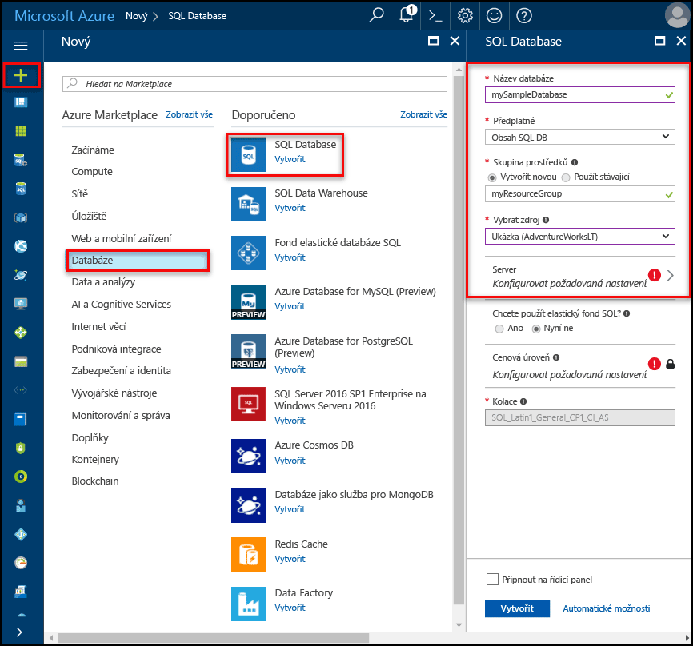
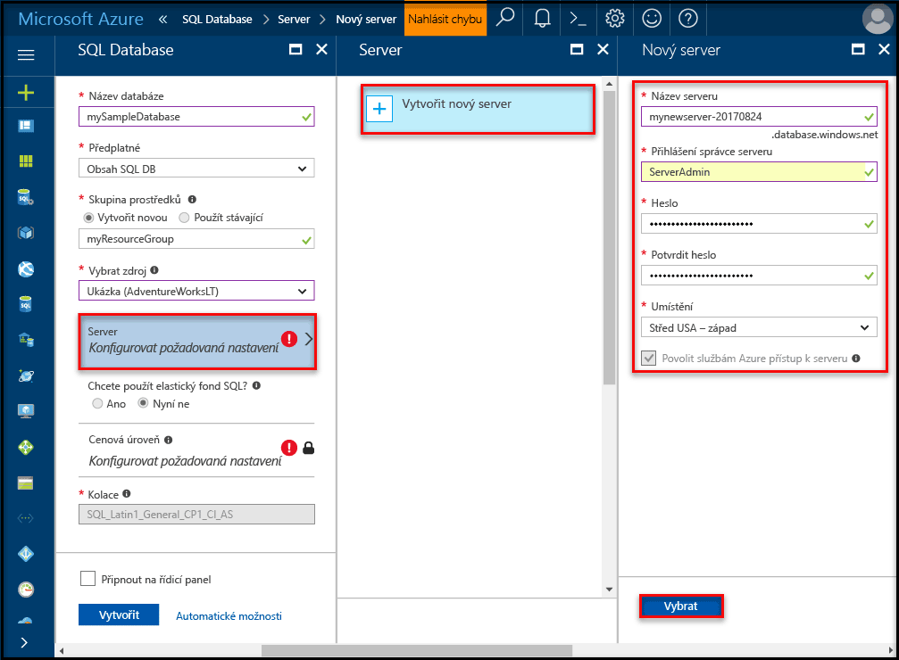
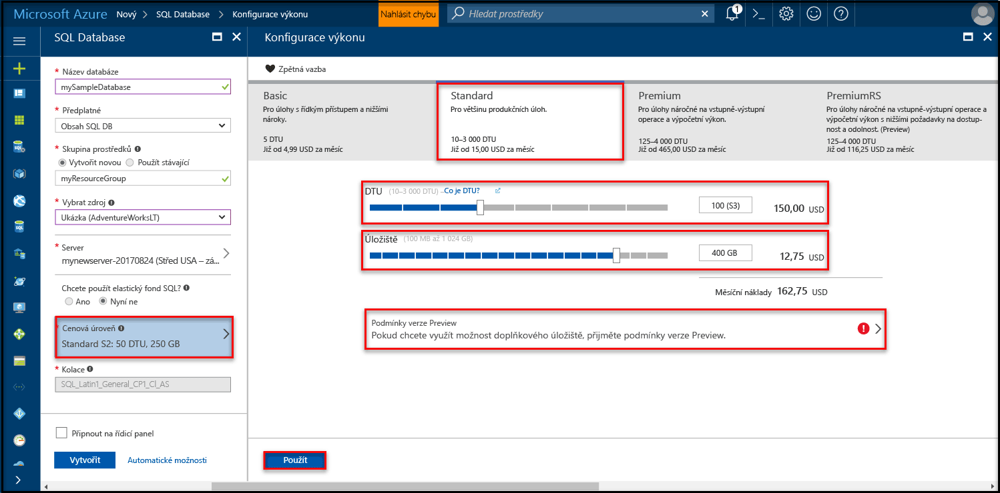
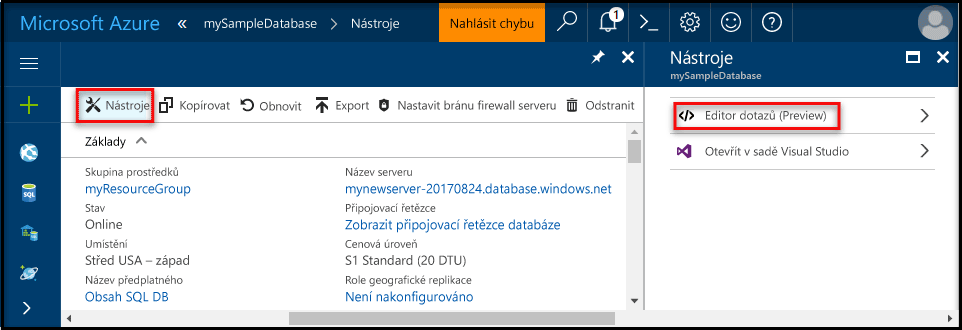
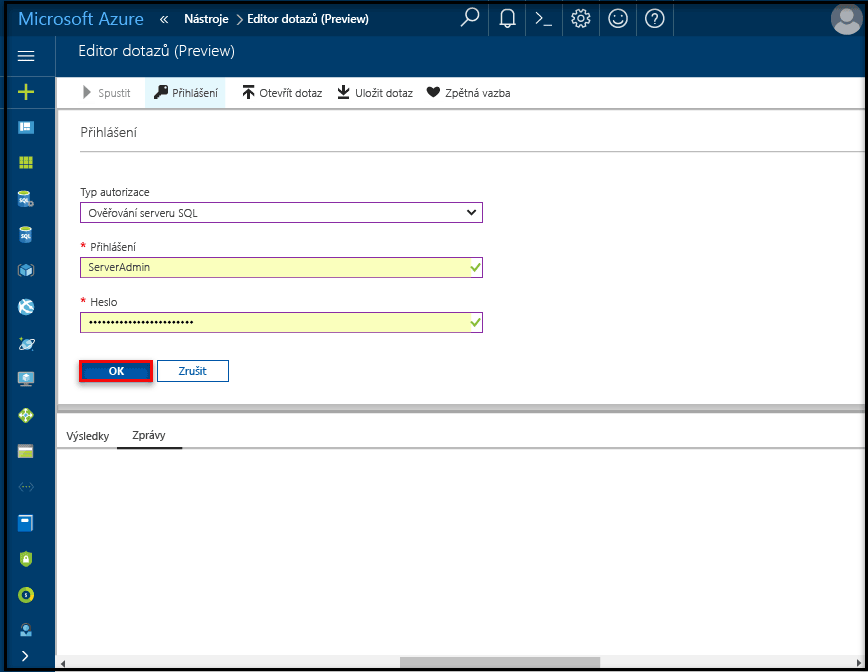
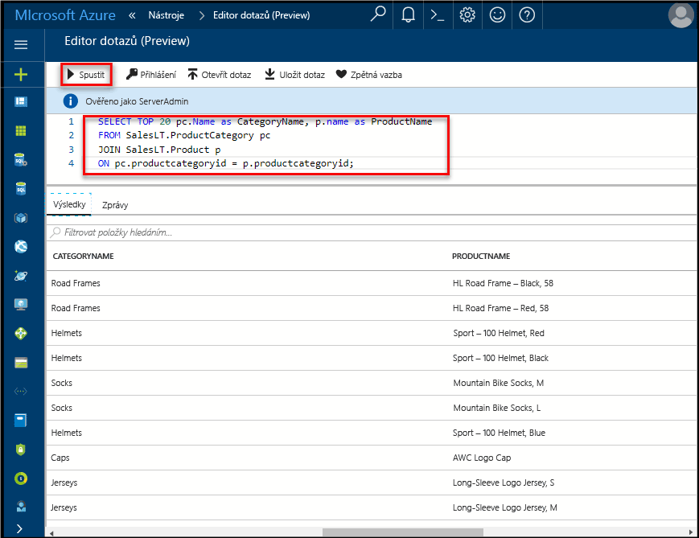

# <a name="create-an-azure-sql-database-in-the-azure-portal"></a>Vytvoření databáze SQL Azure na webu Azure Portal

Tento úvodní kurz vás provede postupy vytvoření databáze SQL v Azure. Azure SQL Database je nabídka „databáze jako služby“, která umožňuje spouštění a škálování vysoce dostupné databáze SQL Serveru v cloudu. Tento rychlý start ukazuje, jak začít tím, že vytvoříte databázi SQL pomocí webu Azure Portal.

Pokud ještě nemáte předplatné Azure, vytvořte si [bezplatný účet](https://azure.microsoft.com/free/) před tím, než začnete.

## <a name="log-in-to-the-azure-portal"></a>Přihlášení k webu Azure Portal

Přihlaste se k [portálu Azure](https://portal.azure.com/).

## <a name="create-a-sql-database"></a>Vytvoření databáze SQL

Databáze SQL Azure se vytvoří s definovanou sadou [výpočetních prostředků a prostředků úložiště](sql-database-service-tiers.md). Databáze se vytvoří v rámci [skupiny prostředků Azure](../azure-resource-manager/resource-group-overview.md) a na [logickém serveru Azure SQL Database](sql-database-features.md). 

Postupujte podle následujících kroků a vytvořte databázi SQL obsahující ukázková data Adventure Works LT. 

1. Klikněte na tlačítko **Nový** v levém horním rohu webu Azure Portal.

2. Na stránce **Nový** vyberte **Databáze** a na stránce **Databáze** vyberte **SQL Database**.

    

3. Vyplňte formulář databáze SQL pomocí následujících informací, jak je vidět na předchozím obrázku:     
   - Název databáze: **mySampleDatabase**
   - Skupina prostředků: **myResourceGroup**
   - Zdroj: **Ukázka (AdventureWorksLT)**

   > [!IMPORTANT]
   > V tomto formuláři je nutné vybrat ukázkovou databázi, protože se používá ve zbývající části tohoto rychlého startu.
   > 

4. Klikněte na **Server** a pak vyplňte **formuláře nového serveru** zadáním globálně jedinečného názvu serveru, jména pro přihlašování správce serveru a hesla podle svého výběru. 

   > [!IMPORTANT]
   > Zde zadané jméno správce serveru a heslo se vyžadují k přihlášení na server a jeho databáze dále v tomto rychlém startu. Tyto informace si zapamatujte nebo poznamenejte pro pozdější použití. 
   >  

    
5. Pokud jste formulář vyplnili, klikněte na **Vybrat**.

6. Klikněte na **Cenová úroveň** a určete úroveň služby a úroveň výkonu pro novou databázi. Pomocí posuvníku vyberte **20 DTU** a **250** GB úložiště. Další informace o jednotkách DTU najdete v tématu [Co je DTU](sql-database-what-is-a-dtu.md).

    

7. Po výběru množství jednotek DTU klikněte na **Použít**.  

8. Po vyplnění formuláře pro SQL Database klikněte na **Vytvořit** a databázi zřiďte. Zřizování trvá několik minut. 

9. Na panelu nástrojů klikněte na **Oznámení** a sledujte proces nasazení.

    


## <a name="create-a-server-level-firewall-rule"></a>Vytvoření pravidla brány firewall na úrovni serveru

Služba SQL Database vytvoří bránu firewall na úrovni serveru, aby zabránila externím aplikacím a nástrojům v připojení k serveru nebo ke kterékoli databázi na serveru, pokud není vytvořené pravidlo brány firewall k otevření brány firewall pro konkrétní IP adresy. Postupujte podle těchto kroků a vytvořte [pravidlo brány firewall na úrovni serveru služby SQL Database](sql-database-firewall-configure.md) pro vaši IP adresu klienta a umožněte externí připojení přes bránu firewall služby SQL Database pouze pro vaši IP adresu. 

> [!NOTE]
> SQL Database komunikuje přes port 1433. Pokud se pokoušíte připojit z podnikové sítě, nemusí být odchozí provoz přes port 1433 bránou firewall vaší sítě povolený. Pokud je to tak, nebudete se moct připojit k serveru Azure SQL Database, dokud vaše IT oddělení neotevře port 1433.
>

1. Po dokončení nasazení klikněte na **Databáze SQL** z nabídky na levé straně a klikněte na **mySampleDatabase** na stránce Databáze SQL. Otevře se stránka s přehledem pro vaši databázi, na které se zobrazí plně kvalifikovaný název serveru (například **mynewserver20170411.database.windows.net**) a možnosti pro další konfiguraci.

   > [!IMPORTANT]
   > Tento plně kvalifikovaný název serveru budete potřebovat pro připojení k serveru a jeho databázím v následujících rychlých startech.
   > 

       

2. Klikněte na **Nastavit bránu firewall serveru** na panelu nástrojů, jak je vidět na předchozím obrázku. Otevře se stránka **Nastavení brány firewall** pro server služby SQL Database. 

       


3. Klikněte na **Přidat IP adresu klienta** na panelu nástrojů a přidejte svoji aktuální IP adresu do nového pravidla brány firewall. Pravidlo brány firewall může otevřít port 1433 pro jednu IP adresu nebo rozsah IP adres.

4. Klikněte na **Uložit**. Vytvoří se pravidlo brány firewall na úrovni serveru pro vaši aktuální IP adresu, které otevře port 1433 na logickém serveru.

       

4. Klikněte na **OK** a pak zavřete stránku **Nastavení brány firewall**.

Nyní se můžete z této IP adresy připojit k serveru SQL Database a jeho databázím pomocí aplikace SQL Server Management Studio nebo jiného nástroje podle vašeho výběru použitím účtu správce serveru vytvořeného dříve.

> [!IMPORTANT]
> Standardně je přístup přes bránu firewall služby SQL Database povolený pro všechny služby Azure. Kliknutím na **OFF** na této stránce provedete zákaz pro všechny služby Azure.

## <a name="query-the-sql-database"></a>Dotazování databáze SQL

Teď, když jste vytvořili ukázkovou databázi v Azure, můžete použít integrovaný dotazovací nástroj na webu Azure Portal k potvrzení, že se můžete připojit k databázi a zadávat dotazy na data. 

1. Na stránce služby SQL Database pro vaši databázi klikněte na panelu nástrojů na **Nástroje**. Otevře se stránka **Nástroje**.

      

2. Klikněte na **Editor dotazů (Preview)**, zaškrtněte políčko **Podmínky verze Preview** a pak klikněte na **OK**. Otevře se stránka Editor dotazů.

3. Klikněte na **Přihlásit**, na vyzvání vyberte **Ověřování SQL Serveru** a pak zadejte přihlašovací jméno a heslo správce serveru, které jste vytvořili dříve.

     

4. Přihlaste se kliknutím na **OK**.

5. Když jste ověřeni, do podokna editoru dotazů zadejte následující dotaz.

   ```
   SELECT TOP 20 pc.Name as CategoryName, p.name as ProductName
   FROM SalesLT.ProductCategory pc
   JOIN SalesLT.Product p
   ON pc.productcategoryid = p.productcategoryid;
   ```

6. Klikněte na **Spustit** a pak zkontrolujte výsledky dotazu v podokně **Výsledky**.

    

7. Zavřít stránku **Editoru dotazů** a stránku **Nástroje**.

## <a name="clean-up-resources"></a>Vyčištění prostředků

Další rychlé starty v této kolekci jsou postavené na tomto rychlém startu. 

> [!TIP]
> Pokud chcete pokračovat v práci s dalšími rychlými starty, nevyčišťujte prostředky vytvořené v rámci tohoto rychlého startu. Pokud pokračovat nechcete, pomocí následujících kroků odstraňte všechny prostředky vytvořené tímto rychlým startem na webu Azure Portal.
>

1. Na webu Azure Portal v nabídce vlevo klikněte na **Skupiny prostředků** a pak na **myResourceGroup**. 
2. Na stránce skupiny prostředků klikněte na **Odstranit**, do textového pole zadejte **myResourceGroup** a pak klikněte na **Odstranit**.

## <a name="next-steps"></a>Další kroky

Teď, když máte databázi, můžete se k ní připojit a provádět dotazování pomocí vašich oblíbených nástrojů. Další informace získáte výběrem vašeho nástroje níže:

- [SQL Server Management Studio](sql-database-connect-query-ssms.md)
- [Visual Studio Code](sql-database-connect-query-vscode.md)
- [.NET](sql-database-connect-query-dotnet.md)
- [PHP](sql-database-connect-query-php.md)
- [Node.js](sql-database-connect-query-nodejs.md)
- [Java](sql-database-connect-query-java.md)
- [Python](sql-database-connect-query-python.md)
- [Ruby](sql-database-connect-query-ruby.md)

